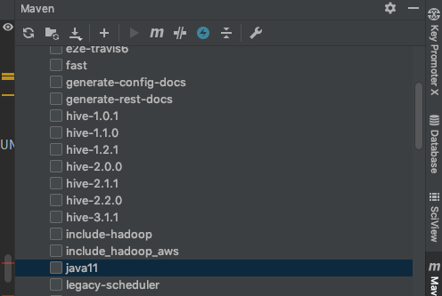

# 遇到的问题

1. Error:java: 无效的标记: --add-exports=java.base/sun.net.util=ALL-UNNAMED

reimport，Profiles取消Java11



# No ExecutorFactory found to execute the application

[参考](https://cloud.tencent.com/developer/article/1730029)，缺少flink-client.jar

```xml
<dependency>
            <groupId>org.apache.flink</groupId>
            <artifactId>flink-clients_2.11</artifactId>
            <version>${flink.version}</version>
  </dependency>
```

