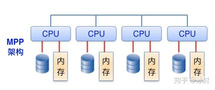

# 先了解下OLTP与OLAP区别

## OLTP(OnLine Transaction Processing ，联机事务处理)系统

例如mysql。擅长事务处理，在数据操作中保持着很强的一致性和原子性 ，能够很好的支持频繁的数据插入和修改 ，但是，一旦数据量过大，OLTP便力不从心了。

OLAP(On-Line Analytical Processing，联机分析处理)系统

例如Greenplum。不特别关心对数据进行输入、修改等事务性处理，而是关心对已有 的大量数据进行多维度的、复杂的分析的一类数据系统 。

# 什么是MPP	

​	MPP(massively parallel processing)是一种存储结构，它设计用于由多个处理单元同时处理多种操作。

​	MPP架构是将任务并行的分散到多个服务器和节点上，在每个节点上计算完成后，将各自部分的结果汇总在一起得到最终的结果。采用MPP架构的数据库称为MPP数据库。

​        这种数仓架构，每个处理单元都使用其自己的操作系统和专用内存独立工作。这使MPP数据库能够处理大量数据，并基于大型数据集提供更快的分析速度。

​	MPP数据库体系结构有几种类型，每种都有其自身的优缺点。例如，网格计算在分布式网络中使用多台计算机，并将根据可用性来机会性地使用资源。这减少了服务器空间的成本，但在高峰时间或请求过多时限制了带宽和容量。另一种流行的方法是计算机群集，它通过将可用电源链接到可以相互连接以处理多个任务的节点来减少此问题。由于可以将较小的计算节点连接起来以实现单个目标，因此MPP数据库变得越来越流行。

这也降低了成本，因为MPP数据库可以水平扩展（简单地在服务器上添加更多的计算节点），而不是垂直扩展（添加更多的服务器进行处理）。

#  MPP可以做什么

如今，组织所产生的数据量很大，这意味着公司不能依靠单个服务器，或者必须为处理大量数据集的物理服务器容量付出高昂的代价。取而代之的是，MPP在各种环境中正变得越来越流行。

例如，在商业智能中，MPP数据库意味着组织中的更多人可以同时运行自己的数据分析和查询，而不会出现滞后或更长的响应时间。尤其是对于大型组织，这种灵活性可以按需授予更多的利益相关者信息。

MPP数据库对于在单个位置集中数据也很有用。MPP不必分解大量的数据集，而是允许将它们存储在单个位置并从不同的位置进行访问。这包括存储各种数据，例如市场营销，网络，运营，物流和人力资源数据。

对于大型组织而言，这种集中式资源使其更易于发现见解，连接起初可能并不明显的数据点，甚至可以构建仪表板，其中包含的信息比从分散的数据中构建的信息更重要。最后，与数据湖之类的模型相比，MPP通常最适合处理结构化数据集。

符合几个条件：不需要更新数据，不需要频繁重复离线计算，不需要并发大。

有上百亿以上离线数据，不更新，结构化，需要各种复杂分析的sql语句，那就可以选择他。几秒、几十秒立即返回你想要的分析结果。例如sum，count，group by，order，好几层查询嵌套，在几百亿数据里分分钟出结果

这类的数据库有，clickhouse，greenplum