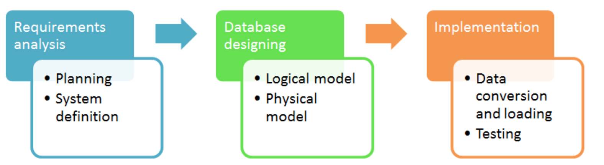

[参考](https://www.guru99.com/database-design.html)

# 数据库开发生命周期

- 需求分析阶段

  - 计划：涉及整个数据库开发声明周期，考虑组织的信息系统策略
  - 系统定义： 定义数据库系统的范围和边界

- 数据库设计

  - 逻辑模型： 基于需求开发数据模型，整个设计都在纸上完成，意思是不设计具体的物理实现
  - 物理模型： 基于具体的DBMS实现逻辑模型

- 实现

  - 数据转换和加载： 数据导入和转换
  - 测试： 检查数据库是否满足需求

  

# ER图

Entity是现实世界中的一件事情或者一个物体，也叫实体，例如一个公司的员工。具有以下特点

- Entity有一个属性集
- 属性可以有值

例如，微软的员工Peter有属性name, age, weight, height等，这些属性是单值的，但也可以有多值属性，例如，phone numbers。 另外，Entity之间可以有关系，例如，每个员工有一台电脑，Peter的电脑和Peter之间有相互关系。ER图模型设计过程中，我们对Entity和它的属性以及Entity之间的关系建模。

## 案例：MyFlix视频库

MyFlix是一个商业实体，租电影给它的成员。ER图设计步骤：

1. 找出实体并发现它们之间的关系
2. 每个实体、属性和关系都必须有个相应的名字，非技术人员也能看懂
3. 关系之间不能直接联系，关系连接实体
4. 实体的属性不能出现同名(废话)

- 实体

  - Members 保存成员信息
  - Movies 保存电影信息
  - Categories 电影类别信息
  - Movie Rentals 出租信息
  - Payments 成员付款信息

- 定义关系

  - Members和Movies

    1. 一个成员可以租多个电影
    2. 一个电影可以被多个成员租

    因此，这是一个多对多关系，关系型数据库不是天然支持多对多，我们需要引入连接实体，这就是实体Movie Rentals扮演的角色。它和Members表之间的关系是一对一，和Movies表之间的关系也是一对一。

  - Movie和Categories实体

    一个电影只能属于一个类别，但一个类别可以有多个电影。因此，可以推出categories和movies表之间的关系是一对多。

  - Members和payments实体

  ​     一个member只能有一个账户但可以有多个付款信息。因此，members和payments是一对多关系。

  

# 其他

[黄志x视频](https://www.bilibili.com/video/BV17E411k7qn?p=15)

关系也可以有属性，例如，学生和课程之间的关系，有选修时间，分数等属性

## 一些技巧：

###  自联系：

### 联系可以是多元联系，即多个实体之间的联系

一般这种多元联系要成为一个实体