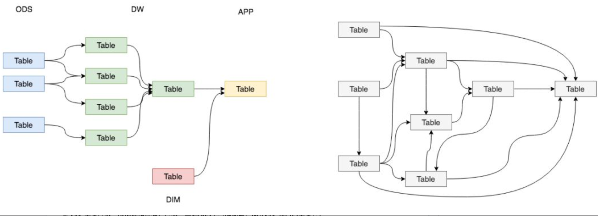
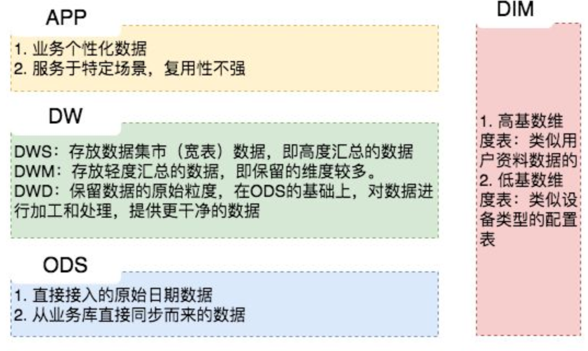
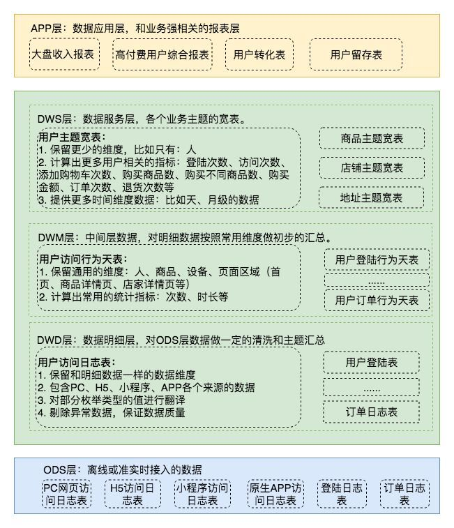

# 概述

[原文](https://cloud.tencent.com/developer/article/1396891)

我们需要一套行之有效的数据组织和管理方法来让我们的数据体系更有序，这就是谈到的数据分层。数据分层并不能解决所有的数据问题，但是，数据分层却可以给我们带来如下的好处：

1. 清晰数据结构：每一个数据分层都有它的作用域和职责，在使用表的时候能更方便地定位和理解
2. 减少重复开发：规范数据分层，开发一些通用的**中间层数据，能够减少极大的重复计算**
3. 统一数据口径：通过数据分层，**提供统一的数据出口，统一对外输出的数据口径**
4. 复杂问题简单化：**将一个复杂的任务分解成多个步骤来完成，每一层解决特定的问题**

## 一种通用分层设计

### ODS（Operational Data Store）

是最接近数据源中数据的一层，数据源中的数据，经过抽取、洗净、传输，也就说传说中的 ETL 之后，装入本层。本层的数据，总体上大多是按照源头业务系统的分类方式而分类的。

### 数据仓库层：DW（Data Warehouse）

数据仓库层是我们在做数据仓库时要**核心设计**的一层，在这里，从 ODS 层中获得的数据按照主题建立各种数据模型。DW层又细分为 DWD（Data Warehouse Detail）层、DWM（Data WareHouse Middle）层和DWS（Data WareHouse Servce）层。

1. **数据明细层**：DWD（Data Warehouse Detail）

该层一般保持和ODS层一样的数据粒度，并且提供一定的数据质量保证。同时，为了提高数据明细层的易用性，该层会采用一些维度退化手法，**将维度退化至事实表中，减少事实表和维表的关联。**

另外，在该层也会做一部分的**数据聚合，将相同主题的数据汇集到一张表中，提高数据的可用性**，后文会举例说明。

2. **数据中间层**：DWM（Data WareHouse Middle）

该层会在DWD层的数据基础上，对数据做轻度的聚合操作，**生成一系列的中间表**，提升公共指标的复用性，减少重复加工。

直观来讲，就是**对通用的核心维度进行聚合操作，算出相应的统计指标**。

3. **数据服务层**：DWS（Data WareHouse Servce）

**又称数据集市或宽表。按照业务划分，如流量、订单、用户等，生成字段比较多的宽表，用于提供后续的业务查询**，OLAP分析，数据分发等。

在实际计算中，如果直接从DWD或者ODS计算出宽表的统计指标，会存在计算量太大并且维度太少的问题，因此一般的做法是，在DWM层先计算出多个小的中间表，然后再拼接成一张DWS的宽表。由于宽和窄的界限不易界定，也可以去掉DWM这一层，只留DWS层，将所有的数据在放在DWS亦可。

### 数据应用层：APP（Application）

在这里，主要是提供给数据产品和数据分析使用的数据，一般会存放在 ES、PostgreSql、[Redis](https://cloud.tencent.com/product/crs?from=10680)等系统中供线上系统使用，也可能会存在 Hive 或者 Druid 中供数据分析和数据挖掘使用。比如我们经常说的报表数据，一般就放在这里。

### 维表层（Dimension）

最后补充一个维表层，维表层主要包含两部分数据：

1. 高基数维度数据：一般是用户资料表、商品资料表类似的资料表。数据量可能是千万级或者上亿级别。
2. 低基数维度数据：一般是配置表，比如枚举值对应的中文含义，或者日期维表。数据量可能是个位数或者几千几万。

至此，我们讲完了数据分层设计中每一层的含义，这里做一个总结便于理解，如下图。

# 例子

趁热打铁，举个栗子说明一下，如下图，可以认为是一个电商网站的数据体系设计。我们暂且只关注用户访问日志这一部分数据。

1. 在ODS层中，由于各端的开发团队不同或者各种其它问题，用户的访问日志被分成了好几张表上报到了我们的ODS层。
2. 为了方便大家的使用，我们在DWD层做了一张用户访问行为天表，在这里，我们将PC网页、H5、小程序和原生APP访问日志**汇聚到一张表里面，统一字段名**，提升数据质量，这样就有了一张可供大家方便使用的明细表了。
3. 在DWM层，我们会从DWD层中选取业务关注的**核心维度来做聚合操作**，比如只保留人、商品、设备和页面区域维度。**类似的，我们这样做了很多个DWM的中间表**
4. 然后在DWS层，我们**将一个人在整个网站中的行为数据放到一张表中，这就是我们的宽表了，有了这张表，就可以快速满足大部分的通用型业务需求了。**
5. 最后，在APP应用层，根据需求从DWS层的一张或者多张表取出数据拼接成一张应用表即可。

*备注：例子只是为了简单地说明每一层的作用，并不是最合理的解决方案，大家辩证地看待即可*。

