# 概念

## 提交对象

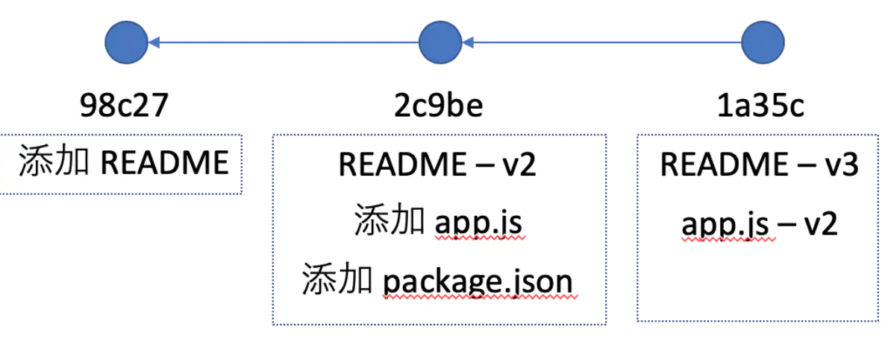

每一个 commit 都包含了 **当时版本的文件快照**，也就是说，切换到某一个 commit，就能回到对应的版本上去。

## 分支

**分支本质上仅仅是指向提交对象的可变指针**。比如如下的 master 分支上，README 已经是 v3 版本了：

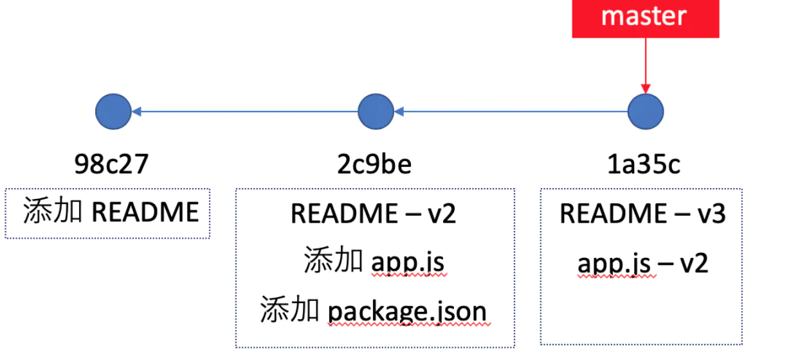

当在 master 分支上 checkout 一个分支出来时，仅仅是创建了一个新的指针，指向了当前的 commit。

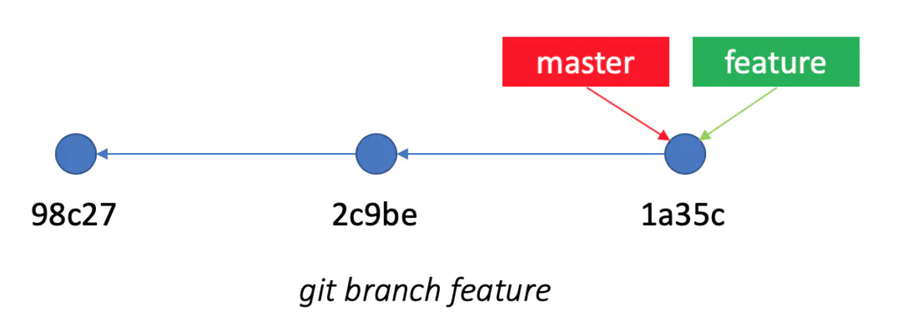

git 怎么知道我们处在哪个分支？这是因为有一个**特殊的指针 `HEAD`，它指向当前所在的本地分支**：

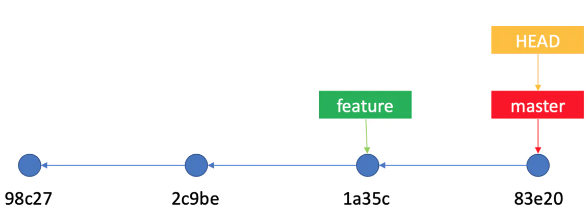

总之就是每次commit，当前分支指针master和HEAD指针都会向后移动而指向当前的commit。

## 三个集合

在 git 中，文件有三种状态：已修改（modified）、已暂存（staged）和已提交（committed），它们分别对应于三个区域：**工作区**（working directory）、**暂存区**（staging area） 和 **版本库**（repository）。

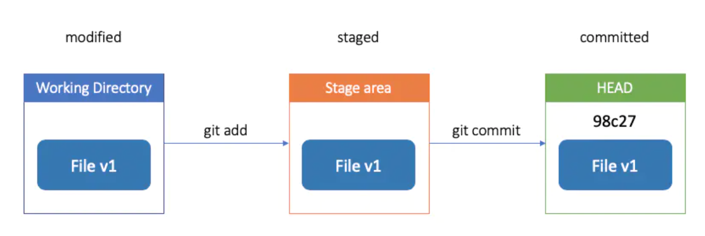

# 撤销


## 撤销最近几次commit

git reset命令，它有三种模式soft\mixed和hard

### soft模式

```shell
git reset --soft commit号
```

git会首先修改HEAD的指向，会连带修改HEAD所在分支的指向

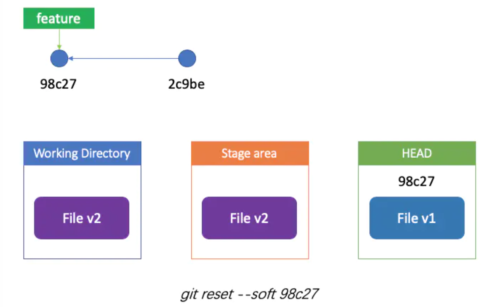

如上图所示，现在的暂存区和 HEAD 是不同的，这个操作本质上撤销了 `2c9be` 这个 commit，如同回到了上次准备 commit 的时候。（git 中的时光机！）

### mixed模式

假如我们执行的是

```shell
git reset --mixed 98c27
```

它也会首先修改 HEAD 的指向，使得 HEAD 上的 commit 为 `98c27`。

但还不够，git 还会接着更新你的暂存区，如同回到了你准备 add 的时候。（时光机再向前！）

这实际上是 reset 的默认模式，等同于 `git reset 98c27`。

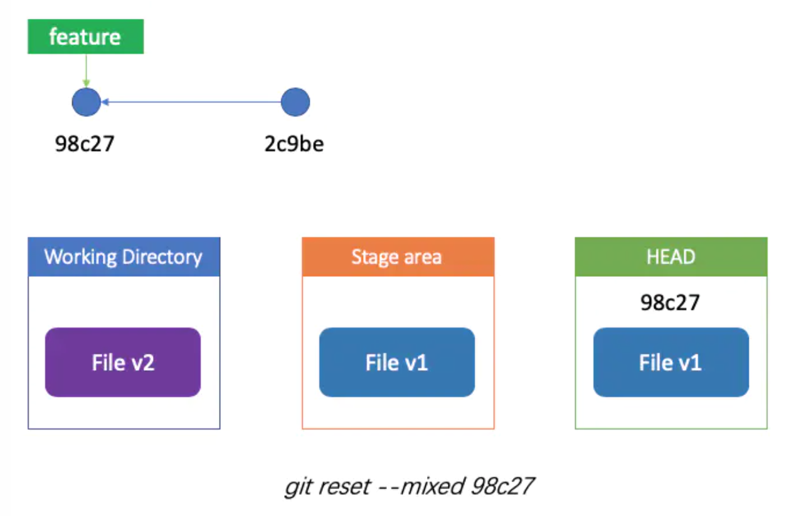

### hard模式

这一次 git 摧枯拉朽，把你的 HEAD、暂存区、工作区全给干掉了：

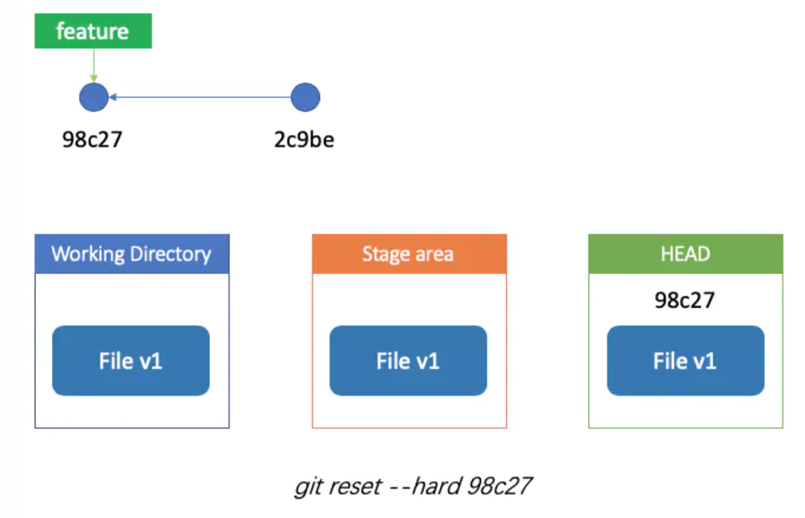

一下子回到了你开始写需求的时候。所以这个命令是 **危险** 的，除非你真的打算不要这些修改了，否则最好不要用。

不过即使你真的用了又后悔，那也是有办法的，在 git 里面，既然能回到过去，也能在过去穿越到未来。使用 `git reflog` 可以查看你最近的修改，找到最前面的 commit id，可以继续使用 reset 穿回去。

## 合并commit

有时候你可能发现自己刚才提交的好几个 commit 其实都是中间状态，还不如把它们合并成一个。根据上面的 reset，实际上就能完成这件事情。

比如下面的场景，我们多提交了一个 File V1.1 的中间版本，希望将其从 commit 历史中去掉：

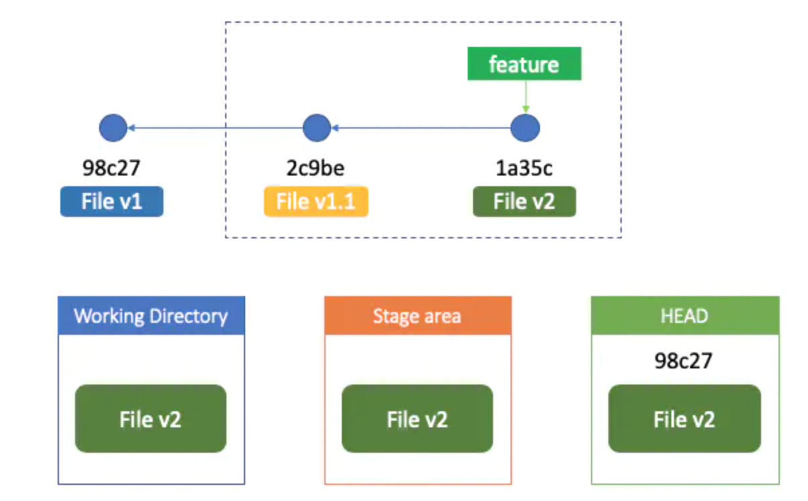

那其实可以直接 reset 到 v1 版本：

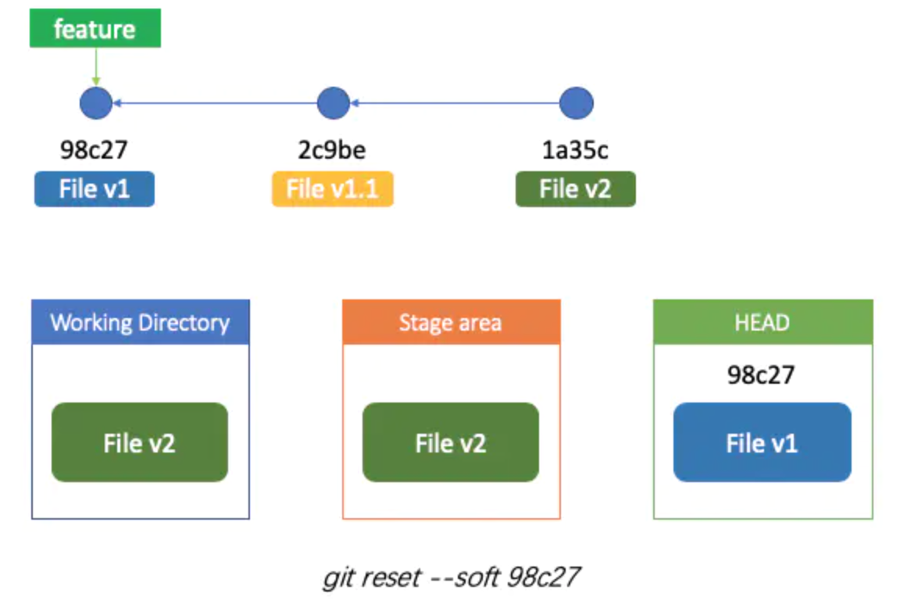

然后重新进行 commit，这样就会将 v1 之后的修改都提交到了新的版本，如同移除了中间的版本。

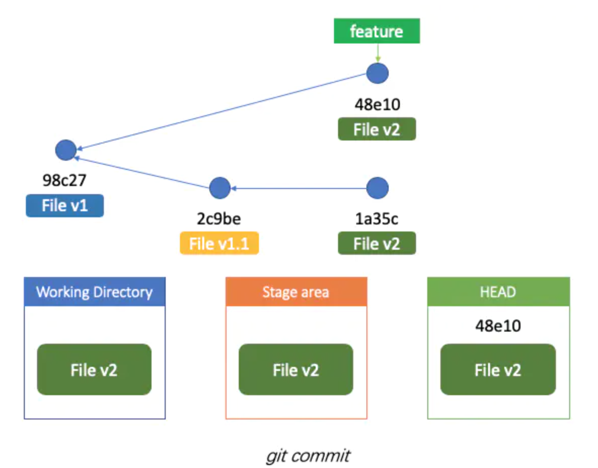

当然，这个场景也能用 rebase 解决，之后会提到。

### 挪动 commit

在多个分支上切换开发的时候，有时候会忘记切换分支就开始开发。当发现自己提交的 commit 放错分支怎么办呢？在 git 中，这也不算个事，通过 `git cherry-pick` 就能解决。

cherry-pick 可以将指定的 commit “摘到”当前的分支上面，git 会为你重新生成一个 commit，但内容与 pick 的 commit 一致。

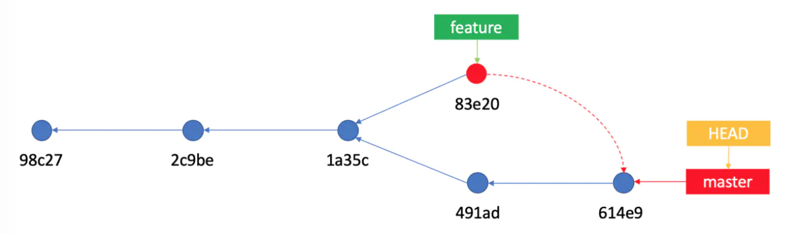

如果你要 pick 好几个 commit，它们之间有依赖关系，那需要根据先后顺序依次进行 cherry pick。

当发生冲突时，此时需要修改文件解决冲突，可以使用 `git cherry-pick --abort` 放弃此次 pick，或者解决完 add 进暂存区，然后使用 `git cherry-pick --continue`。注意这里并不是使用 `git commit`，如果你需要改变 commit 的信息，可以使用 commit，否则 git 会默认使用 pick 的 commit 的信息。

