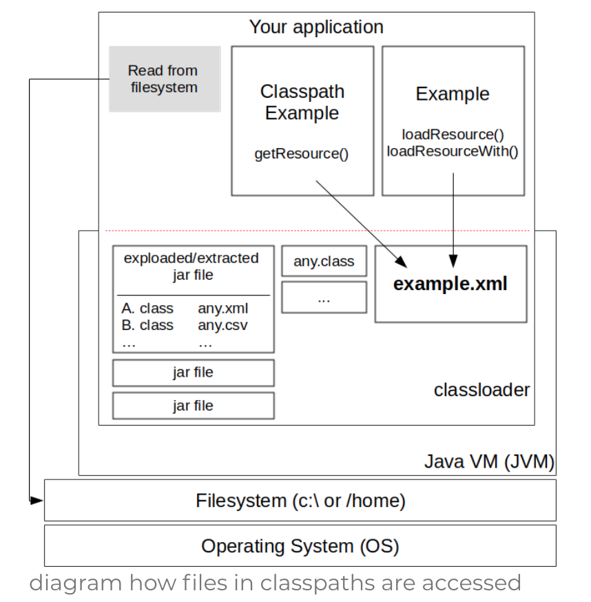

# 读取classpath

## 结构图

程序如何获取文件



## 设置classpath

首先需要把文件添加到classpath中，有两种办法： 

1. 如果文件存放在src目录下，通常我们不需要设置了，因为IDE会自动把文件添加到编译目录(通常是bin/target)
2. 如果文件在jar文件中，我们需要把jar文件添加到classpath中

## 使用getClass().getResource()读取文件

```java
package com.xenovation;
import java.io.File;
import java.net.URL;

public class ClasspathExample {

   public File readFileFromClasspath() {
      //这代表从classpath的根路径读取，如果填写相对路径，则是相对当前包，com.xenovation
      URL fileUrl = getClass().getResource("/example.xml");
      return new File(fileUrl.getFile());
   }
}
```


## 通过classLoader读取

```java
InputStream inputStream = getClass().getClassLoader().getResourceAsStream("example.xml");
String data = readFromInputStream(input Stream);
```

和Resource的区别就是总是从classpath的跟路径读取，不管传入的path是否以/开头

