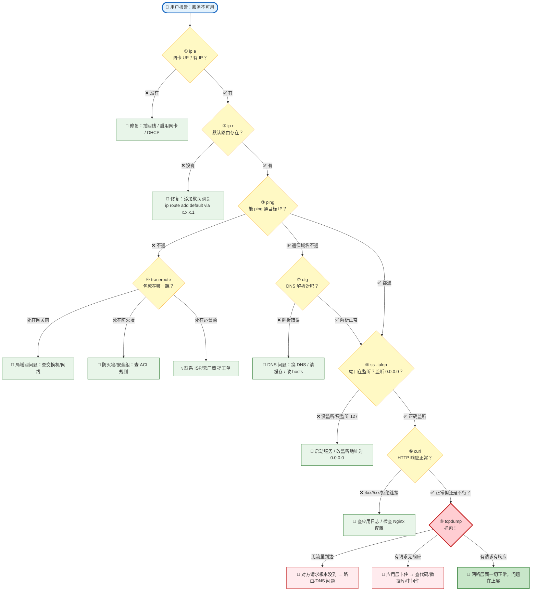

# 8 个 Linux 网络排障命令详解

> **排障心法**：Interface → Route → Ping → Trace → Port → App → DNS → Packet
>
> 网络问题排查有固定思路：先看网卡有没有起来，再看路由通不通，然后逐层向上排查。这 8 个命令就是这条链路上的每一步。

## 网络链路全景图

下图展示了一个数据包从你的本机到远程服务的完整路径，以及在每个环节应该用哪个命令来排查问题：

```mermaid
flowchart LR
    subgraph 你的机器["🖥️ 你的机器"]
        NIC["🔌 网卡<br/>eth0 / wlan0"]
        Route["🗺️ 路由表<br/>内核 IP 路由"]
        Socket["📦 本地端口<br/>TCP / UDP Socket"]
        AppProcess["⚙️ 应用进程<br/>nginx / java / node"]
    end

    subgraph 局域网["🏠 局域网"]
        Gateway["🚪 网关<br/>192.168.1.1"]
        Switch["🔀 交换机"]
    end

    subgraph 互联网["🌍 互联网"]
        DNS_Server["📖 DNS 服务器<br/>域名 → IP"]
        ISP_Router["🏢 运营商路由"]
        Hop1["🛰️ 骨干网一跳"]
        Hop2["🛰️ 骨干网二跳"]
        HopN["🛰️ ...更多跳"]
    end

    subgraph 目标["🎯 目标服务器"]
        RemoteNIC["🔌 目标网卡"]
        Firewall["🔥 防火墙 / 安全组"]
        RemotePort["📦 目标端口<br/>:443 / :8080"]
        RemoteApp["⚙️ 目标应用"]
    end

    NIC -->|"① ip a<br/>查网卡状态/IP/MAC"| Route
    Route -->|"② ip r<br/>查默认网关/路由"| Gateway
    Gateway --> Switch
    Switch --> ISP_Router
    ISP_Router --> Hop1 --> Hop2 --> HopN

    AppProcess -.->|"域名请求"| DNS_Server
    DNS_Server -.->|"⑦ dig<br/>DNS 解析正确吗？"| AppProcess
    AppProcess --> Socket
    Socket --> Route

    HopN --> RemoteNIC
    RemoteNIC -->|"③ ping<br/>ICMP 通吗？延迟/丢包"| Firewall
    Firewall --> RemotePort
    RemotePort -->|"⑤ ss -tulnp<br/>端口在监听吗？"| RemoteApp
    RemoteApp -->|"⑥ curl<br/>HTTP 响应/状态码"| AppProcess

    Hop2 -.->|"④ traceroute<br/>逐跳追踪，断在哪？"| HopN
    NIC -.-|"⑧ tcpdump<br/>抓包，让事实说话"| RemoteNIC

    style NIC fill:#e1f5fe,stroke:#01579b
    style Route fill:#e1f5fe,stroke:#01579b
    style Socket fill:#e1f5fe,stroke:#01579b
    style AppProcess fill:#e1f5fe,stroke:#01579b
    style RemotePort fill:#fff3e0,stroke:#e65100
    style RemoteApp fill:#fff3e0,stroke:#e65100
    style Firewall fill:#ffebee,stroke:#b71c1c
    style DNS_Server fill:#f3e5f5,stroke:#4a148c
```



> **看图说话**：数据包从左上角"你的机器"出发，经过局域网网关进入互联网，逐跳路由到达右下角"目标服务器"。**8 个命令分布在全链路的每个关键检查点**——用对命令，就能精准定位问题出在哪个环节。

---

## 排障命令速查：每个环节用哪个命令？



---

## 1. `ip addr` — 我的网卡活着吗？

**一句话**：列出所有网络接口及其 IP 地址、子网掩码、MAC 地址和运行状态。

```bash
ip addr show
# 简写
ip a
```

### 实际案例

```bash
$ ip a
1: lo: <LOOPBACK,UP,LOWER_UP> mtu 65536 qdisc noqueue state UNKNOWN group default qlen 1000
    link/loopback 00:00:00:00:00:00 brd 00:00:00:00:00:00
    inet 127.0.0.1/8 scope host lo
       valid_lft forever preferred_lft forever
    inet6 ::1/128 scope host noprefixroute
       valid_lft forever preferred_lft forever

2: eth0: <BROADCAST,MULTICAST,UP,LOWER_UP> mtu 1500 qdisc fq_codel state UP group default qlen 1000
    link/ether 52:54:00:a1:b2:c3 brd ff:ff:ff:ff:ff:ff
    inet 192.168.1.100/24 brd 192.168.1.255 scope global dynamic eth0
       valid_lft 86300sec preferred_lft 86300sec
    inet6 fe80::5054:ff:fea1:b2c3/64 scope link
       valid_lft forever preferred_lft forever

3: docker0: <NO-CARRIER,BROADCAST,MULTICAST,UP> mtu 1500 qdisc noqueue state DOWN group default
    link/ether 02:42:ac:11:00:01 brd ff:ff:ff:ff:ff:ff
    inet 172.17.0.1/16 brd 172.17.255.255 scope global docker0
       valid_lft forever preferred_lft forever
```

### 怎么看结果？

| 关注点 | 怎么看 | 本例 |
|--------|--------|------|
| **网卡名** | `eth0`, `ens33`, `wlan0` 等 | `eth0` |
| **状态** | 必须有 `UP` | `state UP` ✅ |
| **是否插线** | 必须有 `LOWER_UP`（物理层连通） | `LOWER_UP` ✅ |
| **IP 地址** | `inet` 后面 | `192.168.1.100/24` |
| **MAC 地址** | `link/ether` 后面 | `52:54:00:a1:b2:c3` |
| **MTU** | 最大传输单元，默认 1500 | `mtu 1500` |

> ⚠️ **排障第一步**：如果 `ip a` 显示 `state DOWN` 或没有 `LOWER_UP`，那问题就在物理层/数据链路层——网线没插、交换机端口挂了、网卡驱动异常。

---

## 2. `ip route` — 数据包出门走哪条路？

**一句话**：显示内核路由表，告诉你数据包的去向——默认网关是谁、各个子网走哪个网卡。

```bash
ip route show
# 简写
ip r
# 老命令（部分系统更直观）
route -n
```

### 实际案例

```bash
$ ip r
default via 192.168.1.1 dev eth0 proto dhcp metric 100
192.168.1.0/24 dev eth0 proto kernel scope link src 192.168.1.100 metric 100
10.0.0.0/8 via 192.168.1.254 dev eth0 proto static metric 200
172.17.0.0/16 dev docker0 proto kernel scope link src 172.17.0.1
```

### 怎么看结果？

把路由表读成一句话：

| 路由条目 | 翻译 |
|----------|------|
| `default via 192.168.1.1 dev eth0` | **默认路由**：所有"不知道往哪走"的包，都从 `eth0` 扔给 `192.168.1.1`（网关） |
| `192.168.1.0/24 dev eth0` | 访问局域网内的 `192.168.1.x`，直接从 `eth0` 发，不需要经过网关 |
| `10.0.0.0/8 via 192.168.1.254` | 访问 `10.x.x.x` 网段，要走 `192.168.1.254` 这个特定网关 |
| `172.17.0.0/16 dev docker0` | Docker 网桥路由，访问容器 IP 走 `docker0` |

> ⚠️ **经典故障**：`ping 8.8.8.8` 不通，但 `ping 192.168.1.1` 通？很可能是**默认路由缺失**——数据包不知道该往哪出门。

---

## 3. `ping` — 对面还活着吗？

**一句话**：发送 ICMP Echo Request，测试到目标主机的连通性、丢包率和延迟。

```bash
ping -c 4 google.com
```

| 常用参数 | 含义 |
|----------|------|
| `-c N` | 发 N 个包后停止（不加会一直 ping） |
| `-i N` | 间隔 N 秒（默认 1 秒） |
| `-s N` | 包大小 N 字节（默认 56，测 MTU 问题常用） |
| `-I eth0` | 指定从哪张网卡发出 |

### 实际案例

```bash
$ ping -c 4 google.com
PING google.com (142.250.80.46) 56(84) bytes of data.
64 bytes from 142.250.80.46: icmp_seq=1 ttl=118 time=12.3 ms
64 bytes from 142.250.80.46: icmp_seq=2 ttl=118 time=11.8 ms
64 bytes from 142.250.80.46: icmp_seq=3 ttl=118 time=12.1 ms
64 bytes from 142.250.80.46: icmp_seq=4 ttl=118 time=11.9 ms

--- google.com ping statistics ---
4 packets transmitted, 4 received, 0% packet loss, time 3004ms
rtt min/avg/max/mdev = 11.812/12.025/12.311/0.192 ms
```

### 怎么看结果？

| 指标 | 含义 | 本例判断 |
|------|------|----------|
| `4 received, 0% loss` | 丢包率 0%，网络通畅 | ✅ 正常 |
| `time=12.3 ms` | 延迟约 12ms，很快 | ✅ 正常 |
| `ttl=118` | 经过了 128-118=10 跳 | 正常 |

**排障关键判断**：

```
ping IP 通 + ping 域名不通 → DNS 问题（跳到第 7 步 dig）
ping 网关通 + ping 外网不通 → 网关/上层路由问题
ping 不通 + ip a 正常      → 跳到第 4 步 traceroute
```

> ⚠️ **注意**：有些服务器禁了 ICMP，ping 不通不代表服务挂了，需要结合其他手段判断。

---

## 4. `traceroute` — 数据包到底死在哪一跳？

**一句话**：逐跳追踪数据包从你的机器到目标经过的每一台路由器，定位丢包位置。

```bash
traceroute google.com
# 或（不需要 root）
tracepath google.com
# 或（UDP 被禁时用 ICMP）
traceroute -I google.com
```

### 实际案例

```bash
$ traceroute google.com
traceroute to google.com (142.250.80.46), 30 hops max, 60 byte packets
 1  _gateway (192.168.1.1)  0.512 ms  0.487 ms  0.462 ms
 2  10.74.0.1 (10.74.0.1)  3.241 ms  3.218 ms  3.195 ms
 3  112.17.38.1 (112.17.38.1)  5.612 ms  5.598 ms  5.574 ms
 4  221.183.55.53 (221.183.55.53)  8.912 ms  8.887 ms  8.863 ms
 5  221.183.40.158 (221.183.40.158)  11.234 ms  11.211 ms  11.187 ms
 6  72.14.218.130 (72.14.218.130)  15.678 ms  15.652 ms  15.628 ms
 7  * * *
 8  108.170.241.65 (108.170.241.65)  45.234 ms  45.108 ms  44.987 ms
 9  142.250.80.46 (142.250.80.46)  12.451 ms  12.427 ms  12.403 ms
```

### 怎么看结果？

| 现象 | 含义 |
|------|------|
| 每行 3 个时间 | 每跳发 3 个探测包，显示各自的 RTT |
| `* * *` | 该跳不回复（防火墙屏蔽 / 路由器不响应 ICMP） |
| 后面跳正常 + 中间有 `*` | 只是中间设备不回复，路由本身没断 |
| `* * *` 之后全是 `*` | **包死在这里了**——该跳及之后都不通 |
| RTT 突然飙升 | 该跳可能存在拥塞或跨地域链路 |

> 🎯 **实战价值**：客户说"我们的服务器访问不了你们的 IP"。你跑一条 `traceroute`，发现包到了防火墙就 timeout——这就不是你服务器的问题，而是网络/防火墙团队的。一条命令省一小时扯皮。

---

## 5. `ss` — 哪个进程在监听哪个端口？

**一句话**：比 `netstat` 更快更现代的工具，查看所有 TCP/UDP 监听端口及对应的进程。

```bash
ss -tulnp
```

| 参数 | 含义 |
|------|------|
| `-t` | TCP |
| `-u` | UDP |
| `-l` | 只显示正在**监听**的（listening） |
| `-n` | 不解析服务名，直接显示端口号 |
| `-p` | 显示进程名和 PID |

### 实际案例

```bash
$ ss -tulnp
Netid  State   Recv-Q  Send-Q  Local Address:Port   Peer Address:Port  Process
udp    UNCONN  0       0       127.0.0.1:323        0.0.0.0:*          users:(("chronyd",pid=891,fd=5))
tcp    LISTEN  0       128     0.0.0.0:22           0.0.0.0:*          users:(("sshd",pid=1024,fd=3))
tcp    LISTEN  0       511     127.0.0.1:3000       0.0.0.0:*          users:(("node",pid=4521,fd=19))
tcp    LISTEN  0       128     0.0.0.0:8080         0.0.0.0:*          users:(("java",pid=3892,fd=27))
tcp    LISTEN  0       128     [::]:80               [::]:*             users:(("nginx",pid=2156,fd=6))
```

### 怎么看结果？

| 关注列 | 怎么看 | 排障要点 |
|--------|--------|----------|
| `Local Address:Port` | `0.0.0.0:8080` vs `127.0.0.1:3000` | **最关键的区别** |
| `Process` | 哪个进程在占用 | 验证服务是否真的在运行 |

> 🔥 **必背判断**：
>
> | 监听地址 | 含义 | 外部可访问？ |
> |----------|------|:---:|
> | `0.0.0.0:8080` | 监听所有网卡的所有 IP | ✅ 可以 |
> | `127.0.0.1:3000` | 只监听本机回环地址 | ❌ 不行 |
> | `::1:80` | 只监听 IPv6 本机 | ❌ IPv4 不行 |
> | `192.168.1.100:22` | 只监听特定 IP | 仅该 IP 可访问 |

> 🎯 **经典场景**：开发说"服务跑起来了但外面访问不了"——`ss -tulnp` 一看，监听在 `127.0.0.1:3000`。问题找到，改监听地址为 `0.0.0.0` 解决。

---

## 6. `curl` — 我能像一个真正的客户端一样跟服务说话吗？

**一句话**：命令行 HTTP 客户端，测试 API 端点、查看响应头和状态码、验证服务是否可达。

```bash
curl -I https://example.com       # 只看响应头
curl -v https://api.example.com   # 详细调试信息
curl -X POST -d '{"k":"v"}' ...   # 发 POST 请求
```

### 实际案例

```bash
$ curl -I https://www.baidu.com
HTTP/1.1 200 OK
Server: bfe/1.0.8.18
Date: Tue, 29 Jul 2026 08:30:00 GMT
Content-Type: text/html
Content-Length: 277
Connection: keep-alive
```

```bash
# 测试本地服务
$ curl -v http://localhost:8080/api/health
*   Trying 127.0.0.1:8080...
* Connected to localhost (127.0.0.1) port 8080
> GET /api/health HTTP/1.1
> Host: localhost:8080
> User-Agent: curl/8.4.0
> Accept: */*
>
< HTTP/1.1 200 OK
< Content-Type: application/json
< Content-Length: 15
<
* Connection #0 to host localhost left intact
{"status":"ok"}
```

### 怎么看结果？

| 输出片段 | 含义 |
|----------|------|
| `* Trying 127.0.0.1:8080...` | curl 正在尝试 TCP 连接 |
| `* Connected to ...` | TCP 三次握手成功 |
| `> GET /api/health HTTP/1.1` | 我方发出的请求 |
| `< HTTP/1.1 200 OK` | 服务器 HTTP 响应状态 |
| `* Connection #0 ... left intact` | 连接结束（正常关闭） |

**常见状态码速查**：

| 状态码 | curl 时报什么 | 含义 |
|:------:|--------------|------|
| 200 | 正常返回内容 | 一切 OK |
| 301/302 | 返回空的，带 `Location` 头 | 重定向了——加 `-L` 跟随 |
| 403 | 被拒绝 | 权限/防火墙/ACL 问题 |
| 500 | 返回错误页面 | 服务器内部挂了 |
| `* connect to ... refused` | 根本没连上 | 端口没监听 → 回到第 5 步 `ss` |

> 🎯 **面试级实战**：应用挂了，不要打开浏览器。跑 `curl -I`，你有证据——它响应了吗？返回什么错误？重定向正常吗？比"我打不开网页"专业十倍。

---

## 7. `dig` — DNS 到底给了我什么答案？

**一句话**：查询 DNS 记录，显示权威答案、DNS 服务器、TTL（缓存时间），比 `nslookup` 信息更丰富。

```bash
dig google.com                    # 查 A 记录
dig google.com MX                 # 查邮件记录
dig -x 8.8.8.8                    # 反向解析
dig google.com +short             # 只要结果
dig @8.8.8.8 google.com           # 指定 DNS 服务器
```

### 实际案例

```bash
$ dig google.com
; <<>> DiG 9.18.18 <<>> google.com
;; global options: +cmd
;; Got answer:
;; ->>HEADER<<- opcode: QUERY, status: NOERROR, id: 12345
;; flags: qr rd ra; QUERY: 1, ANSWER: 1, AUTHORITY: 0, ADDITIONAL: 1

;; QUESTION SECTION:
;google.com.                    IN      A

;; ANSWER SECTION:
google.com.             300     IN      A       142.250.80.46

;; Query time: 24 msec
;; SERVER: 192.168.1.1#53(192.168.1.1) (UDP)
;; WHEN: Tue Jul 29 16:30:00 CST 2026
;; MSG SIZE  rcvd: 55
```

### 怎么看结果？聚焦四个区域：

| 区域 | 关键字段 | 含义 |
|------|----------|------|
| **HEADER** | `status: NOERROR` | 查询成功；`NXDOMAIN`=域名不存在；`SERVFAIL`=DNS 服务器故障 |
| **QUESTION** | `google.com. IN A` | 你在问什么 |
| **ANSWER** | `300 IN A 142.250.80.46` | **答案**：TTL=300秒，A 记录指向 `142.250.80.46` |
| **底栏** | `SERVER: 192.168.1.1#53` | 谁回答的（本地路由器 DNS） |
| | `Query time: 24 msec` | 解析耗时 |

> 🔥 **经典 DNS 故障**：
>
> ```bash
> # 服务 A 能访问，服务 B 不行
> $ dig example.com
> example.com.  300  IN  A  10.0.0.5    # 旧 IP
>
> $ dig @8.8.8.8 example.com
> example.com.  300  IN  A  10.0.0.10   # 新 IP
> ```
>
> 结论：服务 A 的 DNS 缓存了旧 IP，典型的 DNS 缓存/TTL 问题。

---

## 8. `tcpdump` — 别说"应该到了"，抓包看证据

**一句话**：实时捕获网络数据包，让你亲眼看到请求是否到达、响应是否发出。这是区分"Linux 用户"和"Linux 工程师"的分水岭。

```bash
tcpdump -i eth0 port 443
tcpdump -i any host 192.168.1.100
tcpdump -i eth0 -w capture.pcap    # 保存到文件，用 Wireshark 分析
```

### 实际案例

```bash
# 监听 eth0 上所有 443 端口的流量
$ sudo tcpdump -i eth0 port 443
tcpdump: verbose output suppressed, use -v[v]... for full protocol decode
listening on eth0, link-type EN10MB (Ethernet), snapshot length 262144 bytes

16:30:01.123456 IP 10.0.0.5.54321 > 142.250.80.46.443: Flags [S], seq 987654321, win 64240
16:30:01.135678 IP 142.250.80.46.443 > 10.0.0.5.54321: Flags [S.], seq 123456789, ack 987654322, win 65535
16:30:01.135789 IP 10.0.0.5.54321 > 142.250.80.46.443: Flags [.], ack 123456790, win 64240
16:30:01.136000 IP 10.0.0.5.54321 > 142.250.80.46.443: Flags [P.], seq 987654322:987654839, ack 123456790
16:30:01.148234 IP 142.250.80.46.443 > 10.0.0.5.54321: Flags [.], ack 987654839, win 65535
```

### 怎么看结果？—— 关键是 TCP Flags：

| Flag | 含义 | 你在这条流中看到了吗 |
|:----:|------|:---:|
| `[S]` | SYN — 客户端发起连接 | ✅ 第一行 |
| `[S.]` | SYN-ACK — 服务器同意连接 | ✅ 第二行 |
| `[.]` | ACK — 确认收到 | ✅ 第三行 |
| `[P.]` | PUSH+ACK — 传数据 | ✅ 第四行 |
| `[F.]` | FIN — 关闭连接 | 还没 |
| `[R]` | RST — 重置连接（被拒） | ❌ 没有 → 正常 |

**把上面抓包结果翻译成人话**：

```
16:30:01.123 → 客户端(10.0.0.5) 向 Google(142.250.80.46) 的 443 端口发起 SYN
16:30:01.135 → Google 回复 SYN-ACK（112ms 后），握手第二步完成
16:30:01.135 → 客户端回复 ACK，TCP 三次握手完成 ✅
16:30:01.136 → 客户端发送数据（TLS Client Hello）
16:30:01.148 → Google 确认收到
```

> 🎯 **终极排障场景**：
>
> | 你抓包看到 | 结论 | 下一步 |
> |-----------|------|--------|
> | 只有 `[S]`，没有 `[S.]` | 对方没回复 SYN-ACK | 防火墙拦截 / 服务没监听 / 路由不通 |
> | 看到 `[S.]` 但紧接着 `[R]` | 对方拒绝了连接 | 端口没开 / ACL 拒绝 |
> | 请求进去了，没有响应出来 | 你的服务内部卡住了 | 查应用日志 |
> | 响应发出了，对方说没收到 | 中间网络设备丢包 | 查中间链路 |
> | **什么流量都没有** | 请求根本没到你机器上 | 对方在说谎 or 路由/DNS 问题 |

> 💡 **金句**：*"tcpdump shows facts, not opinions."*

---

## 💡 总结 — 每条命令一句记

| 命令 | 记这一句 | 所在网络层 |
|------|----------|:--:|
| `ip a` | 网卡有没有电？ | 物理/链路层 |
| `ip r` | 出门往哪走？ | 网络层 |
| `ping` | 对面还活着吗？ | 网络层 |
| `traceroute` | 死在哪一站？ | 网络层 |
| `ss -tulnp` | 谁在哪个门口等着？ | 传输层 |
| `curl` | 我能跟它说上话吗？ | 应用层 |
| `dig` | DNS 给我的地址对吗？ | 应用层 |
| `tcpdump` | 别废话，抓包看证据 | 全层抓取 |
