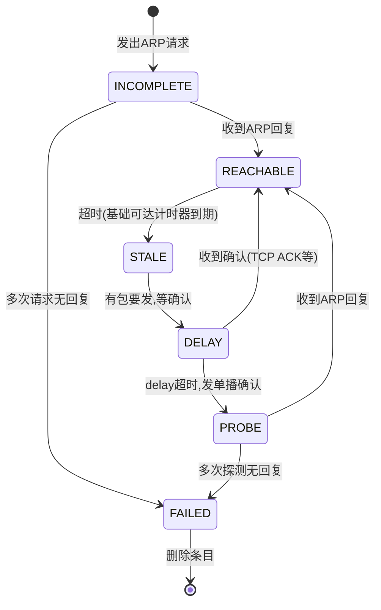

# ARP 命令使用手册

## 一、ARP 是什么

ARP（Address Resolution Protocol）负责在**IP 地址和 MAC 地址之间做翻译**。当主机知道目标 IP 但不知道目标 MAC 时，发一个 ARP 广播问"谁是 192.168.1.1？"，目标机收到后回复自己的 MAC。

```
发送方                                        目标方
  │  ARP 请求(广播): 谁是 192.168.1.1?          │
  │────────────────────────────────────────────→│
  │  ARP 回复(单播): 是我, MAC=aa:bb:cc:dd:ee:ff│
  │←────────────────────────────────────────────│
```

没有 ARP，IP 包就不知道往哪个物理网口发。

---

## 二、arp 命令（传统 net-tools）

### 查看 ARP 表

```bash
arp -a          # 显示所有条目（主机名形式）
arp -an         # 显示所有条目（数字形式，不解析主机名，更快）
arp -n          # 同上
```

输出示例：

```
Address          HWtype  HWaddress           Flags Mask            Iface
192.168.1.1      ether   00:11:22:33:44:55   C                     eth0
10.10.10.11      ether   b8:59:9f:2a:ab:fe   C                     eth1
```

| 列 | 含义 |
|----|------|
| `Address` | IP 地址 |
| `HWtype` | 硬件类型，`ether` 表示以太网 |
| `HWaddress` | MAC 地址 |
| `Flags` | `C`=完整条目(Complete)，`M`=静态(Permanent)，`P`=代理(Proxy) |
| `Iface` | 从哪个网口学到 |

### 查看指定 IP

```bash
arp -n 192.168.1.1
```

### 删除 ARP 条目

```bash
# 删单个
arp -d 192.168.1.1

# 删整个网口的
arp -d 192.168.1.1 -i eth0
```

### 添加静态 ARP

```bash
arp -s 192.168.1.1 aa:bb:cc:dd:ee:ff
arp -s 192.168.1.1 aa:bb:cc:dd:ee:ff -i eth0
```

### 参数速查

| 参数 | 含义 |
|------|------|
| `-a` | 显示所有 ARP 条目（hostname 格式） |
| `-n` | 数字格式显示，不做 DNS 反向解析 |
| `-d` | 删除指定条目 |
| `-s` | 添加静态条目 |
| `-i` | 指定网口 |
| `-v` | 详细模式 |

---

## 三、ip neigh 命令（现代 iproute2，推荐使用）

`ip neigh` 是 `arp` 的现代替代，功能更强。neigh = neighbor（邻居）。

### 查看 ARP 表

```bash
ip neigh show                 # 显示所有
ip neigh                      # 同上（show 可省略）
ip neigh show dev eth0        # 只看某个网口
ip neigh show nud reachable   # 只看状态为 reachable 的
```

输出格式：

```
192.168.1.1 dev eth0 lladdr 00:11:22:33:44:55 REACHABLE
10.10.10.11 dev eth1 lladdr b8:59:9f:2a:ab:fe STALE
192.168.1.100 dev eth0 FAILED
```

| 字段 | 含义 |
|------|------|
| IP | 邻居 IP |
| `dev eth0` | 从哪个网口 |
| `lladdr xx:xx` | MAC 地址（Link Layer Address） |
| `REACHABLE` | 状态 |

### ARP 表项状态说明



| 状态 | 含义 | 说明 |
|------|------|------|
| `INCOMPLETE` | ARP 请求已发出，等待回复 | 正常过渡状态 |
| `REACHABLE` | 可达，对方在线 | 收到过回复或TCP确认 |
| `STALE` | 过期但还能用 | 下次发包时会重新确认 |
| `DELAY` | STALE 后有包要发，等待确认 | 过渡状态 |
| `PROBE` | 正在发单播探测确认 | 过渡状态 |
| `FAILED` | 不可达 | 多次探测无响应，即将被删除 |
| `NOARP` | 不需要 ARP（如 PPP 接口） | 正常 |
| `PERMANENT` | 静态手工添加 | 不会被老化删除 |

### 添加/删除

```bash
# 添加静态ARP
ip neigh add 192.168.1.1 lladdr aa:bb:cc:dd:ee:ff dev eth0

# 添加到指定网口（PERMANENT，不会老化）
ip neigh add 192.168.1.1 lladdr aa:bb:cc:dd:ee:ff dev eth0 nud permanent

# 替换已有条目
ip neigh replace 192.168.1.1 lladdr 00:11:22:33:44:55 dev eth0

# 删除
ip neigh del 192.168.1.1 dev eth0

# 清空整个网口的ARP表（⚠ 断网操作）
ip neigh flush dev eth0

# 清空所有
ip neigh flush all
```

### 查看 ARP 表统计

```bash
ip -s neigh show            # 含统计信息
ip -s -s neigh show         # 更详细
```

统计信息里包含：`used`（上次使用时间）、`confirmed`（上次确认时间）、`updated`（上次更新时间）、`ref`（引用计数）、`probes`（探测次数）。

---

## 四、arping 命令（主动探测）

`arping` 主动发 ARP 请求测试连通性，工作在**二层**，不依赖 IP 层。即使对方没有配 IP 或 IP 配错了，只要能收到 ARP 请求就能回复。

### 基础用法

```bash
# 发 ARP 请求，看对方是否在线
arping -I eth0 192.168.1.1

# 指定次数
arping -I eth0 -c 3 192.168.1.1

# 指定源 IP（伪装）
arping -I eth0 -s 192.168.1.100 192.168.1.1
```

输出示例：

```
ARPING 192.168.1.1 from 192.168.1.50 eth0
Unicast reply from 192.168.1.1 [AA:BB:CC:DD:EE:FF] 0.350ms
Unicast reply from 192.168.1.1 [AA:BB:CC:DD:EE:FF] 0.280ms
Sent 3 probes, Received 3 responses
```

### 场景：检测 IP 冲突

```bash
# 发 ARP 请求，如果有多个 MAC 回复同一个 IP → IP 冲突
arping -D -I eth0 192.168.1.1
echo $?  # 返回 0=IP 未占用，返回 1=IP 已被占用
```

### 参数速查

| 参数 | 含义 |
|------|------|
| `-I <iface>` | 指定网口（**必须**） |
| `-c <n>` | 发 n 次后停止 |
| `-w <sec>` | 超时时间（秒） |
| `-s <ip>` | 指定源 IP |
| `-D` | 检测 IP 冲突模式 |
| `-U` | 免费 ARP（主动通告自己的 IP） |
| `-A` | 同上，ARP 回复模式 |
| `-f` | 收到第一个回复就退出 |
| `-b` | 只发广播，不期望回复 |

---

## 五、ARP 表操作对比

| 操作 | arp（传统） | ip neigh（推荐） |
|------|------------|-----------------|
| 查看全部 | `arp -an` | `ip neigh` |
| 查看单个 | `arp -n 1.2.3.4` | `ip neigh show 1.2.3.4` |
| 添加静态 | `arp -s 1.2.3.4 aa:bb:cc:dd:ee:ff` | `ip neigh add 1.2.3.4 lladdr aa:bb:cc:dd:ee:ff dev eth0 nud permanent` |
| 删除 | `arp -d 1.2.3.4` | `ip neigh del 1.2.3.4 dev eth0` |
| 清空网口 | 不支持 | `ip neigh flush dev eth0` |

---

## 六、常见故障排查场景

### 场景 1：ping 不通，查 ARP 表

```bash
# 1. 看看有没有学到 MAC
ip neigh show 192.168.1.1

# 2. 状态是 FAILED → 对端不在线或物理不通
# 3. 状态是 STALE + ping 不通 → IP/MAC 可能变了
# 4. 状态是 INCOMPLETE → ARP 请求发了但没收到回复
```

### 场景 2：怀疑 MAC 地址变了（有人换了网卡/IP冲突）

```bash
# 先清掉旧 ARP，重新学
ip neigh del 192.168.1.1 dev eth0
ping -c 1 192.168.1.1
ip neigh show 192.168.1.1  # 看新学到的 MAC
```

### 场景 3：排查 ARP 攻击 / MAC 漂移

```bash
# 持续监控特定 IP 的 MAC 变化
watch -n 1 'ip neigh show 192.168.1.1'

# 如果 MAC 在两个值间反复切换 → MAC 漂移，可能环路或 ARP 欺骗
```

### 场景 4：检查 VLAN 二层连通性

```bash
# 跨 VLAN 时，即使 IP 配对了，ARP 也通不了
arping -I vlan100 -c 3 192.168.100.11

# 没回复 → VLAN 不通（交换机端口没 trunk、ID 不对等）
# 有回复 → 二层 OK，问题在 IP 层以上
```

### 场景 5：检测 IP 是否已被占用

```bash
arping -D -I eth0 192.168.1.100 && echo "IP 可用" || echo "IP 已被占用"
```

### 场景 6：网口 down/up 后 ARP 表恢复

```bash
# 网口 flap 后，旧的 REACHABLE 条目会快速老化
# 主动通告自己的 IP，让交换机/邻居快速更新 MAC 表
arping -U -I eth0 -c 3 192.168.1.50
```

---

## 七、一键故障排查命令组合

```bash
#!/bin/bash
# arp_check.sh - ARP 层面快速诊断

TARGET="${1:-192.168.1.1}"
IFACE="${2:-eth0}"

echo "=== 1. ARP 表检查 ==="
ip neigh show "$TARGET"

echo "=== 2. 二层连通性测试(arping) ==="
arping -I "$IFACE" -c 3 "$TARGET"

echo "=== 3. IP 冲突检测 ==="
arping -D -I "$IFACE" -c 2 "$TARGET" && echo "无冲突" || echo "⚠ 存在冲突"

echo "=== 4. 网口状态 ==="
ip link show "$IFACE" | grep -E "state|UP"

echo "=== 5. 本端 MAC 和 IP ==="
ip addr show "$IFACE" | grep -E "inet |ether"
```
