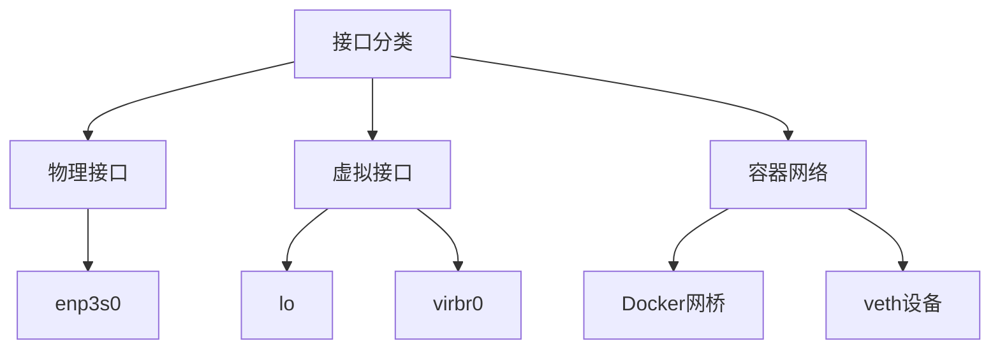
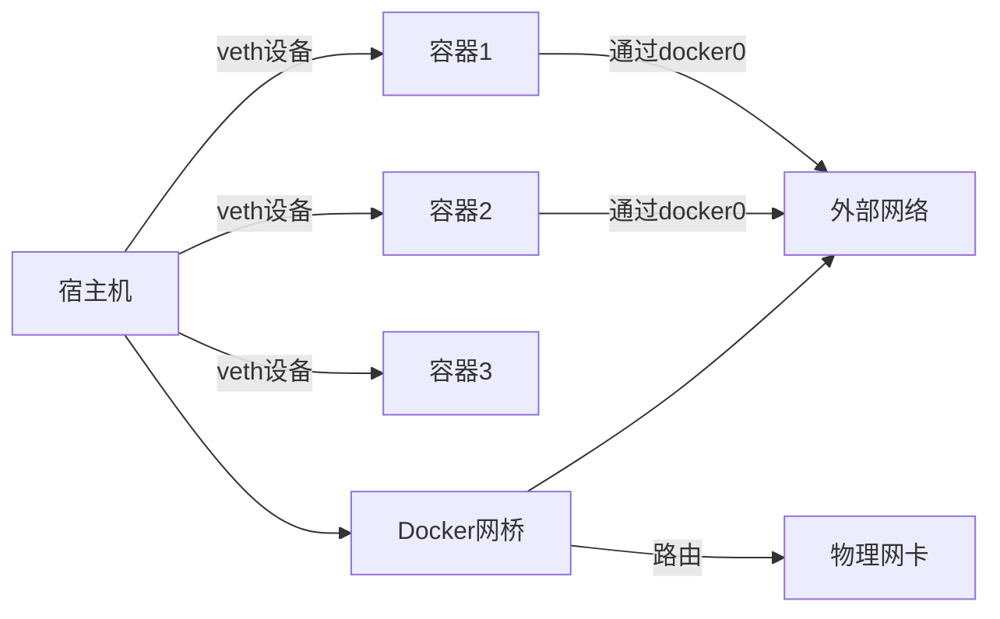

# ip
## help

ip help
Usage:` ip [ OPTIONS ] OBJECT { COMMAND | help }` 对象后面除了写COMMAND，还可以help
       ip [ -force ] -batch filename
📌**OPTIONS** := { -V[ersion] | -s[tatistics] | -d[etails] | -r[esolve] |
                    -h[uman-readable] |

​		     -iec 使用 IEC 单位(1Ki=1024)|
​                    -f[amily] { inet | inet6 | ipx | dnet | mpls | bridge | link } | -4 | -6 | -I | -D | -B | -0 |
​                    -l[oops] { maximum-addr-flush-attempts } |

​		     -br[ief]    **表格化输出**|
​                    -o[neline] **单行输出**| -t[imestamp] | -ts[hort] | -b[atch] [filename] |
​                    -rc[vbuf] [size] |

​                    -n[etns] name 网络命名空间|

​                    -a[ll] | 

​                    -c[olor]  彩色输出}

📌 **OBJECT** := { 

-  link 网络接口| 
- address IP 地址| addrlabel | 
- route  路由表| 
- rule 路由策略 | 
- neigh arp/ndp 邻居表| 
-  ntable  邻居表配置|
-  netns 命名空间
-  tunnel | tuntap | maddress | mroute | mrule | monitor | xfrm |
                      | l2tp | fou | macsec | tcp_metrics | token | netconf | ila |
                     vrf }


📌**COMMAND**:

|    命令     |   功能   |                   示例                    |
| :---------: | :------: | :---------------------------------------: |
|  **show**   | 显示信息 |              `ip link show`               |
|  **list**   | 列表显示 |              `ip addr list`               |
|   **add**   | 添加配置 |   `ip addr add 192.168.1.1/24 dev eth0`   |
|   **del**   | 删除配置 |   `ip addr del 192.168.1.1/24 dev eth0`   |
|   **set**   | 修改属性 |        `ip link set eth0 mtu 9000`        |
| **change**  | 修改配置 | `ip route change default via 192.168.1.1` |
| **replace** | 替换配置 | `ip addr replace 192.168.1.2/24 dev eth0` |
|  **flush**  | 清除配置 |         `ip neigh flush dev eth0`         |
|  **help**   | 对象帮助 |              `ip route help`              |


## 网络接口信息

	ip link set { DEVICE | dev DEVICE | group DEVGROUP }
			[ { up | down } ]

| 功能         | 命令                                | 说明                      |
| ------------ | ----------------------------------- | ------------------------- |
| 查看所有接口 | `ip link`                           | 类似 `ifconfig -a`,  ip a |
| 查看接口状态 | `ip link show dev eth0`             | 查看指定接口的状态信息    |
| 启用接口     | `ip link set dev eth0 up`           | 启动网卡                  |
| 禁用接口     | `ip link set dev eth0 down`         | 关闭网卡                  |
| 设置主从关系 | `ip link set dev eth0 master bond0` |                           |
| 修改 MTU     | `ip link set dev eth0 mtu 1400`     | 设置最大传输单元          |
| 删除网络接口 | `ip link delete <device>`           |                           |
| 创建网络接口 | `ip link add <name>`                |                           |

每个网卡（NIC）都被分配了唯一的名称，如 ethX、enpXXX 等。

- 旧的 Linux 发行版使用的是 `eth[X]` 格式。例如，RHEL 6 和它们的旧版本。
- 现代的 Linux 发行版使用 `enp[XXX]` 或 `ens[XXX]` 格式


`ip link add <name> type <link_type> [options] `创建网络接口

> 例如添加bond接口
>
> ip link add bond6 type bond mode balance-alb miimon 200 

`ip link set enp1s0f0 vf 0 rate 1000 ` vf流量限速

`ip link set DEVNAME vf 0 vlan 10` vf 配置vlan

`ip maddr add 01:00.5e:01:02:02 dev enp1s0f0v0`  添加组播mac地址

### ip link 示例

```shell
$ ip link show up
1: lo: <LOOPBACK,UP,LOWER_UP> mtu 65536 qdisc noqueue state UNKNOWN mode DEFAULT group default qlen 1000
    link/loopback 00:00:00:00:00:00 brd 00:00:00:00:00:00
2: enp3s0: <BROADCAST,MULTICAST,UP,LOWER_UP> mtu 1500 qdisc mq state UP mode DEFAULT group default qlen 1000
    link/ether 04:7c:16:52:b8:f6 brd ff:ff:ff:ff:ff:ff
3: virbr0: <NO-CARRIER,BROADCAST,MULTICAST,UP> mtu 1500 qdisc noqueue state DOWN mode DEFAULT group default qlen 1000
    link/ether 52:54:00:56:e1:82 brd ff:ff:ff:ff:ff:ff
5: br-45dccc0b0135: <NO-CARRIER,BROADCAST,MULTICAST,UP> mtu 1500 qdisc noqueue state DOWN mode DEFAULT group default
    link/ether 02:42:09:fd:1e:14 brd ff:ff:ff:ff:ff:ff
6: br-4e68be08f0a4: <NO-CARRIER,BROADCAST,MULTICAST,UP> mtu 1500 qdisc noqueue state DOWN mode DEFAULT group default
    link/ether 02:42:ed:d7:26:b8 brd ff:ff:ff:ff:ff:ff
7: br-765ac6315308: <NO-CARRIER,BROADCAST,MULTICAST,UP> mtu 1500 qdisc noqueue state DOWN mode DEFAULT group default
    link/ether 02:42:14:7a:9b:64 brd ff:ff:ff:ff:ff:ff
8: br-a5f8fc186b55: <NO-CARRIER,BROADCAST,MULTICAST,UP> mtu 1500 qdisc noqueue state DOWN mode DEFAULT group default
    link/ether 02:42:02:fa:0e:f7 brd ff:ff:ff:ff:ff:ff
9: docker0: <BROADCAST,MULTICAST,UP,LOWER_UP> mtu 1500 qdisc noqueue state UP mode DEFAULT group default
    link/ether 02:42:9b:4b:a0:bc brd ff:ff:ff:ff:ff:ff
11: vethf7b55b1@if10: <BROADCAST,MULTICAST,UP,LOWER_UP> mtu 1500 qdisc noqueue master docker0 state UP mode DEFAULT group default
    link/ether 3e:6b:40:9b:e1:7a brd ff:ff:ff:ff:ff:ff link-netnsid 0
22903: vethb5023e8@if22902: <BROADCAST,MULTICAST,UP,LOWER_UP> mtu 1500 qdisc noqueue master docker0 state UP mode DEFAULT group default
    link/ether 12:3d:32:95:75:21 brd ff:ff:ff:ff:ff:ff link-netnsid 2
22715: veth583e772@if22714: <BROADCAST,MULTICAST,UP,LOWER_UP> mtu 1500 qdisc noqueue master docker0 state UP mode DEFAULT group default
    link/ether b6:43:31:e1:f2:3c brd ff:ff:ff:ff:ff:ff link-netnsid 1
36541: veth4773535@if36540: <BROADCAST,MULTICAST,UP,LOWER_UP> mtu 1500 qdisc noqueue master docker0 state UP mode DEFAULT group default
    link/ether fe:6c:b2:57:23:c9 brd ff:ff:ff:ff:ff:ff link-netnsid 4
36557: veth27c4289@if36556: <BROADCAST,MULTICAST,UP,LOWER_UP> mtu 1500 qdisc noqueue master docker0 state UP mode DEFAULT group default
    link/ether 4a:3e:30:6a:3c:b2 brd ff:ff:ff:ff:ff:ff link-netnsid 6
36579: veth71a2a75@if36578: <BROADCAST,MULTICAST,UP,LOWER_UP> mtu 1500 qdisc noqueue master docker0 state UP mode DEFAULT group default
    link/ether da:4d:14:ed:6e:6e brd ff:ff:ff:ff:ff:ff link-netnsid 5
36599: veth6d8a073@if36598: <BROADCAST,MULTICAST,UP,LOWER_UP> mtu 1500 qdisc noqueue master docker0 state UP mode DEFAULT group default
    link/ether 4a:b4:06:89:bb:65 brd ff:ff:ff:ff:ff:ff link-netnsid 3
```




**每个接口有两行**：

1. 摘要：`<接口索引>: <接口名>: <状态标志> mtu <MTU值> qdisc <队列规则> state <状态> mode <模式> group <组> [qlen <队列长度>]`
2. 详细：`    link/ether <MAC地址> brd <广播地址> [附加信息]`



**veth设备**

`11: vethf7b55b1@if10: <BROADCAST,MULTICAST,UP,LOWER_UP> mtu 1500 qdisc noqueue master docker0 state UP mode DEFAULT group default
    link/ether 3e:6b:40:9b:e1:7a brd ff:ff:ff:ff:ff:ff link-netnsid 0`

- **命名规则**：`veth` + 随机ID + `@if` + 对端接口索引
- **master**：绑定到docker0网桥
- **link-netnsid**：连接到网络命名空间ID 0（容器）
- **作用**：连接容器与宿主机网络

状态标记

|     标志     |      含义      |   示例接口   |
| :----------: | :------------: | :----------: |
|  `LOOPBACK`  |    回环接口    |      lo      |
| `BROADCAST`  |    支持广播    |    enp3s0    |
| `MULTICAST`  |    支持组播    |    enp3s0    |
|     `UP`     |   接口已启用   | 所有显示接口 |
|  `LOWER_UP`  | 物理链路已连接 |    enp3s0    |
| `NO-CARRIER` |   无物理连接   |    virbr0    |


## addr: ip地址管理

| 功能           | 命令                                     | 说明               |
| -------------- | ---------------------------------------- | ------------------ |
| 查看 IP 地址   | `ip addr` 或 `ip a`                      | 显示所有接口的 IP  |
| 查看某接口地址 | `ip addr show dev eth0`                  |                    |
| 添加 IP 地址   | `ip addr add 192.168.1.100/24 dev eth0`  | 添加一个 IPv4 地址 |
| 删除 IP 地址   | `ip addr del 192.168.1.100/24 dev eth0`  | 删除 IPv4 地址     |
| 添加 IPv6 地址 | `ip -6 addr add 2001:db8::1/64 dev eth0` | 添加 IPv6 地址     |

 ens4f1: <**NO-CARRIER**,BROADCAST,MULTICAST,UP> mtu 1500 qdisc mq state DOWN group default qlen 1000

NO-CARRIER： 未连接网线

## route 路由管理

### 基本命令

ip route add <网络> via <网关> [dev <出口网卡>]

> 这里的<网络>可以是目标主机，也可以是目标网络/掩码
>
> 出口网卡可选

ip route del <网络>
ip route get <IP>

| 功能         | 命令                                          | 说明             |
| ------------ | --------------------------------------------- | ---------------- |
| 查看路由表   | `ip route` 或 `ip r`，  旧命令`route -n`      | 显示主路由表     |
| 添加路由     | `ip route add 192.168.2.0/24 via 192.168.1.1` | 添加一条静态路由 |
| 删除路由     | `ip route del 192.168.2.0/24`                 | 删除一条静态路由 |
| 默认路由     | `ip route add default via 192.168.1.1`        | 设置默认网关     |
| 指定接口路由 | `ip route add 10.0.0.0/24 dev eth1`           | 无需网关         |

路由是网络层的核心功能，本质是**数据包转发决策系统**。当设备发送IP数据包时，路由表决定：

1. **是否可达**：目标地址是否在路由表中
2. **下一跳**：通过哪个网关转发
3. **出口**：从哪个网络接口发出

$ ip r
default via 192.168.22.1 dev enp4s0 proto static metric 100
10.0.2.0/24 dev enp1s0f1 proto kernel scope link src 10.0.2.71
10.0.3.0/24 dev enp1s0f1v0 proto kernel scope link src 10.0.3.10
122.199.10.0/24 dev enp1s0f0 proto kernel scope link src 122.199.10.171 metric 101
169.254.0.0/16 dev enp4s0 scope link metric 1000
192.168.22.0/24 dev enp4s0 proto kernel scope link src 192.168.22.171 metric 100

### 命令帮助

$ip route help

✅命令

Usage: ip route { list | flush } SELECTOR
       ip route save SELECTOR
       ip route restore
       ip route showdump
       ip route get [ ROUTE_GET_FLAGS ] ADDRESS
                            [ from ADDRESS iif STRING ]
                            [ oif STRING ] [ tos TOS ]
                            [ mark NUMBER ] [ vrf NAME ]
                            [ uid NUMBER ] [ ipproto PROTOCOL ]
                            [ sport NUMBER ] [ dport NUMBER ]
       ip route { add | del | change | append | replace } ROUTE

✅选择器

SELECTOR := [ root PREFIX ] [ match PREFIX ] [ exact PREFIX ]
            [ table TABLE_ID ] [ vrf NAME ] [ proto RTPROTO ]
            [ type TYPE ] [ scope SCOPE ]
ROUTE := NODE_SPEC [ INFO_SPEC ]

✅路由定义

- 目标网络定义

NODE_SPEC := [ TYPE ] PREFIX [ tos TOS ]
             [ table TABLE_ID ] [ proto RTPROTO ]
             [ scope SCOPE ] [ metric METRIC ]
             [ ttl-propagate { enabled | disabled } ]

- 路径定义

INFO_SPEC := { NH | nhid ID } OPTIONS FLAGS [ nexthop NH ]...

下一跳(Next Hop)

NH := [ encap ENCAPTYPE ENCAPHDR ] [ via [ FAMILY ] ADDRESS ]
	    [ dev STRING ] [ weight NUMBER ] NHFLAGS
FAMILY := [ inet | inet6 | mpls | bridge | link ]
OPTIONS := FLAGS [ mtu NUMBER ] [ advmss NUMBER ] [ as [ to ] ADDRESS ]
           [ rtt TIME ] [ rttvar TIME ] [ reordering NUMBER ]
           [ window NUMBER ] [ cwnd NUMBER ] [ initcwnd NUMBER ]
           [ ssthresh NUMBER ] [ realms REALM ] [ src ADDRESS ]
           [ rto_min TIME ] [ hoplimit NUMBER ] [ initrwnd NUMBER ]
           [ features FEATURES ] [ quickack BOOL ] [ congctl NAME ]
           [ pref PREF ] [ expires TIME ] [ fastopen_no_cookie BOOL ]

路由类型

TYPE := { unicast | local | broadcast | multicast | throw |
          unreachable | prohibit | blackhole | nat }

路由表：

TABLE_ID := [ local | main | default | all | NUMBER ]

作用域

SCOPE := [ host | link | global | NUMBER ]
NHFLAGS := [ onlink | pervasive ]

路由协议

RTPROTO := [ kernel | boot | static | NUMBER ]
PREF := [ low | medium | high ]
TIME := NUMBER[s|ms]
BOOL := [1|0]
FEATURES := ecn
ENCAPTYPE := [ mpls | ip | ip6 | seg6 | seg6local ]
ENCAPHDR := [ MPLSLABEL | SEG6HDR ]
SEG6HDR := [ mode SEGMODE ] segs ADDR1,ADDRi,ADDRn [hmac HMACKEYID] [cleanup]
SEGMODE := [ encap | inline ]
ROUTE_GET_FLAGS := [ fibmatch ]

## netns

Namespace 就像是“虚拟的隔离房间”， 每个房间里的进程只能看到自己的网络、进程、挂载点、主机名等。

Usage:	

​	ip netns list         查
​	ip netns add NAME  增
​	ip netns attach NAME PID
​	ip netns set NAME NETNSID
​	ip [-all] netns delete [NAME]  删
​	ip netns identify [PID]
​	ip netns pids NAME
​	ip [-all] netns exec [NAME] cmd ...  执行命令
​	ip netns monitor
​	ip netns list-id [target-nsid POSITIVE-INT] [nsid POSITIVE-INT]  


```shell
[root@localhost ~]# ip netns add ns1
[root@localhost ~]# ip netns list
ns1
[root@localhost ~]# ifconfig ens4f1 down
[root@localhost ~]# ip link set ens4f1 netns ns1
[root@localhost ~]# ip netns exec ns1 ip a show
1: lo: <LOOPBACK> mtu 65536 qdisc noop state DOWN mode DEFAULT group default qlen 1000
    link/loopback 00:00:00:00:00:00 brd 00:00:00:00:00:00
7: ens4f1: <BROADCAST,MULTICAST> mtu 9000 qdisc noop state DOWN mode DEFAULT group default qlen 1000
    link/ether 74:3e:39:20:06:b7 brd ff:ff:ff:ff:ff:ff
[root@localhost ~]# ip netns exec ns1 ip addr add 1.1.1.2/24 dev ens4f1
[root@localhost ~]# ip netns exec ns1 ip link set ens4f1 up
[root@localhost ~]# ip netns exec ns1 ip link set lo up
ip netns exec ns1 ip a  可以看到ip 已经加上，ip link 不显示ip


```


# ifconfig

`ifconfig`（interface configurator）是 Linux 和类 Unix 系统中的传统网络配置工具，用于查看和配置网络接口的地址和状态。

| 应用场景                | 命令示例                                            | 说明                                     |
| ----------------------- | --------------------------------------------------- | ---------------------------------------- |
| 查看所有网卡状态        | `ifconfig`                                          | 显示所有已激活（UP）的接口信息           |
| 查看指定接口状态        | `ifconfig eth0`                                     | 查看 eth0 的详细信息                     |
| 启用网卡                | `ifconfig eth0 up`                                  | 激活网卡（等效于 `ip link set eth0 up`） |
| 禁用网卡                | `ifconfig eth0 down`                                | 禁用网卡                                 |
| 设置 IP 地址            | `ifconfig eth0 192.168.1.100`                       | 设置 IPv4 地址                           |
| 设置 IP+子网掩码        | `ifconfig eth0 192.168.1.100 netmask 255.255.255.0` | 同时设置 IP 和子网掩码                   |
| 添加广播地址            | `ifconfig eth0 broadcast 192.168.1.255`             | 显式设置广播地址                         |
| 设置 MAC 地址（需权限） | `ifconfig eth0 hw ether 00:11:22:33:44:55`          | 修改 MAC 地址（临时）                    |
| 设置 MTU                | `ifconfig eth0 mtu 1400`                            | 修改最大传输单元大小                     |
| 清除所有设置（慎用）    | `ifconfig eth0 0.0.0.0`                             | 清除接口 IP                              |

`ifconfig` 不会显示 **未启用的接口**，可以使用 `ip link` 或 `ifconfig -a` 查看全部。

新系统建议使用 `ip` 命令替代 `ifconfig`（如 `ip addr`、`ip link`）。


# ethtool

## 常用

`ethtool` 用于查看和修改网络设备（尤其是有线以太网设备）的驱动参数和硬件设置
[参考](https://zhuanlan.zhihu.com/p/146383216)

- **[半双工](https://zhida.zhihu.com/search?content_id=120662519&content_type=Article&match_order=1&q=半双工&zhida_source=entity)**：半双工模式允许设备一次只能发送或接收数据包。
- **[全双工](https://zhida.zhihu.com/search?content_id=120662519&content_type=Article&match_order=1&q=全双工&zhida_source=entity)**：全双工模式允许设备可以同时发送和接收数据包。
- **自动协商**：自动协商是一种机制，允许设备自动选择最佳网速和工作模式（全双工或半双工模式）。
- **速度**：默认情况下，它会使用最大速度，你可以根据自己的需要改变它。

```shell
ethtool enp3s0  #网卡信息，支持的fec类型
ethtool -i(info) enp3s0 #驱动程序版本、固件版本和总线的详细信息
ethtool -S(stat) enp3s0 # 网络使用情况统计
ethtool -a(autoneg) enp3s0 #查看自动协商、RX、TX等详细信息

ethtool -p(physical) enp3s0 # LED闪烁30s，用于识别物理接口

ethtool -k(kernel offload) enp3s0 # 查看功能卸载状态
ethtool -K enp3s0 <feature> [on|off]  # 卸载功能开关

ethtool -g(getring) enp3s0 # 查看rx buffer设置	Query RX/TX ring parameters
ethtool -G(grow/Give new size) enp3s0 tx 4096 tx 4096 # 设置接收队列

ethtool -l enp3s0   #查看网卡队列配置
ethtool -L enp3s0 combined 4 #配置网卡队列

ethtool -m enp3s0 #Query/Decode Module EEPROM information

ethtool --show-fec DEVNAME  #查看网卡设置的FEC设置
ethtool --set-fec DEVNAME encoding rs/auto/off #设置FEC，需要考虑对端交换机配置和规格


ethtool --set-priv-flags  enp3s0 disable-fw-lldp on / off # 配置lldp开关
```

**RSS报文散列配置**

网卡默认按照五元组hash进行RSS，使用toeplitz算法。

查看当前配置

`ethtool -n enp3s0 rx-flow-hash udp4`

配置网卡udp协议按照三元组进行RSS：

`ethtool --config-ntuple ${interface} rx-flow-hash udp4 sdt `

配置网卡udp协议按照五元组进行RSS：

`ethtool --config-ntuple ${interface} rx-flow-hash udp4 sdtfn `

> - `s`：源 IP
> - `d`：目的 IP
> - `t`：目的端口
> - `f`：源端口（Source Port）
> - `n`：协议号（Protocol Number）


**网络时间戳**

```shell
ethtool -T enp3s0  #查看网络接口的时间戳功能支持情况
sudo yum install linuxptp
ptp4l -v
主时钟启动(2层)
ptp4l -i enp1s0f0 -2
从时钟启动(2层)
ptp4l -i enp1s0f0 -2 -s
主时钟启动(4层)
ptp4l -i enp1s0f0 -4
从时钟启动(4层)
ptp4l -i enp1s0f0 -4 -s
```

| 参数 |            功能             |         示例         |
| :--: | :-------------------------: | :------------------: |
| `-i` |        指定网络接口         |     `-i enp3s0`      |
| `-m` |     打印消息到标准输出      |         `-m`         |
| `-f` |        指定配置文件         | `-f /etc/ptp4l.conf` |
| `-s` |         从时钟模式          |         `-s`         |
| `-l` |        设置日志级别         |        `-l 6`        |
| `-2` | 使用 IEEE 1588-2008 (PTPv2) |         `-2`         |

## 光模块

ethtool -m enp33s0f0

Identifier                                : 0x03 (SFP)  # 模块类型：SFP（小型可插拔）
Extended identifier                       : 0x04 (GBIC/SFP defined by 2-wire interface ID)  # 扩展标识：符合GBIC/SFP标准，使用2线接口ID
Connector                                 : 0x07 (LC)  # 连接器类型：LC（标准光纤接口）
Transceiver codes                         : 0x00 0x00 0x00 0x00 0x00 0x00 0x00 0x00 0x02  # 收发器编码：厂商特定编码
Transceiver type                          : Extended: 100G Base-SR4 or 25GBase-SR  # **收发器类型：支持100G-SR4（4通道）或25G-SR（单通道）**
Encoding                                  : 0x03 (NRZ)  # 编码方式：不归零编码（标准光信号编码）
BR, Nominal                               : 25750MBd  # 波特率：25.75 GBd（千兆波特）
Rate identifier                           : 0x00 (unspecified)  # 速率标识：未指定特殊速率
Length (SMF,km)                           : 0km  # 单模光纤距离：不支持单模光纤
Length (SMF)                              : 0m  # 单模光纤距离：不支持单模光纤
Length (50um)                             : 0m  # 50微米多模光纤距离：不支持
Length (62.5um)                           : 0m  # 62.5微米多模光纤距离：不支持
Length (Copper)                           : 10m  # 铜缆距离：理论值（实际不支持铜缆）
Length (OM3)                              : 70m  # OM3多模光纤距离：最大支持70米
Laser wavelength                          : 850nm  # 激光波长：850纳米（多模光纤标准）
Vendor name                               : NADDOD  # 厂商名称：NADDOD
Vendor OUI                                : 00:00:00  # 厂商唯一标识：异常值（应为3字节注册标识）
Vendor PN                                 : SFP-25G-SR  # 厂商部件号：25G短距光模块
Vendor rev                                : A1  # 硬件版本：A1版
Option values                             : 0x08 0x1a  # 选项值：功能位掩码（需解析）
Option                                    : RX_LOS implemented  # 功能选项：接收信号丢失检测已实现
Option                                    : TX_FAULT implemented  # 功能选项：发送故障检测已实现
Option                                    : TX_DISABLE implemented  # 功能选项：发送禁用控制已实现
Option                                    : Retimer or CDR implemented  # 功能选项：时钟恢复功能已实现
BR margin, max                            : 0%  # 波特率最大容差：0%（严格匹配）
BR margin, min                            : 0%  # 波特率最小容差：0%（严格匹配）
Vendor SN                                 : 5A2310180192  # 序列号：唯一设备标识
Date code                                 : 231018  # 生产日期：2023年10月18日


## 特性

### RSS

五元组哈希

|    字段     | 简称 |   包含   |           效果           |
| :---------: | :--: | :------: | :----------------------: |
|  L3 proto   |  n   | 协议类型 |      区分TCP/UDP等       |
|    IP SA    |  s   |   源IP   |    分散不同客户端流量    |
|    IP DA    |  d   |  目的IP  |     分散不同服务流量     |
| L4 src port |  f   |  源端口  | 分散同一客户端的多个连接 |
| L4 dst port |  f   | 目的端口 |     分散不同服务流量     |

此外还有一个t,  **多租户环境**：必须启用 `t`

| 字段     | 简称 | 包含     | 效果 |
| -------- | ---- | -------- | ---- |
| VLAN tag | t    | VLAN标签 |      |

可选配置

|   配置   |     字段      |   适用场景   |                缺点                |
| :------: | :-----------: | :----------: | :--------------------------------: |
|  **sd**  |   IP SA+DA    | 基础负载均衡 | 同一客户端多连接可能分配到同一队列 |
| **sdf**  | IP SA+DA+端口 | 标准Web服务  |            不能区分协议            |
| **sdfn** |  完整五元组   | 最佳通用配置 |                 无                 |
|  **d**   |    目的IP     |   CDN节点    |            源IP不可控时            |


# DNS

## dig： DNS解析查找

在使用dig命令时，可以通过指定@server来请求特定的DNS服务器的主机名或IP地址。如果没有指定DNS服务器，则会使用系统当前配置的DNS服务器。在查询时，可以指定要查找的域名和要检索的DNS记录类型（默认为A记录类型）

# lspci

## 功能

**硬件识别**

- 识别未知硬件设备
- 获取设备厂商和型号
- 确定硬件ID（用于驱动匹配）

 **驱动管理**

- 检查设备是否加载驱动
- 确认驱动是否正确绑定
- 查找未识别的设备

```shell
$lspci -D  
地址格式：[DOMAIN]:[BUS]:[DEVICE].[FUNCTION]
0000= 域（通常单系统为 0000）
05= 总线号
00= 设备号
.2= 功能号
lspci -tv #列出所有PCI设备
lspci |grep -i eth #查看网卡型号
lspci -s 03:02.0 -vv     #-s后面接的是每个设备的总线、插槽与相关函数功能
```


显示模式:
**-t**		树状显示：用于理解硬件连接

选项:
-v		Be verbose (-vv for very verbose)
-k		显示内核驱动
-x		Show hex-dump of the standard part of the config space
-xxx		Show hex-dump of the whole config space (dangerous; root only)
-xxxx		Show hex-dump of the 4096-byte extended config space (root only)
-b		Bus-centric view (addresses and IRQ's as seen by the bus)
-D		显示域号

Resolving of device ID's to names:
-n		Show numeric ID's
-nn	      显示(names & numbers)
-q		Query the PCI ID database for unknown ID's via DNS
-qq		As above, but re-query locally cached entries
-Q		Query the PCI ID database for all ID's via DNS

设备选择:
**-s** [[[[<domain>]:]<bus>]:][][.[<func>]]	Show only devices in selected slots
-d [<vendor>]:[<device>][:]		Show only devices with specified ID's

Other options:
-i <file>	Use specified ID database instead of /usr/share/hwdata/pci.ids
-p <file>	Look up kernel modules in a given file instead of default modules.pcimap
-M		Enable `bus mapping' mode (dangerous; root only)

PCI access options:
-A <method>	Use the specified PCI access method (see `-A help' for a list)
-O <par>=<val>	Set PCI access parameter (see `-O help' for a list)
-G		Enable PCI access debugging
-H <mode>	Use direct hardware access (<mode> = 1 or 2)
-F <file>	Read PCI configuration dump from a given file

### 示例

```shell
(py39) [hados@kubernetes-master ~]$ lspci -tvvnn
						#位置 													[厂商ID:设备ID]
-[0000:00]-+-00.0  Intel Corporation Device [8086:4650] 
           +-02.0  Intel Corporation Device [8086:4692]
           #桥接器  [总线]  设备  类型
           +-06.0-[01]----00.0  Samsung Electronics Co Ltd Device [144d:a809]
           +-08.0  Intel Corporation Device [8086:464f]
           +-0a.0  Intel Corporation Device [8086:467d]
           +-14.0  Intel Corporation Device [8086:7ae0]
           +-14.2  Intel Corporation Device [8086:7aa7]
           +-14.3  Intel Corporation Device [8086:7af0]
           +-16.0  Intel Corporation Device [8086:7ae8]
           +-17.0  Intel Corporation Device [8086:7ae2]
           +-1c.0-[02]--
           +-1c.1-[03]----00.0  Realtek Semiconductor Co., Ltd. RTL8125 2.5GbE Controller [10ec:8125]
           +-1c.3-[04]----00.0  ASMedia Technology Inc. ASM1062 Serial ATA Controller [1b21:0612]
           +-1f.0  Intel Corporation Device [8086:7a86]
           +-1f.3  Intel Corporation Device [8086:7ad0]
           +-1f.4  Intel Corporation Device [8086:7aa3]
           \-1f.5  Intel Corporation Device [8086:7aa4]
           
```

PCIe 扩展总线

|  总线  | 桥接器  |  设备   |            类型             |
| :----: | :-----: | :-----: | :-------------------------: |
|   00   |         |         | 根总线，连接CPU 和核心设备  |
| **01** | 00:06.0 | 01:00.0 | 扩展总线： Samsung NVMe SSD |
| **02** | 00:1c.0 | 无设备  |        空闲PCIe插槽         |
| **03** | 00:1c.1 | 03:00.0 |     Realtek 2.5GbE网卡      |
| **04** | 00:1c.3 | 04:00.0 |     ASMedia SATA扩展卡      |


## pci<->dev

pci 地址找设备

`ls $(find /sys/devices/ -name 'net' -type d|grep 'bus:dev.fun')`

设备找pci 地址

`ethtool -i enp3s0`

## pci->numa_node

通过PCI地址查找NUMA节点

cat /sys/bus/pci/devices/0000:02:00.0/numa_node

# tcpdump

tcpdump -i  enp33s0f0  -vv

[tcpdump](/Users/chengxingfu/cloudu/云创新/网络抓包工具tcpdump.md)

# taskset


Usage: taskset  [options]  [mask | cpu-list]  [pid|cmd [args...]]

🧰选项:
 -a, --all-tasks     操作所有线程
 -p, --pid      操作现有进程
 -c, --cpu-list     cpu 列表
📌mask | cpu-list:

- mask(掩码表示法): 每个cpu核心对应一个bit位
  $CPU0=2^0=1$
  $CPU1=2^1=2$
  $CPU2=2^2=4$
  CPU0+1=1+2=03 表示
  CPU0+2=1+4=05 表示

- cpu-list(列表表示法)， 也就是-c 的值，这种比较友好

📌pid|cmd [args...]  就是进程号或者进程

**示例**

-  taskset 03 sshd -b 1024

> `03` 是 CPU 亲和性掩码（十六进制），表示绑定到 CPU0 和 CPU1（因为 0x03 的二进制是 0011，对应 CPU0 和 CPU1）

- 查看/设置进程亲和性
      taskset -p 700  查看
      taskset -p 03 700  掩码方式设置cpu
      taskset -pc 0,3,7-11 700  列表方式设置cpu

# route

该命令有新的更强大的命令代替：ip route xxx, 不仅输出网卡，还输出网卡ip

> ifconfig 对ip 地址的add/del 操作会自动修改路由表

语法：

route [-CFvnNee] [-A family |-4|-6]
route  [-v] [-A family |-4|-6] add [-net|-host] target [netmask Nm] [gw Gw] [metric N] [mss M] [window W] [irtt I] [reject] [mod] [dyn] [reinstate] [[dev] If]    
route  [-v] [-A family |-4|-6] del [-net|-host] target [gw Gw] [netmask Nm] [metric M] [[dev] If]
route  [-V] [--version] [-h] [--help]

```shell
root@node171:~# route -n
Kernel IP routing table
Destination     Gateway         Genmask         Flags Metric Ref    Use Iface
0.0.0.0         192.168.22.1    0.0.0.0         UG    100    0        0 enp4s0
10.0.2.0        0.0.0.0         255.255.255.0   U     0      0        0 enp1s0f1
10.0.3.0        0.0.0.0         255.255.255.0   U     0      0        0 enp1s0f1v0
122.199.10.0    0.0.0.0         255.255.255.0   U     101    0        0 enp1s0f0
169.254.0.0     0.0.0.0         255.255.0.0     U     1000   0        0 enp4s0
192.168.22.0    0.0.0.0         255.255.255.0   U     100    0        0 enp4s0
```

1. **Destination**：目标网络地址,  特殊的 0.0.0.0 是默认路由，典型场景是访问互联网的流量

2. **Gateway**：

   - `0.0.0.0`= 直连网络（无需网关）
   - 其他IP = 下一跳路由器地址

3. **Genmask**：子网掩码（与Destination组合定义网段）

   > 示例中目标网段10.0.2.0/24是直连网络，且优先级最高，通过物理网卡enp1s0f1 直接通信
   >
   > 169.254.0.0  , 255.255.0.0 对应网段169.254.0.0/16

4. **Flags**：

   - `U`：路由可用（Up）
   - `G`：需要网关（Gateway）
   - `H`：主机路由（已淘汰）

5. **Metric**：路由优先级（值越小优先级越高）

6. **Iface**：数据出口接口

路由优先级规则

1. **最长前缀匹配**：192.168.22.0/24 优先于 0.0.0.0/0
2. **Metric值比较**：
   - 直连路由Metric=0 > 默认路由Metric=100
   - 相同前缀时选Metric小的
3. **接口优先级**：相同Metric时按接口顺序选择

# netperf


1、 server端：netserver

2、 client端：

netperf -t TCP_RR -H <server-ip> -l 30 -- -r 512 512 -O MEAN_LATENCY -D > TCP_RR_512.log

netperf -t UDP_RR -H <server-ip> -l 30 -- -r 512 512 -O MEAN_LATENCY -D > UDP_RR_512.log

# arp


# 特性

1. FEC 前向纠错模式，提高了链路稳定性
  通过ethtool DEVNAME命令来查看支持的FEC类型
  
   


# 帮助文档的语法

有两种查看方法：

1. help  简略
2. man  更详细

```shell
$ip link help
Usage: ip link add [link DEV] [ name ] NAME
                   [ txqueuelen PACKETS ]
                   [ address LLADDR ]
                   [ broadcast LLADDR ]
                   [ mtu MTU ] [index IDX ]
                   [ numtxqueues QUEUE_COUNT ]
                   [ numrxqueues QUEUE_COUNT ]
                   type TYPE [ ARGS ]
```

1. `[]` 可选参数
   示例：[ name ] NAME 表示：
   可以写 name eth0 或直接写 eth0

2. `[ part1 part2 ]` 参数分组：  同时出现或省略
3. `|`  互斥选择：`[A|B|C]` 表示可以选 A、B 或 C 中的一项
4. `{ | }` 必选分组：必须选择一个
   `[{ | }]`意味着整个分组是可选的
5. `<>`  占位符： 需要替换具体值


ethtool -S enp1s0f0  查看网卡实例的统计信息

1. 网卡多队列

ethtool -l enp1s0f0  查看网卡队列配置

ethtool -L enp1s0f0 combined 4  配置网卡队列数

2. RSS

配置网卡udp协议按照三元组进行RSS：

ethtool --config-ntuple ${interface} rx-flow-hash udp4 sdt 

配置网卡udp协议按照五元组进行RSS：

ethtool --config-ntuple ${interface} rx-flow-hash udp4 sdtfn 

4. 发送/接收方向校验和卸载开关
   ```shell
   ethtool -K enp1s0f0 tx/rx on/off
   ```

   

5. 分片卸载
   ```shell
   ethtool -K enp1s0f0 tso/gro/gso/lro on/off
   ```

6. RX/TX buffer

   ethtool -g enp1s0f0 #查看rx buffer配置

   ethtool -G enp1s0f0 rx 4096 tx 4096 # 设置接收队列

7. FEC Mode
   网卡支持设置前向纠错 (FEC) 模式，FEC提高了链路稳定性

   ethtool --show-fec DEVNAME  #查看网卡设置的FEC设置

   ethtool --set-fec DEVNAME encoding rs/auto/off #设置FEC

8. Bond

   

9. VLAN隔离

   不同节点不同VLAN的VF隔离。两个节点接口直连或者通过交换机连接。

   在两个节点上分别创建1个VF接口

   echo 1 > /sys/bus/pci/devices/0000:01:00.0/sirov_numvfs

   在节点1配置VF接口vlan 为10，并配置IP为192.168.1.10

   ip link set DEVNAME vf 0 vlan 10

   ip addr add 192.168.1.10/24 dev DEVNAME

   在节点2配置VF接口vlan为20，并配置IP为192.168.1.20

   ip link set DEVNAME vf 0 vlan 20

   ip addr add 192.168.1.20/24 dev DEVNAME

   通过ping命令发现无法互ping成功。

   同节点不同VLAN的VF隔离同样配置后可发现无法ping通。

10. VLAN卸载

    ethtool -K enp1s0f0 tx-vlan-offload on

    ethtool -K enp1s0f0 rx-vlan-offload on

11. QlnQ(VLAN套娃)

12. 混杂模式

    ip link set enp1s0f0 promisc on/off

13. Vxlan无状态卸载

14. ethtool -K enp1s0f0 tx-udp_tnl-segmentation on/off

    ethtool -K enp1s0f0 tx-udp_tnl-csum-segmentation on/off

15. 组播

    添加一个组播 MAC 地址到enp1s0f0v0（如 01:00:5E:01:02:02）

    ip link set enp1s0f0v0 multicast on

    ip maddr add 01:00.5e:01:02:02 dev enp1s0f0v0

16. 流量限速？

    1. 基于VF的流量限速：

    ip link set enp1s0f0 vf 0 rate 1000 

    2. 基于VLAN的流量限速：
       1. 配置优先级映射关系

    echo 0,1,0,0,0,0,0,0 0,1G,0,0,0,0,0,0 > /sys/bus/pci/devices/0000\:01\:00.0/hw/vlan_qos

    ​	2. 配置vlan子接口

    ip link add enp1s0f0.10 link enp1s0f0 type vlan id 10

    ​	3. 将vlan优先级映射到队列优先级

    ip link set enp1s0f0.10 type vlan egress 0:1 1:1 2:1 3:1 4:1 5:1 6:1 7:1

17. 流量控制
    在硬件层面，流控控制的是发送方是否暂停发包、是否等待对方缓冲区释放资源后再继续发送

18. MTU可设置
    最大传输单元，指的是网络接口一次能够传输的最大数据包大小（以字节为单位）

    ifconfig enp1s0f0  mtu  MTU_NUM

19. 巨帧
    ifconfig enp1s0f0 mtu 9000   # 改

    ifconfig enp1s0f0  #查

20. PXE
    是一种使用网络接口启动服务器的机制，允许计算机在BIOS/UEFI阶段加载网卡Option ROM驱动，通过局域网获取启动文件及操作系统镜像。

21. SR-IOV虚拟化
    允许PCI Express设备显示为多个单独的物理PCI Express设备。SR-IOV允许在虚拟机 (vm) 之间高效共享PCI设备。  **文档中这里有笔误**
