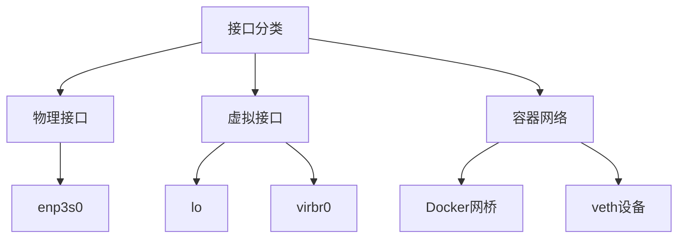
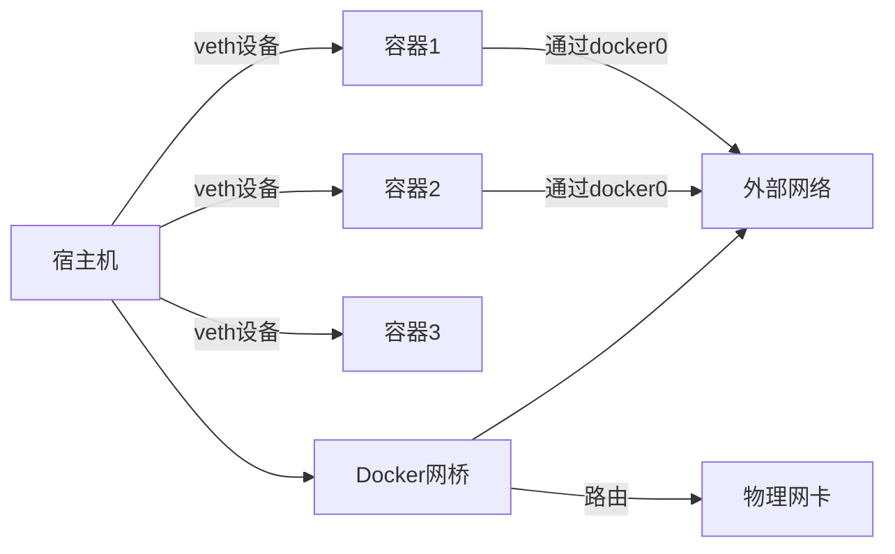

# ip

## 网络接口信息

| 功能         | 命令                                | 说明                      |
| ------------ | ----------------------------------- | ------------------------- |
| 查看所有接口 | `ip link`                           | 类似 `ifconfig -a`,  ip a |
| 查看接口状态 | `ip link show dev eth0`             | 查看指定接口的状态信息    |
| 启用接口     | `ip link set dev eth0 up`           | 启动网卡                  |
| 禁用接口     | `ip link set dev eth0 down`         | 关闭网卡                  |
| 设置主从关系 | `ip link set dev eth0 master bond0` |                           |
| 修改 MTU     | `ip link set dev eth0 mtu 1400`     | 设置最大传输单元          |

每个网卡（NIC）都被分配了唯一的名称，如 ethX、enpXXX 等。

- 旧的 Linux 发行版使用的是 `eth[X]` 格式。例如，RHEL 6 和它们的旧版本。
- 现代的 Linux 发行版使用 `enp[XXX]` 或 `ens[XXX]` 格式


`ip link add <name> type <link_type> [options] `创建网络接口

> 例如添加bond接口
>
> ip link add bond6 type bond mode balance-alb miimon 200 

`ip link delete <device>`  删除网络接口

`ip link set enp1s0f0 vf 0 rate 1000 ` vf流量限速

`ip link set DEVNAME vf 0 vlan 10` vf 配置vlan

`ip maddr add 01:00.5e:01:02:02 dev enp1s0f0v0`  添加组播mac地址

### ip link

```shell
$ ip link show up
1: lo: <LOOPBACK,UP,LOWER_UP> mtu 65536 qdisc noqueue state UNKNOWN mode DEFAULT group default qlen 1000
    link/loopback 00:00:00:00:00:00 brd 00:00:00:00:00:00
2: enp3s0: <BROADCAST,MULTICAST,UP,LOWER_UP> mtu 1500 qdisc mq state UP mode DEFAULT group default qlen 1000
    link/ether 04:7c:16:52:b8:f6 brd ff:ff:ff:ff:ff:ff
3: virbr0: <NO-CARRIER,BROADCAST,MULTICAST,UP> mtu 1500 qdisc noqueue state DOWN mode DEFAULT group default qlen 1000
    link/ether 52:54:00:56:e1:82 brd ff:ff:ff:ff:ff:ff
5: br-45dccc0b0135: <NO-CARRIER,BROADCAST,MULTICAST,UP> mtu 1500 qdisc noqueue state DOWN mode DEFAULT group default
    link/ether 02:42:09:fd:1e:14 brd ff:ff:ff:ff:ff:ff
6: br-4e68be08f0a4: <NO-CARRIER,BROADCAST,MULTICAST,UP> mtu 1500 qdisc noqueue state DOWN mode DEFAULT group default
    link/ether 02:42:ed:d7:26:b8 brd ff:ff:ff:ff:ff:ff
7: br-765ac6315308: <NO-CARRIER,BROADCAST,MULTICAST,UP> mtu 1500 qdisc noqueue state DOWN mode DEFAULT group default
    link/ether 02:42:14:7a:9b:64 brd ff:ff:ff:ff:ff:ff
8: br-a5f8fc186b55: <NO-CARRIER,BROADCAST,MULTICAST,UP> mtu 1500 qdisc noqueue state DOWN mode DEFAULT group default
    link/ether 02:42:02:fa:0e:f7 brd ff:ff:ff:ff:ff:ff
9: docker0: <BROADCAST,MULTICAST,UP,LOWER_UP> mtu 1500 qdisc noqueue state UP mode DEFAULT group default
    link/ether 02:42:9b:4b:a0:bc brd ff:ff:ff:ff:ff:ff
11: vethf7b55b1@if10: <BROADCAST,MULTICAST,UP,LOWER_UP> mtu 1500 qdisc noqueue master docker0 state UP mode DEFAULT group default
    link/ether 3e:6b:40:9b:e1:7a brd ff:ff:ff:ff:ff:ff link-netnsid 0
22903: vethb5023e8@if22902: <BROADCAST,MULTICAST,UP,LOWER_UP> mtu 1500 qdisc noqueue master docker0 state UP mode DEFAULT group default
    link/ether 12:3d:32:95:75:21 brd ff:ff:ff:ff:ff:ff link-netnsid 2
22715: veth583e772@if22714: <BROADCAST,MULTICAST,UP,LOWER_UP> mtu 1500 qdisc noqueue master docker0 state UP mode DEFAULT group default
    link/ether b6:43:31:e1:f2:3c brd ff:ff:ff:ff:ff:ff link-netnsid 1
36541: veth4773535@if36540: <BROADCAST,MULTICAST,UP,LOWER_UP> mtu 1500 qdisc noqueue master docker0 state UP mode DEFAULT group default
    link/ether fe:6c:b2:57:23:c9 brd ff:ff:ff:ff:ff:ff link-netnsid 4
36557: veth27c4289@if36556: <BROADCAST,MULTICAST,UP,LOWER_UP> mtu 1500 qdisc noqueue master docker0 state UP mode DEFAULT group default
    link/ether 4a:3e:30:6a:3c:b2 brd ff:ff:ff:ff:ff:ff link-netnsid 6
36579: veth71a2a75@if36578: <BROADCAST,MULTICAST,UP,LOWER_UP> mtu 1500 qdisc noqueue master docker0 state UP mode DEFAULT group default
    link/ether da:4d:14:ed:6e:6e brd ff:ff:ff:ff:ff:ff link-netnsid 5
36599: veth6d8a073@if36598: <BROADCAST,MULTICAST,UP,LOWER_UP> mtu 1500 qdisc noqueue master docker0 state UP mode DEFAULT group default
    link/ether 4a:b4:06:89:bb:65 brd ff:ff:ff:ff:ff:ff link-netnsid 3
```




**每个接口有两行**：

1. 摘要：`<接口索引>: <接口名>: <状态标志> mtu <MTU值> qdisc <队列规则> state <状态> mode <模式> group <组> [qlen <队列长度>]`
2. 详细：`    link/ether <MAC地址> brd <广播地址> [附加信息]`



**veth设备**

`11: vethf7b55b1@if10: <BROADCAST,MULTICAST,UP,LOWER_UP> mtu 1500 qdisc noqueue master docker0 state UP mode DEFAULT group default
    link/ether 3e:6b:40:9b:e1:7a brd ff:ff:ff:ff:ff:ff link-netnsid 0`

- **命名规则**：`veth` + 随机ID + `@if` + 对端接口索引
- **master**：绑定到docker0网桥
- **link-netnsid**：连接到网络命名空间ID 0（容器）
- **作用**：连接容器与宿主机网络

**状态标记**

|     标志     |      含义      |   示例接口   |
| :----------: | :------------: | :----------: |
|  `LOOPBACK`  |    回环接口    |      lo      |
| `BROADCAST`  |    支持广播    |    enp3s0    |
| `MULTICAST`  |    支持组播    |    enp3s0    |
|     `UP`     |   接口已启用   | 所有显示接口 |
|  `LOWER_UP`  | 物理链路已连接 |    enp3s0    |
| `NO-CARRIER` |   无物理连接   |    virbr0    |


## ip地址管理

| 功能           | 命令                                     | 说明               |
| -------------- | ---------------------------------------- | ------------------ |
| 查看 IP 地址   | `ip addr` 或 `ip a`                      | 显示所有接口的 IP  |
| 查看某接口地址 | `ip addr show dev eth0`                  |                    |
| 添加 IP 地址   | `ip addr add 192.168.1.100/24 dev eth0`  | 添加一个 IPv4 地址 |
| 删除 IP 地址   | `ip addr del 192.168.1.100/24 dev eth0`  | 删除 IPv4 地址     |
| 添加 IPv6 地址 | `ip -6 addr add 2001:db8::1/64 dev eth0` | 添加 IPv6 地址     |

## 路由管理

| 功能         | 命令                                          | 说明             |
| ------------ | --------------------------------------------- | ---------------- |
| 查看路由表   | `ip route` 或 `ip r`                          | 显示主路由表     |
| 添加路由     | `ip route add 192.168.2.0/24 via 192.168.1.1` | 添加一条静态路由 |
| 删除路由     | `ip route del 192.168.2.0/24`                 | 删除一条静态路由 |
| 默认路由     | `ip route add default via 192.168.1.1`        | 设置默认网关     |
| 指定接口路由 | `ip route add 10.0.0.0/24 dev eth1`           | 无需网关         |

# ifconfig

`ifconfig`（interface configurator）是 Linux 和类 Unix 系统中的传统网络配置工具，用于查看和配置网络接口的地址和状态。

| 应用场景                | 命令示例                                            | 说明                                     |
| ----------------------- | --------------------------------------------------- | ---------------------------------------- |
| 查看所有网卡状态        | `ifconfig`                                          | 显示所有已激活（UP）的接口信息           |
| 查看指定接口状态        | `ifconfig eth0`                                     | 查看 eth0 的详细信息                     |
| 启用网卡                | `ifconfig eth0 up`                                  | 激活网卡（等效于 `ip link set eth0 up`） |
| 禁用网卡                | `ifconfig eth0 down`                                | 禁用网卡                                 |
| 设置 IP 地址            | `ifconfig eth0 192.168.1.100`                       | 设置 IPv4 地址                           |
| 设置 IP+子网掩码        | `ifconfig eth0 192.168.1.100 netmask 255.255.255.0` | 同时设置 IP 和子网掩码                   |
| 添加广播地址            | `ifconfig eth0 broadcast 192.168.1.255`             | 显式设置广播地址                         |
| 设置 MAC 地址（需权限） | `ifconfig eth0 hw ether 00:11:22:33:44:55`          | 修改 MAC 地址（临时）                    |
| 设置 MTU                | `ifconfig eth0 mtu 1400`                            | 修改最大传输单元大小                     |
| 清除所有设置（慎用）    | `ifconfig eth0 0.0.0.0`                             | 清除接口 IP                              |

`ifconfig` 不会显示 **未启用的接口**，可以使用 `ip link` 或 `ifconfig -a` 查看全部。

新系统建议使用 `ip` 命令替代 `ifconfig`（如 `ip addr`、`ip link`）。


# ethtool

`ethtool` 用于查看和修改网络设备（尤其是有线以太网设备）的驱动参数和硬件设置
[参考](https://zhuanlan.zhihu.com/p/146383216)

- **[半双工](https://zhida.zhihu.com/search?content_id=120662519&content_type=Article&match_order=1&q=半双工&zhida_source=entity)**：半双工模式允许设备一次只能发送或接收数据包。
- **[全双工](https://zhida.zhihu.com/search?content_id=120662519&content_type=Article&match_order=1&q=全双工&zhida_source=entity)**：全双工模式允许设备可以同时发送和接收数据包。
- **自动协商**：自动协商是一种机制，允许设备自动选择最佳网速和工作模式（全双工或半双工模式）。
- **速度**：默认情况下，它会使用最大速度，你可以根据自己的需要改变它。

```shell
ethtool enp3s0  #网卡信息
ethtool -i(info) enp3s0 #驱动程序版本、固件版本和总线的详细信息
ethtool -S(stat) enp3s0 # 网络使用情况统计
ethtool -a(autoneg) enp3s0 #查看自动协商、RX、TX等详细信息

ethtool -p(physical) enp3s0 # LED闪烁30s，用于识别物理接口

ethtool -k(kernel offload) enp3s0 # 查看功能卸载状态
ethtool -K enp3s0 <feature> [on|off]  # 卸载功能开关

ethtool -g(getring) enp3s0 # 查看rx buffer设置	Query RX/TX ring parameters
ethtool -G(grow/Give new size) enp3s0 tx 4096 tx 4096 # 设置接收队列

ethtool -l enp3s0   #查看网卡队列配置
ethtool -L enp3s0 combined 4 #配置网卡队列


ethtool --show-fec DEVNAME  #查看网卡设置的FEC设置
ethtool --set-fec DEVNAME encoding rs/auto/off #设置FEC


ethtool --set-priv-flags  enp3s0 disable-fw-lldp on / off # 配置lldp开关
```

**RSS报文散列配置**

网卡默认按照五元组hash进行RSS，使用toeplitz算法。

查看当前配置

`ethtool -n enp3s0 rx-flow-hash udp4`

配置网卡udp协议按照三元组进行RSS：

`ethtool --config-ntuple ${interface} rx-flow-hash udp4 sdt `

配置网卡udp协议按照五元组进行RSS：

`ethtool --config-ntuple ${interface} rx-flow-hash udp4 sdtfn `

> - `s`：源 IP
> - `d`：目的 IP
> - `t`：目的端口
> - `f`：源端口（Source Port）
> - `n`：协议号（Protocol Number）


**网络时间戳**

```shell
ethtool -T enp3s0  #查看网络接口的时间戳功能支持情况
sudo yum install linuxptp
ptp4l -v
主时钟启动(2层)
ptp4l -i enp1s0f0 -2
从时钟启动(2层)
ptp4l -i enp1s0f0 -2 -s
主时钟启动(4层)
ptp4l -i enp1s0f0 -4
从时钟启动(4层)
ptp4l -i enp1s0f0 -4 -s
```

| 参数 |            功能             |         示例         |
| :--: | :-------------------------: | :------------------: |
| `-i` |        指定网络接口         |     `-i enp3s0`      |
| `-m` |     打印消息到标准输出      |         `-m`         |
| `-f` |        指定配置文件         | `-f /etc/ptp4l.conf` |
| `-s` |         从时钟模式          |         `-s`         |
| `-l` |        设置日志级别         |        `-l 6`        |
| `-2` | 使用 IEEE 1588-2008 (PTPv2) |         `-2`         |


# DNS

## dig： DNS解析查找

在使用dig命令时，可以通过指定@server来请求特定的DNS服务器的主机名或IP地址。如果没有指定DNS服务器，则会使用系统当前配置的DNS服务器。在查询时，可以指定要查找的域名和要检索的DNS记录类型（默认为A记录类型）

# 网卡

```shell
$ip a  # 查看网卡列表

$ethtool -i enp5s0f0  #查看固件、驱动版本
driver: ysk_unic2
version: 1.9.5    #驱动版本
firmware-version: 2.2.12 # 固件M3版本
expansion-rom-version: 0.16.4
bus-info: 0000:05:00.0
supports-statistics: yes
supports-test: no
supports-eeprom-access: no
supports-register-dump: no
supports-priv-flags: yes
```

固件版本要用ysburn工具查看

## lspci

```shell
$lspci -D  
​​地址格式​​：[DOMAIN]:[BUS]:[DEVICE].[FUNCTION]
0000= 域（通常单系统为 0000）
05= 总线号
00= 设备号
.2= 功能号
```


## 配置

标卡有两个对等的网口，网线插哪个口，哪个口就是UP的，也可以都用，企业一般都是都用，且做bound。

性能测试根据情况分单口性能、双口性能。

标卡使用流程： 插入服务器，服务器识别，装驱动就可以正常使用了。以下纯属优化。


# 帮助文档的语法


```shell
$ip link help
Usage: ip link add [link DEV] [ name ] NAME
                   [ txqueuelen PACKETS ]
                   [ address LLADDR ]
                   [ broadcast LLADDR ]
                   [ mtu MTU ] [index IDX ]
                   [ numtxqueues QUEUE_COUNT ]
                   [ numrxqueues QUEUE_COUNT ]
                   type TYPE [ ARGS ]
```

1. `[]` 可选参数
   示例：[ name ] NAME 表示：
   可以写 name eth0 或直接写 eth0

2. `[ part1 part2 ]` 参数分组：  同时出现或省略
3. `|`  互斥选择：`[A|B|C]` 表示可以选 A、B 或 C 中的一项
4. `{ | }` 必选分组：必须选择一个
   `[{ | }]`意味着整个分组是可选的
5. `<>`  占位符： 需要替换具体值


ethtool -S enp1s0f0  查看网卡实例的统计信息

1. 网卡多队列

ethtool -l enp1s0f0  查看网卡队列配置

ethtool -L enp1s0f0 combined 4  配置网卡队列

2. RSS

配置网卡udp协议按照三元组进行RSS：

ethtool --config-ntuple ${interface} rx-flow-hash udp4 sdt 

配置网卡udp协议按照五元组进行RSS：

ethtool --config-ntuple ${interface} rx-flow-hash udp4 sdtfn 

4. 发送/接收方向校验和卸载开关
   ```shell
   ethtool -K enp1s0f0 tx/rx on/off
   ```

   

5. 分片卸载
   ```shell
   ethtool -K enp1s0f0 tso/gro/gso/lro on/off
   ```

6. RX/TX buffer

   ethtool -g enp1s0f0 #查看rx buffer配置

   ethtool -G enp1s0f0 rx 4096 tx 4096 # 设置接收队列

7. FEC Mode
   网卡支持设置前向纠错 (FEC) 模式，FEC提高了链路稳定性

   ethtool --show-fec DEVNAME  #查看网卡设置的FEC设置

   ethtool --set-fec DEVNAME encoding rs/auto/off #设置FEC

8. Bond

   

9. VLAN隔离

   不同节点不同VLAN的VF隔离。两个节点接口直连或者通过交换机连接。

   在两个节点上分别创建1个VF接口

   echo 1 > /sys/bus/pci/devices/0000:01:00.0/sirov_numvfs

   在节点1配置VF接口vlan 为10，并配置IP为192.168.1.10

   ip link set DEVNAME vf 0 vlan 10

   ip addr add 192.168.1.10/24 dev DEVNAME

   在节点2配置VF接口vlan为20，并配置IP为192.168.1.20

   ip link set DEVNAME vf 0 vlan 20

   ip addr add 192.168.1.20/24 dev DEVNAME

   通过ping命令发现无法互ping成功。

   同节点不同VLAN的VF隔离同样配置后可发现无法ping通。

10. VLAN卸载

    ethtool -K enp1s0f0 tx-vlan-offload on

    ethtool -K enp1s0f0 rx-vlan-offload on

11. QlnQ(VLAN套娃)

12. 混杂模式

    ip link set enp1s0f0 promisc on/off

13. Vxlan无状态卸载

14. ethtool -K enp1s0f0 tx-udp_tnl-segmentation on/off

    ethtool -K enp1s0f0 tx-udp_tnl-csum-segmentation on/off

15. 组播

    添加一个组播 MAC 地址到enp1s0f0v0（如 01:00:5E:01:02:02）

    ip link set enp1s0f0v0 multicast on

    ip maddr add 01:00.5e:01:02:02 dev enp1s0f0v0

16. 流量限速？

    1. 基于VF的流量限速：

    ip link set enp1s0f0 vf 0 rate 1000 

    2. 基于VLAN的流量限速：
       1. 配置优先级映射关系

    echo 0,1,0,0,0,0,0,0 0,1G,0,0,0,0,0,0 > /sys/bus/pci/devices/0000\:01\:00.0/hw/vlan_qos

    ​	2. 配置vlan子接口

    ip link add enp1s0f0.10 link enp1s0f0 type vlan id 10

    ​	3. 将vlan优先级映射到队列优先级

    ip link set enp1s0f0.10 type vlan egress 0:1 1:1 2:1 3:1 4:1 5:1 6:1 7:1

17. 流量控制
    在硬件层面，流控控制的是发送方是否暂停发包、是否等待对方缓冲区释放资源后再继续发送

18. MTU可设置
    最大传输单元，指的是网络接口一次能够传输的最大数据包大小（以字节为单位）

    ifconfig enp1s0f0  mtu  MTU_NUM

19. 巨帧
    ifconfig enp1s0f0 mtu 9000   # 改

    ifconfig enp1s0f0  #查

20. PXE
    是一种使用网络接口启动服务器的机制，允许计算机在BIOS/UEFI阶段加载网卡Option ROM驱动，通过局域网获取启动文件及操作系统镜像。

21. SR-IOV虚拟化
    允许PCI Express设备显示为多个单独的物理PCI Express设备。SR-IOV允许在虚拟机 (vm) 之间高效共享PCI设备。  **文档中这里有笔误**
