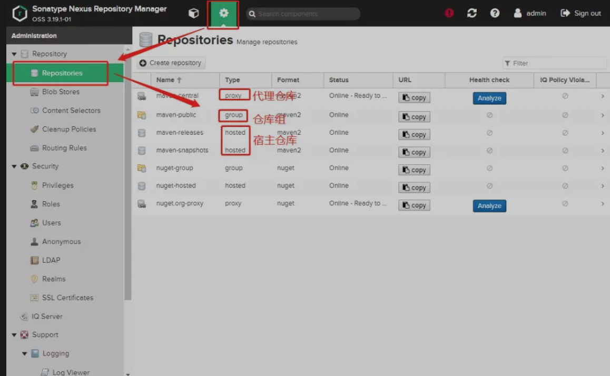

# 私服

私服也是远程仓库中的一种，我们为什么需要私服呢？

如果我们一个团队中有几百个人在开发一些项目，都是采用maven的方式来组织项目，那么我们每个人都需要从远程仓库中把需要依赖的构件下载到本地仓库，这对公司的网络要求也比较高，为了节省这个宽带和加快下载速度，我们在公司内部局域网内部可以架设一台服务器，这台服务器起到一个代理的作用，公司里面的所有开发者去访问这个服务器，这台服务器将需要的构件返回给我们，如果这台服务器中也没有我们需要的构件，那么这个代理服务器会去远程仓库中查找，然后将其先下载到代理服务器中，然后再返回给开发者本地的仓库。

还有公司内部有很多项目之间会相互依赖，你可能是架构组的，你需要开发一些jar包给其他组使用，此时，我们可以将自己jar发布到私服中给其他同事使用，如果没有私服，可能需要我们手动发给别人或者上传到共享机器中，不过管理起来不是很方便。

**总体上来说私服有以下好处：**

1. 加速maven构件的下载速度
2. 节省宽带，加速项目构建速度
3. 方便部署自己的构件以供他人使用
4. 提高maven的稳定性，中央仓库需要本机能够访问外网，而如果采用私服的方式，只需要本机可以访问内网私服就可以了

有3种专门的maven仓库管理软件可以用来帮助我们搭建私服：

1. Apache基金会的archiva

   ```
   http://archiva.apache.org/
   ```

2. JFrog的Artifactory

   ```
   https://jfrog.com/artifactory/
   ```

3. Sonatype的Nexus

   ```
   https://my.sonatype.com/
   ```

# nexus中仓库分类

前面我们说过，用户可以通过nexus去访问远程仓库，可以将本地的构件发布到nexus中，nexus是如何支撑这些操作的呢？

nexus中有个仓库列表，里面包含了各种各样的仓库，有我们说的被代理的第三方远程仓库，如下图：



上图中是nexus安装好默认自带的仓库列表，主要有3种类型：

1. 代理仓库
2. 宿主仓库
3. 仓库组

## 代理仓库

代理仓库主要是让使用者通过代理仓库来间接访问外部的第三方远程仓库的，如通过代理仓库访问maven中央仓库、阿里的maven仓库等等。代理仓库会从被代理的仓库中下载构件，缓存在代理仓库中以供maven用户使用。

## 宿主仓库

宿主仓库主要是给我们自己用的，主要有2点作用

1. 将私有的一些构件通过nexus中网页的方式上传到宿主仓库中给其他同事使用
2. 将自己开发好一些构件发布到nexus的宿主仓库中以供其他同事使用

上面这2种操作，一会稍后会详解以及演示操作过程。

## 仓库组

maven用户可以从代理仓库和宿主仓库中下载构件至本地仓库，为了方便从多个代理仓库和宿主仓库下载构件，maven提供了仓库组，仓库组中可以有多个代理仓库和宿主仓库，而maven用户只用访问一个仓库组就可以间接的访问这个组内所有的仓库，仓库组中多个仓库是有顺序的，当maven用户从仓库组下载构件时，仓库组会按顺序依次在组内的仓库中查找组件，查找到了立即返回给本地仓库，所以一般情况我们会将速度快的放在前面。

仓库组内部实际上是没有构件内容的，他只是起到一个请求转发的作用，将maven用户下载构件的请求转发给组内的其他仓库处理。

nexus默认有个仓库组`maven-public`

## 配置本地maven从nexus下载构件

### 方式一：pom.xml的方式

pom.xml中加入

```xml
<repositories>
    <repository>
        <id>maven-nexus</id>
      	<--这里填仓库组对外地址 !-->
        <url>http://localhost:8081/repository/maven-public/</url>
        <releases>
            <enabled>true</enabled>
        </releases>
        <snapshots>
            <enabled>true</enabled>
        </snapshots>
    </repository>
</repositories>
```

在`~/.m2/settings.xml`文件的`servers`元素中加入如下内容：

```xml
<server>
  <id>maven-nexus</id>
  <username>admin</username>
  <password>admin123</password>
</server>
```

注：还原`~/.m2/settings.xml`的配置到初始状态，操作如下：

```
将M2_HOME/conf/settings.xml复制熬~/.m2/settings.xml目录，如果存在先备份一个，然后进行覆盖。
```

### 方式二：镜像

镜像的方式主要修改`~/.m2/setting.xml`文件，需要修改2处理。

第1处：setting.xml的mirrors元素中加入如下配置：

```xml
<mirror>
  <id>mirror-nexus</id>
  <mirrorOf>*</mirrorOf>
  <name>nexus镜像</name>
  <url>http://localhost:8081/repository/maven-public/</url>
</mirror>
```

第二处就是server的配置

