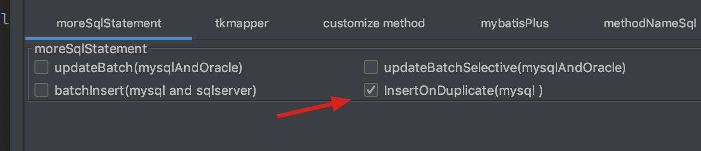

[插件使用](https://zhile.io/2019/04/23/mybatis-code-helper-pro-crack.html)

# 介绍

MyBatisCodeHelper-Pro是IDEA下的一个插件，功能类似mybatis plugin。

## 破解说明

1. 下载已破解的插件压缩包，一定注意校验sha1sum！！！
2. 在IDEA中本地安装插件
3. 激活方法（自2.7.3）：IDEA顶部菜单：Tools -> MybatisCodeHelper -> Activation -> OfflineActivation，在offline key框输入任意字符串
4. 激活方法（旧）：IDEA顶部菜单：Tools -> MybatisCodeHelper -> offlineActivation，输入任意字符串

## 使用

[作者写的](https://gejun123456.github.io/MyBatisCodeHelper-Pro/#/)

[mybatisCodeHelperPro使用](https://ciweigg2.github.io/2018/10/20/mybatiscodehelperpro-shi-yong/)

[mybatis-plus](https://mp.baomidou.com/guide/mybatisx-idea-plugin.html#%E5%8A%9F%E8%83%BD)

[原作者讲解](https://www.bilibili.com/video/av23458308/)

1.连接数据库生成接口，和一些文件

2.还可以在生成的mapper里写命名方法名，自动生成方法和对应的sql。这种方式适合自己修改mapper，默认不会自动生成service对应接口及实现，但可以设置


钩上后，生成方法时会让选择接口文件和接口实现文件

1. 自己加的方法，重新生成mapper时并不会覆盖。因此建议不要改它生成的方法。 
2. 对mapper里的接口，还可以生成测试类，插件会生成一个mybatis的配置文件，利用这个配置文件启动mybatis，不用启动spring，因此测试速度快


## 生成insertOrUpdate

勾选insertOnDuplicate会生成下面两个方法

```java
int insertOrUpdate(OdcDpWorkflow record);

int insertOrUpdateSelective(OdcDpWorkflow record);
```




# 遇到的问题

## idea不显示表名

点击那个扳手，选择schema即可


## 代码格式化

xml文件可以使用command+alt+L进行格式化

## 代码合并

- mapper接口 如果新生成的接口中的方法包含原来接口中的方法会进行替换 **即不会覆盖掉自己写的方法**
- mapper xml 文件 首先会删除掉 @mbg generated 注释的方法 然后生成你选择的方法 **即不会覆盖掉你自己写的方法**
- java 实体 **会保留java实体中的 static方法 static 字段 transient方法 transient字段**
- **请不要修改自动生成的方法 如果要修改 请将sql中的 @mbg generated注释给去掉 以免在添加字段重新生成后 将该方法给覆盖掉了**
- model类可以在设置里面关掉auto merge 以防添加字段后model类被覆盖(比如model添加了一些自定义的注解如jackson时)

