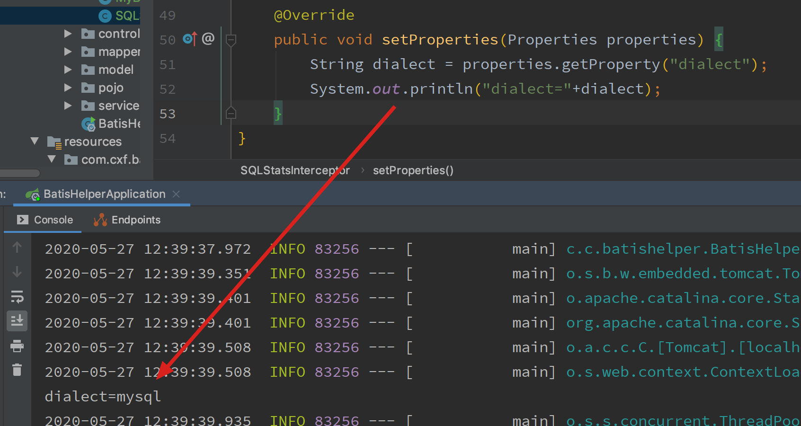

本文目标是自定义一个mybatis插件，打印sql语句。

# 实现思路

自定义mybatis拦截器，并注入Spring容器

# 实现细节

## 拦截器

### 实现Interceptor接口

```java
Object intercept(Invocation invocation) throws Throwable;  
Object plugin(Object target);  
void setProperties(Properties properties);  
```

用途如下：

**（1）方法plugin(Object target)**

plugin方法是拦截器用于封装目标对象的，通过该方法我们可以返回目标对象本身，也可以返回一个它的代理。当返回的是代理的时候我们可以对其中的方法进行拦截来调用intercept方法，当然也可以调用其他方法。

**（2）方法setProperties(Properties properties)**

setProperties方法是用于在Mybatis配置文件中指定一些属性的。 

**（3）方法intercept(Invocation invocation)**

定义自己的Interceptor最重要的是要实现plugin方法和intercept方法，在plugin方法中我们可以决定是否要进行拦截进而决定要返回一个什么样的目标对象。而intercept方法就是要进行拦截的时候要执行的方法。


#### 插件具体实现

```java
package com.cxf.batishelper.config;
import java.sql.Connection;
import java.util.Properties;
import org.apache.ibatis.executor.statement.StatementHandler;
import org.apache.ibatis.mapping.BoundSql;
import org.apache.ibatis.plugin.Interceptor;
import org.apache.ibatis.plugin.Intercepts;
import org.apache.ibatis.plugin.Invocation;
import org.apache.ibatis.plugin.Plugin;
import org.apache.ibatis.plugin.Signature;

/**
 * 打印sql语句的插件
 * 在方法上有一个很重要的注解@Intercepts，
 * 在此注解上配置的注解说明了
 * 要拦截的类（type=StatementHandler.class），
 * 拦截的方法（method="prepare"），
 * 方法中的参数（args={Connection.class,Integer.class}），
 * 也就是此拦截器会拦截StatementHandler类中的如下方法：
 * Statement prepare(Connection connection, Integer transactionTimeout)
 */
@Intercepts({@Signature(type=StatementHandler.class,method="prepare",args={Connection.class,Integer.class})})
public class SQLStatsInterceptor implements Interceptor {

    /**
     * 在这个方法中可以获取到对应的绑定的sql
     * @param invocation
     * @return
     * @throws Throwable
     */
    @Override
    public Object intercept(Invocation invocation) throws Throwable {
        StatementHandler statementHandler= (StatementHandler) invocation.getTarget();
        BoundSql boundSql = statementHandler.getBoundSql();
        System.out.println(boundSql.getSql());
        return invocation.proceed();
    }

    @Override
    public Object plugin(Object target) {
        return Plugin.wrap(target, this);
    }

    @Override
    public void setProperties(Properties properties) {
        String dialect = properties.getProperty("dialect");
        System.out.println("dialect="+dialect);
    }
}
```
### 注入插件到Spring容器

```java
@Configuration  
public class MyBatisConfiguration {  
    @Bean  
    public SQLStatsInterceptor sqlStatsInterceptor(){  
        SQLStatsInterceptor sqlStatsInterceptor = new SQLStatsInterceptor();  
        Properties properties = new Properties();  
        properties.setProperty("dialect", "mysql");  
         sqlStatsInterceptor.setProperties(properties);  
       return sqlStatsInterceptor;  
    }  
}  
```


## 测试

启动项目，可以发现setProperties方法被调用了



通过controller触发一个查询

```java
    @RequestMapping(value = "/first")
    public ResponseData<Student> first() {
        Student student = studentService.selectByPrimaryKey(1);
        ResponseData<Student> responseData = new ResponseData<>();
        responseData.setData(student);
        responseData.setStatus(HttpStatus.OK.value());
        responseData.setSuccess(true);
        return responseData;
    }
```

可以发现后台把sql语句打印出来了

```sql
select     
        id, `name`, age 
        from student
        where id = ?
```

