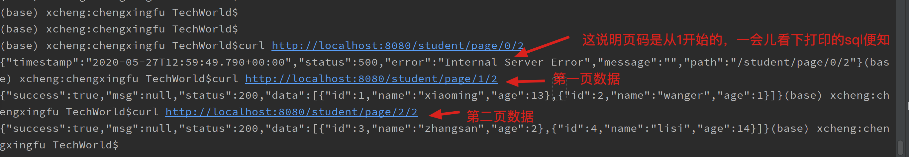

上一篇文章《springboot自定义mybatis插件》里，我们看到了如何在springboot中使用自定义的插件，完成sql打印，这一篇，我们来看看如何自动分页

# 分页插件

## 拦截器

### 实现拦截器接口

在这里我们需要拦截所有以ByPage结尾的所有查询语句，因此要使用该拦截器实现分页功能，那么再定义名称的时候需要满足它拦截的规则（以ByPage结尾）

```java
package com.cxf.batishelper.config;

import org.apache.ibatis.executor.parameter.ParameterHandler;
import org.apache.ibatis.executor.statement.StatementHandler;
import org.apache.ibatis.mapping.MappedStatement;
import org.apache.ibatis.plugin.*;
import org.apache.ibatis.reflection.MetaObject;
import org.apache.ibatis.reflection.SystemMetaObject;

import java.sql.Connection;
import java.util.Map;
import java.util.Properties;

/**
 * Copyright (c) 2015 XiaoMi Inc. All Rights Reserved.
 * Authors: chengxingfu <chengxingfu@xiaomi.com>
 * Date:2020-05-27
 */
@Intercepts({@Signature(type = StatementHandler.class, method = "prepare", args = {Connection.class, Integer.class})})
public class MyPageInterceptor implements Interceptor {

    //每页显示的条目数
    private int pageSize;
    //当前现实的页数
    private int currPage;

    private String dbType;


    @Override
    public Object intercept(Invocation invocation) throws Throwable {
        //获取StatementHandler，默认是RoutingStatementHandler
        StatementHandler statementHandler = (StatementHandler) invocation.getTarget();
        //获取statementHandler包装类
        MetaObject MetaObjectHandler = SystemMetaObject.forObject(statementHandler);

        //分离代理对象链
        while (MetaObjectHandler.hasGetter("h")) {
            Object obj = MetaObjectHandler.getValue("h");
            MetaObjectHandler = SystemMetaObject.forObject(obj);
        }

        while (MetaObjectHandler.hasGetter("target")) {
            Object obj = MetaObjectHandler.getValue("target");
            MetaObjectHandler = SystemMetaObject.forObject(obj);
        }

        //获取连接对象
        //Connection connection = (Connection) invocation.getArgs()[0];


        //object.getValue("delegate");  获取StatementHandler的实现类

        //获取查询接口映射的相关信息
        MappedStatement mappedStatement = (MappedStatement) MetaObjectHandler.getValue("delegate.mappedStatement");
        String mapId = mappedStatement.getId();

        //statementHandler.getBoundSql().getParameterObject();

        //拦截以.ByPage结尾的请求，分页功能的统一实现
        if (mapId.matches(".+ByPage$")) {
            //获取进行数据库操作时管理参数的handler
            ParameterHandler parameterHandler = (ParameterHandler) MetaObjectHandler.getValue("delegate.parameterHandler");
            //获取请求时的参数
            Map<String, Map<String,Object>> paraObject = (Map<String, Map<String,Object>>) parameterHandler.getParameterObject();
            //也可以这样获取
            //paraObject = (Map<String, Object>) statementHandler.getBoundSql().getParameterObject();

            //参数名称和在service中设置到map中的名称一致
            currPage = (int) paraObject.get("param").get("currPage");
            pageSize = (int) paraObject.get("param").get("pageSize");

            String sql = (String) MetaObjectHandler.getValue("delegate.boundSql.sql");
            //也可以通过statementHandler直接获取
            //sql = statementHandler.getBoundSql().getSql();

            //构建分页功能的sql语句
            String limitSql;
            sql = sql.trim();
            limitSql = sql + " limit " + (currPage - 1) * pageSize + "," + pageSize;
            System.out.println(limitSql);
            //将构建完成的分页sql语句赋值个体'delegate.boundSql.sql'，偷天换日
            MetaObjectHandler.setValue("delegate.boundSql.sql", limitSql);
        }

        return invocation.proceed();
    }


    //获取代理对象
    @Override
    public Object plugin(Object o) {
        return Plugin.wrap(o, this);
    }

    //设置代理对象的参数
    @Override
    public void setProperties(Properties properties) {
//如果项目中分页的pageSize是统一的，也可以在这里统一配置和获取，这样就不用每次请求都传递pageSize参数了。参数是在配置拦截器时配置的。
        String limit1 = properties.getProperty("limit", "2");
        this.pageSize = Integer.valueOf(limit1);
        this.dbType = properties.getProperty("dbType", "mysql");
    }
}
```

### 注入spring容器

```java
package com.cxf.batishelper.config;

import org.springframework.context.annotation.Bean;
import org.springframework.context.annotation.Configuration;

import java.util.Properties;

/**
 * Copyright (c) 2015 XiaoMi Inc. All Rights Reserved.
 * Authors: chengxingfu <chengxingfu@xiaomi.com>
 * Date:2020-05-27
 */
@Configuration
public class MyBatisConfiguration {
   //这里可以把上一篇的打印sql语句的插件加上，方便查看sql
    @Bean
    public SQLStatsInterceptor sqlStatsInterceptor(){
        SQLStatsInterceptor sqlStatsInterceptor = new SQLStatsInterceptor();
        Properties properties = new Properties();
        properties.setProperty("dialect", "mysql");
        sqlStatsInterceptor.setProperties(properties);
        return sqlStatsInterceptor;
    }

  //分页插件， 定义了每一页的大小
    @Bean
    MyPageInterceptor pageInterceptor() {
        MyPageInterceptor myPageInterceptor = new MyPageInterceptor();
        Properties properties = new Properties();
        properties.setProperty("limit", "2");
        properties.setProperty("dbType", "mysql");
        myPageInterceptor.setProperties(properties);
        return myPageInterceptor;
    }
}
```

## mapper接口

要分页的接口，只需要方法名以ByPage结尾即可，param将会传入currPage和pageSize两个分页参数

```java
    List<Student> selectByPage(@Param("param") Map param);
```

```xml
    <select id="selectByPage" resultType="com.cxf.batishelper.model.Student">
        select
        <include refid="Base_Column_List"></include>
        from student
    </select>
```

## service方法实现

```java
接口
List<Student> selectByPage(int currPage, int pageSize);
实现
    @Override
    public List<Student> selectByPage(int currPage,int pageSize) {
        HashMap<String, Integer> param = new HashMap<>();
        param.put("currPage", currPage);
        param.put("pageSize", pageSize);
        return studentMapper.selectByPage(param);
    }  
```

## controller

```java
    @RequestMapping(value = "/page/{currPage}/{pageSize}")
    public ResponseData<List<Student>> page(@PathVariable("currPage") Integer currPage,
                                            @PathVariable("pageSize") Integer pageSize) {

        List<Student> students = studentService.selectByPage(currPage,pageSize);
        ResponseData<List<Student>> responseData = new ResponseData<>();
        responseData.setData(students);
        responseData.setStatus(HttpStatus.OK.value());
        responseData.setSuccess(true);
        return responseData;
    }
```

测试



上面三个测试打印的sql语句如下:

```sql
错误页码0
select  id, `name`, age from student limit -2,2
第一页
select id, `name`, age from student limit 0,2
第二页
select  id, `name`, age from student limit 2,2
```

至此完成了分页插件的开发

源码参见:https://github.com/luckywind/TechWorld/blob/master/code/mybatis/batis-helper/

