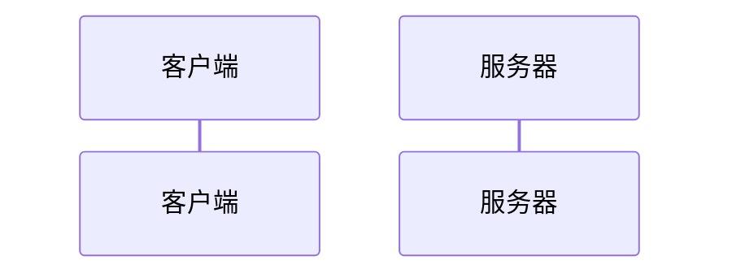
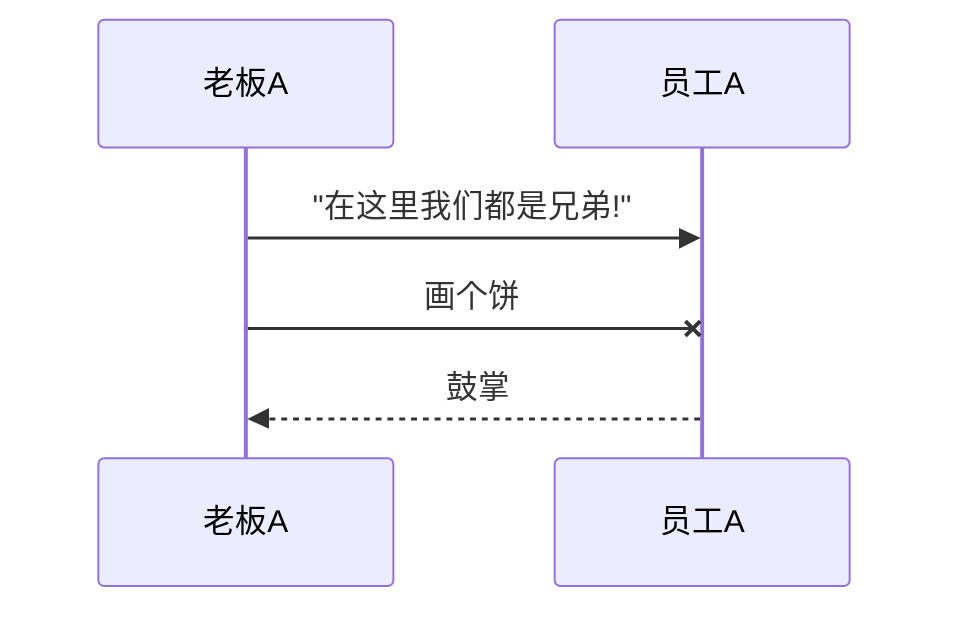
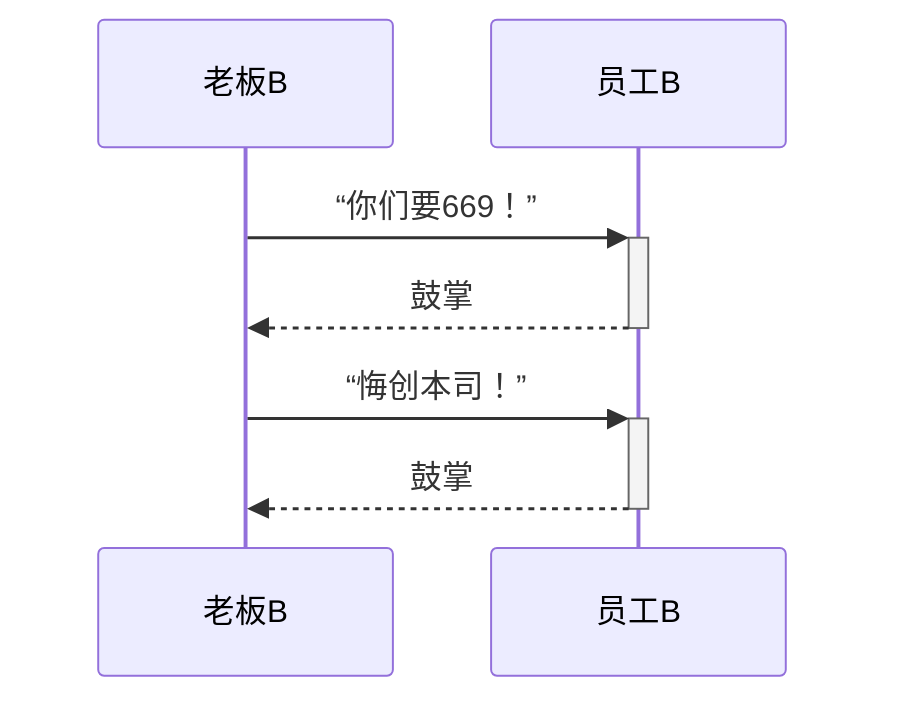
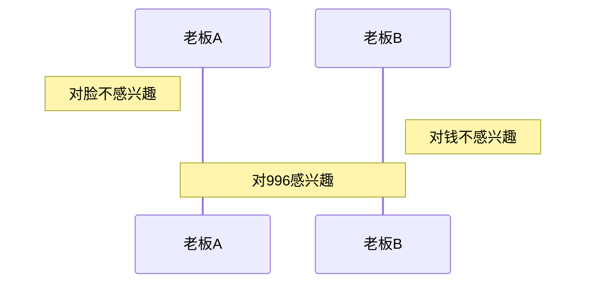
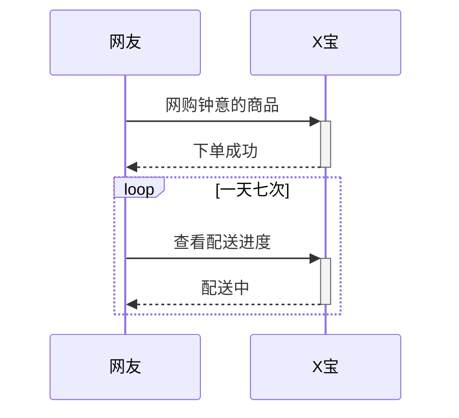
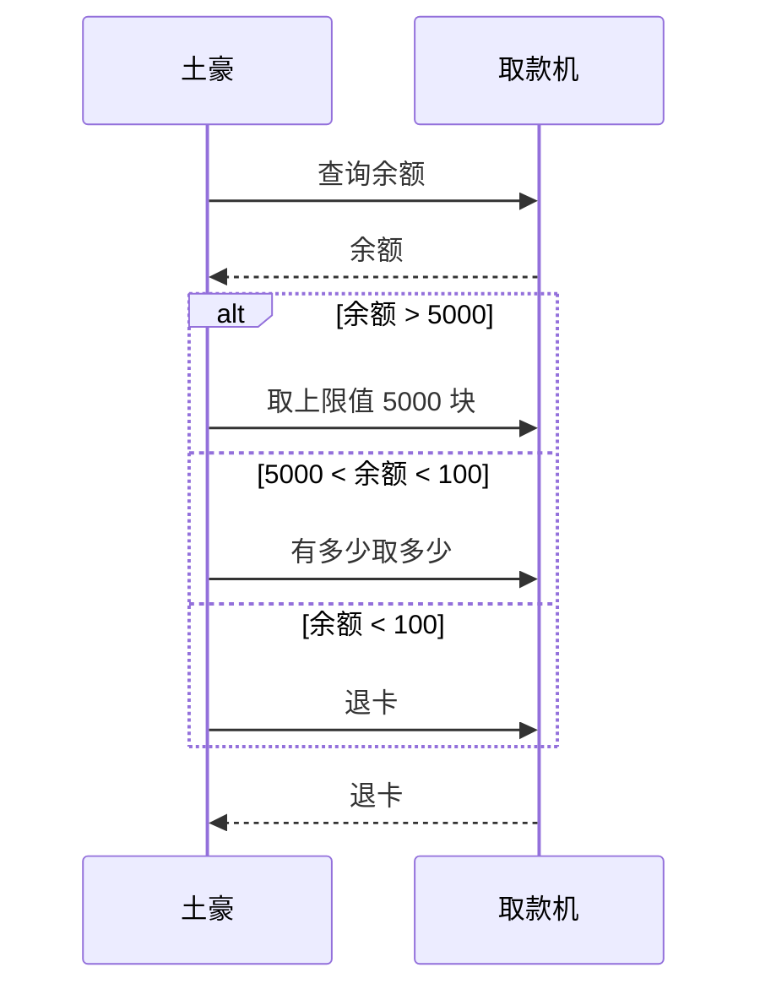
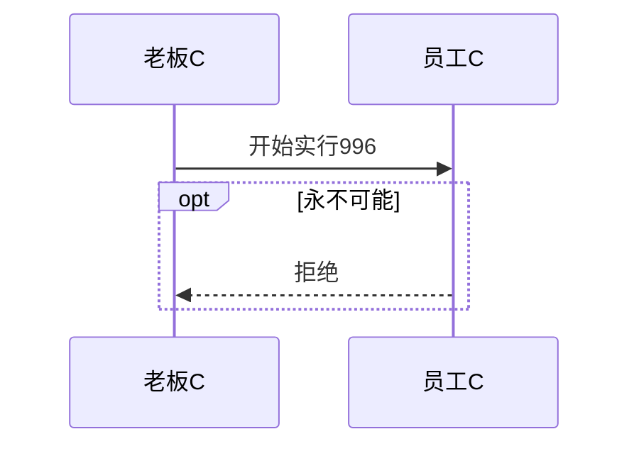
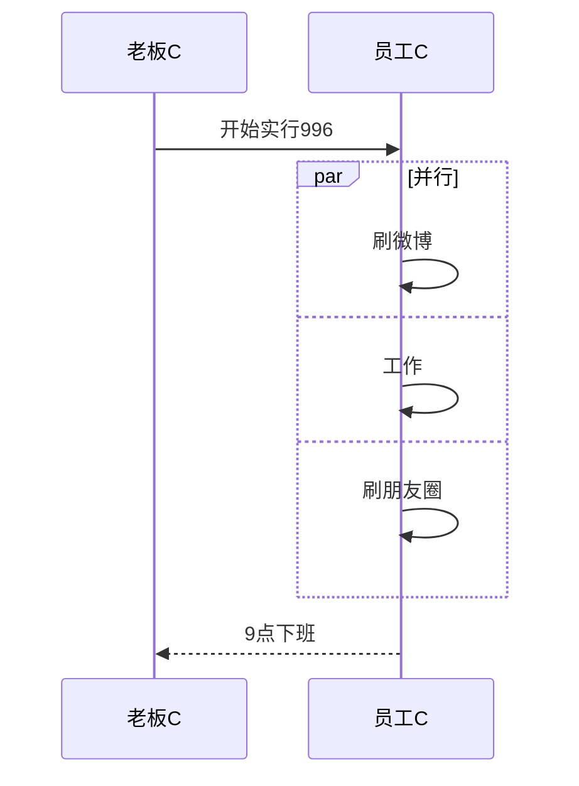

# 时序图

https://zhuanlan.zhihu.com/p/70261692

https://blog.sidneyyi.com/view/uml%2FUML%E6%97%B6%E5%BA%8F%E5%9B%BE

换行<br>

注释%%

## 参与者

> ```text
> sequenceDiagram
>     participant 客户端   可以省略
>     participant 服务器
> ```





## 消息

```
sequenceDiagram
  participant 老板A
    participant 员工A
    老板A->>员工A:"在这里我们都是兄弟!"
    老板A-x 员工A:画个饼
    员工A -->> 老板A: 鼓掌
```


> > 消息语句格式为：`<参与者> <箭头> <参与者> : <描述文本>`。
> > 其中 `<箭头>`的写法有：
> > `->>` 显示为实线箭头（主动发出消息）
> > `-->>`显示为虚线箭头（响应）
> > `-x`显示为末尾带「X」的实线箭头（异步消息）
> >
> > -> 实线
>
> 
>
> > 注：`participant <参与者名称>` 这句可以省略，省略后参与者横向排列的次序，由消息语句中其出现的次序决定。如后续示例所示。



## 激活框

注意体会箭头符号后的 `+` 和 `-` 的使用方法和效果，它们相当于激活框的开关

```
sequenceDiagram
    老板B ->> + 员工B : “你们要669！”
    员工B -->> - 老板B : 鼓掌
    
    老板B ->> + 员工B : “悔创本司！”
    员工B -->> - 老板B : 鼓掌
```




## 注解

```
sequenceDiagram
    Note left of 老板A : 对脸不感兴趣
    Note right of 老板B : 对钱不感兴趣
    Note over 老板A,老板B : 对996感兴趣
```




## 组合片段

| 片段类型 | 名称   | 说明                                                         |
| :------- | :----- | :----------------------------------------------------------- |
| Opt      | 选项   | if语句的图形化表示。                                         |
| Alt      | 抉择   | if else语句的图形化表示。                                    |
| Loop     | 循环   | for语句的图形化表示。                                        |
| Par      | 并行   | 指此片段中的消息可以并行交错。                               |
| Break    | 中断   | 指此中断此片段中的其余部分消息。                             |
| Seq      | 弱顺序 | 指相同生命线的消息不能并行交错，但不同生命线的消息可以并行交错。 |
| Strict   | 强顺序 | 指此片段中的消息必须按给定顺序执行。                         |
| Critical | 关键   | 主要用在`Par`或`Seq`片段中，指此片段中的消息只能原子化处理，不能并行。 |
| Consider | 考虑   | 指片段中指定的消息才是主要需要考虑的，其他的可以忽略。       |
| Ignore   | 忽略   | 指片段中指定的消息可以忽略。                                 |
| Assert   | 断言   | 指一定会发生的消息片段。                                     |
| Neg      | 否定   | 指不得发生的消息片段。                                       |

### 循环

在条件满足时，重复发出消息序列。相当于编程语言中的 while 语句。

```
sequenceDiagram
    网友 ->> + X宝 : 网购钟意的商品
    X宝 -->> - 网友 : 下单成功
    
    loop 一天七次
        网友 ->> + X宝 : 查看配送进度
        X宝 -->> - 网友 : 配送中
    end
```



### 选择alt

在多个条件中作出判断，每个条件将对应不同的消息序列。相当于 if 及 else if 语句。

```
sequenceDiagram    
    土豪 ->> 取款机 : 查询余额
    取款机 -->> 土豪 : 余额
    
    alt 余额 > 5000
        土豪 ->> 取款机 : 取上限值 5000 块
    else 5000 < 余额 < 100
        土豪 ->> 取款机 : 有多少取多少
    else 余额 < 100
        土豪 ->> 取款机 : 退卡
    end
    
    取款机 -->> 土豪 : 退卡
```



### 可选opt

```
sequenceDiagram
    老板C ->> 员工C : 开始实行996
    
    opt 永不可能
        员工C -->> 老板C : 拒绝
    end
```



### 并行par

```
sequenceDiagram
    老板C ->> 员工C : 开始实行996
    
    par 并行
        员工C ->> 员工C : 刷微博
    and
        员工C ->> 员工C : 工作
    and
        员工C ->> 员工C : 刷朋友圈
    end
    
    员工C -->> 老板C : 9点下班
```



