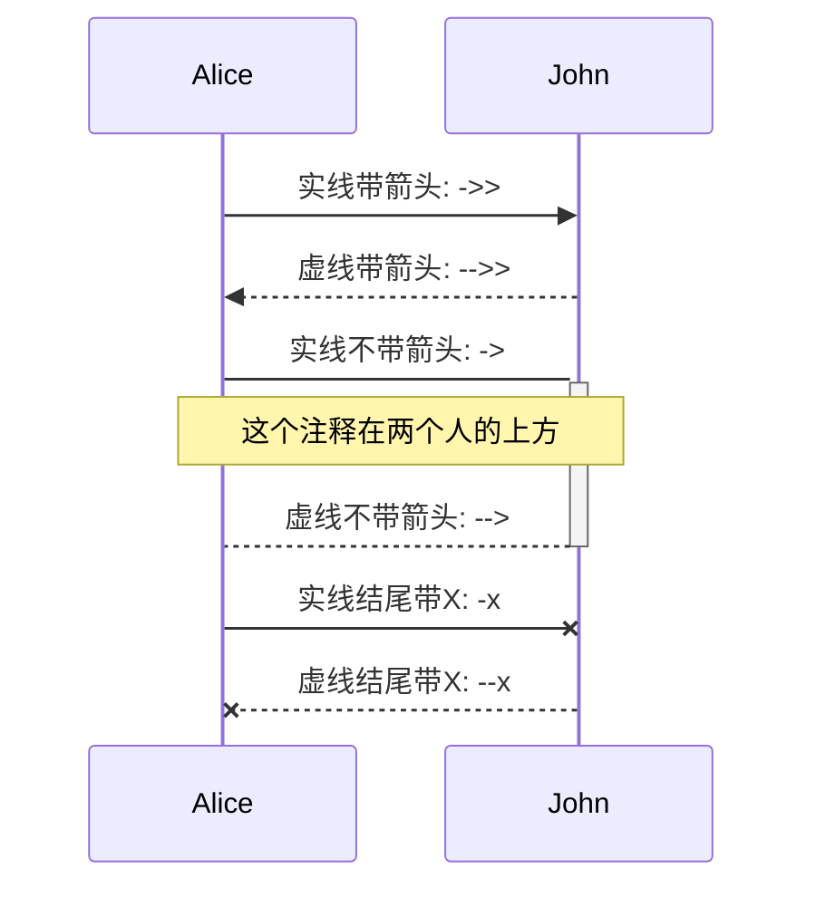
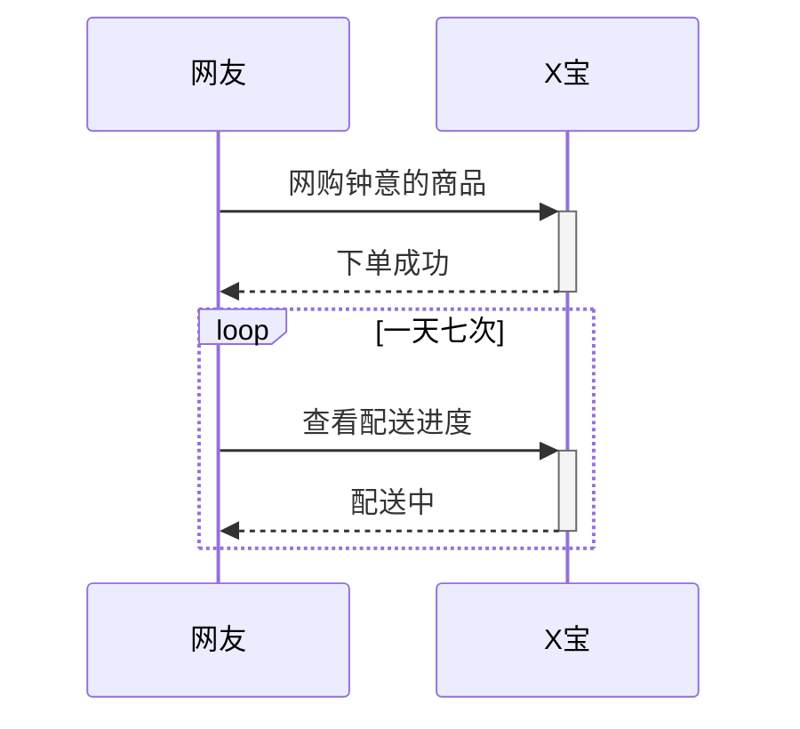
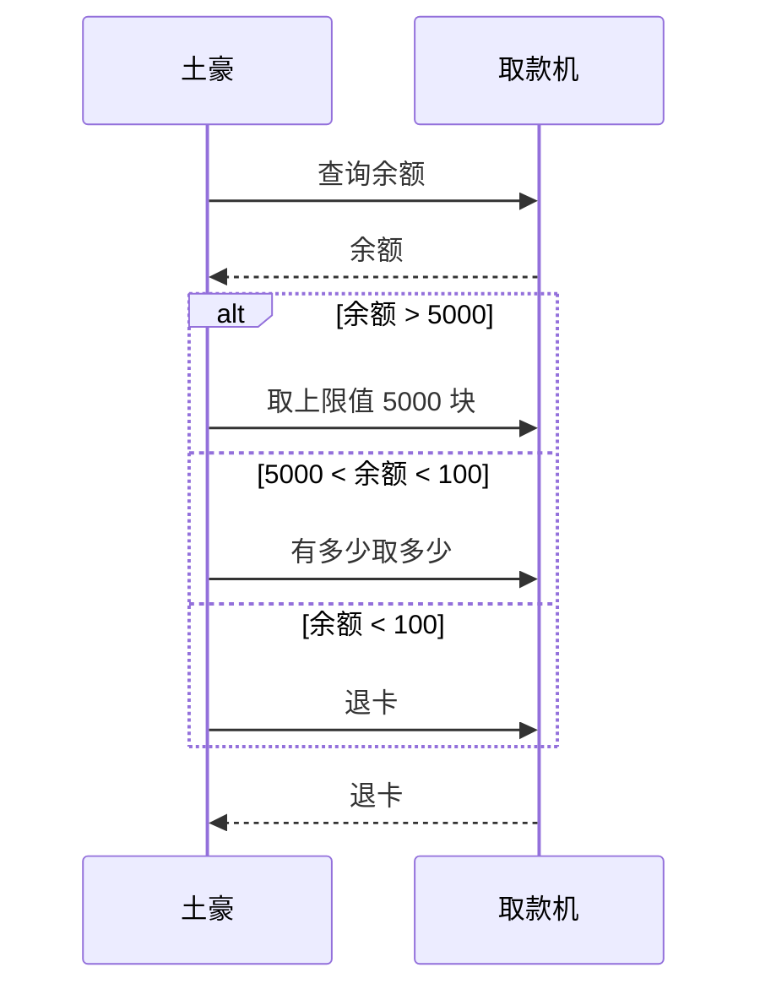
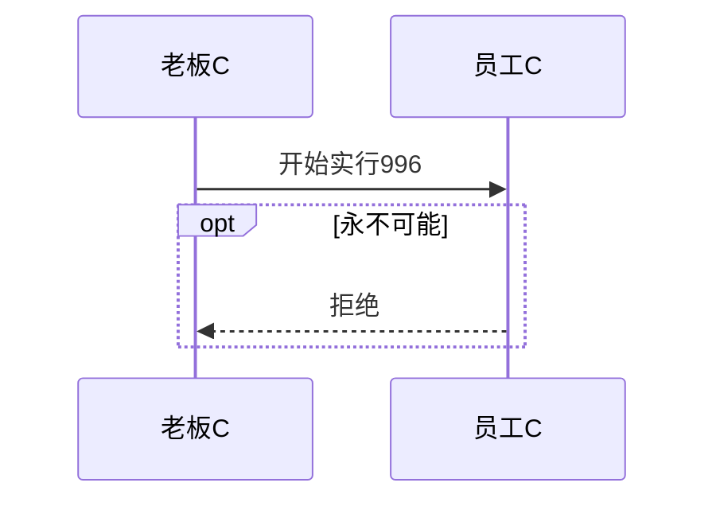
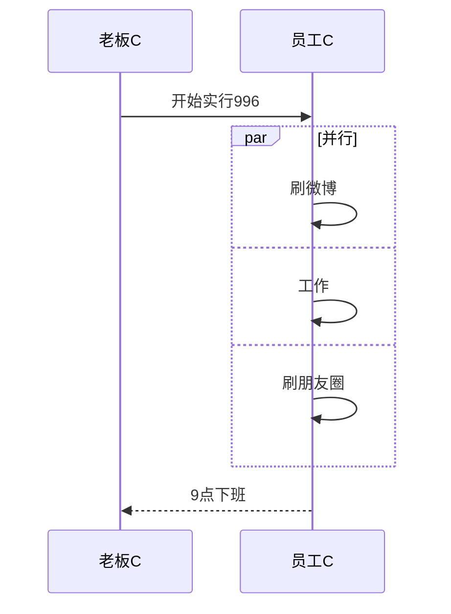

# 时序图

https://zhuanlan.zhihu.com/p/70261692

https://blog.sidneyyi.com/view/uml%2FUML%E6%97%B6%E5%BA%8F%E5%9B%BE

[mermaid语法](http://blog.lisp4fun.com/2017/11/21/mermaiduse)

## 基本语法

1. 换行<br>

2. 注释%%

3. 激活/去激活， 有两种方式activate/deactivate xx  或者箭头后使用+/-

4. 注释

   ```yaml
   Note [ right of | left of | over ] [Actor]: Text in note content
   注: Actor 可以是多个，通过逗号分割，例如：
   Note over Alice,John: A typical interaction
   ```

```yaml
sequenceDiagram
    participant Alice
    participant John
    Alice ->> John:  实线带箭头: ->>
    John -->> Alice: 虚线带箭头: -->>
    Alice -> John : 实线不带箭头: ->
    activate John
    Note over Alice,John: 这个注释在两个人的上方
    John --> Alice : 虚线不带箭头: -->
    deactivate John
    Alice -x John : 实线结尾带X: -x
    John --x Alice : 虚线结尾带X: --x
```





## 组合片段

| 片段类型 | 名称   | 说明                                                         |
| :------- | :----- | :----------------------------------------------------------- |
| Opt      | 选项   | if语句的图形化表示。                                         |
| Alt      | 抉择   | if else语句的图形化表示。                                    |
| Loop     | 循环   | for语句的图形化表示。                                        |
| Par      | 并行   | 指此片段中的消息可以并行交错。                               |
| Break    | 中断   | 指此中断此片段中的其余部分消息。                             |
| Seq      | 弱顺序 | 指相同生命线的消息不能并行交错，但不同生命线的消息可以并行交错。 |
| Strict   | 强顺序 | 指此片段中的消息必须按给定顺序执行。                         |
| Critical | 关键   | 主要用在`Par`或`Seq`片段中，指此片段中的消息只能原子化处理，不能并行。 |
| Consider | 考虑   | 指片段中指定的消息才是主要需要考虑的，其他的可以忽略。       |
| Ignore   | 忽略   | 指片段中指定的消息可以忽略。                                 |
| Assert   | 断言   | 指一定会发生的消息片段。                                     |
| Neg      | 否定   | 指不得发生的消息片段。                                       |

### 循环

在条件满足时，重复发出消息序列。相当于编程语言中的 while 语句。

```
sequenceDiagram
    网友 ->> + X宝 : 网购钟意的商品
    X宝 -->> - 网友 : 下单成功
    
    loop 一天七次
        网友 ->> + X宝 : 查看配送进度
        X宝 -->> - 网友 : 配送中
    end
```



### 选择alt

在多个条件中作出判断，每个条件将对应不同的消息序列。相当于 if 及 else if 语句。

```
sequenceDiagram    
    土豪 ->> 取款机 : 查询余额
    取款机 -->> 土豪 : 余额
    
    alt 余额 > 5000
        土豪 ->> 取款机 : 取上限值 5000 块
    else 5000 < 余额 < 100
        土豪 ->> 取款机 : 有多少取多少
    else 余额 < 100
        土豪 ->> 取款机 : 退卡
    end
    
    取款机 -->> 土豪 : 退卡
```



### 可选opt

```
sequenceDiagram
    老板C ->> 员工C : 开始实行996
    
    opt 永不可能
        员工C -->> 老板C : 拒绝
    end
```



### 并行par

```
sequenceDiagram
    老板C ->> 员工C : 开始实行996
    
    par 并行
        员工C ->> 员工C : 刷微博
    and
        员工C ->> 员工C : 工作
    and
        员工C ->> 员工C : 刷朋友圈
    end
    
    员工C -->> 老板C : 9点下班
```



