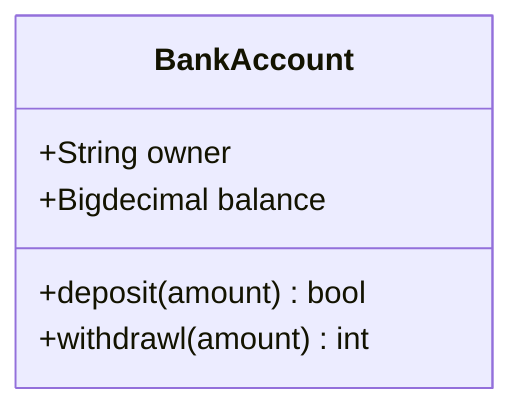
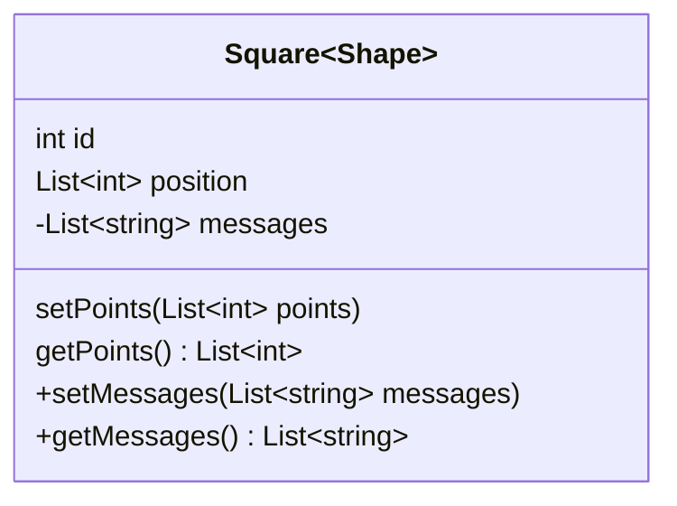
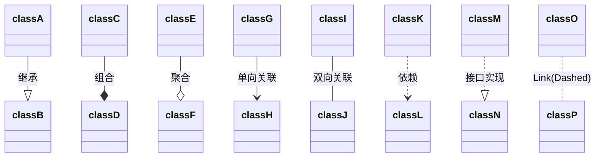
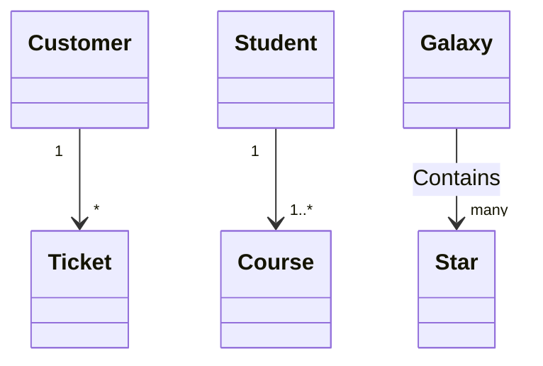

# 类图

## 类图语法

1. 用:关联多个成员， 用{}可一次定义多个成员
2. 用()区分属性和方法
4. 返回类型：跟在属性/方法后

```yaml
classDiagram
    class BankAccount
    // 属性
    BankAccount : +String owner
    BankAccount : +Bigdecimal balance
    // 方法
    BankAccount : +deposit(amount) bool
    BankAccount : +withdrawl(amount) int
```




也可用{}关联多个成员

```ymal
classDiagram
    class BankAccount{
        +String owner
        +BigDecimal balance
        +deposit(amount) bool
        +withdrawl(amount)
    }
```

### 其他

1. 范型，用~(波浪线)代替尖括号
2. 注释 %%开头
3. 可见性

| 可见性                         | Java               | UML  |
| ------------------------------ | ------------------ | ---- |
| 对所有类可见(公共的)           | public             | `+`  |
| 仅对本类可见(私有的)           | private            | `-`  |
| 对本包和所有子类可见(受保护的) | protected          | `#`  |
| 对本包可见(包内部)             | 默认，不需要修饰符 | `_`  |


```yaml
classDiagram
	class Square~Shape~{
        int id
        List~int~ position
        setPoints(List~int~ points)
        getPoints() List~int~
    }
    %% 这是注释
    Square : -List~string~ messages
    Square : +setMessages(List~string~ messages)
    Square : +getMessages() List~string~
```





## 关系

依赖：如果一个类的方法操纵另一个类的对象， 我们就说一个类依赖于另一个类。


```yaml
classDiagram
    classA --|> classB : 继承
    classC --* classD : 组合
    classE --o classF : 聚合
    classG --> classH : 单向关联
    classI -- classJ : 双向关联
    classK ..> classL : 依赖
    classM ..|> classN : 接口实现
    classO .. classP : Link(Dashed)
```





### 多重关系

- `1` 只有1个
- `0..1` 零或一
- `1..*` 一个或多个
- `*` 许多
- `n` n {其中n> 1}
- `0..n` 0至n {其中n> 1}
- `1..n` 1至n{其中n> 1}

```yaml
classDiagram
    %% 一个客户有许多票
    Customer "1" --> "*" Ticket
    %% 一个学生有1个或多个课程
    Student "1" --> "1..*" Course
    Galaxy --> "many" Star : Contains
```




