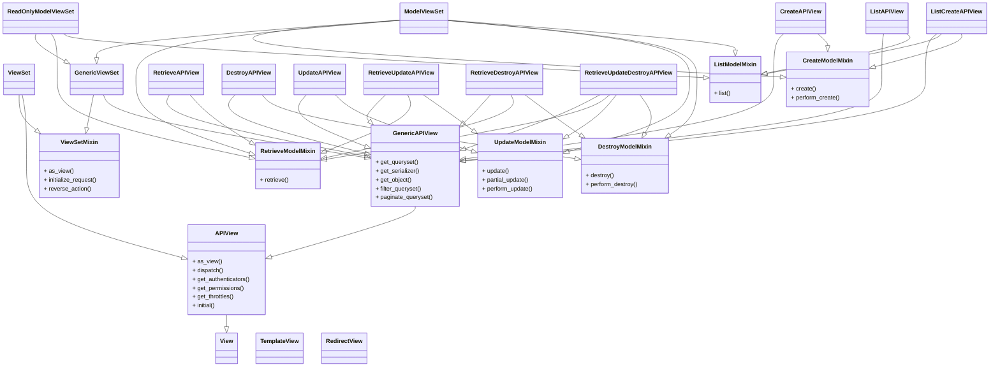

# REST API风格

1. **核心含义**：无状态的资源

- 资源的变化（CURD）都是通过操作去实现的

  - 资源可以用 [URI](https://en.wikipedia.org/wiki/Uniform_resource_identifier) 表示，看url就知道要什么

  - 用不同的URI和方法，表示对资源的不同操作

    - 典型的：

      - `GET`：获取资源

      - `POST`：新建资源

      - `PUT`：更新资源

        > 如果只是更新部分字段，按设计应该用PATCH,但实际上大家都在用PUT代替PATCH

      - `DELETE`：删除资源

2. **设计特点和要求**

- 接口形式统一=Uniform Interface
- 无状态=Stateless  
  对每个资源的请求都不依赖于其他资源或其他请求，[参考](https://crifan.github.io/http_restful_api/website/restful_intro/)
- 可缓存=Cacheable
- 客户端服务器架构=Client-Server
- 分层设计=Layered System

3. **通俗理解**：

- 看`url`就知道**要什么**
- 看`http method`就知道**干什么**
- 看`http status code`就知道**结果如何**


4. **参考API设计**：

- 用户
  - 获取用户ID：支持多个参数，根据参数不同返回对应的值
    - `GET /v1.0/open/userId?type=phone&phone={phone}`
    - `GET /v1.0/open/userId?type=email&email={email}`
    - `GET /v1.0/open/userId?type=facebook&facebookUserId={facebookUserId}`
  - 获取用户信息，**尽量用复数，且统一**
    - `GET /v1.0/users/{userId}`
  - 修改用户信息
    - `PUT /v1.0/users/{userId}/info`
  - 修改密码
    - `PUT /v1.0/users/{userId}/password`
- 订单
  - 获取订单任务信息
    - `GET /v1.0/tasks/{taskId}/users/{userId}`
  - 发布任务
    - `POST /v1.0/tasks/users/{userId}`
  - 发单人确认任务信息
    - `PUT /v1.0/tasks/{taskId}/users/{userId}/confirmInfo`

**心得**：

1. 如果有多个对象， 用模块化逻辑，嵌套资源去设计接口：举例：

获取某个（内部id为8的）歌手的所有的专辑： `GET /artists/8/albums`

2. POST`时,如果没有Body内容参数传递时，Header中就不要包含 `Content-Type:application/json


[通用设计原则](https://crifan.github.io/http_restful_api/website/restful_rule/rule.html#google_vignette)

# 安装

settings.py文件里

```python
REST_FRAMEWORK = {
    'DEFAULT_PERMISSION_CLASSES': [
        'rest_framework.permissions.IsAdminUser',  #API只能由管理员使用
    ],
    'PAGE_SIZE': 10
}


INSTALLED_APPS = [
     ... ...
    'rest_framework',   #获取一个图形化的页面来操作API
    'your_app', # 你自己的app
]
```


# 序列化器

**Serializer 与 Model 的区别：**
 Serializer 是数据验证、序列化和反序列化的工具，而 Model 类关注数据持久化。Serializer 提供了一层抽象，让你可以灵活控制 API 数据的输入输出，而不直接操作数据库模型。

## Django自带的序列化器


```python
# Django Queryset数据 to Json
from django.core import serializers
data = serializers.serialize("json", SomeModel.objects.all())
data1 = serializers.serialize("json", SomeModel.objects.all(), fields=('name','id'))
data2 = serializers.serialize("json", SomeModel.objects.filter(field = some_value))

# 只序列化部分字段
import json
from django.core.serializers.json import DjangoJSONEncoder
queryset = myModel.objects.filter(foo_icontains=bar).values('f1', 'f2', 'f3')
data4 = json.dumps(list(queryset), cls=DjangoJSONEncoder)
```

## DRF序列化器

尽管Django自带的serializers类也能将Django的查询集QuerySet序列化成json格式数据，Django REST Framework才是你真正需要的序列化工具。与django自带的serializers类相比，DRF的序列化器更强大，可以根据模型生成序列化器，还能对客户端发送过来的数据进行验证。


就像Django提供了`Form`类和`ModelForm`类两种方式自定义表单一样，REST framework提供了`Serializer`类和`ModelSerializer`类两种方式供你自定义序列化器。前者需手动指定需要序列化和反序列化的字段，后者根据模型(model)生成需要序列化和反序列化的字段，可以使代码更简洁。

假如我们有一个Model

```python
class Snippet(models.Model):
    created = models.DateTimeField(auto_now_add=True)
    title = models.CharField(max_length=100, blank=True, default='')
    code = models.TextField()
    linenos = models.BooleanField(default=False)
    language = models.CharField(choices=LANGUAGE_CHOICES, default='python', max_length=100)
    style = models.CharField(choices=STYLE_CHOICES, default='friendly', max_length=100)

    class Meta:
        ordering = ('created',)
```


### 使用Serializer类

```python
class SnippetSerializer(serializers.Serializer):
    # 定义序列化、反序列化字段， 注意这里对输入数据的验证
    id = serializers.IntegerField(read_only=True)
    title = serializers.CharField(required=False, allow_blank=True, max_length=10
    code = serializers.CharField(style={'base_template': 'textarea.html'})
    linenos = serializers.BooleanField(required=False)
    language = serializers.ChoiceField(choices=LANGUAGE_CHOICES, default='python'
    style = serializers.ChoiceField(choices=STYLE_CHOICES, default='friendly')
    def create(self, validated_data):
        """
        定义了在调用serializer.save()时如何创建一个实例，
        根据提供的验证过的数据创建并返回一个新的`Snippet`实例。
        """
        return Snippet.objects.create(**validated_data)
    def update(self, instance, validated_data):
        """
        定义了在调用serializer.save()时如何修改一个实例
        根据提供的验证过的数据更新和返回一个已经存在的`Snippet`实例。
        """
        instance.title = validated_data.get('title', instance.title)
        instance.code = validated_data.get('code', instance.code)
        instance.linenos = validated_data.get('linenos', instance.linenos)
        instance.language = validated_data.get('language', instance.language)
        instance.style = validated_data.get('style', instance.style)
        instance.save()
        return instance
```


### 使用ModelSerializer类

继承这两个类的类就是序列化器了

```python
serializers.ModelSerializer
						HyperlinkedModelSerializer
```

会根据模型（Model）自动生成一系列字段。它主要是将模型实例转换为 Python 的原生数据类型（如字典、列表等），以便能够将这些数据轻松地转换为 JSON、XML 或其他内容类型，然后在 API 中返回给客户端。

HyperlinkedModelSerializer 的主要特点是在序列化数据时，会使用超链接（Hyperlinks）来表示模型之间的关系，也就是会提供一个url字段。

例如

```python
class SnippetSerializer(serializers.ModelSerializer):
    class Meta:
        model = Snippet
        fields = ('id', 'title', 'code', 'linenos', 'language', 'style')
        #fields = '__all__'  所有字段
        # 自定义验证器，检查 age 字段
        def validate_age(self, value):
            if value < 1 or value > 120:
                raise serializers.ValidationError("年龄必须在 1 到 120 之间。","valueError")
            return value
```

fields定义了get请求返回的字段，不在这里出现的字段会被忽略。

它负责：

- 将 JSON 输入数据反序列化为 Python 数据类型
- 自动检查字段类型和必填项
- 执行自定义验证逻辑（例如验证年龄范围）

  - validate_xxx方法验证单个字段，该方法在调用is_valid时自动执行
  - 重写validate 可以验证多个字段，[参考](https://www.cnblogs.com/lczmx/p/15668391.html#meta%E7%B1%BB)
  - 自定义验证器，通过validators指定：
    ```python
    def check_pub_date(date):
    	if date.year < 2015:
    		raise serializers.ValidationError("日期不能小于2015年")
    	return date
     
     
    class BookSerialize(serializers.Serializer):
    	pub_date = serializers.DateTimeField(validators=[check_pub_date]
     
    ```

  - 自定义错误信息，内置错误通过`error_messages`参数指定，也可在自定义验证器里手动抛出异常
  
- 最终通过 `serializer.save()` 创建模型实例

#### Meta类

1. `model`
   指定用哪个Model
2. `fields`
   使用模型中的哪些字段，推荐利用元组显式指定，但可以将值指定为`__all__`（表示全部字段）
   **不能和`exclude`一起使用，否则报错：Cannot set both 'fields' and 'exclude' options on serializer xxx.**
3. `exclude`
   不使用模型中的哪些字段
   **不能和`fields`一起使用，否则报错：Cannot set both 'fields' and 'exclude' options on serializer xxx.**
4. `depth`
   指定关联深度，是一个数字
   **注意，关联字段默认返回的是主键，即`rest_framework.serializers.PrimaryKeyRelatedField`**
5. `read_only_fields`
   只读字段，主键默认只读
6. `extra_kwargs`
   指定额外的参数，该参数可以传给字段

# 视图

## 概览


由于`REST API`的url是固定的，所以可以把视图分为 列表视图和详情视图，可能有点抽象，举个例子：

- **列表视图**：`GET /books`（获取所有的书籍）；`POST /books` （创建书籍）
- **详情视图**：`GET /books/{id}`（获取单个书籍 ）；`PUT /books/{id}`（修改书籍）；`DELETE /books/{id}` （删除书籍）

对数据做增删改查需要**两个路由5个函数**, 因此我们可以将视图类分为 列表视图 和 详情视图两个视图类（其实也可以放到一个类里），**不过我们可以利用 视图集 将视图类变为一个**




## 函数视图

### @api_view注解

- **RDF引入了一个扩展了常规`HttpRequest`的`Request`对象**，并提供了更灵活的请求解析。`Request`对象的核心功能是`request.data`属性，它与`request.POST`类似，但对于使用Web API更为有用。

```python
request.POST  # 只处理表单数据  只适用于'POST'方法
request.data  # 处理任意数据  适用于'POST'，'PUT'和'PATCH'方法
```

- **RDF还引入了一个`Response`对象**
  我们不再显式地将请求或响应绑定到给定的内容类型比如HttpResponse和JSONResponse，我们统一使用Response方法返回响应，该方法支持内容协商，可根据客户端请求的内容类型返回不同的响应数据。
- api_view注解
  - 与Django传统函数视图相区分，强调这是API视图，并限定了可以接受的请求方法。
  - 拓展了django原来的request对象。新的request对象不仅仅支持request.POST提交的数据，还支持其它请求方式如PUT或PATCH等方式提交的数据，所有的数据都在`request.data`字典里。这对开发Web API非常有用。
  


```python
from rest_framework.response import Response

@api_view(['GET', 'POST'])
def snippet_list(request):
    """
    列出所有的snippets，或者创建一个新的snippet。
    """
    if request.method == 'GET':
        snippets = Snippet.objects.all()
        				# ❤️使用序列化器对模型进行序列化
        serializer = SnippetSerializer(snippets, many=True)
        				# ❤️统一Response, 不再区分HTTPResponse还是JSONResponse
        return Response(serializer.data)

    elif request.method == 'POST':
								# ❤️request.data 获取任意请求数据， 代替POST
        serializer = SnippetSerializer(data=request.data)
        if serializer.is_valid():
            serializer.save()
            return Response(serializer.data, status=status.HTTP_201_CREATED)
        return Response(serializer.errors, status=status.HTTP_400_BAD_REQUEST)

      
@api_view(['GET', 'PUT', 'DELETE'])
def snippet_detail(request, pk):
    """
    获取，更新或删除一个snippet实例。
    """
    try:
        snippet = Snippet.objects.get(pk=pk)
    except Snippet.DoesNotExist:
        return Response(status=status.HTTP_404_NOT_FOUND)

    if request.method == 'GET':
        serializer = SnippetSerializer(snippet)
        return Response(serializer.data)

    elif request.method == 'PUT':
        serializer = SnippetSerializer(snippet, data=request.data)#这里无需对request进行JSON解析，其data就是json请求
        if serializer.is_valid():
            serializer.save()
            return Response(serializer.data) #也无需指定内容类型
        return Response(serializer.errors, status=status.HTTP_400_BAD_REQUEST)

    elif request.method == 'DELETE':
        snippet.delete()
        return Response(status=status.HTTP_204_NO_CONTENT)
      
      
      
```


## 基于类的视图(推荐)

### why?

类可以被继承、拓展，提高代码的复用性，特别是将一些可以共用的功能抽象成Mixin类或基类后可以减少重复造轮子的工作。

DRF推荐使用基于类的视图(CBV)来开发API, 并提供了4种开发CBV开发模式。

- 使用基础的`APIView`类： <u>有很多冗余代码，每个方法基本都要重复定义serialize</u> 
- 使用Mixins类和`GenericAPI`类混配
- 使用通用视图`generics.*`类, 比如`generics.ListCreateAPIView`
- 使用视图集`ViewSet`和`ModelViewSet`

**注意**：类视图需要调用`as_view()`的方法才能在视图中实现查找指定方法

### 一级视图APIView类

```python
from rest_framework.views import APIView
from rest_framework import status
from rest_framework.response import Response
from rest_test.serializers import AuthorModelSerialize
from rest_test.models import Author
 
列表视图 
class AuthorListView(APIView):
    def get(self, request):
        """
        获取全部数据
        :param request: 
        :return: 
        """
        authors = Author.objects.all()
		# instance指定要序列化的对象
		# 多个数据用many=True
        serialize = AuthorModelSerialize(instance=authors, many=True)
        return Response(serialize.data, status=status.HTTP_200_OK)
 
    def post(self, request):
        """
        创建数据
        :param request: 
        :return: 
        """
        serialize = AuthorModelSerialize(data=request.data)
        
        # raise_exception=True，假如报错，会自动处理
        # 返回状态码：400，且数据的形式：{"phone": ["Ensure this field has no more than 11 characters."]}
        
        serialize.is_valid(raise_exception=True)
        serialize.save()
        return Response(serialize.data, status=status.HTTP_201_CREATED)
 

详情视图 
class AuthorDetailView(APIView):
    def get(self, request, pk):
        # 这是django的内置方法，不会的可以查一下
        author = get_object_or_404(Author, pk=pk)
 
        serialize = AuthorModelSerialize(instance=author)
        return Response(serialize.data, status=status.HTTP_200_OK)
 
    def put(self, request, pk):
        author = get_object_or_404(Author, pk=pk)
		
        # 兼容patch方法的部分更新，一般我们都不会在定义个patch方法
        serialize = AuthorModelSerialize(instance=author, data=request.data, partial=True)
        serialize.is_valid(raise_exception=True)
        serialize.save()
        return Response(serialize.data, status.HTTP_201_CREATED)
 
    def delete(self, request, pk):
        author = get_object_or_404(Author, pk=pk)
        author.delete()
        return Response(status=status.HTTP_204_NO_CONTENT)
 

路由
urlpatterns = [
    path("authors/", views.AuthorListView.as_view()),
    path("authors/<int:pk>/", views.AuthorDetailView.as_view())
]
```

注意：

1. APIView类继承了Django自带的View类，它不仅支持更多请求方法，而且它的Response对Django的HTTPRequest对象进行了封装，可以使用request.data获取用户通过POST, PUT和PATCH方法发过来的数据，而且支持插拔式地配置认证、权限和限流类。

2. 它的Response代替了Django的HttpResponse可根据客户端请求的内容类型返回不同的响应数据

3. 所哟API异常会被自动捕获

4. 不同的HTTP方法由不同的函数来实现，逻辑上更清晰

5. url里对类调用as_view()函数，从而在视图中实现查找指定方法

6. Response可以直接返回json, 例如：

   ```python
   # 返回普通JSON
   return Response({'some': 'data'})
   # 之间返回Model
   usernames = [user.username for user in User.objects.all()]
   return Response(usernames)
   # 自定义返回格式
   return Response({
               'data':serializer.data,
               'status':"SUCCESS"
           })
   ```

7. **可读性最高，最灵活**

- 列表视图

- 详情视图
  多了主键，用来操作单个数据

#### 2个路由5个方法

```python
class RunnerHostsAPIView(APIView):
    """
    提供 RunnerHosts 模型的完整 CRUD 接口。
    支持 GET, POST, PUT, DELETE 方法。
    """

    def get(self, request, pk=None):
        logger.info(f"get RunnerHosts with pk: {pk}")
        if pk:
            try:
                host = RunnerHosts.objects.get(pk=pk)
                serializer = RunnerHostsSerializer(host)
                return Response(serializer.data, status=status.HTTP_200_OK)
            except RunnerHosts.DoesNotExist:
                return Response({"error": "RunnerHost not found"}, status=status.HTTP_404_NOT_FOUND)
        else:
            hosts = RunnerHosts.objects.all()
            logger.info(f"get all RunnerHosts: {hosts}")
            serializer = RunnerHostsSerializer(hosts, many=True)#序列化多个
            return Response(serializer.data, status=status.HTTP_200_OK)

    def post(self, request):
        serializer = RunnerHostsSerializer(data=request.data)
        if serializer.is_valid():
            serializer.save()
            return Response(serializer.data, status=status.HTTP_201_CREATED)
        return Response(serializer.errors, status=status.HTTP_400_BAD_REQUEST)

    def put(self, request, pk):
        try:
            host = RunnerHosts.objects.get(pk=pk)
        except RunnerHosts.DoesNotExist:
            return Response({"error": "RunnerHost not found"}, status=status.HTTP_404_NOT_FOUND)

        serializer = RunnerHostsSerializer(host, data=request.data)
        if serializer.is_valid():
            serializer.save()
            return Response(serializer.data, status=status.HTTP_200_OK)
        return Response(serializer.errors, status=status.HTTP_400_BAD_REQUEST)

    def delete(self, request, pk):
        try:
            host = RunnerHosts.objects.get(pk=pk)
            host.delete()
            return Response(status=status.HTTP_204_NO_CONTENT)
        except RunnerHosts.DoesNotExist:
            return Response({"error": "RunnerHost not found"}, status=status.HTTP_404_NOT_FOUND)
          
          
urlpatterns = [
    path('runner-hosts/', RunnerHostsAPIView.as_view(), name='runner-hosts-list'),
    path('runner-hosts/<int:pk>/', RunnerHostsAPIView.as_view(), name='runner-hosts-detail'),
]          
```


### 二级视图GenericAPIView

`GenericAPIView`是`APIView`的子类，它将我们用到的序列化器和模型以及获取model对象的方法进行了集成，即**添加了常用的行为和属性**

`GenericAPIView`有4个重要属性和3个重要方法：

- 属性
  1.`queryset`: 通用的数据集，通常是`XXX.objects.all()`
  2.`serializer_class`: 通用的序列化器
  3.`lookup_field`: 主键的名称，默认是`pk`，主键，请注意与`lookup_url_kwarg`区分，`get_object`根据`lookup_field`获取**单个对象**
  4.`lookup_url_kwarg`：`url`参数中的标识，如：`/books/1` 若：`lookup_url_kwarg`为`author_id`，那么`1`这个值就要用`author_id`接收

    ```python
     path("authors/<int:author_id>/", views.AuthorDetailView.as_view())
      
    class AuthorDetailView(GenericAPIView):
        queryset = Author.objects.all()
        serializer_class = AuthorModelSerialize
        lookup_url_kwarg = "author_id"  # 指定url参数中的标识
        def get(self, request, author_id):
          # 相当于get_object_or_404
          instance = self.get_object()
          serialize = self.get_serializer(instance=instance)
          return Response(serialize.data, status=status.HTTP_200_OK)
    ```

  

- 行为(方法)
  1.`get_queryset`: 获取`queryset`的数据集
  2.`get_serializer`: 获取`serializer_class`序列化器对象
  3.`get_object`: 根据`lookup_field`获取**单个对象**


最重要的是它可以与`Mixin`类结合，能够减少的部分工作，但是仍然需要自定义方法，然后在方法中调用`Mixin`类的方法。

#### 用Mixin类和GenericAPI类结合

使用基于类视图的最大优势之一是它可以轻松地创建可复用的行为。mixin类中已经实现基本的增删改查功能。

添加mixins来提供具体的`.retrieve()`，`.update()`和`.destroy()`操作。

| 类名                 | 方法       | 作用           |      |
| -------------------- | ---------- | -------------- | ---- |
| `ListModelMixin`     | `list`     | 查询所有的数据 | 列表 |
| `CreateModelMixin`   | `create`   | 创建单个对象   | 列表 |
| `RetrieveModelMixin` | `retrieve` | 获取单个对象   | 详情 |
| `UpdateModelMixin`   | `update`   | 更新单个对象   | 详情 |
| `DestroyModelMixin`  | `destroy`  | 删除单个对象   | 详情 |

**使用起来也特别简单**：

1. 继承`GenericAPIView`和`对应的Mixin`
2. 定义方法（`get`, `post`,`put`, `delete`）
3. 返回`Mixin`类中的处理方法（记得传入`request`等参数）

```python
from snippets.models import Snippet
from snippets.serializers import SnippetSerializer
from rest_framework import mixins
from rest_framework import generics

class SnippetList(mixins.ListModelMixin,
                  mixins.CreateModelMixin,
                  generics.GenericAPIView):
    queryset = Snippet.objects.all()
    serializer_class = SnippetSerializer

    def get(self, request, *args, **kwargs):
        return self.list(request, *args, **kwargs)

    def post(self, request, *args, **kwargs):
        return self.create(request, *args, **kwargs)
      
      
class SnippetDetail(mixins.RetrieveModelMixin,
                    mixins.UpdateModelMixin,
                    mixins.DestroyModelMixin,
                    generics.GenericAPIView):
    queryset = Snippet.objects.all()
    serializer_class = SnippetSerializer

    def get(self, request, *args, **kwargs):
        return self.retrieve(request, *args, **kwargs)

    def put(self, request, *args, **kwargs):
        return self.update(request, *args, **kwargs)

    def delete(self, request, *args, **kwargs):
        return self.destroy(request, *args, **kwargs)      
```

### 三级视图xxxAPIView 类（好用）

所谓的三级视图，就是将`GenericAPIView`和一个`Mixin`类继承到一个子类中，实现列表视图和详情视图的**某个方法**。

缺点： 我们必须要定义多个视图类（列表视图和详细视图，要添加额外方法的话，可能还要增加视图数量）

| 类名称            | 父类                                  | 提供方法 | 作用           |
| ----------------- | ------------------------------------- | -------- | -------------- |
| `CreateAPIView`   | `GenericAPIView` `CreateModelMixin`   | `post`   | 创建单个对象   |
| `ListAPIView`     | `GenericAPIView` `ListModelMixin`     | `get`    | 查询所有的数据 |
| `RetrieveAPIView` | `GenericAPIView` `RetrieveModelMixin` | `get`    | 获取单个对象   |
| `DestroyAPIView`  | `GenericAPIView` `DestroyModelMixin`  | `delete` | 删除单个对象   |
| `UpdateAPIView`   | `GenericAPIView` `UpdateModelMixin`   | `put`    | 更新单个对象   |

还可以更简洁：

```python
from rest_framework import generics

from rest_framewk.models import Snippet
from rest_framewk.serializers import SnippetSerializer


class SnippetList(generics.ListCreateAPIView):
    # 只需要定义属性，无需定义方法
    queryset = Snippet.objects.all()
    serializer_class = SnippetSerializer


class SnippetDetail(generics.RetrieveUpdateDestroyAPIView):
    queryset = Snippet.objects.all()
    serializer_class = SnippetSerializer
```

其它常用generics类视图还包括`ListAPIView`, `RetrieveAPIView`, `RetrieveUpdateAPIView`等等。你可以根据实际需求使用，为你的API写视图时只需要定义`queryset`和`serializer_class`即可。


测试URL

```python
    re_path(r'^cbv/snippets/$', cbv.SnippetList.as_view()),
    # 捕获命名组pk是参数名
    re_path(r'^cbv/snippets/(?P<pk>[0-9]+)/$', cbv.SnippetDetail.as_view()),
```


### 使用视图集

[参考](https://www.cnblogs.com/lczmx/p/15668391.html#%E4%BA%8C%E7%BA%A7%E8%A7%86%E5%9B%BEgenericapiview)

视图集就是将整个列表视图和详情视图变成**一个**类，然后我们只需要指定`queryset` `serializer_class` `lookup_field` `lookup_url_kwarg`即可。

1. 处理方法变化了：
   - `get`全部 --> `list`
   - `post` --> `create`
   - `get`单个 --> `retrieve`
   - `put` --> `update`
   - `delete` --> `destroy`

感觉丢失了灵活性，增加了代码复杂度

| 类名称                 | 父类                                                   | 作用                                                         |
| ---------------------- | ------------------------------------------------------ | ------------------------------------------------------------ |
| `ViewSet`              | `APIView` `ViewSetMixin`                               | 可以做路由映射                                               |
| `GenericViewSet`       | `GenericAPIView` `ViewSetMixin`                        | 可以使用4个属性 3个方法, 其他同上                            |
| `ModelViewSet`         | `GenericAPIView`和5个`mixin`类                         | 集成所有的增删改查功能, 其他同上                             |
| `ReadOnlyModelViewSet` | `GenericAPIView` `RetrieveModelMixin` `ListModelMixin` | 可以做路由映射, 集成单个和所有数据的功能, 可以使用4个属性 3个方法 |

#### ViewSet

视图，用一个类即可定义全部方法， <u>但是每个方法要重复定义serialize等重复代码</u>：

```python
from rest_framework.viewsets import ViewSet
from django.shortcuts import get_object_or_404
from rest_framework import status
from rest_framework.response import Response
from rest_test.serializers import AuthorModelSerialize
from rest_test.models import Author
 
class AuthorViewSet(ViewSet):
   def list(self, request):
       authors = Author.objects.all()
       serialize = AuthorModelSerialize(instance=authors, many=True)
       return Response(serialize.data, status=status.HTTP_200_OK)
 
   def create(self, request):
       data = request.data
       serialize = AuthorModelSerialize(data=data)
       serialize.is_valid(raise_exception=True)
       serialize.save()
       return Response(serialize.data, status=status.HTTP_201_CREATED)
 
   def retrieve(self, request, author_id):
       author = get_object_or_404(Author, pk=author_id)
       serialize = AuthorModelSerialize(instance=author)
       return Response(serialize.data, status=status.HTTP_200_OK)
 
   def update(self, request, author_id):
       data = request.data
       author = get_object_or_404(Author, pk=author_id)
       serialize = AuthorModelSerialize(instance=author, data=data, partial=True)
       serialize.is_valid(raise_exception=True)
       serialize.save()
       return Response(serialize.data, status=status.HTTP_201_CREATED)
 
   def destroy(self, request, author_id):
       author = get_object_or_404(Author, pk=author_id)
       author.delete()
       return Response(status=status.HTTP_204_NO_CONTENT)
 

```

做路由映射，由于列表视图和详情视图的url不一样，所以需要做两次映射：

```python
from django.contrib import admin
from django.urls import path
from rest_test import views
 
urlpatterns = [
   path('admin/', admin.site.urls),
   path("authors/", views.AuthorViewSet.as_view({"get": "list", "post": "create"})),
   path("authors/<int:author_id>/",
        views.AuthorViewSet.as_view({"get": "retrieve", "put": "update", "delete": "destroy"}))
]

```

路由映射的意思就是，这个url的哪个请求方式，去哪个方法处理
**路由中的as_view方法:** 参数是一个字典, 键为请求方式, 值为对应的处理函数
如: `path("authors/", views.AuthorViewSet.as_view({"get": "list", "post": "create"}))`
意为：`authors/`的`get`方法去`list`函数那里处理，而`post`方法去`create`函数那里处理

#### GenericViewSet(灵活好用且可自动分页)

集成了4大属性，方法里省略更多代码

```python
from rest_framework import status
from rest_framework.response import Response
from rest_test.serializers import AuthorModelSerialize
from rest_test.models import Author
from rest_framework.viewsets import GenericViewSet
 
class AuthorViewSet(GenericViewSet):
    # 每个方法通用的代码只需在这里写一次
    queryset = Author.objects.all()
    serializer_class = AuthorModelSerialize
    lookup_url_kwarg = "author_id"
 
    def list(self, request):
        authors = self.get_queryset()
        serialize = self.get_serializer(instance=authors, many=True)
        return Response(serialize.data, status=status.HTTP_200_OK)
 
    def create(self, request):
        data = request.data
        serialize = self.get_serializer(data=data)
        serialize.is_valid(raise_exception=True)
        serialize.save()
        return Response(serialize.data, status=status.HTTP_201_CREATED)
 
    def retrieve(self, request, author_id):
        author = self.get_object()
        serialize = self.get_serializer(instance=author)
        return Response(serialize.data, status=status.HTTP_200_OK)
 
    def update(self, request, author_id):
        data = request.data
        author = self.get_object()
        serialize = self.get_serializer(instance=author, data=data, partial=True)
        serialize.is_valid(raise_exception=True)
        serialize.save()
        return Response(serialize.data, status=status.HTTP_201_CREATED)
 
    def destroy(self, request, author_id):
        author = self.get_object()
        author.delete()
        return Response(status=status.HTTP_204_NO_CONTENT)

```

#### ReadOnlyModelViewSet

#### ModelViewSet（简洁但不灵活）

模型字符集，把列表视图和详情视图已经集成在一起了

```python
from rest_framework.viewsets import ModelViewSet
from rest_test.serializers import AuthorModelSerialize
from rest_test.models import Author
 
 
class AuthorViewSet(ModelViewSet):
    queryset = Author.objects.all()
    serializer_class = AuthorModelSerialize
    lookup_url_kwarg = "author_id"
 


from django.contrib import admin
from django.urls import path
from rest_test import views
 
urlpatterns = [
    path('admin/', admin.site.urls),
    path("authors/", views.AuthorViewSet.as_view({"get": "list", "post": "create"})),
    path("authors/<int:author_id>/",
         views.AuthorViewSet.as_view(
             {"get": "retrieve", "put": "update", "delete": "destroy", "patch": "partial_update"}))
]
 

或者使用DRF提供的路由器自动确定
router = DefaultRouter()
router.register(r'authors', viewset=views.AuthorViewSet)

urlpatterns += router.urls  
```

如果只需要其中的一种或几种操作，则只需在路由映射中写明需要哪些方法即可

```python
article_list = views.ArticleViewSet.as_view(
    {
        'get': 'list',
        'post': 'create'
    })

article_detail = views.ArticleViewSet.as_view({
    'get': 'retrieve', # 只处理get请求，获取单个记录
})

urlpatterns = [
    re_path(r'^articles/$', article_list),
    re_path(r'^articles/(?P<pk>[0-9]+)$', article_detail),
]

```


#### 自定义额外方法

如: 获取id大于4的作者：

```python
from rest_framework.viewsets import ReadOnlyModelViewSet
from rest_test.serializers import AuthorModelSerialize
from rest_test.models import Author
 
 
# 为了看起来更简洁，使用ReadOnlyModelViewSet
class AuthorReadOnlyViewSet(ReadOnlyModelViewSet):
    queryset = Author.objects.all()
    serializer_class = AuthorModelSerialize
    lookup_url_kwarg = "author_id"
 
    def gt_id(self, request):
        queryset = self.filter_queryset(self.get_queryset())
        authors = queryset.filter(pk__gt=4)
        serialize = self.get_serializer(instance=authors, many=True)
        return Response(serialize.data, status=status.HTTP_200_OK)
 


urlpatterns = [
    path('admin/', admin.site.urls),
    path("authors/", views.AuthorReadOnlyViewSet.as_view({"get": "list"})),
    path("authors/<int:author_id>/", views.AuthorReadOnlyViewSet.as_view({"get": "retrieve"})),
    # 注意这里 ！！！！！！！！ get请求方式，找gt_id方法
    path("authors/gt4/", views.AuthorReadOnlyViewSet.as_view({"get": "gt_id"}))
]
```


# 限制访问

## 认证

认证器有两种配置方式：

1. 在settings中配置全局的如：

   ```python
   REST_FRAMEWORK = {
       'DEFAULT_AUTHENTICATION_CLASSES': (
           'rest_framework.authentication.BasicAuthentication',
           'rest_framework.authentication.SessionAuthentication',
       )
   }
   ```
   
2. 在视图中配置本视图的

   ```python
   from rest_framework.authentication import SessionAuthentication, BasicAuthentication
    
    
   class BookInfoModelViewSet(ModelViewSet):
       authentication_classes = (SessionAuthentication, BasicAuthentication)
       pass
   ```

一般来说我们常用有这几种认证器：

1. `BasicAuthentication`
   基于HTTP的认证方式，要求验证的时候会弹出一个框来，让你输入账号和密码，一般只在开发测试时使用
2. `SessionAuthentication`
   基于Session的认证，这里应该用的时django自带的AUTH组件
3. `TokenAuthentication`
   基于Token的HTTP认证方案，即生成一个令牌，作为标识，请求头带上`Authorization: Token token的值`即可
4. `JSON Web Token Authentication`
   基于`jwt`的认证方式

### BasicAuthentication

```python
 
REST_FRAMEWORK = {
    "DEFAULT_AUTHENTICATION_CLASSES": (
        'rest_framework.authentication.BasicAuthentication',
    ),
    'DEFAULT_PERMISSION_CLASSES': (  
        # 'rest_framework.permissions.IsAuthenticated', # 普通用户
        # 'rest_framework.permissions.AllowAny',         # 所有用户
        'rest_framework.permissions.IsAdminUser',          # 管理员户
    )
}

```

1. DEFAULT_AUTHENTICATION_CLASSES： 认证器

2. DEFAULT_PERMISSION_CLASSES： 权限

### SessionAuthentication

使用`SessionAuthentication`首先就是需要注意`CSRF`的问题

### TokenAuthentication

会生成一个`authtoken_token`表

### JWTAuthentication

`pip install djangorestframework-simplejwt` 这是目前官网推荐的python jwt库

## 权限

权限可以是能不能让用户访问到页面的关键，不过你得先通过了认证。

### 指定权限

- 全局（在settings中定义）：

  ```python
  REST_FRAMEWORK = {
      'DEFAULT_PERMISSION_CLASSES': (
          'rest_framework.permissions.IsAuthenticated',  # 普通用户
      )
  }
  ```

- 视图（在视图中定义）：

  ```python
  from rest_framework.permissions import AllowAny
  from rest_framework.viewsets import ModelViewSet
   
   
  class BookInfoModelViewSet(ModelViewSet):
      permission_classes = (AllowAny,)
      # ...
   
  ```

常用的内置权限

- `rest_framework.permissions.AllowAny`
  不管谁都可以
- `rest_framework.permissions.IsAuthenticatedOrReadOnly`
  允许经过身份验证的用户执行任何请求，匿名用户可以仅仅可以读取（`GET`）
- `rest_framework.permissions.IsAuthenticated`
  仅允许经过身份验证的用户执行任何请求（即已经登录的用户才能访问）
- `rest_framework.permissions.IsAdminUser`
  仅允许`request.user.is_staff`为`True`的用户执行任何请求（说明这是一个管理员账号）
- `rest_framework.permissions.DjangoModelPermissions`
  仅允许用户通过身份验证并分配了相关模型权限的情况下的用户执行任何请求


由于内置的权限(只有增删改查)粒度不够细，不足以应付复杂的需求，所有这里演示一些使用我们自定义的权限
关于`django`的权限问题可以查看此文：[权限](https://www.cnblogs.com/lczmx/p/15210702.html#权限)

## 限流

即让请求在一段时间内只能访问多少次。

- 全局定义

  ```python
  REST_FRAMEWORK = {
      'DEFAULT_THROTTLE_CLASSES': [
          'rest_framework.throttling.AnonRateThrottle', # 匿名用户
          'rest_framework.throttling.UserRateThrottle'  # 认证用户
      ],
      'DEFAULT_THROTTLE_RATES': {
          'anon': '2/minute',     # 匿名用户每分钟2次
          'user': '3/minute'        # 认证用户每分钟3次
      }
  }
  ```

- 视图中定义

  ```python
  from rest_framework.throttlingimport AnonRateThrottle
  from rest_framework.viewsets import ModelViewSet
  class BookInfoModelViewSet(ModelViewSet):
      throttle_classes = (AnonRateThrottle, )
  ```

# 分页

**APIView是不直接支持自动分页的，只有 GenericAPIView 及其子类才内置了对分页的支持**，但可以手动分页


Django REST Framework提供了3种分页类，接下来我们会分别进行演示。

- **PageNumberPagination**：普通分页器。支持用户按?page=3&size=10这种更灵活的方式进行查询，这样用户不仅可以选择页码，还可以选择每页展示数据的数量。通常还需要设置max_page_size这个参数限制每页展示数据的最大数量，以防止用户进行恶意查询(比如size=10000), 这样一页展示1万条数据将使分页变得没有意义。
- **LimitOffsetPagination**：偏移分页器。支持用户按?limit=20&offset=100这种方式进行查询。offset是查询数据的起始点，limit是每页展示数据的最大条数，类似于page_size。当你使用这个类时，你通常还需要设置max_limit这个参数来限制展示给用户数据的最大数量。
- **CursorPagination类**：加密分页器。这是DRF提供的加密分页查询，仅支持用户按响应提供的上一页和下一页链接进行分页查询，每页的页码都是加密的。使用这种方式进行分页需要你的模型有”created”这个字段，否则你要手动指定ordering排序才能进行


## PageNumberPagination

第一步: 在app目录下新建`pagination.py`, 添加如下代码：

```python
#blog/pagination.py
from rest_framework.pagination import PageNumberPagination

class MyPageNumberPagination(PageNumberPagination):
    page_size = 2   # default page size
    page_size_query_param = 'size'  # ?page=xx&size=??
    max_page_size = 10 # max page size
```

我们自定义了一个`MyPageNumberPagination`类，该类继承了`PageNumberPagination`类。我们通过`page_size`设置了每页默认展示数据的条数，通过`page_size_query_param`设置了每页size的参数名以及通过`max_page_size`设置了每个可以展示的最大数据条数。

第二步：使用自定义的分页类

在基于类的视图中，你可以使用`pagination_class`这个属性使用自定义的分页类，如下所示：

```python
from rest_framework import viewsets
from .pagination import MyPageNumberPagination

class ArticleViewSet(viewsets.ModelViewSet):
    # 用一个视图集替代ArticleList和ArticleDetail两个视图
    queryset = Article.objects.all()
    serializer_class = ArticleSerializer
    pagination_class = MyPageNumberPagination #指定分页类

    # 自行添加，将request.user与author绑定
    def perform_create(self, serializer):
        serializer.save(author=self.request.user)

    # 自行添加，将request.user与author绑定
    def perform_update(self, serializer):
        serializer.save(author=self.request.user)
```

访问时通过?page=2&size=3 这样的参数去获取数据

### APIView中手动分页

```python
from rest_framework.pagination import PageNumberPagination

class ArticleList0(APIView):
    """
    List all articles, or create a new article.
    """
    def get(self, request, format=None):
        articles = Article.objects.all()
        
        page = PageNumberPagination()  # 产生一个分页器对象
        page.page_size = 3  # 默认每页显示的多少条记录
        page.page_query_param = 'page'  # 默认查询参数名为 page
        page.page_size_query_param = 'size'  # 前台控制每页显示的最大条数
        page.max_page_size = 10  # 后台控制显示的最大记录条数
        
        ret = page.paginate_queryset(articles, request)
        serializer = ArticleSerializer(ret, many=True)
        return Response(serializer.data)
```


# 生成API文档

1. `pip install coreapi`

2. 新增docs路由：`path('^docs/', include_docs_urls(title='我的API文档'))  `

3. 添加备注信息
   配置视图集的`__doc__`和序列化器的`help_text`或`label`

   ```python
    
   class CourseViewSet(viewsets.ModelViewSet):
       """
       retrieve:
           返回指定course信息
       list:
           返回course列表
       update:
           更新course信息
       destroy:
           删除course记录
       create:
           创建course记录
       partial_update:
           更新部分字段
       """
   #在view中的资源类下，说明注释信息
    
   class Course(models.Model):
       name = models.CharField(max_length=64,verbose_name='课程名称',help_text='课程名称')
       ...
   #在model或者serializer中添加help_text字段。它会显示在api文档的字段描述信息中
    
   
   ```

4. 打开`http://127.0.0.1:8008/docs/`即可查看文档


# [认证与权限](https://pythondjango.cn/django/rest-framework/5-permissions/)

无论是Django还是DRF, 当用户成功通过身份验证以后，系统会把已通过验证的用户对象与request请求绑定，这样一来你就可以使用`request.user`获取这个用户对象的所有信息了。

# 问题

## csrf Forbidden

APIView的post接口报错： {"detail":"CSRF Failed: CSRF token missing or incorrect."}

django后台日志：Forbidden

解决： 
原因是DRF默认会启用

```python
DEFAULT_AUTHENTICATION_CLASSES = [
    'rest_framework.authentication.SessionAuthentication',
    'rest_framework.authentication.BasicAuthentication',
]

```

其中的 `SessionAuthentication` 会强制要求 CSRF 验证，即使你：

- 注释掉了 `CsrfViewMiddleware`；
- 加上了 `@csrf_exempt`；

在你的 `settings.py` 中添加如下配置，**明确去掉 `SessionAuthentication`**：

```python
# settings.py

REST_FRAMEWORK = {
    'DEFAULT_AUTHENTICATION_CLASSES': [
        'rest_framework.authentication.BasicAuthentication',  # 可选
        'rest_framework.authentication.TokenAuthentication',  # 可选
    ],
    'DEFAULT_PERMISSION_CLASSES': [
        'rest_framework.permissions.AllowAny',  # 如果你不需要登录验证
    ],
}
```


# 参考

[大江狗的DRF](https://pythondjango.cn/django/rest-framework/1-RESTfull-API-why-DRF/)

[Django REST framework完全入门](https://www.cnblogs.com/lczmx/p/15668391.html)
