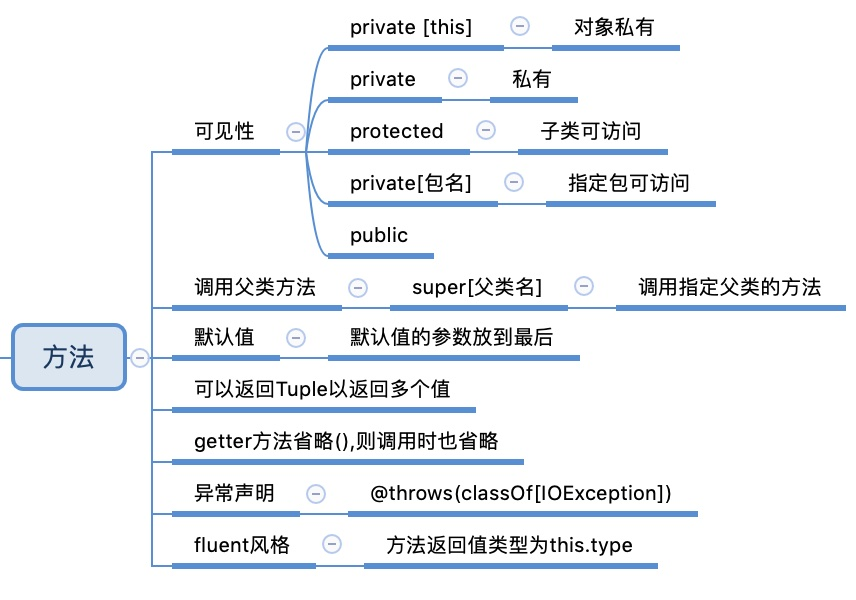

# 方法

和Java一样，scala里的方法也是对象上的行为，但是scala里的对象方法和Java里的对象方法有以下区别： 

1. scala更简洁
2. 方法可见性
3. 方法参数默认值的设置
4. 调用时按名传参的能力
5. 异常的声明方式
6. var字段的使用

下面一一讨论 

## 方法可见性控制

scala方法默认是public的，控制方法和Java类似，但是比Java更强大

有以下几种（从小到大）

1. 对象私有`private[this] def isFoo = true`
2. 私有`private def isFoo = true`
3. Protected  子类可访问（和Java不同，Java同包也可访问）
4. 包访问`private[model] def doX {}`model是子包名
5. 特定包访问`private[coolapp] def doY {}`
6. public

### 对象私有

只有当前对象可以访问,在方法前面加上private[this]

```scala
private[this] def isFoo = true
```

### 私有

private的方法只能当前类的对象可以访问（即使子类也不行），只要加private就行了

```scala
class Foo {
private def isFoo = true
  def doFoo(other: Foo) {
    if (other.isFoo) { // this now compiles
    // ...
    }
  }
}
```

### protected范围

Protected相比private来说，增加了子类也可以访问

### Package范围

package范围允许同一包下的所有类访问，除此之外，scala的包控制更加强大的，它还可以控制在包层级级别的访问

```scala
package com.acme.coolapp.model {
class Foo {
  private[model] def doX {}
  private[coolapp] def doY {}
  private[acme] def doZ {}
  }
}
import com.acme.coolapp.model._
package com.acme.coolapp.view {
  class Bar {
    val f = new Foo
    f.doX // won't compile
    f.doY
    f.doZ
  }
}
package com.acme.common {
  class Bar {
    val f = new Foo
    f.doX // won't compile
    f.doY // won't compile
    f.doZ
  }
}
```

### public

如果没有任何访问修饰符，则可以在任何地方访问

## 调用父类方法

和Java一样，直接使用super

```scala
class WelcomeActivity extends Activity { 
  override def onCreate(bundle: Bundle) {
			super.onCreate(bundle)
        // more code here ...
  } 
}
```

如果有多个父类，可以使用super[父类名]调用指定父类的方法

## 方法参数默认值

注意，把有默认值的参数放到最后就行

```scala
class Connection {
def makeConnection(timeout: Int = 5000, protocol: = "http") {
        println("timeout = %d, protocol = %s".format(timeout, protocol))
        // more code here
  } 
}
```

## 返回多个值的方法

这是通过返回tuple实现的，tuple可以包含最多22个变量，分别通过Tuple1,Tuple2,....,Tuple22类表示

```scala
def getStockInfo = {
// other code here ...
("NFLX", 100.00, 101.00) // this is a Tuple3
}

val (symbol, currentPrice, bidPrice) = getStockInfo
```

## 强制getter调用时省略()

这么做的目的，其实scala是在强调，调用getter不会产生副作用。

```scala
class Pizza {
//方法名后面不写()
  def crustSize = 12
}
```

## 变长参数

参数类型后加*

```scala
def printAll(strings: String*) {
      strings.foreach(println)
    }
在函数内部，重复参数的类型是参数类型的数组，String*的参数实际上是Array[String]。 但是不能直接传入数组，当想把数组中每个元素当作参数传入时，可以这么做：
printAll(arr:_*)
```

## 声明异常

只需要在方法签名上面加一行注解

```scala
@throws(classOf[IOException])
@throws(classOf[LineUnavailableException])
@throws(classOf[UnsupportedAudioFileException])
def playSoundFileWithJavaAudio {
// exception throwing code here ...
}
```

## fluent风格

```scala
person.setFirstName("Leonard")
          .setLastName("Nimoy")
          .setAge(82)
          .setCity("Los Angeles")
          .setState("California")
```

支持这种方式，需要：

1. 如果你的类可以被继承，方法返回值类型为this.type（这让子类也可以fluent，即返回值是子类而不是父类）
2. 否则，返回this类型就行

```scala
class Person {
  protected var fname = ""
  protected var lname = ""
  def setFirstName(firstName: String): this.type = //注意返回类型为this.type
    { fname = firstName
     this
  }
  def setLastName(lastName: String): this.type = 
    { lname = lastName
      this
    } 
}

class Employee extends Person {
  protected var role = ""
  def setRole(role: String): this.type = 
    { this.role = role
  this
  }
  override def toString = {
          "%s, %s, %s".format(fname, lname, role)
        }
}

//测试类
object Main extends App {
  val employee = new Employee
  // use the fluent methods
  employee.setFirstName("Al")
          .setLastName("Alexander")
          .setRole("Developer")
  println(employee)
}
```

# 总结



# 方法与函数

Scala 有方法与函数，二者在语义上的区别很小。Scala 方法是类的一部分，而函数是一个对象可以赋值给一个变量。

Scala 中的方法跟 Java 的类似，方法是组成类的一部分。

**Scala 中的函数则是一个完整的对象，Scala 中的函数其实就是继承了 Trait 的类的对象。**

**Scala 中使用 val 语句可以定义函数，def 语句定义方法。**

方法用=分割参数列表和方法体，而函数使用=>分割

[菜鸟](https://www.runoob.com/scala/scala-functions.html)

1. 方法

```scala
//声明方法，方法会被隐式声明为抽象(abstract)，包含它的类型于是也是一个抽象类型。
def functionName ([参数列表]) : [return type]
//定义方法
def functionName ([参数列表]) : [return type] = {
   function body
   return [expr]
}
```

2. 函数

```scala
scala> val f1 = (x: Int) => x+3
f1: Int => Int = <function1>
```

