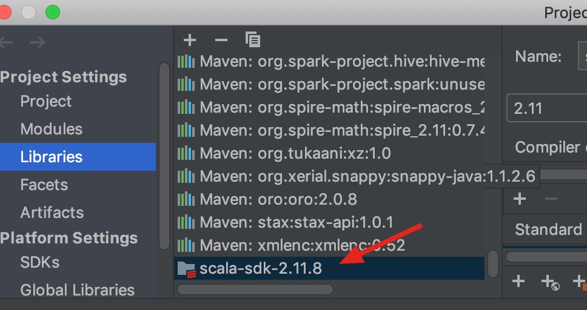

# 问题记录

## pom中的scala版本要和sdk中的scala版本一致

否则，出现问题

 java.lang.NoSuchMethodError: scala.Predef..conforms()Lscala/Predef$$less$colon$less;

# pom文件

## pom文件

```xml
<?xml version="1.0" encoding="UTF-8"?>
<project xmlns="http://maven.apache.org/POM/4.0.0"
         xmlns:xsi="http://www.w3.org/2001/XMLSchema-instance"
         xsi:schemaLocation="http://maven.apache.org/POM/4.0.0 http://maven.apache.org/xsd/maven-4.0.0.xsd">
    <modelVersion>4.0.0</modelVersion>

    <groupId>com.nsfocus.Learnscala</groupId>
    <artifactId>Learnscala</artifactId>
    <version>1.0-SNAPSHOT</version>

    <properties>
        <spark.version>2.0.2</spark.version>
        <scala.version>2.11</scala.version>
    </properties>


    <dependencies>
        <dependency>
            <groupId>org.apache.spark</groupId>
            <artifactId>spark-core_${scala.version}</artifactId>
            <version>${spark.version}</version>
        </dependency>
        <dependency>
            <groupId>org.apache.spark</groupId>
            <artifactId>spark-streaming_${scala.version}</artifactId>
            <version>${spark.version}</version>
        </dependency>
        <dependency>
            <groupId>org.apache.spark</groupId>
            <artifactId>spark-sql_${scala.version}</artifactId>
            <version>${spark.version}</version>
        </dependency>
        <dependency>
            <groupId>org.apache.spark</groupId>
            <artifactId>spark-hive_${scala.version}</artifactId>
            <version>${spark.version}</version>
        </dependency>
        <dependency>
            <groupId>org.apache.spark</groupId>
            <artifactId>spark-mllib_${scala.version}</artifactId>
            <version>${spark.version}</version>
        </dependency>

    </dependencies>

    <build>
        <plugins>

            <plugin>
                <groupId>org.scala-tools</groupId>
                <artifactId>maven-scala-plugin</artifactId>
                <version>2.15.2</version>
                <executions>
                    <execution>
                        <goals>
                            <goal>compile</goal>
                            <goal>testCompile</goal>
                        </goals>
                    </execution>
                </executions>
            </plugin>

            <plugin>
                <artifactId>maven-compiler-plugin</artifactId>
                <version>3.6.0</version>
                <configuration>
                    <source>1.8</source>
                    <target>1.8</target>
                </configuration>
            </plugin>

            <plugin>
                <groupId>org.apache.maven.plugins</groupId>
                <artifactId>maven-surefire-plugin</artifactId>
                <version>2.19</version>
                <configuration>
                    <skip>true</skip>
                </configuration>
            </plugin>

        </plugins>
    </build>
</project>
```



## maven插件

### Scala-maven-plugin

这个插件是用来让maven能够编译、测试、运行scala项目的，使用文档参考[scala-maven-plugin](https://link.jianshu.com/?t=https://davidb.github.io/scala-maven-plugin/index.html)

### maven-surefire-plugin

用于执行单元测试