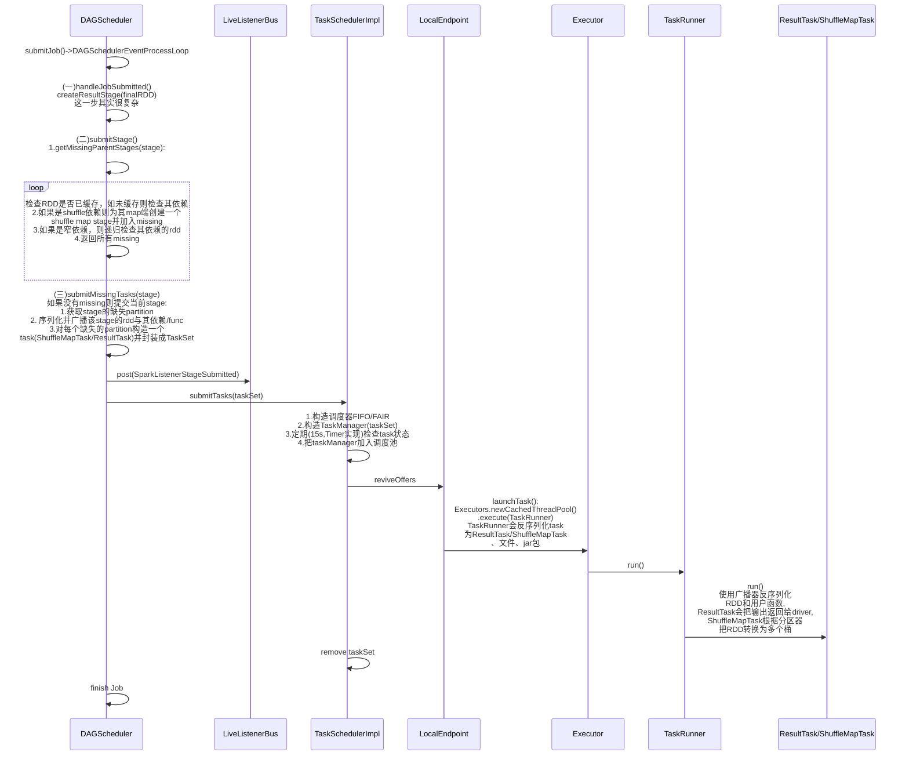

# 基本角色

**了解Spark架构原理及相关任务提交流程前，我们需要先了解一下Spark中的一些角色概念。**

- Application：用户编写的Spark应用程序，包含了一个Driver 功能的代码和分布在集群中多个节点上运行的Executor代码
- Driver：运行Application的main()函数并且创建SparkContext（Spark应用程序的运行环境）。Driver负责和ClusterManager通信，进行资源的申请、任务的分配和监控等。
- Cluster Manager：集群上获取资源的外部服务，比如Standalone（由Master负责资源的分配）和Yarn（由ResourceManager负责资源的分配）
- Worker：从节点，负责控制计算节点，启动Executor或者Driver。在Standalone模式中指的就是通过Slave文件配置的Worker节点，在Spark on Yarn模式中指的就是NodeManager节点。
- Executor：运行在Worker 节点上的进程，该进程负责运行Task，并且负责将数据存在内存或者磁盘上。
- Job：包含多个Task组成的并行计算，往往由Spark Action催生，一个JOB包含多个RDD及作用于相应RDD上的各种Operation；
- Stage：每个Job会被拆分很多Stage，而每个Stage又包含多个Task；Stage是根据宽依赖和窄依赖划分的.
- Task：被送到某个Executor上的工作任务

# 逻辑执行图

以下是Spark自带的GroupByTest的例子

```scala
/*
 * Licensed to the Apache Software Foundation (ASF) under one or more
 * contributor license agreements.  See the NOTICE file distributed with
 * this work for additional information regarding copyright ownership.
 * The ASF licenses this file to You under the Apache License, Version 2.0
 * (the "License"); you may not use this file except in compliance with
 * the License.  You may obtain a copy of the License at
 *
 *    http://www.apache.org/licenses/LICENSE-2.0
 *
 * Unless required by applicable law or agreed to in writing, software
 * distributed under the License is distributed on an "AS IS" BASIS,
 * WITHOUT WARRANTIES OR CONDITIONS OF ANY KIND, either express or implied.
 * See the License for the specific language governing permissions and
 * limitations under the License.
 */

// scalastyle:off println
package spark

import java.util.Random

import org.apache.spark.rdd.RDD
import org.apache.spark.sql.SparkSession

/**
 * Usage: GroupByTest [numMappers] [numKVPairs] [KeySize] [numReducers]
 */
object GroupByTest {
  def main(args: Array[String]) {
    val spark = SparkSession
      .builder
      .appName("GroupBy Test").master("local[4]")
      .getOrCreate()

    val numMappers = if (args.length > 0) args(0).toInt else 2
    val numKVPairs = if (args.length > 1) args(1).toInt else 1000
    val valSize = if (args.length > 2) args(2).toInt else 1000
    val numReducers = if (args.length > 3) args(3).toInt else numMappers

    val pairs1 = spark.sparkContext.parallelize(0 until numMappers, numMappers).flatMap { p =>
      val ranGen = new Random
      val arr1 = new Array[(Int, Array[Byte])](numKVPairs)
      for (i <- 0 until numKVPairs) {
        val byteArr = new Array[Byte](valSize)
        ranGen.nextBytes(byteArr)
        arr1(i) = (ranGen.nextInt(Int.MaxValue), byteArr)
      }
      arr1
    }.cache()
    // Enforce that everything has been calculated and in cache
    pairs1.count()

    val res: RDD[(Int, Iterable[Array[Byte]])] = pairs1.groupByKey(numReducers)
    println(res.toDebugString)
    println(res.count())

    Thread.sleep(1000000)
    spark.stop()
  }
}
// scalastyle:on println


```

首先我们要知道创建了多少个RDD，这段代码parallelize创建了一个RDD，flatMap创建了一个RDD，groupByKey也创建了一个RDD

运行代码，程序将打印出执行图

```java
(2) ShuffledRDD[2] at groupByKey at GroupByTest.scala:54 []
 +-(2) MapPartitionsRDD[1] at flatMap at GroupByTest.scala:41 []
    |      CachedPartitions: 2; MemorySize: 2.0 MB; ExternalBlockStoreSize: 0.0 B; DiskSize: 0.0 B
    |  ParallelCollectionRDD[0] at parallelize at GroupByTest.scala:41 []
```

它不仅把产生的RDD按顺序打印出来，还把RDD的缓存情况打印出来了，其中MapPartitionsRDD缓存了两个Partition，直接缓存到内存。

我们头脑中RDD的逻辑执行图应该是下面这样：


由于count是Action算子，所以两个count操作会产生两个Job，要搞清楚逻辑执行图，我们本次只需要关注一个Job即可。

# Job提交到执行

## Job提交的关键角色

运行代码，我们会发现提交了两个Job,我们先只关注第一个Job，观察driver日志我们会发现几个关键的角色：

1. DAGScheduler
2. TaskSchedulerImpl
3. TaskManager
4. Executor

## RPC通信进程

Backend进程是一个后台进程，用来启动Task， 通过分析源码， 发现有三种Backend进程可选


当运行本地版本的Spark时使用，其中执行程序、后端和主程序都运行在相同的JVM中。它位于TaskSchedulerImpl后面，处理在本地运行的单个Executor(由LocalSchedulerBackend创建)上启动的任务。

对LocalSchedulerBackend的调用都是通过LocalEndpoint序列化的。使用一个RpcEndpoint使调用LocalSchedulerBackend异步，这是必要的防止LocalSchedulerBackend和TaskSchedulerImpl之间的死锁。

这个进程启动时会添加一个Executor，同时提供调度Task的接口reviveOffers:

```scala
class:LocalSchedulerBackend

override def start() {
    val rpcEnv = SparkEnv.get.rpcEnv
    val executorEndpoint = new LocalEndpoint(rpcEnv, userClassPath, scheduler, this, totalCores)
    localEndpoint = rpcEnv.setupEndpoint("LocalSchedulerBackendEndpoint", executorEndpoint)
  //启动时发送添加executor消息 
  listenerBus.post(SparkListenerExecutorAdded(
      System.currentTimeMillis,
      executorEndpoint.localExecutorId,
      new ExecutorInfo(executorEndpoint.localExecutorHostname, totalCores, Map.empty)))
    launcherBackend.setAppId(appId)
    launcherBackend.setState(SparkAppHandle.State.RUNNING)
  }

//调度task
def reviveOffers() {
    val offers = Seq(new WorkerOffer(localExecutorId, localExecutorHostname, freeCores))
    for (task <- scheduler.resourceOffers(offers).flatten) {
      freeCores -= scheduler.CPUS_PER_TASK
      executor.launchTask(executorBackend, taskId = task.taskId, attemptNumber = task.attemptNumber,
        task.name, task.serializedTask)
    }
  }
```


## Job提交时序图

这里画出在IDE里提交Job，即默认使用的LocalSchedulerBackend时 Job提交的时序图





# 总结

我们发现，DAGScheduler做了相当多的工作：

1. DAGScheduler的submitJob方法触发Job的提交
2. 首先对最后一个RDD创建一个ResultStage，当然这一步其实很复杂，这里暂且不表，留待以后单开一篇细说
3. 接着提交resultStage，stage的提交方法也是一个复杂的流程，它会递归检查当前stage所有缺失的stage列表
4. 只有所有依赖的stage都已经ready了，才开始提交当前stage的task。注意，只对缺失的partition创建并提交task。序列化并广播该stage的rdd与其依赖，且会把task封装为taskSet提交。
5. 通过LiveListenerBus把taskSet提交给taskSchedulerImpl

接下来其他角色才开始介入：

1. taskSchedulerImpl对taskSet构造一个taskManager，然后向LocalEndPoint发起rpc调用reviveOffers以提交作业集
2. LocalSchedulerBackend申请资源，再调用executor.launchTask
3. Executor创建线程池，并把task封装成TaskRunner提交到线程池
4. TaskRunner会把TaskRunner会反序列化task为ResultTask/ShuffleMapTask、文件、jar包。
5. 最后ResultTask/ShuffleMapTask会通过广播器反序列化出rdd和用户函数并执行

所有内容放到一篇，真的太长了，后续分篇扒每个步骤，完！


