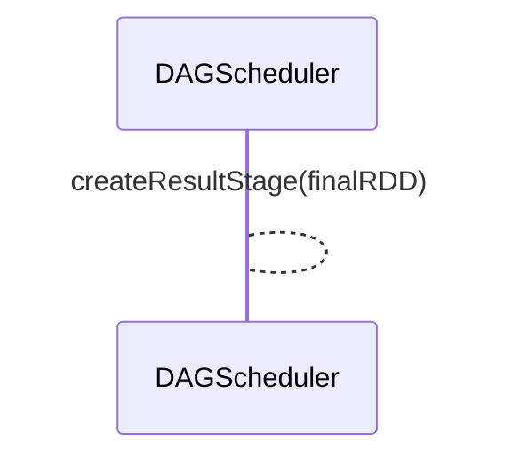
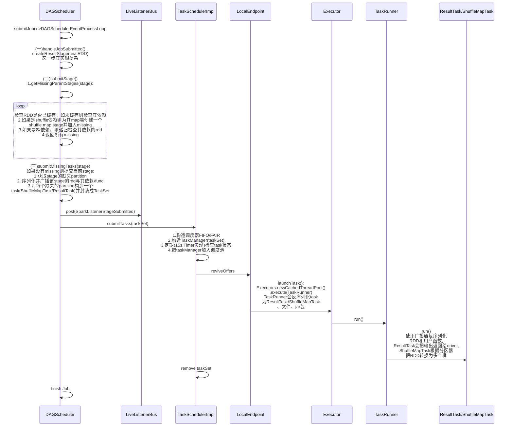
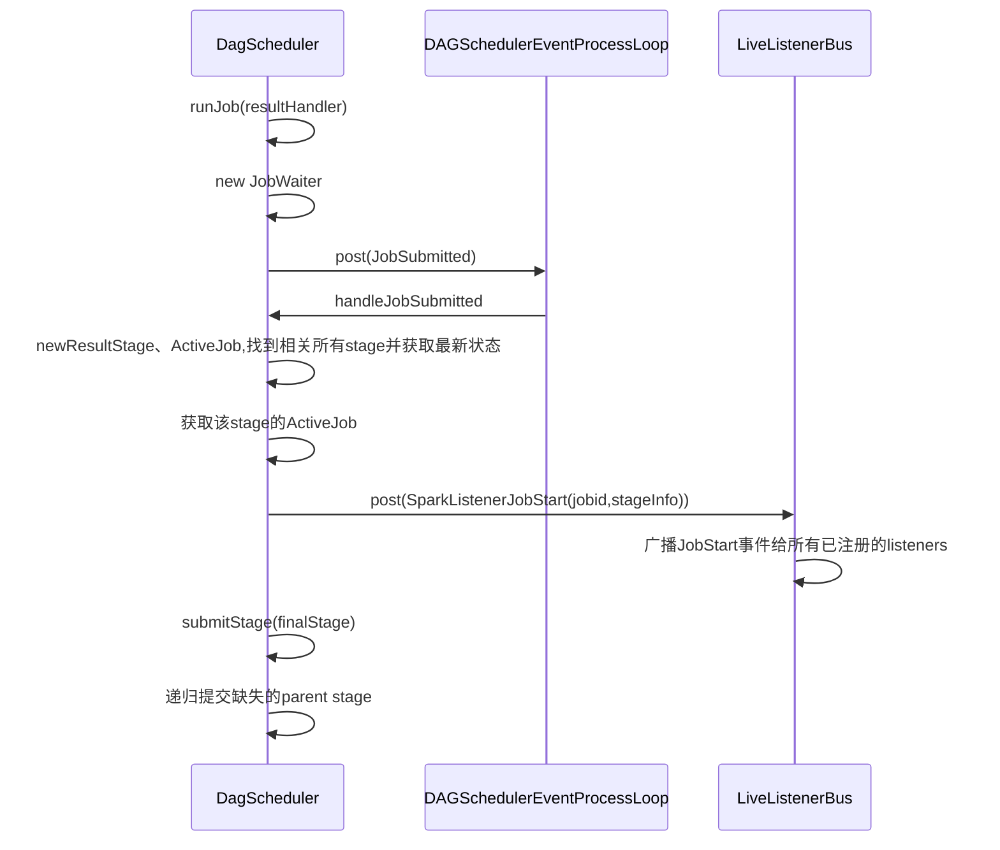
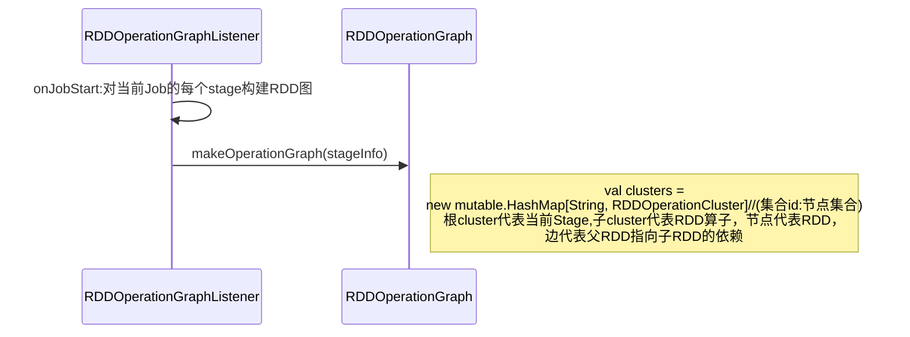

# 案例分析

## 代码

以源码自带例子GroupByTest.scala为例：

```scala
/*
 * Licensed to the Apache Software Foundation (ASF) under one or more
 * contributor license agreements.  See the NOTICE file distributed with
 * this work for additional information regarding copyright ownership.
 * The ASF licenses this file to You under the Apache License, Version 2.0
 * (the "License"); you may not use this file except in compliance with
 * the License.  You may obtain a copy of the License at
 *
 *    http://www.apache.org/licenses/LICENSE-2.0
 *
 * Unless required by applicable law or agreed to in writing, software
 * distributed under the License is distributed on an "AS IS" BASIS,
 * WITHOUT WARRANTIES OR CONDITIONS OF ANY KIND, either express or implied.
 * See the License for the specific language governing permissions and
 * limitations under the License.
 */

// scalastyle:off println
package spark

import java.util.Random

import org.apache.spark.rdd.RDD
import org.apache.spark.sql.SparkSession

/**
 * Usage: GroupByTest [numMappers] [numKVPairs] [KeySize] [numReducers]
 */
object GroupByTest {
  def main(args: Array[String]) {
    val spark = SparkSession
      .builder
      .appName("GroupBy Test").master("local[4]")
      .getOrCreate()

    val numMappers = if (args.length > 0) args(0).toInt else 2
    val numKVPairs = if (args.length > 1) args(1).toInt else 1000
    val valSize = if (args.length > 2) args(2).toInt else 1000
    val numReducers = if (args.length > 3) args(3).toInt else numMappers

    val pairs1 = spark.sparkContext.parallelize(0 until numMappers, numMappers).flatMap { p =>
      val ranGen = new Random
      val arr1 = new Array[(Int, Array[Byte])](numKVPairs)
      for (i <- 0 until numKVPairs) {
        val byteArr = new Array[Byte](valSize)
        ranGen.nextBytes(byteArr)
        arr1(i) = (ranGen.nextInt(Int.MaxValue), byteArr)
      }
      arr1
    }.cache()
    // Enforce that everything has been calculated and in cache
    pairs1.count()

    val res: RDD[(Int, Iterable[Array[Byte]])] = pairs1.groupByKey(numReducers)
    println(res.toDebugString)
    println(res.count())

    Thread.sleep(1000000)
    spark.stop()
  }
}
// scalastyle:on println

```

### 日志

```java
/Library/Java/JavaVirtualMachines/adoptopenjdk-8.jdk/Contents/Home/bin/java "-javaagent:/Applications/IntelliJ IDEA.app/Contents/lib/idea_rt.jar=50849:/Applications/IntelliJ IDEA.app/Contents/bin" -Dfile.encoding=UTF-8 -classpath /Library/Java/JavaVirtualMachines/adoptopenjdk-8.jdk/Contents/Home/jre/lib/charsets.jar:/Library/Java/JavaVirtualMachines/adoptopenjdk-8.jdk/Contents/Home/jre/lib/ext/cldrdata.jar:/Library/Java/JavaVirtualMachines/adoptopenjdk-8.jdk/Contents/Home/jre/lib/ext/dnsns.jar:/Library/Java/JavaVirtualMachines/adoptopenjdk-8.jdk/Contents/Home/jre/lib/ext/jaccess.jar:/Library/Java/JavaVirtualMachines/adoptopenjdk-8.jdk/Contents/Home/jre/lib/ext/localedata.jar:/Library/Java/JavaVirtualMachines/adoptopenjdk-8.jdk/Contents/Home/jre/lib/ext/nashorn.jar:/Library/Java/JavaVirtualMachines/adoptopenjdk-8.jdk/Contents/Home/jre/lib/ext/sunec.jar:/Library/Java/JavaVirtualMachines/adoptopenjdk-8.jdk/Contents/Home/jre/lib/ext/sunjce_provider.jar:/Library/Java/JavaVirtualMachines/adoptopenjdk-8.jdk/Contents/Home/jre/lib/ext/sunpkcs11.jar:/Library/Java/JavaVirtualMachines/adoptopenjdk-8.jdk/Contents/Home/jre/lib/ext/zipfs.jar:/Library/Java/JavaVirtualMachines/adoptopenjdk-8.jdk/Contents/Home/jre/lib/jce.jar:/Library/Java/JavaVirtualMachines/adoptopenjdk-8.jdk/Contents/Home/jre/lib/jsse.jar:/Library/Java/JavaVirtualMachines/adoptopenjdk-8.jdk/Contents/Home/jre/lib/management-agent.jar:/Library/Java/JavaVirtualMachines/adoptopenjdk-8.jdk/Contents/Home/jre/lib/resources.jar:/Library/Java/JavaVirtualMachines/adoptopenjdk-8.jdk/Contents/Home/jre/lib/rt.jar:/Library/Java/JavaVirtualMachines/adoptopenjdk-8.jdk/Contents/Home/lib/dt.jar:/Library/Java/JavaVirtualMachines/adoptopenjdk-8.jdk/Contents/Home/lib/jconsole.jar:/Library/Java/JavaVirtualMachines/adoptopenjdk-8.jdk/Contents/Home/lib/sa-jdi.jar:/Library/Java/JavaVirtualMachines/adoptopenjdk-8.jdk/Contents/Home/lib/tools.jar:/Users/chengxingfu/code/my/TechWorld/code/spark/Learnscala/target/classes:/Users/chengxingfu/repo/org/apache/spark/spark-core_2.11/2.0.2/spark-core_2.11-2.0.2.jar:/Users/chengxingfu/repo/org/apache/avro/avro-mapred/1.7.7/avro-mapred-1.7.7-hadoop2.jar:/Users/chengxingfu/repo/org/apache/avro/avro-ipc/1.7.7/avro-ipc-1.7.7.jar:/Users/chengxingfu/repo/org/apache/avro/avro-ipc/1.7.7/avro-ipc-1.7.7-tests.jar:/Users/chengxingfu/repo/org/codehaus/jackson/jackson-core-asl/1.9.13/jackson-core-asl-1.9.13.jar:/Users/chengxingfu/repo/com/twitter/chill_2.11/0.8.0/chill_2.11-0.8.0.jar:/Users/chengxingfu/repo/com/esotericsoftware/kryo-shaded/3.0.3/kryo-shaded-3.0.3.jar:/Users/chengxingfu/repo/com/esotericsoftware/minlog/1.3.0/minlog-1.3.0.jar:/Users/chengxingfu/repo/org/objenesis/objenesis/2.1/objenesis-2.1.jar:/Users/chengxingfu/repo/com/twitter/chill-java/0.8.0/chill-java-0.8.0.jar:/Users/chengxingfu/repo/org/apache/xbean/xbean-asm5-shaded/4.4/xbean-asm5-shaded-4.4.jar:/Users/chengxingfu/repo/org/apache/hadoop/hadoop-client/2.2.0/hadoop-client-2.2.0.jar:/Users/chengxingfu/repo/org/apache/hadoop/hadoop-common/2.2.0/hadoop-common-2.2.0.jar:/Users/chengxingfu/repo/org/apache/commons/commons-math/2.1/commons-math-2.1.jar:/Users/chengxingfu/repo/xmlenc/xmlenc/0.52/xmlenc-0.52.jar:/Users/chengxingfu/repo/commons-configuration/commons-configuration/1.6/commons-configuration-1.6.jar:/Users/chengxingfu/repo/commons-collections/commons-collections/3.2.1/commons-collections-3.2.1.jar:/Users/chengxingfu/repo/commons-digester/commons-digester/1.8/commons-digester-1.8.jar:/Users/chengxingfu/repo/commons-beanutils/commons-beanutils/1.7.0/commons-beanutils-1.7.0.jar:/Users/chengxingfu/repo/commons-beanutils/commons-beanutils-core/1.8.0/commons-beanutils-core-1.8.0.jar:/Users/chengxingfu/repo/com/google/protobuf/protobuf-java/2.5.0/protobuf-java-2.5.0.jar:/Users/chengxingfu/repo/org/apache/hadoop/hadoop-auth/2.2.0/hadoop-auth-2.2.0.jar:/Users/chengxingfu/repo/org/apache/hadoop/hadoop-hdfs/2.2.0/hadoop-hdfs-2.2.0.jar:/Users/chengxingfu/repo/org/mortbay/jetty/jetty-util/6.1.26/jetty-util-6.1.26.jar:/Users/chengxingfu/repo/org/apache/hadoop/hadoop-mapreduce-client-app/2.2.0/hadoop-mapreduce-client-app-2.2.0.jar:/Users/chengxingfu/repo/org/apache/hadoop/hadoop-mapreduce-client-common/2.2.0/hadoop-mapreduce-client-common-2.2.0.jar:/Users/chengxingfu/repo/org/apache/hadoop/hadoop-yarn-client/2.2.0/hadoop-yarn-client-2.2.0.jar:/Users/chengxingfu/repo/com/google/inject/guice/3.0/guice-3.0.jar:/Users/chengxingfu/repo/javax/inject/javax.inject/1/javax.inject-1.jar:/Users/chengxingfu/repo/aopalliance/aopalliance/1.0/aopalliance-1.0.jar:/Users/chengxingfu/repo/org/apache/hadoop/hadoop-yarn-server-common/2.2.0/hadoop-yarn-server-common-2.2.0.jar:/Users/chengxingfu/repo/org/apache/hadoop/hadoop-mapreduce-client-shuffle/2.2.0/hadoop-mapreduce-client-shuffle-2.2.0.jar:/Users/chengxingfu/repo/org/apache/hadoop/hadoop-yarn-api/2.2.0/hadoop-yarn-api-2.2.0.jar:/Users/chengxingfu/repo/org/apache/hadoop/hadoop-mapreduce-client-core/2.2.0/hadoop-mapreduce-client-core-2.2.0.jar:/Users/chengxingfu/repo/org/apache/hadoop/hadoop-yarn-common/2.2.0/hadoop-yarn-common-2.2.0.jar:/Users/chengxingfu/repo/org/apache/hadoop/hadoop-mapreduce-client-jobclient/2.2.0/hadoop-mapreduce-client-jobclient-2.2.0.jar:/Users/chengxingfu/repo/org/apache/hadoop/hadoop-annotations/2.2.0/hadoop-annotations-2.2.0.jar:/Users/chengxingfu/repo/org/apache/spark/spark-launcher_2.11/2.0.2/spark-launcher_2.11-2.0.2.jar:/Users/chengxingfu/repo/org/apache/spark/spark-network-common_2.11/2.0.2/spark-network-common_2.11-2.0.2.jar:/Users/chengxingfu/repo/org/fusesource/leveldbjni/leveldbjni-all/1.8/leveldbjni-all-1.8.jar:/Users/chengxingfu/repo/com/fasterxml/jackson/core/jackson-annotations/2.6.5/jackson-annotations-2.6.5.jar:/Users/chengxingfu/repo/org/apache/spark/spark-network-shuffle_2.11/2.0.2/spark-network-shuffle_2.11-2.0.2.jar:/Users/chengxingfu/repo/org/apache/spark/spark-unsafe_2.11/2.0.2/spark-unsafe_2.11-2.0.2.jar:/Users/chengxingfu/repo/net/java/dev/jets3t/jets3t/0.7.1/jets3t-0.7.1.jar:/Users/chengxingfu/repo/org/apache/curator/curator-recipes/2.4.0/curator-recipes-2.4.0.jar:/Users/chengxingfu/repo/org/apache/curator/curator-framework/2.4.0/curator-framework-2.4.0.jar:/Users/chengxingfu/repo/org/apache/curator/curator-client/2.4.0/curator-client-2.4.0.jar:/Users/chengxingfu/repo/org/apache/zookeeper/zookeeper/3.4.5/zookeeper-3.4.5.jar:/Users/chengxingfu/repo/com/google/guava/guava/14.0.1/guava-14.0.1.jar:/Users/chengxingfu/repo/javax/servlet/javax.servlet-api/3.1.0/javax.servlet-api-3.1.0.jar:/Users/chengxingfu/repo/org/apache/commons/commons-lang3/3.3.2/commons-lang3-3.3.2.jar:/Users/chengxingfu/repo/org/apache/commons/commons-math3/3.4.1/commons-math3-3.4.1.jar:/Users/chengxingfu/repo/com/google/code/findbugs/jsr305/1.3.9/jsr305-1.3.9.jar:/Users/chengxingfu/repo/org/slf4j/slf4j-api/1.7.16/slf4j-api-1.7.16.jar:/Users/chengxingfu/repo/org/slf4j/jul-to-slf4j/1.7.16/jul-to-slf4j-1.7.16.jar:/Users/chengxingfu/repo/org/slf4j/jcl-over-slf4j/1.7.16/jcl-over-slf4j-1.7.16.jar:/Users/chengxingfu/repo/log4j/log4j/1.2.17/log4j-1.2.17.jar:/Users/chengxingfu/repo/org/slf4j/slf4j-log4j12/1.7.16/slf4j-log4j12-1.7.16.jar:/Users/chengxingfu/repo/com/ning/compress-lzf/1.0.3/compress-lzf-1.0.3.jar:/Users/chengxingfu/repo/org/xerial/snappy/snappy-java/1.1.2.6/snappy-java-1.1.2.6.jar:/Users/chengxingfu/repo/net/jpountz/lz4/lz4/1.3.0/lz4-1.3.0.jar:/Users/chengxingfu/repo/org/roaringbitmap/RoaringBitmap/0.5.11/RoaringBitmap-0.5.11.jar:/Users/chengxingfu/repo/commons-net/commons-net/2.2/commons-net-2.2.jar:/Users/chengxingfu/repo/org/scala-lang/scala-library/2.11.8/scala-library-2.11.8.jar:/Users/chengxingfu/repo/org/json4s/json4s-jackson_2.11/3.2.11/json4s-jackson_2.11-3.2.11.jar:/Users/chengxingfu/repo/org/json4s/json4s-core_2.11/3.2.11/json4s-core_2.11-3.2.11.jar:/Users/chengxingfu/repo/org/json4s/json4s-ast_2.11/3.2.11/json4s-ast_2.11-3.2.11.jar:/Users/chengxingfu/repo/org/scala-lang/scalap/2.11.0/scalap-2.11.0.jar:/Users/chengxingfu/repo/org/scala-lang/scala-compiler/2.11.0/scala-compiler-2.11.0.jar:/Users/chengxingfu/repo/org/scala-lang/modules/scala-parser-combinators_2.11/1.0.1/scala-parser-combinators_2.11-1.0.1.jar:/Users/chengxingfu/repo/org/glassfish/jersey/core/jersey-client/2.22.2/jersey-client-2.22.2.jar:/Users/chengxingfu/repo/javax/ws/rs/javax.ws.rs-api/2.0.1/javax.ws.rs-api-2.0.1.jar:/Users/chengxingfu/repo/org/glassfish/hk2/hk2-api/2.4.0-b34/hk2-api-2.4.0-b34.jar:/Users/chengxingfu/repo/org/glassfish/hk2/hk2-utils/2.4.0-b34/hk2-utils-2.4.0-b34.jar:/Users/chengxingfu/repo/org/glassfish/hk2/external/aopalliance-repackaged/2.4.0-b34/aopalliance-repackaged-2.4.0-b34.jar:/Users/chengxingfu/repo/org/glassfish/hk2/external/javax.inject/2.4.0-b34/javax.inject-2.4.0-b34.jar:/Users/chengxingfu/repo/org/glassfish/hk2/hk2-locator/2.4.0-b34/hk2-locator-2.4.0-b34.jar:/Users/chengxingfu/repo/org/javassist/javassist/3.18.1-GA/javassist-3.18.1-GA.jar:/Users/chengxingfu/repo/org/glassfish/jersey/core/jersey-common/2.22.2/jersey-common-2.22.2.jar:/Users/chengxingfu/repo/javax/annotation/javax.annotation-api/1.2/javax.annotation-api-1.2.jar:/Users/chengxingfu/repo/org/glassfish/jersey/bundles/repackaged/jersey-guava/2.22.2/jersey-guava-2.22.2.jar:/Users/chengxingfu/repo/org/glassfish/hk2/osgi-resource-locator/1.0.1/osgi-resource-locator-1.0.1.jar:/Users/chengxingfu/repo/org/glassfish/jersey/core/jersey-server/2.22.2/jersey-server-2.22.2.jar:/Users/chengxingfu/repo/org/glassfish/jersey/media/jersey-media-jaxb/2.22.2/jersey-media-jaxb-2.22.2.jar:/Users/chengxingfu/repo/javax/validation/validation-api/1.1.0.Final/validation-api-1.1.0.Final.jar:/Users/chengxingfu/repo/org/glassfish/jersey/containers/jersey-container-servlet/2.22.2/jersey-container-servlet-2.22.2.jar:/Users/chengxingfu/repo/org/glassfish/jersey/containers/jersey-container-servlet-core/2.22.2/jersey-container-servlet-core-2.22.2.jar:/Users/chengxingfu/repo/org/apache/mesos/mesos/0.21.1/mesos-0.21.1-shaded-protobuf.jar:/Users/chengxingfu/repo/io/netty/netty-all/4.0.29.Final/netty-all-4.0.29.Final.jar:/Users/chengxingfu/repo/io/netty/netty/3.8.0.Final/netty-3.8.0.Final.jar:/Users/chengxingfu/repo/com/clearspring/analytics/stream/2.7.0/stream-2.7.0.jar:/Users/chengxingfu/repo/io/dropwizard/metrics/metrics-core/3.1.2/metrics-core-3.1.2.jar:/Users/chengxingfu/repo/io/dropwizard/metrics/metrics-jvm/3.1.2/metrics-jvm-3.1.2.jar:/Users/chengxingfu/repo/io/dropwizard/metrics/metrics-json/3.1.2/metrics-json-3.1.2.jar:/Users/chengxingfu/repo/io/dropwizard/metrics/metrics-graphite/3.1.2/metrics-graphite-3.1.2.jar:/Users/chengxingfu/repo/com/fasterxml/jackson/core/jackson-databind/2.6.5/jackson-databind-2.6.5.jar:/Users/chengxingfu/repo/com/fasterxml/jackson/core/jackson-core/2.6.5/jackson-core-2.6.5.jar:/Users/chengxingfu/repo/com/fasterxml/jackson/module/jackson-module-scala_2.11/2.6.5/jackson-module-scala_2.11-2.6.5.jar:/Users/chengxingfu/repo/org/scala-lang/scala-reflect/2.11.7/scala-reflect-2.11.7.jar:/Users/chengxingfu/repo/com/fasterxml/jackson/module/jackson-module-paranamer/2.6.5/jackson-module-paranamer-2.6.5.jar:/Users/chengxingfu/repo/org/apache/ivy/ivy/2.4.0/ivy-2.4.0.jar:/Users/chengxingfu/repo/oro/oro/2.0.8/oro-2.0.8.jar:/Users/chengxingfu/repo/net/razorvine/pyrolite/4.13/pyrolite-4.13.jar:/Users/chengxingfu/repo/net/sf/py4j/py4j/0.10.3/py4j-0.10.3.jar:/Users/chengxingfu/repo/org/apache/spark/spark-tags_2.11/2.0.2/spark-tags_2.11-2.0.2.jar:/Users/chengxingfu/repo/org/scalatest/scalatest_2.11/2.2.6/scalatest_2.11-2.2.6.jar:/Users/chengxingfu/repo/org/scala-lang/modules/scala-xml_2.11/1.0.2/scala-xml_2.11-1.0.2.jar:/Users/chengxingfu/repo/org/spark-project/spark/unused/1.0.0/unused-1.0.0.jar:/Users/chengxingfu/repo/org/apache/spark/spark-streaming_2.11/2.0.2/spark-streaming_2.11-2.0.2.jar:/Users/chengxingfu/repo/org/apache/spark/spark-sql_2.11/2.0.2/spark-sql_2.11-2.0.2.jar:/Users/chengxingfu/repo/com/univocity/univocity-parsers/2.1.1/univocity-parsers-2.1.1.jar:/Users/chengxingfu/repo/org/apache/spark/spark-sketch_2.11/2.0.2/spark-sketch_2.11-2.0.2.jar:/Users/chengxingfu/repo/org/apache/spark/spark-catalyst_2.11/2.0.2/spark-catalyst_2.11-2.0.2.jar:/Users/chengxingfu/repo/org/codehaus/janino/janino/2.7.8/janino-2.7.8.jar:/Users/chengxingfu/repo/org/antlr/antlr4-runtime/4.5.3/antlr4-runtime-4.5.3.jar:/Users/chengxingfu/repo/org/apache/parquet/parquet-column/1.7.0/parquet-column-1.7.0.jar:/Users/chengxingfu/repo/org/apache/parquet/parquet-common/1.7.0/parquet-common-1.7.0.jar:/Users/chengxingfu/repo/org/apache/parquet/parquet-encoding/1.7.0/parquet-encoding-1.7.0.jar:/Users/chengxingfu/repo/org/apache/parquet/parquet-generator/1.7.0/parquet-generator-1.7.0.jar:/Users/chengxingfu/repo/org/apache/parquet/parquet-hadoop/1.7.0/parquet-hadoop-1.7.0.jar:/Users/chengxingfu/repo/org/apache/parquet/parquet-format/2.3.0-incubating/parquet-format-2.3.0-incubating.jar:/Users/chengxingfu/repo/org/apache/parquet/parquet-jackson/1.7.0/parquet-jackson-1.7.0.jar:/Users/chengxingfu/repo/org/apache/spark/spark-hive_2.11/2.0.2/spark-hive_2.11-2.0.2.jar:/Users/chengxingfu/repo/com/twitter/parquet-hadoop-bundle/1.6.0/parquet-hadoop-bundle-1.6.0.jar:/Users/chengxingfu/repo/org/spark-project/hive/hive-exec/1.2.1.spark2/hive-exec-1.2.1.spark2.jar:/Users/chengxingfu/repo/commons-io/commons-io/2.4/commons-io-2.4.jar:/Users/chengxingfu/repo/commons-lang/commons-lang/2.6/commons-lang-2.6.jar:/Users/chengxingfu/repo/javolution/javolution/5.5.1/javolution-5.5.1.jar:/Users/chengxingfu/repo/log4j/apache-log4j-extras/1.2.17/apache-log4j-extras-1.2.17.jar:/Users/chengxingfu/repo/org/antlr/antlr-runtime/3.4/antlr-runtime-3.4.jar:/Users/chengxingfu/repo/org/antlr/stringtemplate/3.2.1/stringtemplate-3.2.1.jar:/Users/chengxingfu/repo/antlr/antlr/2.7.7/antlr-2.7.7.jar:/Users/chengxingfu/repo/org/antlr/ST4/4.0.4/ST4-4.0.4.jar:/Users/chengxingfu/repo/org/apache/commons/commons-compress/1.4.1/commons-compress-1.4.1.jar:/Users/chengxingfu/repo/org/tukaani/xz/1.0/xz-1.0.jar:/Users/chengxingfu/repo/com/googlecode/javaewah/JavaEWAH/0.3.2/JavaEWAH-0.3.2.jar:/Users/chengxingfu/repo/org/iq80/snappy/snappy/0.2/snappy-0.2.jar:/Users/chengxingfu/repo/org/json/json/20090211/json-20090211.jar:/Users/chengxingfu/repo/stax/stax-api/1.0.1/stax-api-1.0.1.jar:/Users/chengxingfu/repo/net/sf/opencsv/opencsv/2.3/opencsv-2.3.jar:/Users/chengxingfu/repo/org/spark-project/hive/hive-metastore/1.2.1.spark2/hive-metastore-1.2.1.spark2.jar:/Users/chengxingfu/repo/com/jolbox/bonecp/0.8.0.RELEASE/bonecp-0.8.0.RELEASE.jar:/Users/chengxingfu/repo/commons-cli/commons-cli/1.2/commons-cli-1.2.jar:/Users/chengxingfu/repo/commons-logging/commons-logging/1.1.3/commons-logging-1.1.3.jar:/Users/chengxingfu/repo/org/apache/derby/derby/10.10.2.0/derby-10.10.2.0.jar:/Users/chengxingfu/repo/org/datanucleus/datanucleus-api-jdo/3.2.6/datanucleus-api-jdo-3.2.6.jar:/Users/chengxingfu/repo/org/datanucleus/datanucleus-rdbms/3.2.9/datanucleus-rdbms-3.2.9.jar:/Users/chengxingfu/repo/commons-pool/commons-pool/1.5.4/commons-pool-1.5.4.jar:/Users/chengxingfu/repo/commons-dbcp/commons-dbcp/1.4/commons-dbcp-1.4.jar:/Users/chengxingfu/repo/javax/jdo/jdo-api/3.0.1/jdo-api-3.0.1.jar:/Users/chengxingfu/repo/javax/transaction/jta/1.1/jta-1.1.jar:/Users/chengxingfu/repo/org/apache/avro/avro/1.7.7/avro-1.7.7.jar:/Users/chengxingfu/repo/com/thoughtworks/paranamer/paranamer/2.3/paranamer-2.3.jar:/Users/chengxingfu/repo/commons-httpclient/commons-httpclient/3.1/commons-httpclient-3.1.jar:/Users/chengxingfu/repo/org/apache/calcite/calcite-avatica/1.2.0-incubating/calcite-avatica-1.2.0-incubating.jar:/Users/chengxingfu/repo/org/apache/calcite/calcite-core/1.2.0-incubating/calcite-core-1.2.0-incubating.jar:/Users/chengxingfu/repo/org/apache/calcite/calcite-linq4j/1.2.0-incubating/calcite-linq4j-1.2.0-incubating.jar:/Users/chengxingfu/repo/net/hydromatic/eigenbase-properties/1.1.5/eigenbase-properties-1.1.5.jar:/Users/chengxingfu/repo/org/codehaus/janino/commons-compiler/2.7.6/commons-compiler-2.7.6.jar:/Users/chengxingfu/repo/org/apache/httpcomponents/httpclient/4.5.2/httpclient-4.5.2.jar:/Users/chengxingfu/repo/org/apache/httpcomponents/httpcore/4.4.4/httpcore-4.4.4.jar:/Users/chengxingfu/repo/org/codehaus/jackson/jackson-mapper-asl/1.9.13/jackson-mapper-asl-1.9.13.jar:/Users/chengxingfu/repo/commons-codec/commons-codec/1.10/commons-codec-1.10.jar:/Users/chengxingfu/repo/joda-time/joda-time/2.9.3/joda-time-2.9.3.jar:/Users/chengxingfu/repo/org/jodd/jodd-core/3.5.2/jodd-core-3.5.2.jar:/Users/chengxingfu/repo/org/datanucleus/datanucleus-core/3.2.10/datanucleus-core-3.2.10.jar:/Users/chengxingfu/repo/org/apache/thrift/libthrift/0.9.2/libthrift-0.9.2.jar:/Users/chengxingfu/repo/org/apache/thrift/libfb303/0.9.2/libfb303-0.9.2.jar:/Users/chengxingfu/repo/org/apache/spark/spark-mllib_2.11/2.0.2/spark-mllib_2.11-2.0.2.jar:/Users/chengxingfu/repo/org/apache/spark/spark-graphx_2.11/2.0.2/spark-graphx_2.11-2.0.2.jar:/Users/chengxingfu/repo/com/github/fommil/netlib/core/1.1.2/core-1.1.2.jar:/Users/chengxingfu/repo/net/sourceforge/f2j/arpack_combined_all/0.1/arpack_combined_all-0.1.jar:/Users/chengxingfu/repo/org/apache/spark/spark-mllib-local_2.11/2.0.2/spark-mllib-local_2.11-2.0.2.jar:/Users/chengxingfu/repo/org/scalanlp/breeze_2.11/0.11.2/breeze_2.11-0.11.2.jar:/Users/chengxingfu/repo/org/scalanlp/breeze-macros_2.11/0.11.2/breeze-macros_2.11-0.11.2.jar:/Users/chengxingfu/repo/com/github/rwl/jtransforms/2.4.0/jtransforms-2.4.0.jar:/Users/chengxingfu/repo/org/spire-math/spire_2.11/0.7.4/spire_2.11-0.7.4.jar:/Users/chengxingfu/repo/org/spire-math/spire-macros_2.11/0.7.4/spire-macros_2.11-0.7.4.jar:/Users/chengxingfu/repo/org/jpmml/pmml-model/1.2.15/pmml-model-1.2.15.jar:/Users/chengxingfu/repo/org/jpmml/pmml-schema/1.2.15/pmml-schema-1.2.15.jar:/Users/chengxingfu/repo/org/scala-lang/scala-actors/2.11.7/scala-actors-2.11.7.jar spark.GroupByTest
16:42:39.170  INFO spark.SparkContext logInfo: | Running Spark version 2.0.2
16:42:39.522  WARN util.NativeCodeLoader <clinit>: | Unable to load native-hadoop library for your platform... using builtin-java classes where applicable
16:42:39.706  INFO spark.SecurityManager logInfo: | Changing view acls to: chengxingfu
16:42:39.707  INFO spark.SecurityManager logInfo: | Changing modify acls to: chengxingfu
16:42:39.707  INFO spark.SecurityManager logInfo: | Changing view acls groups to: 
16:42:39.708  INFO spark.SecurityManager logInfo: | Changing modify acls groups to: 
16:42:39.708  INFO spark.SecurityManager logInfo: | SecurityManager: authentication disabled; ui acls disabled; users  with view permissions: Set(chengxingfu); groups with view permissions: Set(); users  with modify permissions: Set(chengxingfu); groups with modify permissions: Set()
16:42:40.122  INFO util.Utils logInfo: | Successfully started service 'sparkDriver' on port 50855.
16:42:40.145  INFO spark.SparkEnv logInfo: | Registering MapOutputTracker
16:42:40.160  INFO spark.SparkEnv logInfo: | Registering BlockManagerMaster
16:42:40.171  INFO storage.DiskBlockManager logInfo: | Created local directory at /private/var/folders/1n/llyxr5q56pd1cfdcfq5mqtx40000gp/T/blockmgr-6146c3b9-260c-4b4a-9ab8-af0165656333
16:42:40.186  INFO memory.MemoryStore logInfo: | MemoryStore started with capacity 2004.6 MB
16:42:40.222  INFO spark.SparkEnv logInfo: | Registering OutputCommitCoordinator
16:42:40.301  INFO util.log initialized: | Logging initialized @1984ms
16:42:40.424  INFO server.Server doStart: | jetty-9.2.z-SNAPSHOT
16:42:40.438  INFO handler.ContextHandler doStart: | Started o.s.j.s.ServletContextHandler@1338fb5{/jobs,null,AVAILABLE}
16:42:40.439  INFO handler.ContextHandler doStart: | Started o.s.j.s.ServletContextHandler@42463763{/jobs/json,null,AVAILABLE}
16:42:40.439  INFO handler.ContextHandler doStart: | Started o.s.j.s.ServletContextHandler@59f63e24{/jobs/job,null,AVAILABLE}
16:42:40.440  INFO handler.ContextHandler doStart: | Started o.s.j.s.ServletContextHandler@61f05988{/jobs/job/json,null,AVAILABLE}
16:42:40.440  INFO handler.ContextHandler doStart: | Started o.s.j.s.ServletContextHandler@7ca33c24{/stages,null,AVAILABLE}
16:42:40.440  INFO handler.ContextHandler doStart: | Started o.s.j.s.ServletContextHandler@fade1fc{/stages/json,null,AVAILABLE}
16:42:40.441  INFO handler.ContextHandler doStart: | Started o.s.j.s.ServletContextHandler@67c2e933{/stages/stage,null,AVAILABLE}
16:42:40.441  INFO handler.ContextHandler doStart: | Started o.s.j.s.ServletContextHandler@41dd05a{/stages/stage/json,null,AVAILABLE}
16:42:40.441  INFO handler.ContextHandler doStart: | Started o.s.j.s.ServletContextHandler@613a8ee1{/stages/pool,null,AVAILABLE}
16:42:40.442  INFO handler.ContextHandler doStart: | Started o.s.j.s.ServletContextHandler@178213b{/stages/pool/json,null,AVAILABLE}
16:42:40.442  INFO handler.ContextHandler doStart: | Started o.s.j.s.ServletContextHandler@7103cb56{/storage,null,AVAILABLE}
16:42:40.442  INFO handler.ContextHandler doStart: | Started o.s.j.s.ServletContextHandler@1b765a2c{/storage/json,null,AVAILABLE}
16:42:40.443  INFO handler.ContextHandler doStart: | Started o.s.j.s.ServletContextHandler@2e8e8225{/storage/rdd,null,AVAILABLE}
16:42:40.443  INFO handler.ContextHandler doStart: | Started o.s.j.s.ServletContextHandler@6ebf0f36{/storage/rdd/json,null,AVAILABLE}
16:42:40.443  INFO handler.ContextHandler doStart: | Started o.s.j.s.ServletContextHandler@18920cc{/environment,null,AVAILABLE}
16:42:40.445  INFO handler.ContextHandler doStart: | Started o.s.j.s.ServletContextHandler@2807bdeb{/environment/json,null,AVAILABLE}
16:42:40.445  INFO handler.ContextHandler doStart: | Started o.s.j.s.ServletContextHandler@72c28d64{/executors,null,AVAILABLE}
16:42:40.445  INFO handler.ContextHandler doStart: | Started o.s.j.s.ServletContextHandler@6492fab5{/executors/json,null,AVAILABLE}
16:42:40.446  INFO handler.ContextHandler doStart: | Started o.s.j.s.ServletContextHandler@2c5529ab{/executors/threadDump,null,AVAILABLE}
16:42:40.446  INFO handler.ContextHandler doStart: | Started o.s.j.s.ServletContextHandler@39a8312f{/executors/threadDump/json,null,AVAILABLE}
16:42:40.450  INFO handler.ContextHandler doStart: | Started o.s.j.s.ServletContextHandler@5f6722d3{/static,null,AVAILABLE}
16:42:40.451  INFO handler.ContextHandler doStart: | Started o.s.j.s.ServletContextHandler@2c532cd8{/,null,AVAILABLE}
16:42:40.451  INFO handler.ContextHandler doStart: | Started o.s.j.s.ServletContextHandler@294e5088{/api,null,AVAILABLE}
16:42:40.452  INFO handler.ContextHandler doStart: | Started o.s.j.s.ServletContextHandler@51972dc7{/stages/stage/kill,null,AVAILABLE}
16:42:40.458  INFO server.ServerConnector doStart: | Started ServerConnector@7e7b159b{HTTP/1.1}{0.0.0.0:4040}
16:42:40.458  INFO server.Server doStart: | Started @2143ms
16:42:40.459  INFO util.Utils logInfo: | Successfully started service 'SparkUI' on port 4040.
16:42:40.461  INFO ui.SparkUI logInfo: | Bound SparkUI to 0.0.0.0, and started at http://10.224.208.47:4040
16:42:40.528  INFO executor.Executor logInfo: | Starting executor ID driver on host localhost
16:42:40.544  INFO util.Utils logInfo: | Successfully started service 'org.apache.spark.network.netty.NettyBlockTransferService' on port 50859.
16:42:40.545  INFO netty.NettyBlockTransferService logInfo: | Server created on 10.224.208.47:50859
16:42:40.546  INFO storage.BlockManagerMaster logInfo: | Registering BlockManager BlockManagerId(driver, 10.224.208.47, 50859)
16:42:40.548  INFO storage.BlockManagerMasterEndpoint logInfo: | Registering block manager 10.224.208.47:50859 with 2004.6 MB RAM, BlockManagerId(driver, 10.224.208.47, 50859)
16:42:40.551  INFO storage.BlockManagerMaster logInfo: | Registered BlockManager BlockManagerId(driver, 10.224.208.47, 50859)
16:42:40.738  INFO handler.ContextHandler doStart: | Started o.s.j.s.ServletContextHandler@15a902e7{/metrics/json,null,AVAILABLE}
16:42:40.752  WARN spark.SparkContext logWarning: | Use an existing SparkContext, some configuration may not take effect.
16:42:40.782  INFO handler.ContextHandler doStart: | Started o.s.j.s.ServletContextHandler@355e34c7{/SQL,null,AVAILABLE}
16:42:40.782  INFO handler.ContextHandler doStart: | Started o.s.j.s.ServletContextHandler@2a2da905{/SQL/json,null,AVAILABLE}
16:42:40.783  INFO handler.ContextHandler doStart: | Started o.s.j.s.ServletContextHandler@48c40605{/SQL/execution,null,AVAILABLE}
16:42:40.784  INFO handler.ContextHandler doStart: | Started o.s.j.s.ServletContextHandler@1b11ef33{/SQL/execution/json,null,AVAILABLE}
16:42:40.785  INFO handler.ContextHandler doStart: | Started o.s.j.s.ServletContextHandler@21ec5d87{/static/sql,null,AVAILABLE}
16:42:40.798  INFO internal.SharedState logInfo: | Warehouse path is 'file:/Users/chengxingfu/code/my/TechWorld/code/spark/Learnscala/spark-warehouse'.
16:42:41.112  INFO spark.SparkContext logInfo: | Starting job: count at GroupByTest.scala:52
16:42:41.131  INFO scheduler.DAGScheduler logInfo: | Got job 0 (count at GroupByTest.scala:52) with 2 output partitions
16:42:41.132  INFO scheduler.DAGScheduler logInfo: | Final stage: ResultStage 0 (count at GroupByTest.scala:52)
16:42:41.132  INFO scheduler.DAGScheduler logInfo: | Parents of final stage: List()
16:42:41.136  INFO scheduler.DAGScheduler logInfo: | Missing parents: List()
16:42:41.145  INFO scheduler.DAGScheduler logInfo: | Submitting ResultStage 0 (MapPartitionsRDD[1] at flatMap at GroupByTest.scala:41), which has no missing parents
16:42:41.318  INFO memory.MemoryStore logInfo: | Block broadcast_0 stored as values in memory (estimated size 1840.0 B, free 2004.6 MB)
16:42:41.399  INFO memory.MemoryStore logInfo: | Block broadcast_0_piece0 stored as bytes in memory (estimated size 1259.0 B, free 2004.6 MB)
16:42:41.402  INFO storage.BlockManagerInfo logInfo: | Added broadcast_0_piece0 in memory on 10.224.208.47:50859 (size: 1259.0 B, free: 2004.6 MB)
16:42:41.411  INFO spark.SparkContext logInfo: | Created broadcast 0 from broadcast at DAGScheduler.scala:1012
16:42:41.415  INFO scheduler.DAGScheduler logInfo: | Submitting 2 missing tasks from ResultStage 0 (MapPartitionsRDD[1] at flatMap at GroupByTest.scala:41)
16:42:41.417  INFO scheduler.TaskSchedulerImpl logInfo: | Adding task set 0.0 with 2 tasks
16:42:41.495  INFO scheduler.TaskSetManager logInfo: | Starting task 0.0 in stage 0.0 (TID 0, localhost, partition 0, PROCESS_LOCAL, 5289 bytes)
16:42:41.500  INFO scheduler.TaskSetManager logInfo: | Starting task 1.0 in stage 0.0 (TID 1, localhost, partition 1, PROCESS_LOCAL, 5289 bytes)
16:42:41.510  INFO executor.Executor logInfo: | Running task 0.0 in stage 0.0 (TID 0)
16:42:41.510  INFO executor.Executor logInfo: | Running task 1.0 in stage 0.0 (TID 1)
16:42:41.732  INFO memory.MemoryStore logInfo: | Block rdd_1_0 stored as values in memory (estimated size 1035.2 KB, free 2003.6 MB)
16:42:41.733  INFO storage.BlockManagerInfo logInfo: | Added rdd_1_0 in memory on 10.224.208.47:50859 (size: 1035.2 KB, free: 2003.6 MB)
16:42:41.735  INFO memory.MemoryStore logInfo: | Block rdd_1_1 stored as values in memory (estimated size 1035.2 KB, free 2002.6 MB)
16:42:41.736  INFO storage.BlockManagerInfo logInfo: | Added rdd_1_1 in memory on 10.224.208.47:50859 (size: 1035.2 KB, free: 2002.6 MB)
16:42:41.755  INFO executor.Executor logInfo: | Finished task 1.0 in stage 0.0 (TID 1). 1603 bytes result sent to driver
16:42:41.755  INFO executor.Executor logInfo: | Finished task 0.0 in stage 0.0 (TID 0). 1603 bytes result sent to driver
16:42:41.761  INFO scheduler.TaskSetManager logInfo: | Finished task 1.0 in stage 0.0 (TID 1) in 262 ms on localhost (1/2)
16:42:41.762  INFO scheduler.TaskSetManager logInfo: | Finished task 0.0 in stage 0.0 (TID 0) in 304 ms on localhost (2/2)
16:42:41.762  INFO scheduler.TaskSchedulerImpl logInfo: | Removed TaskSet 0.0, whose tasks have all completed, from pool 
16:42:41.767  INFO scheduler.DAGScheduler logInfo: | ResultStage 0 (count at GroupByTest.scala:52) finished in 0.330 s
16:42:41.805  INFO scheduler.DAGScheduler logInfo: | Job 0 finished: count at GroupByTest.scala:52, took 0.692894 s
(2) ShuffledRDD[2] at groupByKey at GroupByTest.scala:54 []
 +-(2) MapPartitionsRDD[1] at flatMap at GroupByTest.scala:41 []
    |      CachedPartitions: 2; MemorySize: 2.0 MB; ExternalBlockStoreSize: 0.0 B; DiskSize: 0.0 B
    |  ParallelCollectionRDD[0] at parallelize at GroupByTest.scala:41 []
16:42:41.844  INFO spark.SparkContext logInfo: | Starting job: count at GroupByTest.scala:56
16:42:41.847  INFO scheduler.DAGScheduler logInfo: | Registering RDD 1 (flatMap at GroupByTest.scala:41)
16:42:41.848  INFO scheduler.DAGScheduler logInfo: | Got job 1 (count at GroupByTest.scala:56) with 2 output partitions
16:42:41.848  INFO scheduler.DAGScheduler logInfo: | Final stage: ResultStage 2 (count at GroupByTest.scala:56)
16:42:41.848  INFO scheduler.DAGScheduler logInfo: | Parents of final stage: List(ShuffleMapStage 1)
16:42:41.848  INFO scheduler.DAGScheduler logInfo: | Missing parents: List(ShuffleMapStage 1)
16:42:41.851  INFO scheduler.DAGScheduler logInfo: | Submitting ShuffleMapStage 1 (MapPartitionsRDD[1] at flatMap at GroupByTest.scala:41), which has no missing parents
16:42:41.862  INFO memory.MemoryStore logInfo: | Block broadcast_1 stored as values in memory (estimated size 3.8 KB, free 2002.6 MB)
16:42:41.864  INFO memory.MemoryStore logInfo: | Block broadcast_1_piece0 stored as bytes in memory (estimated size 2.2 KB, free 2002.6 MB)
16:42:41.864  INFO storage.BlockManagerInfo logInfo: | Added broadcast_1_piece0 in memory on 10.224.208.47:50859 (size: 2.2 KB, free: 2002.6 MB)
16:42:41.865  INFO spark.SparkContext logInfo: | Created broadcast 1 from broadcast at DAGScheduler.scala:1012
16:42:41.867  INFO scheduler.DAGScheduler logInfo: | Submitting 2 missing tasks from ShuffleMapStage 1 (MapPartitionsRDD[1] at flatMap at GroupByTest.scala:41)
16:42:41.867  INFO scheduler.TaskSchedulerImpl logInfo: | Adding task set 1.0 with 2 tasks
16:42:41.871  INFO scheduler.TaskSetManager logInfo: | Starting task 0.0 in stage 1.0 (TID 2, localhost, partition 0, PROCESS_LOCAL, 5278 bytes)
16:42:41.873  INFO scheduler.TaskSetManager logInfo: | Starting task 1.0 in stage 1.0 (TID 3, localhost, partition 1, PROCESS_LOCAL, 5278 bytes)
16:42:41.874  INFO executor.Executor logInfo: | Running task 0.0 in stage 1.0 (TID 2)
16:42:41.874  INFO executor.Executor logInfo: | Running task 1.0 in stage 1.0 (TID 3)
16:42:41.881  INFO storage.BlockManager logInfo: | Found block rdd_1_1 locally
16:42:41.881  INFO storage.BlockManager logInfo: | Found block rdd_1_0 locally
16:42:42.089  INFO executor.Executor logInfo: | Finished task 0.0 in stage 1.0 (TID 2). 1331 bytes result sent to driver
16:42:42.089  INFO executor.Executor logInfo: | Finished task 1.0 in stage 1.0 (TID 3). 1331 bytes result sent to driver
16:42:42.091  INFO scheduler.TaskSetManager logInfo: | Finished task 0.0 in stage 1.0 (TID 2) in 221 ms on localhost (1/2)
16:42:42.092  INFO scheduler.TaskSetManager logInfo: | Finished task 1.0 in stage 1.0 (TID 3) in 219 ms on localhost (2/2)
16:42:42.092  INFO scheduler.TaskSchedulerImpl logInfo: | Removed TaskSet 1.0, whose tasks have all completed, from pool 
16:42:42.093  INFO scheduler.DAGScheduler logInfo: | ShuffleMapStage 1 (flatMap at GroupByTest.scala:41) finished in 0.223 s
16:42:42.093  INFO scheduler.DAGScheduler logInfo: | looking for newly runnable stages
16:42:42.094  INFO scheduler.DAGScheduler logInfo: | running: Set()
16:42:42.094  INFO scheduler.DAGScheduler logInfo: | waiting: Set(ResultStage 2)
16:42:42.094  INFO scheduler.DAGScheduler logInfo: | failed: Set()
16:42:42.096  INFO scheduler.DAGScheduler logInfo: | Submitting ResultStage 2 (ShuffledRDD[2] at groupByKey at GroupByTest.scala:54), which has no missing parents
16:42:42.102  INFO memory.MemoryStore logInfo: | Block broadcast_2 stored as values in memory (estimated size 4.6 KB, free 2002.6 MB)
16:42:42.103  INFO memory.MemoryStore logInfo: | Block broadcast_2_piece0 stored as bytes in memory (estimated size 2.5 KB, free 2002.6 MB)
16:42:42.104  INFO storage.BlockManagerInfo logInfo: | Added broadcast_2_piece0 in memory on 10.224.208.47:50859 (size: 2.5 KB, free: 2002.6 MB)
16:42:42.104  INFO spark.SparkContext logInfo: | Created broadcast 2 from broadcast at DAGScheduler.scala:1012
16:42:42.105  INFO scheduler.DAGScheduler logInfo: | Submitting 2 missing tasks from ResultStage 2 (ShuffledRDD[2] at groupByKey at GroupByTest.scala:54)
16:42:42.105  INFO scheduler.TaskSchedulerImpl logInfo: | Adding task set 2.0 with 2 tasks
16:42:42.108  INFO scheduler.TaskSetManager logInfo: | Starting task 0.0 in stage 2.0 (TID 4, localhost, partition 0, ANY, 5085 bytes)
16:42:42.109  INFO scheduler.TaskSetManager logInfo: | Starting task 1.0 in stage 2.0 (TID 5, localhost, partition 1, ANY, 5085 bytes)
16:42:42.109  INFO executor.Executor logInfo: | Running task 0.0 in stage 2.0 (TID 4)
16:42:42.109  INFO executor.Executor logInfo: | Running task 1.0 in stage 2.0 (TID 5)
16:42:42.127  INFO storage.ShuffleBlockFetcherIterator logInfo: | Getting 2 non-empty blocks out of 2 blocks
16:42:42.127  INFO storage.ShuffleBlockFetcherIterator logInfo: | Getting 2 non-empty blocks out of 2 blocks
16:42:42.128  INFO storage.ShuffleBlockFetcherIterator logInfo: | Started 0 remote fetches in 3 ms
16:42:42.128  INFO storage.ShuffleBlockFetcherIterator logInfo: | Started 0 remote fetches in 3 ms
16:42:42.236  INFO executor.Executor logInfo: | Finished task 1.0 in stage 2.0 (TID 5). 1591 bytes result sent to driver
16:42:42.236  INFO executor.Executor logInfo: | Finished task 0.0 in stage 2.0 (TID 4). 1591 bytes result sent to driver
16:42:42.238  INFO scheduler.TaskSetManager logInfo: | Finished task 0.0 in stage 2.0 (TID 4) in 131 ms on localhost (1/2)
16:42:42.238  INFO scheduler.TaskSetManager logInfo: | Finished task 1.0 in stage 2.0 (TID 5) in 130 ms on localhost (2/2)
16:42:42.238  INFO scheduler.TaskSchedulerImpl logInfo: | Removed TaskSet 2.0, whose tasks have all completed, from pool 
16:42:42.239  INFO scheduler.DAGScheduler logInfo: | ResultStage 2 (count at GroupByTest.scala:56) finished in 0.133 s
16:42:42.239  INFO scheduler.DAGScheduler logInfo: | Job 1 finished: count at GroupByTest.scala:56, took 0.394903 s
2000

```


## Job逻辑执行图

运行代码，程序将打印出执行图

```java
(2) ShuffledRDD[2] at groupByKey at GroupByTest.scala:54 []
 +-(2) MapPartitionsRDD[1] at flatMap at GroupByTest.scala:41 []
    |      CachedPartitions: 2; MemorySize: 2.0 MB; ExternalBlockStoreSize: 0.0 B; DiskSize: 0.0 B
    |  ParallelCollectionRDD[0] at parallelize at GroupByTest.scala:41 []
```

它不仅把产生的RDD按顺序打印出来，还把RDD的缓存情况打印出来了，其中MapPartitionsRDD缓存了两个Partition，直接缓存到内存。


### Job

代码中出现了两个Action算子count，应该会触发两个Job：


### Stage

第一个Job因为不需要shuffle,只产生一个Stage


#### task并行

因为parallelize设置了defaultParalisem为2，所以有两个task并行调度(注意， 这是因为我们整个Application设置了4个并行度 local[4],能够满足task的并行需求)


第二个Job产生了两个Stage:


但是我们发现stage1和Job0的Stage0是同一行代码，此时会使用缓存的RDD

catch操作缓存了一个MapPartitionsRDD


## 事件时间线

分为executor的增删和Job状态变更两大类事件：


## 角色


### DAGScheduler

#### handleJobSubmitted

1. 先创建createResultStage

stage一共有两种:ShuffleMapStage和ResultStage

**ShuffleMapStage**： 

ShuffleMapStages是DAG执行的中间阶段，为shuffle产生数据。它们发生在每个shuffle操作之前，并且可能包含多个流水线操作(例如map和filter)。当执行时，它们保存映射输出文件，可以稍后由reduce任务获取。 shuffleDep字段描述了shuffle的每个阶段，像' outputLocs '和' numAvailableOutputs '等变量跟踪有多少map输出已经准备好。shufflemapstage也可以作为作业独立提交DAGScheduler.submitMapStage。对于这样的stage，提交它们的ActiveJobs在' mapStageJobs '中被跟踪。注意，可能有多个ActiveJobs试图计算相同的shuffle map stage。

**ResultStage**:

resultstage在一个RDD分区上应用一个函数来计算action的结果。


```scala
 private def createResultStage(
      rdd: RDD[_],
      func: (TaskContext, Iterator[_]) => _,
      partitions: Array[Int],
      jobId: Int,
      callSite: CallSite): ResultStage = {
    // 调用getOrCreateParentStages获取所有的父Stage的列表，父Stage主要是宽依赖（如ShuffleDependency）对应的Stage
    /**
      * 这里存在递归调用：createResultStage（）--> getOrCreateParentStages()-->  getOrCreateShuffleMapStage（）
      *                                                 |                      |
      *                                                 |                      |
      *                                                 |                      |
      *                                                 >                      |
      *                                            createShuffleMapStage（） <--
      */
   //先计算父stages，可能是多个
   val parents = getOrCreateParentStages(rdd, jobId)
   
    val id = nextStageId.getAndIncrement()
    // 再构造自己ResultStage
    val stage = new ResultStage(id, rdd, func, partitions, parents, jobId, callSite)
    // 记录StageId对应的Stage
    stageIdToStage(id) = stage
    updateJobIdStageIdMaps(jobId, stage)
   //返回最后一个stage，也就是finalStage
    stage
  }

//获取/创建给定rdd的父stage列表，注意，这些stage的创建需要当前rdd的jobid
  private def getOrCreateParentStages(rdd: RDD[_], firstJobId: Int): List[Stage] = {
    getShuffleDependencies(rdd)//返回rdd的直接依赖(不关心传递依赖)
    .map { shuffleDep =>
      getOrCreateShuffleMapStage(shuffleDep, firstJobId)
    }.toList
  }
```


​    



2. getMissingParentStages用来找到Stage所有不可用的祖先Stage.

    如何判断Stage可用？他的判断十分简单：如果Stage不是Map任务，那么它是可用的；
   否则它的已经输出计算结果的分区任务数量要和分区数一样，即所有分区上的子任务都要完成。

   寻找父Stage的方法。首先根据当前Stage中的RDD，得到RDD的依赖关系。如果依赖关系是宽依赖，则生成一个mapSrtage来作为当前Stage的父Stage（因为有个多父亲，肯定要用map来存储）。如果依赖关系是窄依赖，不会生成新的Stage.

   对于不需要Shuffle操作的Job，他只需要一个finalStage,对于需要Shuffle操作dejob，会生成mapStage和
   finalStage这两种Stage.

3. submitStage

这一步主要是计算stage之间的依赖关系（Stage DAG）并且对依赖关系进行处理，首先寻找父Stage,如果没有，说明当前的Stage的所有依赖都已经准备完毕，则提交Task，并将当前的Stage放入runningStages中，进入下一步。如果有父 Stage，则需要先提交父Stage,并且把当前的Stage放入等待队列中，因为当前Stage的执行时依赖前面的Stage的。


#### DAGSchedulerEventProcessLoop

该对象启动一个线程处理从调用者接收到的所有事件

```scala
 private def doOnReceive(event: DAGSchedulerEvent): Unit = event match {
    case JobSubmitted(jobId, rdd, func, partitions, callSite, listener, properties) =>
      dagScheduler.handleJobSubmitted(jobId, rdd, func, partitions, callSite, listener, properties)

    case MapStageSubmitted(jobId, dependency, callSite, listener, properties) =>
      dagScheduler.handleMapStageSubmitted(jobId, dependency, callSite, listener, properties)

    case StageCancelled(stageId) =>
      dagScheduler.handleStageCancellation(stageId)

    case JobCancelled(jobId) =>
      dagScheduler.handleJobCancellation(jobId)

    case JobGroupCancelled(groupId) =>
      dagScheduler.handleJobGroupCancelled(groupId)

    case AllJobsCancelled =>
      dagScheduler.doCancelAllJobs()

    case ExecutorAdded(execId, host) =>
      dagScheduler.handleExecutorAdded(execId, host)

    case ExecutorLost(execId, reason) =>
      val filesLost = reason match {
        case SlaveLost(_, true) => true
        case _ => false
      }
      dagScheduler.handleExecutorLost(execId, filesLost)

    case BeginEvent(task, taskInfo) =>
      dagScheduler.handleBeginEvent(task, taskInfo)

    case GettingResultEvent(taskInfo) =>
      dagScheduler.handleGetTaskResult(taskInfo)

    case completion: CompletionEvent =>
      dagScheduler.handleTaskCompletion(completion)

    case TaskSetFailed(taskSet, reason, exception) =>
      dagScheduler.handleTaskSetFailed(taskSet, reason, exception)

    case ResubmitFailedStages =>
      dagScheduler.resubmitFailedStages()
  }
```

### TaskSchedulerImpl

通过SchedulerBackend支持多种类型集群调度tasks，负责处理通用逻辑，例如：决定跨job的调度顺序，发起推测task等。


### JobWaiter

等待DAGScheduler任务完成的对象。当任务完成时，它将结果传递给给定的处理程序函数。


## 时序图




通过rpc调用


当在本地运行时，executor/backend和master都运行在一个jvm里

LocalSchedulerBackend启动时会

```scala
class:LocalSchedulerBackend

override def start() {
    val rpcEnv = SparkEnv.get.rpcEnv
    val executorEndpoint = new LocalEndpoint(rpcEnv, userClassPath, scheduler, this, totalCores)
    localEndpoint = rpcEnv.setupEndpoint("LocalSchedulerBackendEndpoint", executorEndpoint)
  //启动时发送添加executor消息 
  listenerBus.post(SparkListenerExecutorAdded(
      System.currentTimeMillis,
      executorEndpoint.localExecutorId,
      new ExecutorInfo(executorEndpoint.localExecutorHostname, totalCores, Map.empty)))
    launcherBackend.setAppId(appId)
    launcherBackend.setState(SparkAppHandle.State.RUNNING)
  }

//调度task
def reviveOffers() {
    val offers = Seq(new WorkerOffer(localExecutorId, localExecutorHostname, freeCores))
    for (task <- scheduler.resourceOffers(offers).flatten) {
      freeCores -= scheduler.CPUS_PER_TASK
      executor.launchTask(executorBackend, taskId = task.taskId, attemptNumber = task.attemptNumber,
        task.name, task.serializedTask)
    }
  }
```





各个Listener收到JobStart事件后如何处理


 

## 算子pipeline

[参考](https://www.jianshu.com/p/45c9ee55eea6)

rdd的map operators最终都会被转化成shuffle map task和result task，然后分配到exectuor端去执行。那么这些map operators是怎么被pipeline起来执行的呢？也就是说shuffle map task和result task是怎么把这些operators串联起来的呢？

shuffle map task和result task都会对taskBinary做反序列化得到rdd对象并且调用rdd.iterator函数去获取对应partition的数据。我们来看看rdd.iterator函数做了什么：

ShuffleMapTask:

```scala
 /**
    *
    * 运行的主要逻辑其实只有两步，如下：
        1、通过使用广播变量反序列化得到RDD和ShuffleDependency：
              1.1、获得反序列化的起始时间deserializeStartTime；
              1.2、通过SparkEnv获得反序列化器ser；
              1.3、调用反序列化器ser的deserialize()进行RDD和ShuffleDependency的反序列化，数据来源于taskBinary，得到rdd、dep；
              1.4、计算Executor进行反序列化的时间_executorDeserializeTime；
         2、利用shuffleManager的writer进行数据的写入：
               2.1、通过SparkEnv获得shuffleManager；
               2.2、通过shuffleManager的getWriter()方法，获得shuffle的writer，其中的partitionId表示的是当前RDD的某个partition,也就是说write操作作用于partition之上；
               2.3、针对RDD中的分区partition，调用rdd的iterator()方法后，再调用writer的write()方法，写数据；
               2.4、停止writer，并返回标志位。
    */
  override def runTask(context: TaskContext): MapStatus = {
    // Deserialize the RDD using the broadcast variable.
    val threadMXBean = ManagementFactory.getThreadMXBean
    // 反序列化的起始时间
    val deserializeStartTime = System.currentTimeMillis()
    val deserializeStartCpuTime = if (threadMXBean.isCurrentThreadCpuTimeSupported) {
      threadMXBean.getCurrentThreadCpuTime
    } else 0L

    // 获得反序列化器closureSerializer
    val ser = SparkEnv.get.closureSerializer.newInstance()
    // 调用反序列化器closureSerializer的deserialize()进行RDD和ShuffleDependency的反序列化，数据来源于taskBinary
    val (rdd, dep) = ser.deserialize[(RDD[_], ShuffleDependency[_, _, _])](
      ByteBuffer.wrap(taskBinary.value), Thread.currentThread.getContextClassLoader)
    // 计算Executor进行反序列化的时间
    _executorDeserializeTime = System.currentTimeMillis() - deserializeStartTime
    _executorDeserializeCpuTime = if (threadMXBean.isCurrentThreadCpuTimeSupported) {
      threadMXBean.getCurrentThreadCpuTime - deserializeStartCpuTime
    } else 0L

    var writer: ShuffleWriter[Any, Any] = null
    try {
      // 获得shuffleManager
      val manager = SparkEnv.get.shuffleManager
      // 通过shuffleManager的getWriter()方法，获得shuffle的writer
      // 启动的partitionId表示的是当前RDD的某个partition,也就是说write操作作用于partition之上
      writer = manager.getWriter[Any, Any](dep.shuffleHandle, partitionId, context)
      // 针对RDD中的分区调用rdd的iterator()方法后，再调
      // 用writer的write()方法，写数据
      writer.write(rdd.iterator(partition, context).asInstanceOf[Iterator[_ <: Product2[Any, Any]]])
      // 停止writer，并返回标志位
      writer.stop(success = true).get
    } catch {
      case e: Exception =>
        try {
          if (writer != null) {
            writer.stop(success = false)
          }
        } catch {
          case e: Exception =>
            log.debug("Could not stop writer", e)
        }
        throw e
    }
  }
```

rdd的iterator方法

```scala
  final def iterator(split: Partition, context: TaskContext): Iterator[T] = {
    if (storageLevel != StorageLevel.NONE) {
      // 如果存储级别不是NONE，那么先检查是否有缓存，没有缓存则需要进行计算
      getOrCompute(split, context)
    } else {
      // 如果有checkpoint,那么直接读取结果，否则直接进行计算
      computeOrReadCheckpoint(split, context)
    }
  }
```

getOrCompute方法最终会由RDD的一个实现的compute()方法调用，map/flatmap/filter这些方法产生的RDD都是MapPartitionsRDD,其compute方法

```scala
private[spark] class MapPartitionsRDD[U: ClassTag, T: ClassTag](
    var prev: RDD[T],
    f: (TaskContext, Int, Iterator[T]) => Iterator[U],  // (TaskContext, partition index, iterator)
    preservesPartitioning: Boolean = false)
  extends RDD[U](prev) {
  override def compute(split: Partition, context: TaskContext): Iterator[U] =
    f(context, split.index, firstParent[T].iterator(split, context))

  override def clearDependencies() {
    super.clearDependencies()
    prev = null
  }
}
```

可以看到，compute方法调用了parent RDD的iterator方法，然后apply了当前MapPartitionsRDD的f参数. 那这个f又是什么function呢？我们需要回到RDD.scala中看一下map, filter, flatMap的code：

```scala
 /**
   * Return a new RDD by applying a function to all elements of this RDD.
   */
  def map[U: ClassTag](f: T => U): RDD[U] = withScope {
    val cleanF = sc.clean(f)
    new MapPartitionsRDD[U, T](this, (context, pid, iter) => iter.map(cleanF))
  }

  /**
   *  Return a new RDD by first applying a function to all elements of this
   *  RDD, and then flattening the results.
   */
  def flatMap[U: ClassTag](f: T => TraversableOnce[U]): RDD[U] = withScope {
    val cleanF = sc.clean(f)
    new MapPartitionsRDD[U, T](this, (context, pid, iter) => iter.flatMap(cleanF))
  }

  /**
   * Return a new RDD containing only the elements that satisfy a predicate.
   */
  def filter(f: T => Boolean): RDD[T] = withScope {
    val cleanF = sc.clean(f)
    new MapPartitionsRDD[T, T](
      this,
      (context, pid, iter) => iter.filter(cleanF),
      preservesPartitioning = true)
  }
```

从上面的源码可以看出，MapPartitionsRDD中的f函数就是对parent rdd的iterator调用了相同的map函数以执行用户给定的function. 

所以这是一个逐层嵌套的rdd.iterator方法调用，子rdd调用父rdd的iterator方法并在其结果之上调用scala.collection.Iterator的map函数以执行用户给定的function，逐层调用，直到调用到最初的iterator（比如hadoopRDD partition的iterator）。

现在，我们最初的问题：“多个连续的spark map operators是如何pipeline起来执行的？” 就转化成了“scala.collection.Iterator的多个连续map操作是如何pipeline起来的？”

scala.collection.Iterator的map operators是怎么构成pipeline的？看下map操作的源码：

```scala
  /** Creates a new iterator that maps all produced values of this iterator
   *  to new values using a transformation function.
   *  创建一个新的iterator，该iterator把当前iterator的值value映射成f(value)
   *  @param f  the transformation function
   *  @return a new iterator which transforms every value produced by this
   *          iterator by applying the function `f` to it.
   *  @note   Reuse: $consumesAndProducesIterator
   */
  def map[B](f: A => B): Iterator[B] = new AbstractIterator[B] {
    def hasNext = self.hasNext
    def next() = f(self.next())  //重写新iterator的next方法
  }

```

从上面的源码可以看出，Iterator的map方法返回的Iterator就是基于当前Iterator （self）override了next和hasNext方法的Iterator实例。比如，对于map函数，新的Iterator的hasNext就是直接调用了当前iterator的hasNext，next方法就是在当前iterator的next方法的结果上调用了指定的map函数.

flatMap和filter函数稍微复杂些，但本质上一样，都是通过调用self iterator的hasNext和next方法对数据进行遍历和处理。

所以，当我们调用最终结果iterator的hasNext和next方法进行遍历时，每遍历一个data element都会逐层调用父层iterator的hasNext和next方法。各层的map function组成了一个pipeline，每个data element都经过这个pipeline的处理得到最终结果数据。

1. task通过调用对应rdd的iterator方法获取对应partition的数据，而这个iterator方法又会逐层调用父rdd的iterator方法获取数据。这一过程底层是通过覆写scala.collection.iterator的hasNext和next方法实现的。
2. RDD/DataFrame上的连续的map, filter, flatMap函数会自动构成operator pipeline一起对每个data element进行处理，单次循环即可完成多个map operators, 无需多次遍历。


