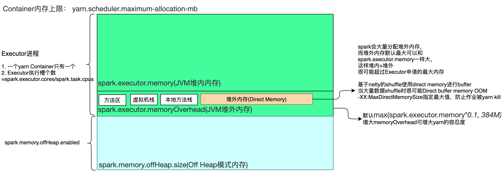

# diver内存

- 创建spark环境
- 提交spark作业
- 把作业解析为task
- 协调executor的任务调度
- sparkUI数据

# executor内存管理

## 实例创建

在SparkEnv中创建：

```scala
    // =======================创建MemoryManager==================================================================
    /**
      * 根据 spark.memory.useLegacyMode 值的不同，会创建 MemoryManager 不同子类的实例：
      * 值为 false：创建 UnifiedMemoryManager 类实例，该类为新的内存管理模块的实现
      * 值为 true：创建 StaticMemoryManager类实例，该类为1.6版本以前旧的内存管理模块的实现
      * */
val useLegacyMemoryManager = conf.getBoolean("spark.memory.useLegacyMode", false)
    val memoryManager: MemoryManager =
      if (useLegacyMemoryManager) {
        // 如果还是采用之前的方式，则使用StaticMemoryManager内存管理模型，即静态内存管理
        // 配套博客：https://blog.csdn.net/qq_21383435/article/details/78641586
        new StaticMemoryManager(conf, numUsableCores)
      } else {
        // 否则，使用最新的UnifiedMemoryManager内存管理模型，即统一内存管理模型
        UnifiedMemoryManager(conf, numUsableCores)
      }
```


## 旧内存管理(1.6之前)


1. Execution：在执行shuffle、join、sort和aggregation时，用于缓存中间数据
2. Storage：主要用于缓存数据块以提高性能，同时也用于连续不断地广播或发送大的任务结果
3. Other：这部分内存用于存储运行Spark系统本身需要加载的代码与元数据
> 三部分内存是静态的，在应用执行过程中，不会发生变化。
>
> 无论是哪个区域的内存，只要内存的使用量达到了上限，则内存中存储的数据就会被放入到硬盘中，从而清理出足够的内存空间。这样一来，由于与执行或存储相关的数据在内存中不存在，就会影响到整个系统的性能，导致I/O增长，或者重复计算

## 新内存管理

相比较于旧的内存管理，新内存管理Execution Memory和Storage Memory之间支持跨界使用。当执行内存不够时，可以借用存储内存，反之亦然。

Executor 的内存管理建立在 JVM 的内存管理之上，Spark 对 JVM 的空间（Heap+Off-heap）进行了更为详细的分配，以充分利用内存。同时，Spark 引入了Off-heap（[Spark TungSten项目](https://databricks.com/blog/2015/04/28/project-tungsten-bringing-spark-closer-to-bare-metal.html)）内存模式，使之可以直接在工作节点的系统内存中开辟空间，进一步优化了内存的使用（可以理解为是独立于JVM托管的Heap之外利用c-style的malloc从os分配到的memory。由于不再由JVM托管，通过高效的内存管理，可以避免JVM object overhead和Garbage collection的开销）

运行于Executor中的Task同时可使用JVM 和Off-heap[两种模式的内存](https://www.jianshu.com/p/10e91ace3378)。

1. JVM模式

- JVM OnHeap内存： 大小由”--executor-memory”(即 spark.executor.memory)参数指定。Executor中运行的并发任务共享JVM堆内内存。
- JVM OffHeap内存：大小由spark.executor.memoryOverhead(“spark.yarn.executor.memoryOverhead”已废弃)参数指定，**主要用于JVM自身，字符串, NIO Buffer等开销**。

2. Off-heap模式：默认情况下Off-heap模式的内存并不启用，可以通过“spark.memory.offHeap.enabled”参数开启，并由spark.memory.offHeap.size指定堆外内存的大小（占用的空间划归JVM OffHeap内存）。

   

下面对这两块区域进行详细的说明，下文介绍的内存模型全部指 Executor 端的内存模型

### 堆内内存(On-heap Memory)

默认情况下，Spark 仅仅使用了堆内内存。Executor 端的堆内内存区域大致可以分为以下四大块：

- **Execution 内存**：主要用于存放 <font color=red>Shuffle、Join、Sort、Aggregation</font> 等计算过程中的临时数据
- **Storage 内存**：主要用于存储 spark 的 cache 数据，例如RDD的缓存、unroll数据(unroll memory和storage memory本质上是同一份内存，只是在任务执行的不同阶段的不同逻辑表述形式。在partition数据的读取存储过程中，这份内存叫做unroll memory，而当成功读取存储了所有reocrd到内存中后，这份内存就改了个名字叫storage memory了)；
- **用户内存（User Memory）**：主要用于存储 RDD 转换操作所需要的数据，例如 RDD 依赖等信息。
- **预留内存（Reserved Memory）**：系统预留内存，会用来存储Spark内部对象。


1. `systemMemory = Runtime.getRuntime.maxMemory`，其实就是通过参数 `spark.executor.memory` 或 `--executor-memory` 配置的。

2. reservedMemory 在 Spark 2.2.1 中是写死的，其值等于 300MB，这个值是不能修改的（如果在测试环境下，我们可以通过 `spark.testing.reservedMemory` 参数进行修改）；

3. `usableMemory = systemMemory - reservedMemory`，这个就是 Spark 可用内存；

4. systemMemory至少是reservedMemory的1.5倍

   

### 堆外内存(Off-heap Memory)

> 注意，这并不是JVM Off-Heap Memory! 这部分内存并不属于JVM管理，而是系统内存

Spark 1.6 开始引入了Off-heap memory(详见[SPARK-11389](https://www.iteblog.com/redirect.php?url=aHR0cHM6Ly9pc3N1ZXMuYXBhY2hlLm9yZy9qaXJhL2Jyb3dzZS9TUEFSSy0xMTM4OQ==&article=true))。这种模式不在 JVM 内申请内存，而是调用 Java 的 unsafe 相关 API 进行诸如 C 语言里面的 malloc() 直接向操作系统申请内存，由于这种方式不经过 JVM 内存管理，所以可以避免频繁的 GC，这种内存申请的缺点是必须自己编写内存申请和释放的逻辑。

默认情况下，堆外内存是关闭的，我们可以通过 `spark.memory.offHeap.enabled` 参数启用，并且通过 `spark.memory.offHeap.size` 设置堆外内存大小，单位为字节。如果堆外内存被启用，那么 Executor 内将同时存在堆内和堆外内存，两者的使用互不影响，这个时候 Executor 中的 Execution 内存是堆内的 Execution 内存和堆外的 Execution 内存之和，同理，Storage 内存也一样。相比堆内内存，堆外内存只区分 Execution 内存和 Storage 内存


> 上图中的 *maxOffHeapMemory* 等于 *spark.memory.offHeap.size* 参数配置的。

### Execution 内存和 Storage 内存动态调整


Storage多占用的内存可被淘汰，但是Execution多占的内存只能等待被释放

具体的实现逻辑如下：

- 程序提交的时候我们都会设定基本的 Execution 内存和 Storage 内存区域（通过 `spark.memory.storageFraction` 参数设置）；
- 在程序运行时，如果双方的空间都不足时，则存储到硬盘；将内存中的块存储到磁盘的策略是按照 LRU 规则进行的。若己方空间不足而对方空余时，可借用对方的空间;（存储空间不足是指不足以放下一个完整的 Block）
- <font color=red>Execution 内存的空间被对方占用后，可让对方将占用的部分转存到硬盘，然后"归还"借用的空间</font>
- Storage 内存的空间被对方占用后，目前的实现是无法让对方"归还"，因为需要考虑 Shuffle 过程中的很多因素，实现起来较为复杂；而且 Shuffle 过程产生的文件在后面一定会被使用到，而 Cache 在内存的数据不一定在后面使用。

> 注意，上面说的借用对方的内存需要借用方和被借用方的内存类型都一样，都是堆内内存或者都是堆外内存，不存在堆内内存不够去借用堆外内存的空间。

1. Reserved Memory(保留内存)，系统默认值为300M，一般无需改动，不用关心此部分内存。 但如果Executor分配的内存小于 1.5 * 300 = 450M时，Executor将无法执行。
2. Storage Memory(存储内存) 
    用于存放广播数据及RDD缓存数据。由上图可知，Spark 2+中，初始状态下，Storage及Execution Memory均约占系统总内存的30%（1 * 0.6 * 0.5 = 0.3）。在UnifiedMemory管理中，这两部分内存可以相互借用，为了方便描述,我们使用storageRegionSize来表示“spark.storage.storageFraction”。当计算内存不足时，可以改造storageRegionSize中未使用部分，且StorageMemory需要存储内存时也不可被抢占； 若实际StorageMemory使用量超过storageRegionSize，那么当计算内存不足时，可以改造(StorageMemory – storageRegionSize)部分，而storageRegionSize部分不可被抢占。

> Unified Memory中，spark.shuffle.memoryFraction, spark.storage.unrollFraction等参数无需在指定。

memoryManager主要是使得execution部分和storage部分的内存不像之前由比例参数限定住，而是两者可以互相借用内存。
execution和storage总的内存上限由参数｀spark.memory.fraction（默认0.6）来设定的，这个比例是相对于整个JVM heap来说的。
Storage部分可以申请Execution部分的所有空闲内存，直到Execution内存不足时向Storage发出信号为止。当Execution需要更多内存时，Storage部分会向磁盘spill数据，直到把借用的内存都还上为止。同样的Execution部分也能向Storage部分借用内存，当Storage需要内存时，Execution中的数据不会马上spill到磁盘，因为Execution使用的内存发生在计算过程中，如果数据丢失就会导致task计算失败。Storage部分只能等待Execution部分主动释放占用的内存。

#### 申请执行内存

```
while♻️
3.1、获取当前活跃Task的数目numActiveTasks；
3.2、获取该Task对应的当前已耗费内存curMem；
3.3、maybeGrowPool为传进来的UnifiedMemoryManager的maybeGrowExecutionPool()方法，其通过收回缓存的块扩充the execution pool，从而减少the storage pool；
3.4、计算内存池的最大大小maxPoolSize；
3.5、平均每个Task分配的最大内存大小maxMemoryPerTask；
3.6、平均每个Task分配的最小内存大小minMemoryPerTask，为maxMemoryPerTask的一半；
3.7、计算我们可以赋予该Task的最大大小maxToGrant，取numBytes和（maxMemoryPerTask - curMem与0较大者）中的较小者，也就是，如果当前已耗费内存大于maxMemoryPerTask，则为0，不再分配啦，否则取还可以分配的内存和申请分配的内存中的较小者；
3.8、计算实际可以分配的最大大小toGrant，取maxToGrant和memoryFree中的较小者；
3.9、如果实际分配的内存大小toGrant小于申请分配的内存大小numBytes，且当前已耗费内存加上马上就要分配的内存，小于Task需要的最小内存，记录日志信息，lock等待，即MemoryManager等待；否则memoryForTask中对应Task的已耗费内存增加toGrant，返回申请的内存大小toGrant，跳出循环。
```

```scala
//通过驱逐缓存块来增加执行池，从而减少存储池,增大Execution部分    
def maybeGrowExecutionPool(extraMemoryNeeded: Long): Unit = {
      if (extraMemoryNeeded > 0) {
        // There is not enough free memory in the execution pool, so try to reclaim memory from
        // storage. We can reclaim any free memory from the storage pool. If the storage pool
        // has grown to become larger than `storageRegionSize`, we can evict blocks and reclaim
        // the memory that storage has borrowed from execution.
        val memoryReclaimableFromStorage = math.max( 
          storagePool.memoryFree,
          storagePool.poolSize - storageRegionSize)
        if (memoryReclaimableFromStorage > 0) {
          // Only reclaim as much space as is necessary and available: 
          val spaceToReclaim = storagePool.freeSpaceToShrinkPool(
            math.min(extraMemoryNeeded, memoryReclaimableFromStorage))
          storagePool.decrementPoolSize(spaceToReclaim) //这里就是一个减法
          executionPool.incrementPoolSize(spaceToReclaim) //加法
        }
      }
    }
//计算申请后的大小
   def computeMaxExecutionPoolSize(): Long = {
      maxMemory - math.min(storagePool.memoryUsed, storageRegionSize)
    }

// 执行内存申请
    executionPool.acquireMemory(
      numBytes, taskAttemptId, maybeGrowExecutionPool, computeMaxExecutionPoolSize)

//核心方法
 private[memory] def acquireMemory(
      numBytes: Long,
      taskAttemptId: Long,
      maybeGrowPool: Long => Unit = (additionalSpaceNeeded: Long) => Unit,
      computeMaxPoolSize: () => Long = () => poolSize): Long = lock.synchronized {
     ... ... 
    // Keep looping until we're either sure that we don't want to grant this request (because this
    // task would have more than 1 / numActiveTasks of the memory) or we have enough free
    // memory to give it (we always let each task get at least 1 / (2 * numActiveTasks)).
    // TODO: simplify this to limit each task to its own slot
    while (true) {
      // 获取当前活跃Task的数目
      val numActiveTasks = memoryForTask.keys.size
      // 获取该Task对应的当前已耗费内存
      val curMem = memoryForTask(taskAttemptId)

			//真正申请内存= 申请内存- 可用内存
      maybeGrowPool(numBytes - memoryFree)

      // 计算内存池的最大大小maxPoolSize
      val maxPoolSize = computeMaxPoolSize()

      // 平均每个Task分配的最大内存大小maxMemoryPerTask
      val maxMemoryPerTask = maxPoolSize / numActiveTasks

      // 平均每个Task分配的最小内存大小minMemoryPerTask，为maxMemoryPerTask的一半
      val minMemoryPerTask = poolSize / (2 * numActiveTasks)

      // 我们可以赋予该Task的最大大小，取numBytes和（maxMemoryPerTask - curMem与0较大者）中的较小者
      // 如果当前已耗费内存大于maxMemoryPerTask，则为0，不再分配啦，否则取还可以分配的内存和申请分配的内存中的较小者
      val maxToGrant = math.min(numBytes, math.max(0, maxMemoryPerTask - curMem))

      // Only give it as much memory as is free, which might be none if it reached 1 / numTasks
      // 实际可以分配的最大大小，取maxToGrant和memoryFree中的较小者
      val toGrant = math.min(maxToGrant, memoryFree)

      if (toGrant < numBytes && curMem + toGrant < minMemoryPerTask) {
        // 如果实际分配的内存大小toGrant小于申请分配的内存大小numBytes，且当前已耗费内存加上马上就要分配的内存，小于Task需要的最小内存
        // 记录日志信息
        logInfo(s"TID $taskAttemptId waiting for at least 1/2N of $poolName pool to be free")
        // lock等待，即MemoryManager等待
        lock.wait()
      } else {
        // 对应Task的已耗费内存增加toGrant
        memoryForTask(taskAttemptId) += toGrant
        // 返回申请的内存大小toGrant
        return toGrant
      }
    }
    0L  // Never reached
  }
```


#### 申请存储内存


### Task 之间内存管理

为了更好地使用使用内存，Executor 内运行的 Task 之间共享着 Execution 内存，因此，可能会出现这样的情况：先到达的任务可能占用较大的内存，而后到的任务因得不到足够的内存而挂起。具体的，Spark 内部维护了一个 HashMap 用于记录每个 Task 占用的内存。


源代码中申请过程是一个while循环，退出条件是申请到最小内存，循环体的逻辑大致如下：

当 Task 需要在 Execution 内存区域申请 numBytes 内存，其先判断 HashMap 里面是否维护着这个 Task 的内存使用情况，如果没有，则将这个 Task 内存使用置为0，并且以 TaskId 为 key，内存使用为 value 加入到 HashMap 里面。之后为这个 Task 申请 numBytes 内存，如果 Execution 内存区域正好有大于 numBytes 的空闲内存，则在 HashMap 里面将当前 Task 使用的内存加上 numBytes，然后返回；如果当前 Execution 内存区域无法申请到每个 Task 最小可申请的内存(也就是1/2N)，则当前 Task 被阻塞，直到有其他任务释放了足够的执行内存，该任务才可以被唤醒。每个 Task 可以使用 Execution 内存大小范围为 1/2N ~ 1/N，其中 N 为当前 Executor 内正在运行的 Task 个数。一个 Task 能够运行必须申请到最小内存为 (1/2N * Execution 内存)；当 N = 1 的时候，Task 可以使用全部的 Execution 内存。

比如如果 Execution 内存大小为 10GB，当前 Executor 内正在运行的 Task 个数为5，则该 Task 可以申请的内存范围为 10 / (2 * 5) ~ 10 / 5，也就是 1GB ~ 2GB的范围

这段逻辑可直接查看org.apache.spark.memory.ExecutionMemoryPool#acquireMemory源码

### tips

1. Spark的Executor拿到的 Eden，Survivor 和 Tenured 三部分空间，而这里面一共包含了两个 Survivor 区域，而这两个 Survivor 区域在任何时候我们只能用到其中一个
2. SparkUI上显示的Storage Memory 可用内存其实等于 Execution 内存和 Storage 内存之和
3.  Spark UI 是通过除于 1000 * 1000 * 1000 将字节转换成 GB

### 对应源码

详细请查看UnifiedMemoryManager.scala，里面有详细注释


## spark.yarn.executor.memoryOverhead” 与spark.memory.offHeap.size

> spark.yarn.executor.memoryOverhead已废弃，被spark.executor.memoryOverhead代替了

[参考](https://stackoverflow.com/questions/58666517/difference-between-spark-yarn-executor-memoryoverhead-and-spark-memory-offhea/61723456#61723456)

## spark.executor.memoryOverhead与spark.memory.offHeap.size的区别


```shell
spark.storage.memoryFraction 0.6(默认 )
spark.storage.safetyFraction 0.5(默认 )

Executor内存(GB)=
(spark.executor.memory*1024*1024*1024 - 300*1024*1024) //spark可用内存
*spark.memory.fraction         //统一内存
/1000/1000/1000
```

因为动态占用机制，UI显示的 storage memory = 执行内存 + 存储内存

[参考](https://blog.csdn.net/lquarius/article/details/106698097)

设置堆外内存的参数为spark.executor.memoryOverhead与spark.memory.offHeap.size(需要与 spark.memory.offHeap.enabled同时使用)，其中这两个都是描述堆外内存的，但是它们有什么区别么？

spark.memory.offHeap.size是spark Core(memory manager)使用的，真正作用于spark executor的堆外内存（只是只有执行内存和存储内存）。
spark.executor.memoryOverhead是资源管理器使用的，例如YARN;通知yarn我要使用堆外内存和使用内存的大小，相当于spark.memory.offHeap.size +  spark.memory.offHeap.enabled，设置参数的大小并非实际使用内存大小

spark2.4.5之前的版本，我们在设置spark.executor.memoryOverhead的时候，应该把spark.memory.offHeap.size加上，因为Yarn申请内存时没考虑spark.memory.offHeap.size：

```scala
private[yarn] val resource = Resource.newInstance(
    executorMemory + memoryOverhead + pysparkWorkerMemory,
    executorCores)
```

默认spark.executor.memoryOverhead=max(spark.executor.memory*0.1, 384M); 如果我们设置了spark.memory.offHeap.size，则应该同时设置spark.executor.memoryOverhead*

*=max(spark.executor.memory*0.1, 384M) + spark.memory.offHeap.size


但是spark3.0之后，Yarn申请资源时会把spark.memory.offHeap.size加上，我们就不必在设置spark.executor.memoryOverhead时加上spark.memory.offHeap.size了：

```scala
 executorMemory + executorOffHeapMemory + memoryOverhead + pysparkWorkerMemory
```

spark.executor.memoryOverhead官网介绍

> 每个executor分配的堆外内存，默认单位是M。 这部分内存用于如 VM overheads，interned strings, other native overheads。
>
> 可以理解为jvm本身维持运行所需要的额外内存。  通常占executor大小的6-10%，默认是executor大小的10%，且最小是384M。为JVM进程中除Java堆以外占用的空间大小，包括方法区（永久代）、Java虚拟机栈、本地方法栈、JVM进程本身所用的内存、堆外内存（Direct Memory）等

spark.memory.offHeap.enabled

默认false, true时，spark将尝试使用堆外内存

spark.memory.offHeap.size：

>  用于堆外内存分配，不影响堆内内存。 通过unsafeApi申请的系统内存，表示rdd计算执行和数据存储使用的offheap

## Direct buffer与memoryOverhead

memoryOverhead: jvm 本身维持运行所需要的的额外内存, 

Direct Buffer: NIO 使用的channel 缓冲区, 在 memoryOverHead 内存中分配direct buffer.

spark.executor.extraJavaOptions = -XX:MaxDirectMemorySize=xxxm




executor进程内存计算：
计算公式：

  val executorMem = args.executorMemory + executorMemoryOverhead
假设executor-为X（整数，单位为M）
1） 如果没有设置spark.yarn.executor.memoryOverhead,

executorMem= X+max(X*0.1,384)
2）如果设置了spark.yarn.executor.memoryOverhead（整数，单位是M）

executorMem=X +spark.yarn.executor.memoryOverhead 
需要满足的条件：

<font color=red>executorMem< yarn.scheduler.maximum-allocation-mb </font>

[spark参数调优](https://blog.csdn.net/purisuit_knowledge/article/details/94600468)

通过-XX:MaxDirectMemorySize可以指定最大的direct memory。默认如果不设置，则与最大堆内存相同。基于netty的shuffle，使用direct memory存进行buffer（spark.shuffle.io.preferDirectBufs），所以在大数据量shuffle时，堆外内存使用较多。 Direct Memory是受GC控制的，例如ByteBuffer bb = ByteBuffer.allocateDirect(1024)，这段代码的执行会在堆外占用1k的内存，Java堆内只会占用一个对象的指针引用的大小，堆外的这1k的空间只有当bb对象被回收时，才会被回收，这里会发现一个明显的不对称现象，就是堆外可能占用了很多，而堆内没占用多少，导致还没触发GC。加上-XX:MaxDirectMemorySize这个大小限制后，那么只要Direct Memory使用到达了这个大小，就会强制触发GC，这个大小如果设置的不够用，那么在日志中会看到java.lang.OutOfMemoryError: Direct buffer memory。

<font color=red>和spark.executor.memory一样，spark.memory.offHeap.size也是Spark Core要使用的(只是只有存储内存和执行内存)。</font>

如果不配置MaxDirectMemorySize，那么netty就认为executory内存就是可用的最大堆外内存。executor申请的内存未必会全用完，剩余的空间会被netty当作Direct Memory使用，所以executor的内存就被netty认为是可以申请的最大内存(不管spark已经使用多少了)，所以就会可劲儿使用。一旦使用超过Executor申请的总量，就会OOM。 我们调整Overhead是调整Yarn的容忍度，允许我超过一些。调整spark.reducer.maxSizeInFlight调整reduce task的buff缓冲区，让它少缓存点儿数据。

[Java-直接内存 DirectMemory 详解](https://cloud.tencent.com/developer/article/1586341)

[databrick的解释](https://kb.databricks.com/clusters/spark-executor-memory)

## 优化准则

- executor-memory + spark.yarn.executor.memoryOverhead是所能使用的内存的上线，如果超过此上线，就会被yarn kill掉。

- executor默认的永久代内存是64K，可以看到永久代使用率长时间为99%，通过设置spark.executor.extraJavaOptions适当增大永久代内存，例如：–conf spark.executor.extraJavaOptions=”-XX:MaxPermSize=64m”

- executor除了stdout、stderr日志，我们可以把gc日志打印出来，便于我们对jvm的内存和gc进行调试。

  ```shell
  --conf "spark.executor.extraJavaOptions=-XX:+PrintGC -XX:+PrintGCDetails -XX:+PrintGCTimeStamps -XX:+PrintGCDateStamps -XX:+PrintGCApplicationStoppedTime -XX:+PrintHeapAtGC -XX:+PrintGCApplicationConcurrentTime -Xloggc:gc.log"
  ```

  触发Full GC可以对Direct Memory进行回收，所以想办法增加Full GC次数

  1. 减少堆大小

  2. 年轻代尽快进入老年代，-XX:MaxTenuringThreshold=1

  3. CMS回收策略可以设置触发Full GC的老年代内存使用率，设置一个比较低的值

     ```shell
     -XX:+PrintGC -XX:+PrintGCDetails -XX:+PrintGCTimeStamps -XX:+PrintGCDateStamps -XX:+PrintGCApplicationStoppedTime -XX:+PrintHeapAtGC -XX:+PrintGCApplicationConcurrentTime -Xloggc:gc.log -XX:+HeapDumpOnOutOfMemoryError"
     
     每次gc.log文件会被覆盖
     ```

  ​      使用G1GC

       ```shell
       --conf "spark.executor.extraJavaOptions=-XX:+UseG1GC -XX:G1HeapRegionSize=16M -XX:+PrintGCDetails -XX:+PrintGCTimeStamps"
       ```

  

  4. 调整老年代所占比例：-XX:NewRatio
  5. 降低spark.memory.storageFraction减少用于缓存的空间

    [Spark GC调优实战](https://blog.csdn.net/vfgbv/article/details/51720344)

  ### GC调优

[Tuning Java Garbage Collection for Apache Spark Applications](https://www.databricks.com/blog/2015/05/28/tuning-java-garbage-collection-for-spark-applications.html)


## UI指标分析实例

为了更好的理解上面堆内内存和堆外内存的使用情况，这里给出一个简单的例子。

### 只用了堆内内存

现在我们提交的 Spark 作业关于内存的配置如下：

```
--executor-memory 18g
```

由于没有设置 `spark.memory.fraction` 和 `spark.memory.storageFraction` 参数，我们可以看到 Spark UI 关于 Storage Memory 的显示如下：

上图很清楚地看到 Storage Memory 的可用内存是 10.1GB，这个数是咋来的呢？根据前面的规则，我们可以得出以下的计算：

```shell
systemMemory = spark.executor.memory
reservedMemory = 300MB
usableMemory = systemMemory - reservedMemory
StorageMemory= usableMemory * spark.memory.fraction * spark.memory.storageFraction
```

如果我们把数据代进去，得出以下的结果：

```scala
systemMemory = 18Gb = 19327352832 字节
reservedMemory = 300MB = 300 * 1024 * 1024 = 314572800
usableMemory = systemMemory - reservedMemory = 19327352832 - 314572800 = 19012780032
StorageMemory= usableMemory * spark.memory.fraction * spark.memory.storageFraction
             = 19012780032 * 0.6 * 0.5 = 5703834009.6 = 5.312109375GB
```

不对啊，和上面的 10.1GB 对不上啊。为什么呢？这是因为 Spark UI 上面显示的 Storage Memory 可用内存其实等于 Execution 内存和 Storage 内存之和，也就是 *usableMemory \* spark.memory.fraction*：

```scala
StorageMemory= usableMemory * spark.memory.fraction
             = 19012780032 * 0.6 = 11407668019.2 = 10.62421GB
```

还是不对，这是因为我们虽然设置了 *--executor-memory 18g*，但是 Spark 的 Executor 端通过 *Runtime.getRuntime.maxMemory* 拿到的内存其实没这么大，只有 17179869184 字节，所以 *systemMemory = 17179869184*，然后计算的数据如下：

```scala
systemMemory = 17179869184 字节
reservedMemory = 300MB = 300 * 1024 * 1024 = 314572800
usableMemory = systemMemory - reservedMemory = 17179869184 - 314572800 = 16865296384
StorageMemory= usableMemory * spark.memory.fraction
             = 16865296384 * 0.6 = 9.42421875 GB
```

我们通过将上面的 16865296384 * 0.6 字节除于 1024 * 1024 * 1024 转换成 9.42421875 GB，和 UI 上显示的还是对不上，这是因为 Spark UI 是通过除于 1000 * 1000 * 1000 将字节转换成 GB（最新版本已经改成1204了），如下：

```scala
systemMemory = 17179869184 字节
reservedMemory = 300MB = 300 * 1024 * 1024 = 314572800
usableMemory = systemMemory - reservedMemory = 17179869184 - 314572800 = 16865296384
StorageMemory= usableMemory * spark.memory.fraction
             = 16865296384 * 0.6 字节 =  16865296384 * 0.6 / (1000 * 1000 * 1000) = 10.1GB
```

现在终于对上了。

具体将字节转换成 GB 的计算逻辑如下(core 模块下面的 */core/src/main/resources/org/apache/spark/ui/static/utils.js*)：

```scala
function formatBytes(bytes, type) {
    if (type !== 'display') return bytes;
    if (bytes == 0) return '0.0 B';
    var k = 1000;
    var dm = 1;
    var sizes = ['B', 'KB', 'MB', 'GB', 'TB', 'PB', 'EB', 'ZB', 'YB'];
    var i = Math.floor(Math.log(bytes) / Math.log(k));
    return parseFloat((bytes / Math.pow(k, i)).toFixed(dm)) + ' ' + sizes[i];
}
```

我们设置了 *--executor-memory 18g*，但是 Spark 的 Executor 端通过 *Runtime.getRuntime.maxMemory* 拿到的内存其实没这么大，只有 17179869184 字节，这个数据是怎么计算的？
*Runtime.getRuntime.maxMemory* 是程序能够使用的最大内存，其值会比实际配置的执行器内存的值小。这是因为内存分配池的堆部分分为 Eden，Survivor 和 Tenured 三部分空间，而这里面一共包含了两个 Survivor 区域，而这两个 Survivor 区域在任何时候我们只能用到其中一个，所以我们可以使用下面的公式进行描述：


```scala
ExecutorMemory = Eden + 2 * Survivor + Tenured
Runtime.getRuntime.maxMemory =  Eden + Survivor + Tenured
```

上面的 17179869184 字节可能因为你的 GC 配置不一样得到的数据不一样，但是上面的计算公式是一样的。

### 用了堆内和堆外内存

现在如果我们启用了堆外内存，情况咋样呢？我们的内存相关配置如下：

```shell
spark.executor.memory           18g
spark.memory.offHeap.enabled    true
spark.memory.offHeap.size       10737418240
```

从上面可以看出，堆外内存为 10GB，现在 Spark UI 上面显示的 Storage Memory 可用内存为 20.9GB，如下：

[](https://s.iteblog.com/pic/spark/spark_memory_usage1.png)

其实 Spark UI 上面显示的 Storage Memory 可用内存等于堆内内存和堆外内存之和，计算公式如下：

```shell
堆内
systemMemory = 17179869184 字节
reservedMemory = 300MB = 300 * 1024 * 1024 = 314572800
usableMemory = systemMemory - reservedMemory = 17179869184 - 314572800 = 16865296384
totalOnHeapStorageMemory = usableMemory * spark.memory.fraction
                         = 16865296384 * 0.6 = 10119177830
 
堆外
totalOffHeapStorageMemory = spark.memory.offHeap.size = 10737418240
 
StorageMemory = totalOnHeapStorageMemory + totalOffHeapStorageMemory
              = (10119177830 + 10737418240) 字节
              = (20856596070 / (1000 * 1000 * 1000)) GB
              = 20.9 GB
```


# MemoryStore

[内存存储MemoryStore的具体实现](https://cloud.tencent.com/developer/article/1491372?from=article.detail.1491368)


# SparkEnv

保存运行的Spark实例的所有运行时环境对象（无论是master的还是worker的），包括序列化、块管理、RpcEnv，map输出的跟踪等等。spark代码SparkEnv.get通过一个全局变量获取SparkEnv，所以所有线程可以获得同样的SparkEnv

SparkEnv会维护一堆对象

```scala
    val envInstance = new SparkEnv(
      executorId,
      rpcEnv,
      serializer,
      closureSerializer,
      serializerManager,
      mapOutputTracker,
      shuffleManager,
      broadcastManager,
      blockManager,
      securityManager,
      metricsSystem,
      memoryManager,
      outputCommitCoordinator,
      conf)
```

Driver端的SparkEnv由SparkContex创建，Executor端的由其守护进程CoarseGrainedExecutorBackend创建

## CoarseGrainedExecutorBackend

Coarse Grained：单词的意思是 粗粒度的

CoarseGrainedExecutorBackend进程主要的作用究竟是什么？ 由于CoarseGrainedExecutorBackend为一个rpc远程调用的包装， 它主要接受driver下发的task命令，完成task的实际执行

# 参考

[Spark Executor内存管理](https://www.huaweicloud.com/articles/229d728cf7b313656cddc5de2dbd75e9.html)

1. `spark.memory.fraction` 由 0.75 降至 0.6

`spark.memory.fraction` 最初版本的值是 0.75，很多分析统一内存管理这块的文章也是这么介绍的，同样的，在使用中发现这个值设置的偏高，导致了 gc 时间过长，spark 2.0 版本将其调整为 0.6

## Executor内存调优

###  Executor JVM Used Memory Heuristic

现象：配置的executor内存比实际使用的JVM最大使用内存还要大很多。

原因：这意味着 executor 内存申请过多了，实际上并不需要使用这么多内存。

解决方案：将 `spark.executor.memory` 设置为一个比较小的值。

### Executor Unified Memory Heuristic

现象：分配的统一内存 (`Unified Memory = Storage Memory + Execution Memory`) 比 executor 实际使用的统一内存大的多。

原因：这意味着不需要这么大的统一内存。

解决方案：降低 `spark.memory.fraction` 的比例。

### Executor OOM类错误 （错误代码 137、143等）

该类错误一般是由于 Heap（M2）已达上限，Task 需要更多的内存，而又得不到足够的内存而导致。因此，解决方案要从增加每个 Task 的内存使用量，满足任务需求 或 降低单个 Task 的内存消耗量，从而使现有内存可以满足任务运行需求两个角度出发。因此有如下解决方案:

<font color=red>法一：增加单个task的内存使用量</font>

- 增加最大 Heap值，即上图中 M2 的值，使每个 Task 可使用内存增加。
- <font color=red>降低 Executor 的可用 Core 的数量 N , 使 Executor 中同时运行的任务数减少，在总资源不变的情况下，使每个 Task 获得的内存相对增加。</font>当然，这会使得 Executor 的并行度下降。可以通过调高 `spark.executor.instances` 参数来申请更多的 executor 实例（或者通过 `spark.dynamicAllocation.enabled` 启动动态分配），提高job的总并行度。

<font color=red>法二： 降低单个Task的内存消耗量</font>

降低单个Task的内存消耗量可从配置方式和调整应用逻辑两个层面进行优化:

一、配置方式

减少每个 Task 处理的数据量，可降低 Task 的内存开销，在 Spark 中，每个 partition 对应一个处理任务 Task，因此，在数据总量一定的前提下，可以通过增加 partition 数量的方式来减少每个 Task 处理的数据量，从而降低 Task 的内存开销。针对不同的 Spark 应用类型，存在不同的 partition 配置参数 :

```javascript
P = spark.default.parallism (非SQL应用)
P = spark.sql.shuffle.partition (SQL 应用)
```

二、调整应用逻辑

Executor OOM 一般发生 Shuffle 阶段，该阶段需求计算内存较大，且应用逻辑对内存需求有较大影响

<font color=red>1、选择合适的算子，如 groupByKey 转换为 reduceByKey</font>

一般情况下，groupByKey 能实现的功能使用 reduceByKey 均可实现，而 ReduceByKey 存在 Map 端的合并，可以有效减少传输带宽占用及 Reduce 端内存消耗。


<font color=red>2、 避免数据倾斜</font>

### GC

观察Executors汇总信息，GC Time列如果告警，那就说明需要调优GC了。


[Spark GC调优](https://cloud.tencent.com/developer/article/1032521)

<font color=red>就是依据minor gc/mafor gc频率 调整新生代/老年代大小</font>

Spark应用程序GC调优的目标是，确保生命周期比较长的RDD保存在老年代，新生代有足够的空间保存生命周期比较短的对象。这有助于避免触发Full GC去收集task运行期间产生的临时变量。

1),通过收集垃圾回收信息，判断是否有太多的垃圾回收过程。假如full gc在一个task完成之前触发了好几次，那说明运行task的内存空间不足，需要加内存。

2),在gc的统计信息中，如果老年代接近满了，减少用于缓存的内存(通过减小spark.memory.storageFraction)
另外，可以考虑减少年轻代,可以通过减小-Xmn参数设置的值

3),如果有太多的minor gc，较少的major gc，增加Eden区内存会有帮助。

[Spark JVM调优](https://bbs.huaweicloud.com/blogs/235943)

1. 统一内存管理机制下，Storage 和 Execution是动态调整的，无需手动调节。
2. 调节Executor memoryOverhead

Executor 的堆外内存主要用于程序的共享库、Perm Space、 线程Stack和一些Memory mapping等, 或者类C方式allocate object。

有时，如果你的Spark作业处理的数据量非常大，达到几亿的数据量，此时运行 Spark 作业会时不时地报错，例如shuffle output file cannot find，executor lost，task lost，out of memory等，这可能是Executor的堆外内存不太够用，导致 Executor 在运行的过程中内存溢出。

stage 的 task 在运行的时候，可能要从一些 Executor 中去拉取 shuffle map output 文件，但是 Executor 可能已经由于内存溢出挂掉了，其关联的 BlockManager 也没有了，这就可能会报出 shuffle output file cannot find，executor lost，task lost，out of memory等错误，此时，就可以考虑调节一下Executor的堆外内存，也就可以避免报错，与此同时，堆外内存调节的比较大的时候，对于性能来讲，也会带来一定的提升。

默认情况下，Executor 堆外内存上限大概为300多MB，在实际的生产环境下，对海量数据进行处理的时候，这里都会出现问题，导致Spark作业反复崩溃，无法运行，此时就会去调节这个参数，到至少1G，甚至于2G、4G

Executor堆外内存的配置需要在spark-submit脚本里配置，

```java
--conf spark.executor.memoryOverhead=2048
```

3. 调节连接等待时长

在 Spark 作业运行过程中，Executor 优先从自己本地关联的 BlockManager 中获取某份数据，如果本地BlockManager没有的话，会通过TransferService远程连接其他节点上Executor的BlockManager来获取数据。

如果 task 在运行过程中创建大量对象或者创建的对象较大，会占用大量的内存，这会导致频繁的垃圾回收，但是垃圾回收会导致工作现场全部停止，也就是说，垃圾回收一旦执行，Spark 的 Executor 进程就会停止工作，无法提供相应，此时，由于没有响应，无法建立网络连接，会导致网络连接超时。

在生产环境下，有时会遇到file not found、file lost这类错误，在这种情况下，很有可能是Executor的BlockManager在拉取数据的时候，无法建立连接，然后超过默认的连接等待时长120s后，宣告数据拉取失败，如果反复尝试都拉取不到数据，可能会导致 Spark 作业的崩溃。这种情况也可能会导致 DAGScheduler 反复提交几次 stage，TaskScheduler 返回提交几次 task，大大延长了我们的 Spark 作业的运行时间。

此时，可以考虑调节连接的超时时长，连接等待时长需要在spark-submit脚本中进行设置

```java
--conf spark.core.connection.ack.wait.timeout=300
```

调节连接等待时长后，通常可以避免部分的XX文件拉取失败、XX文件lost等报错。

# 参考2

[](https://blog.csdn.net/pre_tender/article/details/101517789)

**堆内内存优缺点分析**
我们知道，堆内内存采用JVM来进行管理。而JVM的对象可以以序列化的方式存储，序列化的过程是将对象转换为二进制字节流，本质上可以理解为将非连续空间的链式存储转化为连续空间或块存储，在访问时则需要进行序列化的逆过程——反序列化，将字节流转化为对象，序列化的方式可以节省存储空间，但增加了存储和读取时候的计算开销。

对于Spark中序列化的对象，由于是字节流的形式，其占用的内存大小可直接计算。
对于Spark中非序列化的对象，其占用的内存是通过周期性地采样近似估算而得，即并不是每次新增的数据项都会计算一次占用的内存大小。这种方法：

1. **降低了时间开销但是有可能误差较大，导致某一时刻的实际内存有可能远远超出预期**
2. 此外，在被Spark标记为释放的对象实例，很有可能在实际上并没有被JVM回收，导致实际可用的内存小于Spark记录的可用内存。所以Spark并不能准确记录实际可用的堆内内存，从而也就无法完全避免内存溢出（OOM, Out of Memory）的异常。
   虽然不能精准控制堆内内存的申请和释放，但Spark通过对存储内存和执行内存各自独立的规划管理，可以决定是否要在存储内存里缓存新的RDD，以及是否为新的任务分配执行内存，在一定程度上可以提升内存的利用率，减少异常的出现。
