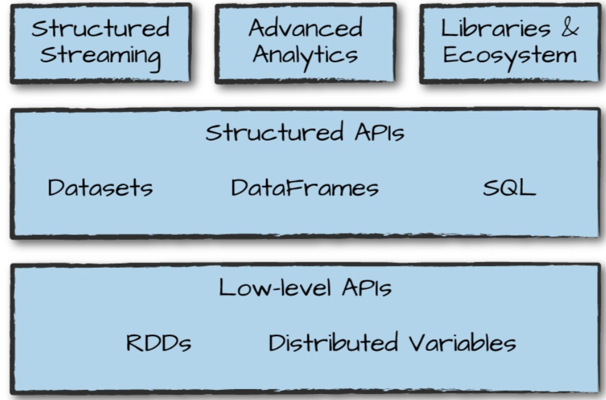

# 工具集

a

## Dataset:类型安全的结构化API

df是Row类型对象的集合，Row可以存储多种类型的扁平数据。而Dataset允许把java/scala类赋给df的records，并像对象集合一样操作df，类似ArrayList/Seq。

dataset是类型安全的，意味着适合通过接口交互变得安全。

dataset类以它内部对象的类型作为参数，例如`Dataset[Person]`只会保存Person类型的对象。spark2.0开始，支持case class。 

dataset的一大好处是可以只在需要的时候使用它。例如，我们定义了数据类型，并通过map/filter等操作，spark还是返回了df，这样就可以继续执行其他的操作。 可以在需要的时候转成dataset执行类型安全的编码以执行低阶操作，还能执行高阶sql操作

```scala
scala> case class Flight(DEST_COUNTRY_NAME:String,ORIGIN_COUNTRY_NAME:String,count:BigInt)
defined class Flight

scala> val flightsDF=spark.read.parquet("data/flight-data/parquet/2010-summary.parquet")
flightsDF: org.apache.spark.sql.DataFrame = [DEST_COUNTRY_NAME: string, ORIGIN_COUNTRY_NAME: string ... 1 more field]

scala> val flights=flightsDF.as[Flight]
flights: org.apache.spark.sql.Dataset[Flight] = [DEST_COUNTRY_NAME: string, ORIGIN_COUNTRY_NAME: string ... 1 more field]
```


另一个好处是，dataset的collect和take方法会收集dataset里确切的类型对象，而不是df的Row。

```scala
scala> flights.filter(flight_row => flight_row.ORIGIN_COUNTRY_NAME!="Canada").map(flight_row => flight_row).take(5)
res16: Array[Flight] = Array(Flight(United States,Romania,1), Flight(United States,Ireland,264), Flight(United States,India,69), Flight(Egypt,United States,24), Flight(Equatorial Guinea,United States,1))


```


