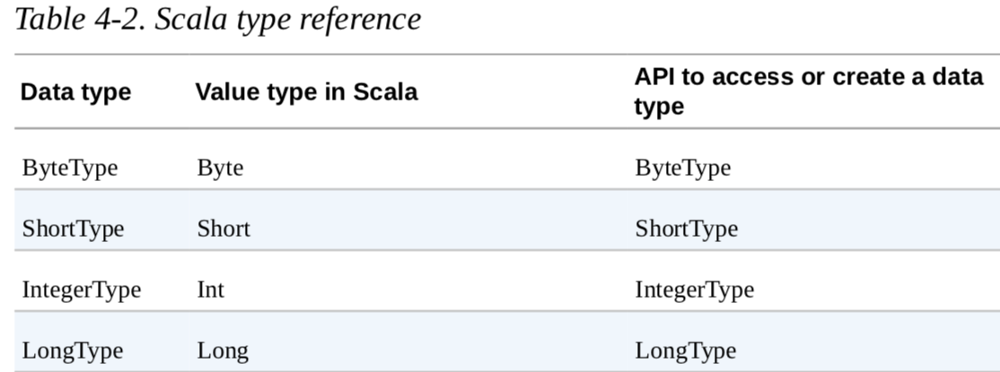
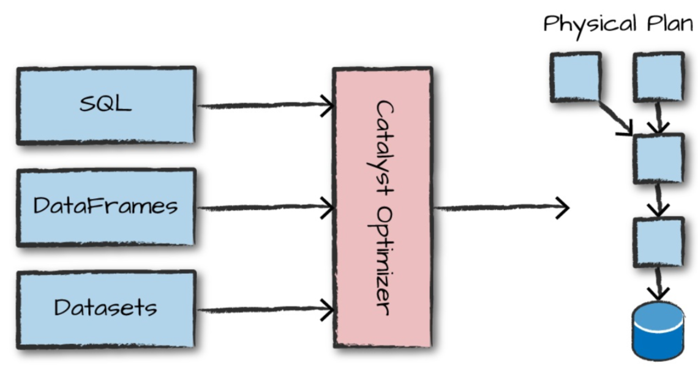
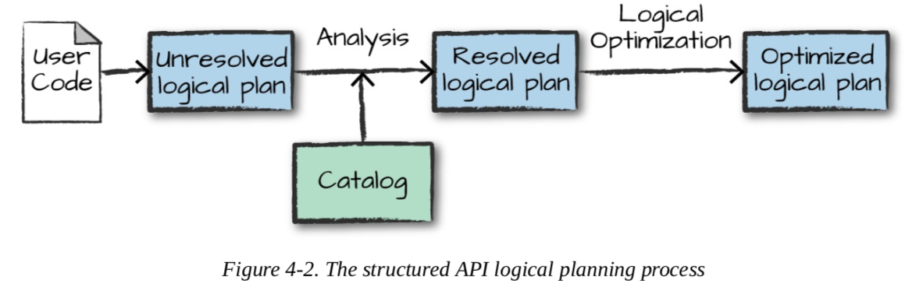
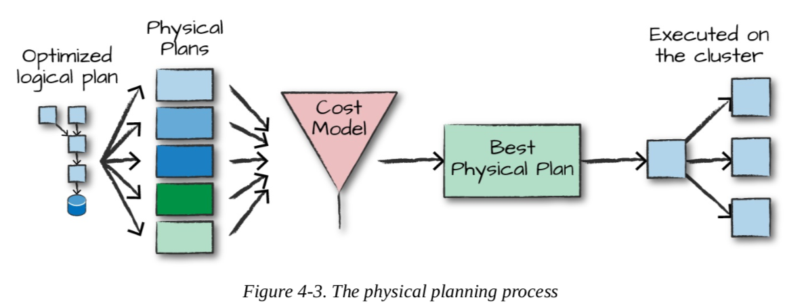

# 概览

spark结构化API是操作从非结构化的log文件到半结构化的csv文件和结构化的parquet文件的工具。主要参考三个核心类型的API

1. Datasets
2. DataFrames
3. SQL表和视图

## Dataframe 和 dataset

他们都是spark的结构化集合。

df和ds都是类似表的集合，都定义了行和列。 df和ds代表不可变的懒执行计划，它们指定了对数据所要做的操作。当执行action操作时，spark开始执行转换操作并返回结果。

## schema

schema定义了df的列名和类型，可以手动定义也可以从数据源定义。

## 结构化的spark类型

spark自身时一个高效的编程语言，内部，spark使用catalyst引擎维护spark自身的类型信息。spark类型直接映射到spark维护的不同语言的API，且在Scala、Java、python、sql和R都有一个lookup表。即使我们在python或者R中使用spark的结构化API，大多数操作都直接操作spark类型，而非python类型。例如，下面的代码不是在scala和python进行加法，事实上是在spark中进行加法：

```scala
//scala
val df=spark.range(500).toDF("number")
df.select(df.col("number")+10)

//python
df=spark.range(500).toDF("number")
df.select(df.col("number")+10)
```

Spark会把输入语言的表达式转换成其类型信息在spark的catalyst内部表示，之后将操作内部表示。

## Dataframe vs dataset

实质上，结构化API内部，有"untyped"DataFrame和"typed" Dataset。 说DF是untyped严格来说是不准确的，df有类型，但是spark只是在运行时才检查这些类型是否匹配指定的schema。 dataset只在基于jvm的语言可用，通常通过case class和java bean指定类型。

对于spark而言，df就是Row类型的ds。 Row类型是计算优化的内存格式的spark内部表示。这个格式高度定制和优化计算是因为，如果使用jvm类型，会导致大量gc和对象实例化开销，spark可以操作内部格式而不用考虑这些开销。

## columns

columns代表integer/string/复杂类型array/map/null 。

## Row

df的每个记录都是Row类型

## Spark Types

之前提到spark有大量内部类型表示，如何实例化/声明一个指定类型的列？

scala类型

```scala
import org.apache.spark.sql.types._
val b=ByteType	
```

java 类型，应该使用如下包中的工场方法

```java
import org.apache.spark.sql.types.DataTypes;
ByteType x = DataTypes.ByteType;	
```

类型参考可以查看书本，如下：



## 结构化API的执行

大致步骤：

1. 编写df/ds/sql代码
2. spark把代码转为逻辑计划
3. 把逻辑计划转为物理计划，检查优化
4. 执行物理计划(RDD操作)

代码经过catalyst优化器，它决定代码如何执行并列出一个计划



### 逻辑计划



逻辑计划只代表一个抽象transformation的集合，仅仅把用户的表达式集合转成最优化的版本，这通过把用户代码转成unresolved逻辑计划完成。说它是unresolved是因为尽管代码是合法的，但是它引用的表、列可能不存在。spark在解析器(analyzer)里使用catalog解析表和列，catalog是所有表和dataframe信息的仓库。如果表/列不存在，解析器会拒绝unresolved逻辑计划。如果解析器可以解析它，解析结果将传给Catalyst优化器，实际上是一些规则集合，通过谓词下推或者selections优化逻辑计划。可以定制自己的优化规则

### 物理计划

物理计划通常称为spark计划，通过生成不同的物理执行策略并比较它们开销模型下的开销指定逻辑计划的执行方式。



物理计划的结果是一系列RDD和transformation， 这也是为什么spark也被称为编译器的原因： 它自动把df/ds/sql中的查询编译成RDD转换。

选择一个物理计划，spark在RDD(低阶编程接口)上执行这些代码。spark在运行时会执行更多优化，生成原生Java字节码。


