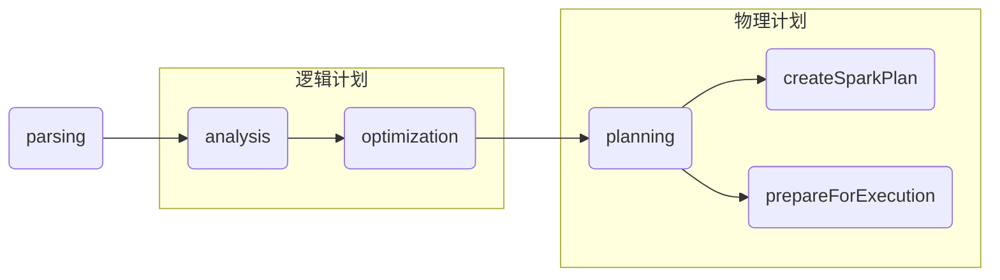
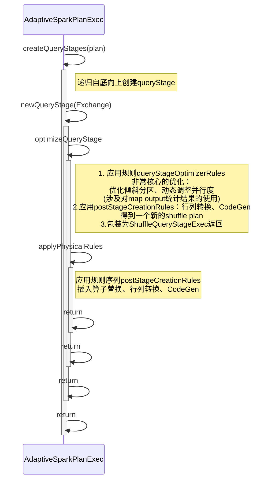
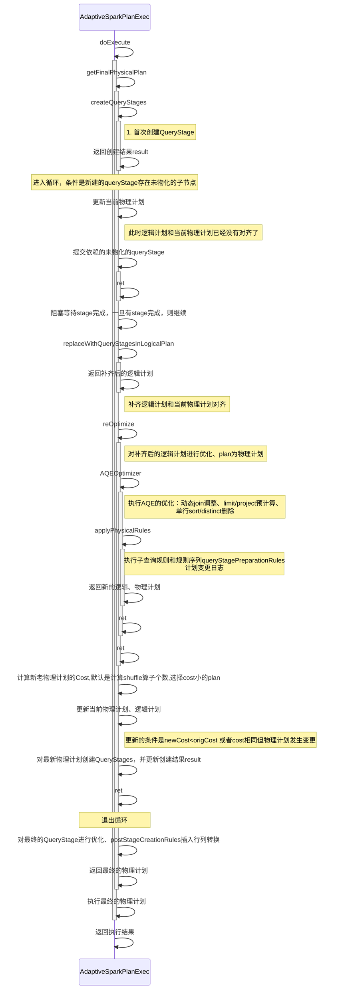

# 案例

```sql
select ss_sold_date_sk, avg(ss_sales_price) from  ds1g.store_sales group by ss_sold_date_sk order by avg(ss_sales_price)
```

计划树

```scala
== Parsed Logical Plan ==
'Sort ['avg('ss_sales_price) ASC NULLS FIRST], true
+- 'Aggregate ['ss_sold_date_sk], ['ss_sold_date_sk, unresolvedalias('avg('ss_sales_price), None)]
   +- 'UnresolvedRelation [ds1g, store_sales], [], false

== Analyzed Logical Plan ==
ss_sold_date_sk: int, avg(ss_sales_price): decimal(11,6)
Sort [avg(ss_sales_price)#24 ASC NULLS FIRST], true
+- Aggregate [ss_sold_date_sk#0], [ss_sold_date_sk#0, avg(ss_sales_price#13) AS avg(ss_sales_price)#24]
   +- SubqueryAlias spark_catalog.ds1g.store_sales
      +- Relation ds1g.store_sales[ss_sold_date_sk#0,ss_sold_time_sk#1,ss_item_sk#2,ss_customer_sk#3,ss_cdemo_sk#4,ss_hdemo_sk#5,ss_addr_sk#6,ss_store_sk#7,ss_promo_sk#8,ss_ticket_number#9,ss_quantity#10,ss_wholesale_cost#11,ss_list_price#12,ss_sales_price#13,ss_ext_discount_amt#14,ss_ext_sales_price#15,ss_ext_wholesale_cost#16,ss_ext_list_price#17,ss_ext_tax#18,ss_coupon_amt#19,ss_net_paid#20,ss_net_paid_inc_tax#21,ss_net_profit#22] parquet

== Optimized Logical Plan ==
Sort [avg(ss_sales_price)#24 ASC NULLS FIRST], true
+- Aggregate [ss_sold_date_sk#0], [ss_sold_date_sk#0, cast((avg(UnscaledValue(ss_sales_price#13)) / 100.0) as decimal(11,6)) AS avg(ss_sales_price)#24]
   +- Project [ss_sold_date_sk#0, ss_sales_price#13]
      +- Relation ds1g.store_sales[ss_sold_date_sk#0,ss_sold_time_sk#1,ss_item_sk#2,ss_customer_sk#3,ss_cdemo_sk#4,ss_hdemo_sk#5,ss_addr_sk#6,ss_store_sk#7,ss_promo_sk#8,ss_ticket_number#9,ss_quantity#10,ss_wholesale_cost#11,ss_list_price#12,ss_sales_price#13,ss_ext_discount_amt#14,ss_ext_sales_price#15,ss_ext_wholesale_cost#16,ss_ext_list_price#17,ss_ext_tax#18,ss_coupon_amt#19,ss_net_paid#20,ss_net_paid_inc_tax#21,ss_net_profit#22] parquet

== Physical Plan ==
AdaptiveSparkPlan isFinalPlan=true
+- == Final Plan ==
   *(3) Sort [avg(ss_sales_price)#24 ASC NULLS FIRST], true, 0
   +- AQEShuffleRead coalesced
      +- ShuffleQueryStage 1
         +- Exchange rangepartitioning(avg(ss_sales_price)#24 ASC NULLS FIRST, 200), ENSURE_REQUIREMENTS, [id=#64]
            +- *(2) HashAggregate(keys=[ss_sold_date_sk#0], functions=[avg(UnscaledValue(ss_sales_price#13))], output=[ss_sold_date_sk#0, avg(ss_sales_price)#24])
               +- AQEShuffleRead coalesced
                  +- ShuffleQueryStage 0
                     +- Exchange hashpartitioning(ss_sold_date_sk#0, 200), ENSURE_REQUIREMENTS, [id=#36]
                        +- *(1) HashAggregate(keys=[ss_sold_date_sk#0], functions=[partial_avg(UnscaledValue(ss_sales_price#13))], output=[ss_sold_date_sk#0, sum#53, count#54L])
                           +- *(1) ColumnarToRow
                              +- FileScan parquet ds1g.store_sales[ss_sold_date_sk#0,ss_sales_price#13] Batched: true, DataFilters: [], Format: Parquet, Location: InMemoryFileIndex(1 paths)[hdfs://master:9000/user/hive/warehouse/ds1g.db/store_sales], PartitionFilters: [], PushedFilters: [], ReadSchema: struct<ss_sold_date_sk:int,ss_sales_price:decimal(7,2)>
+- == Initial Plan ==
   Sort [avg(ss_sales_price)#24 ASC NULLS FIRST], true, 0
   +- Exchange rangepartitioning(avg(ss_sales_price)#24 ASC NULLS FIRST, 200), ENSURE_REQUIREMENTS, [id=#18]
      +- HashAggregate(keys=[ss_sold_date_sk#0], functions=[avg(UnscaledValue(ss_sales_price#13))], output=[ss_sold_date_sk#0, avg(ss_sales_price)#24])
         +- Exchange hashpartitioning(ss_sold_date_sk#0, 200), ENSURE_REQUIREMENTS, [id=#15]
            +- HashAggregate(keys=[ss_sold_date_sk#0], functions=[partial_avg(UnscaledValue(ss_sales_price#13))], output=[ss_sold_date_sk#0, sum#53, count#54L])
               +- FileScan parquet ds1g.store_sales[ss_sold_date_sk#0,ss_sales_price#13] Batched: true, DataFilters: [], Format: Parquet, Location: InMemoryFileIndex(1 paths)[hdfs://master:9000/user/hive/warehouse/ds1g.db/store_sales], PartitionFilters: [], PushedFilters: [], ReadSchema: struct<ss_sold_date_sk:int,ss_sales_price:decimal(7,2)>


```


# 大体流程

一共四个阶段：

- parsing:   解析获得语法树
- analysis:   产生逻辑计划
- optimization：优化逻辑计划
- planning ：包含了两步

1. QueryExection.createSparkPlan  产生物理计划
2. QueryExection.prepareForExecution 对物理计划插入shuffle算子和行列转换算子、AQE算子、全代码生成算子

   > 插件在这里第一次拿到完整的计划树，这个计划树已经插入了AdaptiveExecutionExec算子




## 创建QueryStage

### 递归过程

自下而上递归创建并插入ShuffleQueryStage，创建过程有两个条件：

1. 遇到Exchange算子
2. 子stage已经完成物化

> 这个过程类似DAG的stage的创建，从根节点向下递归查找符合条件的plan，一旦符合就开始创建QueryStage

### 实际创建过程




## 全流程



## 统计信息的收集

1. metrics传播机制
2. CBO用到的统计信息
3. AQE用到的统计信息
   Spark MapOutputTracker 

## reOptimze(logicalPlan)

1. 清空当前逻辑计划的stats缓存

2. 执行AQEOptimizer

   ```scala
       Batch("Propagate Empty Relations", fixedPoint,
         AQEPropagateEmptyRelation,
         ConvertToLocalRelation,
         UpdateAttributeNullability),
       Batch("Dynamic Join Selection", Once, DynamicJoinSelection),
       Batch("Eliminate Limits", fixedPoint, EliminateLimits),
       Batch("Optimize One Row Plan", fixedPoint, OptimizeOneRowPlan)) :+
       Batch("User Provided Runtime Optimizers", fixedPoint, extendedRuntimeOptimizerRules: _*)
   ```

   这一批规则非常重要，涉及从MapOutputStatistics获取数据帮助调整Join策略

3. 执行规则批preprocessingRules ++ queryStagePreparationRules

   preprocessingRules

   对子查询表达式的重用规则，这里涉及到表达式模式，没看明白怎么实现的

   queryStagePreparationRules

   ```scala
       val ensureRequirements =
         EnsureRequirements(requiredDistribution.isDefined, requiredDistribution)
       Seq(
         RemoveRedundantProjects,
         ensureRequirements,
         ReplaceHashWithSortAgg,
         RemoveRedundantSorts,
         DisableUnnecessaryBucketedScan,
         OptimizeSkewedJoin(ensureRequirements)
       ) ++ context.session.sessionState.adaptiveRulesHolder.queryStagePrepRules
   ```

   

