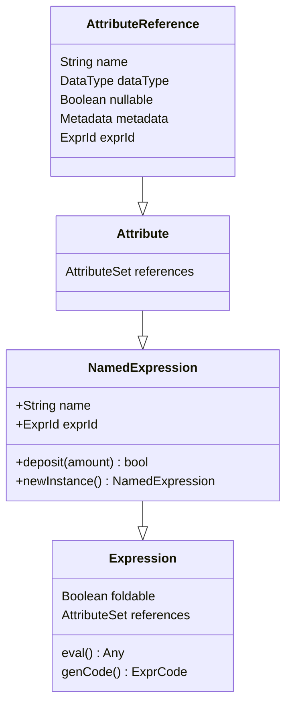

NamedExpression 全局唯一的一个ID，用于识别后续计算引用的是relation输出的哪个attribute

```scala
case class ExprId(id: Long, jvmId: UUID) {

  override def equals(other: Any): Boolean = other match {
    case ExprId(id, jvmId) => this.id == id && this.jvmId == jvmId
    case _ => false
  }

  override def hashCode(): Int = id.hashCode()

}
```

其他算子产出的attribute的一个引用

```scala
case class AttributeReference(
    name: String,
    dataType: DataType,
    nullable: Boolean = true,
    override val metadata: Metadata = Metadata.empty)(
    val exprId: ExprId = NamedExpression.newExprId,
    val qualifier: Seq[String] = Seq.empty[String])
  extends Attribute with Unevaluable
abstract class Attribute extends LeafExpression with NamedExpression
trait NamedExpression extends Expression 
```




