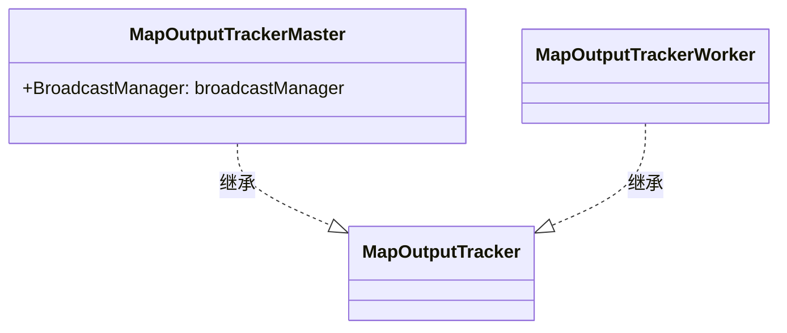
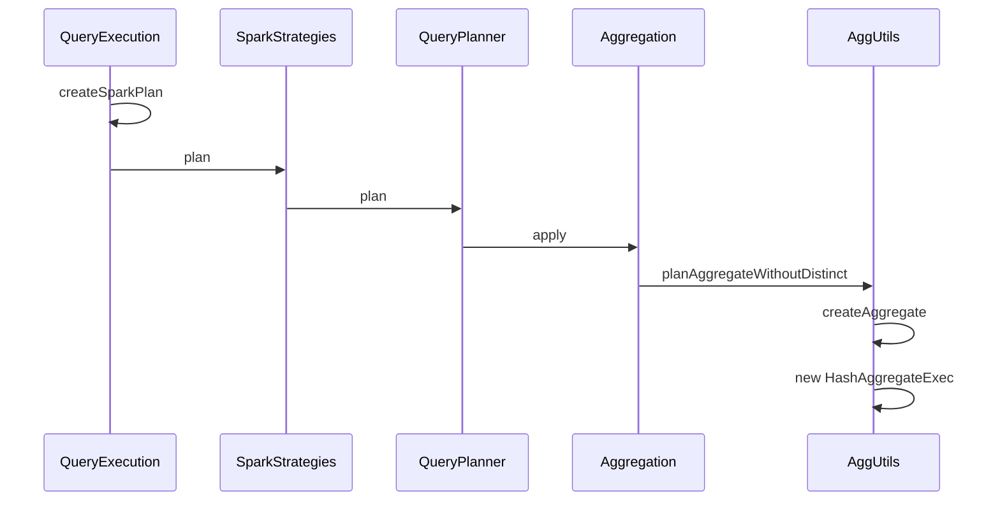
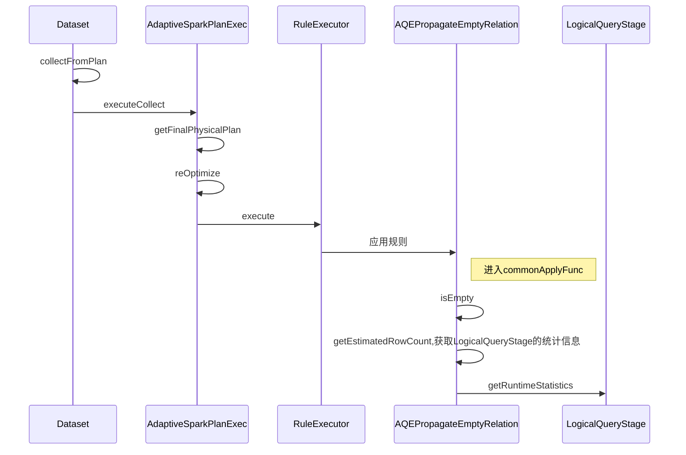

# Statistics

[参考](http://www.fanyilun.me/2022/08/02/%E5%85%B3%E4%BA%8ESpark%E5%92%8CHive%E7%9A%84statistics/)

## 简介

统计估计，默认是子节点的乘积。

```scala
case class Statistics(
    sizeInBytes: BigInt, // 叶子节点默认为1 否则是子节点的乘积
    rowCount: Option[BigInt] = None,
    attributeStats: AttributeMap[ColumnStat] = AttributeMap(Nil),
    isRuntime: Boolean = false//是否是从aqe期间的query stage运行时统计数据
)
```


## Statistics的用途

首先在SparkSQL逻辑阶段中，统计信息一般被记录在Statistics类中，最初它只计算了逻辑计划的物理大小。现在它还可以估计的行数、列统计信息等。

统计信息在Spark中各处被使用，我们可以在以下这些地方找到：

1. Join策略的选择上，使用统计信息来确定Spark SQL Join的策略。它通过检查统计信息来校验表是否可广播，或者在Shuffle Hash Join的情况下物理计划的大小是否满足指定的阈值等。
2. 星型表的检测，在星型模式中，区分事实表和维度表需要依赖事实表大于维度表的规则。这时基于统计信息（估计了行数和列数（空值和不同值的数量）统计信息）来判断表的类型。
3. full outer join和limit一起使用的情况，这时会使用统计信息比较两边的大小并限制join查询的left side或right side。

```scala
case class Statistics(
    sizeInBytes: BigInt,
    rowCount: Option[BigInt] = None,
    attributeStats: AttributeMap[ColumnStat] = AttributeMap(Nil)) {
```

- sizeInBytes: 物理大小（以字节为单位），对于叶子运算符此值默认为1， 非叶子运算符为child节点的sizeInBytes乘积。
- rowCount：估计的行数
- attributeStats：列属性统计信息

从Statistics类定义可以看出，统计信息主要包含三个字段sizeInBytes、rowCount和attributeStats。统计信息首先会由叶节点计算，每个叶节点会以某种方式来计算统计信息。然后他们通过某些rules应用遍历到plan树上。

那么叶节点如何计算统计信息以及传播是如何工作的呢？

## **如何计算统计数据**

[参考](https://blog.csdn.net/monkeyboy_tech/article/details/115871919?spm=1001.2101.3001.6650.3&utm_medium=distribute.pc_relevant.none-task-blog-2%7Edefault%7ECTRLIST%7ERate-3-115871919-blog-124227293.235%5Ev38%5Epc_relevant_sort&depth_1-utm_source=distribute.pc_relevant.none-task-blog-2%7Edefault%7ECTRLIST%7ERate-3-115871919-blog-124227293.235%5Ev38%5Epc_relevant_sort&utm_relevant_index=6)

叶节点可以通过以下三种方式来计算统计信息。

1. 从元存储中获取统计信息，这种方式是最好的方式
2. Spark 将使用*InMemoryFileIndex*，通过调用 Hadoop API 来收集数据源中每个文件的大小并将其相加得到总*sizeInBytes*。
3. Spark 将使用*spark.sql.defaultSizeInBytes*配置作为的*sizeInBytes*指标的默认值，该默认值为 8 EiB。


上面的图很好的总结了Spark在计算统计信息时采取的策略方法。

叶子将会代表统计信息将会计算的实际方式

假如test.table01是一个Hive表，它是属于CatalogTable的（其中T表示true, F代表False）。另外我们没有开启CBO, 同时之前也没进行Analyze Table分析。此外test.table01是一个分区表，所以最终将使用*spark.sql.defaultSizeInBytes*配置作为的*sizeInBytes*指标的默认值(红色箭头所示选择过程)。

### DetermineTableStats

下面我们再从代码层面进行分析, 这里还是以Hive表为例：

当我们执行SparkSQL查询Hive表时，会先通过Catalyst将SQL转换为plan树，然后通过应用rule将其从未解析的逻辑计划转换为解析的逻辑计划。在扫描解析Hive表relation时，主要应用的有ResolveRelations和FindDataSourceTable规则。表统计信息的确定是在DetermineTableStats规则中，下面先来看下DetermineTableStats规则是如何实现的。

```scala
class DetermineTableStats(session: SparkSession) extends Rule[LogicalPlan] {
    override def apply(plan: LogicalPlan): LogicalPlan = plan resolveOperators {
    //如果是Hive表
    case relation: HiveTableRelation
      if DDLUtils.isHiveTable(relation.tableMeta) && relation.tableMeta.stats.isEmpty =>
      hiveTableWithStats(relation)

    // handles InsertIntoStatement specially as the table in InsertIntoStatement is not added in its
    // children, hence not matched directly by previous HiveTableRelation case.
    case i @ InsertIntoStatement(relation: HiveTableRelation, _, _, _, _, _)
      if DDLUtils.isHiveTable(relation.tableMeta) && relation.tableMeta.stats.isEmpty =>
      i.copy(table = hiveTableWithStats(relation))
  }
  private def hiveTableWithStats(relation: HiveTableRelation): HiveTableRelation = {
    val table = relation.tableMeta
    val partitionCols = relation.partitionCols
    val conf = session.sessionState.conf
    // For partitioned tables, the partition directory may be outside of the table directory.
    // Which is expensive to get table size. Please see how we implemented it in the AnalyzeTable.
    // [1] 如果开启了fallBackToHdfsForStats，同时是非分区表，则通过调用Hadoop API进行统计信息
    val sizeInBytes = if (conf.fallBackToHdfsForStatsEnabled && partitionCols.isEmpty) {
      try {
        val hadoopConf = session.sessionState.newHadoopConf()
        val tablePath = new Path(table.location)
        val fs: FileSystem = tablePath.getFileSystem(hadoopConf)
        fs.getContentSummary(tablePath).getLength
      } catch {
        case e: IOException =>
          logWarning("Failed to get table size from HDFS.", e)
          conf.defaultSizeInBytes
      }
     // [2] 否则则采用conf.defaultSizeInBytes
    } else {
      conf.defaultSizeInBytes
    }

    val stats = Some(Statistics(sizeInBytes = BigInt(sizeInBytes)))
    relation.copy(tableStats = stats)
  }
```

- [1] 如果开启了fallBackToHdfsForStats，同时是非分区表，则通过调用Hadoop API进行统计信息
- [2] 否则则采用conf.defaultSizeInBytes

所以说在查询plan中对于分区的Hive表默认使用的表大小为 Long.MaxValue，它是大于spark.sql.autoBroadcastJoinThreshold，这里的策略是比较保守的。也就是说，默认情况下，Join策略选择规则不会选择其作为broadcast Table，除非它可以确定表的尺寸足够小。

这也就是为什么在开头创建的Hive表在进行Join时，并不会如我们所想的选择BHJ。

### LogicalPlanStats(统计信息传播)

SparkSQL使用访问者模式和mixin来在逻辑计划阶段实现统计信息的传播，要实现统计信息的传播就需要实现LogicalPlanStats接口，这样就可以直接在逻辑计划中通过stats来获取当前节点的统计信息。

```scala
trait LogicalPlanStats { self: LogicalPlan =>

  def stats: Statistics = statsCache.getOrElse {
    if (conf.cboEnabled) {
      statsCache = Option(BasicStatsPlanVisitor.visit(self))
    } else {
      statsCache = Option(SizeInBytesOnlyStatsPlanVisitor.visit(self))
    }
    statsCache.get
  }
```

stats方法用来计算statistics,如果开启了cbo,则用BasicStatsPlanVisitor的visit，否则调用SizeInBytesOnlyStatsPlanVisitor的visit方法。

#### SizeInBytesOnlyStatsPlanVisitor

我们来看下SizeInBytesOnlyStatsPlanVisitor方法，在其中有每个UnaryNode统计信息计算的*通用*方法：

```scala
object SizeInBytesOnlyStatsPlanVisitor extends LogicalPlanVisitor[Statistics] {

  private def visitUnaryNode(p: UnaryNode): Statistics = {
    // There should be some overhead in Row object, the size should not be zero when there is
    // no columns, this help to prevent divide-by-zero error.
    val childRowSize = EstimationUtils.getSizePerRow(p.child.output)
    val outputRowSize = EstimationUtils.getSizePerRow(p.output)
    // 假设当前算子不改变行数，那么当前算子的输出大小就是行数*当前算子输出的每行的大小
    var sizeInBytes = (p.child.stats.sizeInBytes * outputRowSize) / childRowSize
    if (sizeInBytes == 0) {
      // sizeInBytes can't be zero, or sizeInBytes of BinaryNode will also be zero
      // (product of children).
      sizeInBytes = 1
    }

    // Don't propagate rowCount and attributeStats, since they are not estimated here.
    Statistics(sizeInBytes = sizeInBytes)
  }
```

可以看出获取当前运算符的sizeInBytes非常简单且粗略，公式是(childPhysicalSize*outputRowSize)/childRowSize，它是基于child plan和输出行的大小。现在我们再展开getSizePerRow方法，看下RowSize是如何计算的：

```scala
def getSizePerRow(
    attributes: Seq[Attribute],
    attrStats: AttributeMap[ColumnStat] = AttributeMap(Nil)): BigInt = {
  // We assign a generic overhead for a Row object, the actual overhead is different for different
  // Row format.
  8 + attributes.map { attr =>
    if (attrStats.get(attr).map(_.avgLen.isDefined).getOrElse(false)) {
      attr.dataType match {
        case StringType =>
          // string 类型的大小为 8 + 8 + 4 = 20
          // UTF8String: base + offset + numBytes
          attrStats(attr).avgLen.get + 8 + 4
        case _ =>
          attrStats(attr).avgLen.get
      }
    } else {
      attr.dataType.defaultSize
    }
  }.sum
}
```

getSizePerRow的主要作用是给定逻辑计划返回的一行的大小，在获取行大小的开销为8（用于避免除以 0）。再加上各个数据类型的大小。举个例子，结果集由 2 列 (IntType, StringType) 组成，其中IntType分别为 4 和 StringType类型为20，再加上获取行的开销8。则每行的大小为 32 (4 + 20 + 8)。

但并非所有的所有的plan节点都是这么计算，一些特定的plan节点可能会*覆盖*这个结果。在SizeInBytesOnlyStatsPlanVisitor类（没有开启CBO）中，除了visitUnaryNode方法外。还有些特定方法，如visitFilter，visitProject，visitJoin等。

下面我们先来看下visitFilter, visitProject, visitJoin的实现。

```scala
override def visitFilter(p: Filter): Statistics = visitUnaryNode(p)

override def visitProject(p: Project): Statistics = visitUnaryNode(p)

 override def visitJoin(p: Join): Statistics = {
    p.joinType match {
      case LeftAnti | LeftSemi =>
        // LeftSemi and LeftAnti won't ever be bigger than left
        p.left.stats
      case _ =>
        default(p)
    }
  }
```

在没有开启CBO的情况下，各种运算符上调整Statistics的规则是非常基本和简单的。例如，*Filter*运算符根本不调整值，而Join也只是在LeftAnti或LeftSemi的情况下采用左表的stats作为join后的统计估值。

#### BasicStatsPlanVisitor

我们在来看下在开启CBO的情况下Filter算子统计估值：

```scala
object BasicStatsPlanVisitor extends LogicalPlanVisitor[Statistics] {
  override def visitFilter(p: Filter): Statistics = {
    FilterEstimation(p).estimate.getOrElse(fallback(p))
  }
```

在visitFilter中调用了FilterEstimation.estimate的方法，下面我们展开看看。

> Filter逻辑计划节点计算一个Statistics,计算filter过滤的百分比，用于计算行数、大小、以及给定谓词下推应用后更新Statistics

```scala
def estimate: Option[Statistics] = {
  if (childStats.rowCount.isEmpty) return None

  // Estimate selectivity of this filter predicate, and update column stats if needed.
  // For not-supported condition, set filter selectivity to a conservative estimate 100%
  val filterSelectivity = calculateFilterSelectivity(plan.condition).getOrElse(1.0)

  val filteredRowCount: BigInt = ceil(BigDecimal(childStats.rowCount.get) * filterSelectivity)
  val newColStats = if (filteredRowCount == 0) {
    // The output is empty, we don't need to keep column stats.
    AttributeMap[ColumnStat](Nil)
  } else {
    colStatsMap.outputColumnStats(rowsBeforeFilter = childStats.rowCount.get,
      rowsAfterFilter = filteredRowCount)
  }
  val filteredSizeInBytes: BigInt = getOutputSize(plan.output, filteredRowCount, newColStats)

  Some(childStats.copy(sizeInBytes = filteredSizeInBytes, rowCount = Some(filteredRowCount),
    attributeStats = newColStats))
}
```

可见，在开启CBO后，Spark可以利用Metastore中的统计信息。如果我们还提供列级指标，Spark可以通过calculateFilterSelectivity返回在Filter节点中满足条件的行的百分比，它会区分单一和复合条件根据列统计信息更新统计信息。

在开启CBO的情况下，计算*sizeInBytes*会首先根据每一列的数据类型信息计算单行的大小，然后乘以*rowCount*得到最终的*sizeInBytes*。如果*rowCount*为零，则将*sizeInBytes*设置为 1 以避免在其他一些统计信息计算中除以零。

那么如何查看逻辑计划Plan中的sizeInBytes统计信息呢，可以通过explain查看其逻辑计划来查看：


## **CBO是如何使用统计信息的**

Cost-based optimizer(CBO)基于数据表的统计信息（如表大小、数据列分布）来选择优化策略。CBO 支持的统计信息很丰富，比如数据表的行数、每列的基数（Cardinality）、空值数、最大值、最小值和直方图等等。

在CBO中使用统计信息主要是在*joinReorder* Rule中，使用这个Rule， Spark可以更加精准的选择Join策略，避免在小表join的情况下仍然使用SMJ。

<font color=red>但此规则默认是关闭的</font>，使用前需要打开如下配置：

```sql
spark.sql.cbo.enabled=true //默认false, 使用前需要确保相关表和列的统计信息已经生成
spark.sql.cbo.joinReorder.enabled=true//默认false,自动调整连续join的顺序，也需要统计信息
spark.sql.cbo.planStats.enabled=true
逻辑计划从catalog获取行数和列统计
```


此外CBO规则的优化依赖于表的统计信息，需要在执行SQL前先运行Analysis Table语句收集统计信息，而各类信息的收集会消耗大量时间：

```sql
生成表级别的统计
ANALYZE TABLE 表名 COMPUTE STATISTICS;
生成字段级别的统计
ANALYZE TABLE 表名 COMPUTE STATISTICS FOR COLUMNS col_name1,col2,col3
查看列统计信息
DESCRIBE EXTENDED 表名 column_name
```

生成后的结果保存在元数据库的table_param表里

CBO 仅支持注册到 Hive Metastore 的数据表，但在大量的应用场景中，数据源往往是存储在分布式文件系统的各类文件，如 Parquet、ORC、CSV 等等。此外，如果在运行时数据分布发生动态变化，CBO 先前制定的执行计划并不会跟着调整、适配。

## **AQE是如何使用统计信息的**

在Adaptive Query Execution ( *AQE* )中，以更加高级的方式使用统计信息。如果启用了*AQE*，则在运行时执行每个阶段后利用落盘的数据重新计算统计信息。

下面我们来简单分析下AQE中如何获取MapStage运行时的统计信息：

```sql
// ShuffleExchangeExec
override def runtimeStatistics: Statistics = {
  val dataSize = metrics("dataSize").value
  val rowCount = metrics(SQLShuffleWriteMetricsReporter.SHUFFLE_RECORDS_WRITTEN).value
  Statistics(dataSize, Some(rowCount))
}
```

运行时的统计信息主要依赖于Spark的metrics进行统计收集, 例如在ShuffleExchangeExec中通过runtimeStatistics从metrics获取数据的统计信息。

```sql
def computeStats(): Option[Statistics] = resultOption.map { _ =>
  // Metrics `dataSize` are available in both `ShuffleExchangeExec` and `BroadcastExchangeExec`.
  val exchange = plan match {
    case r: ReusedExchangeExec => r.child
    case e: Exchange => e
    case _ => throw new IllegalStateException("wrong plan for query stage:\\n " + plan.treeString)
  }
  Statistics(sizeInBytes = exchange.metrics("dataSize").value)
}
```

在query stage执行中，通过metrics("dataSize")更新计算其sizeInBytes。

总结下，本篇文章的知识点：

1. Spark中的统计信息首先会由叶节点计算，然后在逻辑计划阶段传播应用到plan树中。

2. 叶节点的统计信息可以通过以下三种方式来估计：

3. 1. 从元存储中获取统计信息
   2. Spark 将使用*InMemoryFileIndex*，通过调用 Hadoop API 来收集数据源中每个文件的大小并将其相加得到总*sizeInBytes*。
   3. Spark 将使用*spark.sql.defaultSizeInBytes*配置作为的*sizeInBytes*指标的默认值，该默认值为 8 EiB。

4. 使用访问者模式和mixin来在逻辑计划阶段实现统计信息的传播，要实现统计信息的传播就需要实现LogicalPlanStats接口。

5. Spark默认的plan运算符的sizeInBytes非常简单且粗略, Filter和Project运算符根本不调整值。

6. 使用CBO可以根据先前运行Analysis Table语句收集统计信息（各类信息的收集会消耗大量时间）获取更加精准的sizeInBytes。

7. 使用AQE主要是基于QueryStage阶段落盘的数据信息，在运行时重新计算统计信息，动态的更新逻辑计划和物理计划。

# MapOutput获取

参考MapOutputTracker的getStatistics方法




# 流程




## 获取runtimeStatistic



