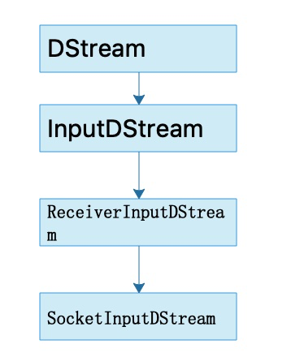
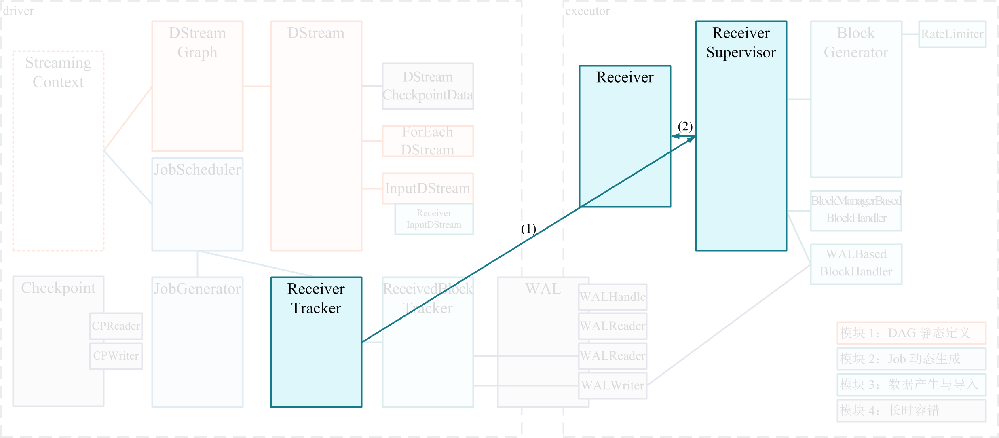
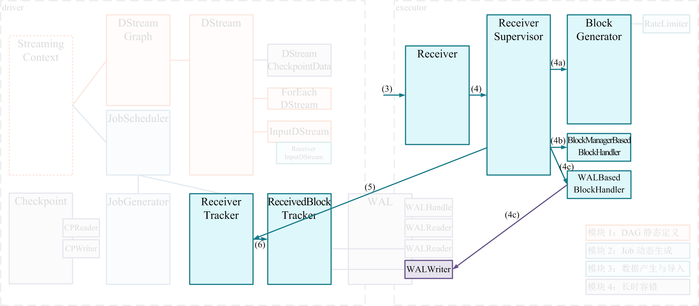
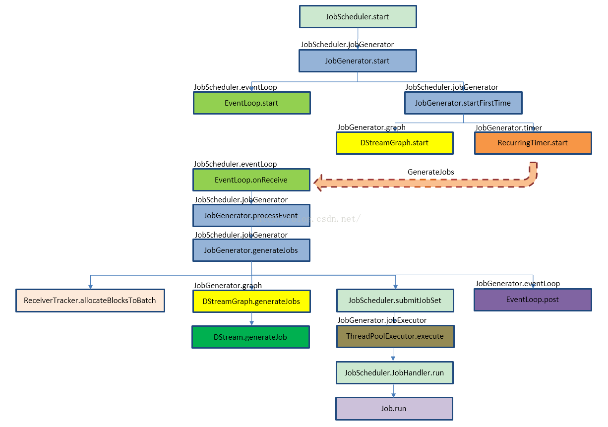

# SparkStreaming

## 前言

Spark Streaming 是基于Spark Core将流式计算分解成一系列的小批处理任务来执行。在Spark Streaming里，总体负责任务的动态调度是`JobScheduler`，而`JobScheduler`有两个很重要的成员：`JobGenerator` 和 `ReceiverTracker`。`JobGenerator` 负责将每个 batch 生成具体的 RDD DAG ，而`ReceiverTracker`负责数据的来源。

Spark Streaming里的`DStream`可以看成是Spark Core里的RDD的模板，`DStreamGraph`是RDD DAG的模板。

## wordcount源码

```scala
package spark

import org.apache.spark._
import org.apache.spark.streaming._
import org.apache.spark.streaming.StreamingContext._ // not necessary since Spark 1.3

object ncwordcount {
  def main(args: Array[String]): Unit = {

    val conf = new SparkConf().setMaster("local[2]").setAppName("NetworkWordCount")
    val ssc = new StreamingContext(conf, Seconds(60))
    // Create a DStream that will connect to hostname:port, like localhost:9999，它使用SocketInputDStream接收tcp流
    val lines = ssc.socketTextStream("localhost", 9999)
    // Split each line into words
    val words = lines.flatMap(_.split(" "))
    // Count each word in each batch
    val pairs = words.map(word => (word, 1))
    val wordCounts = pairs.reduceByKey(_ + _)

    // Print the first ten elements of each RDD generated in this DStream to the console
    wordCounts.print()
    ssc.start()             // Start the computation
    ssc.awaitTermination()  // Wait for the computation to terminate
  }
}

```

socketInputStream的继承



### StreamingContext初始化

#### SparkContext初始化

```scala
  private[streaming] val sc: SparkContext = {
    if (_sc != null) {
      _sc
    } else if (isCheckpointPresent) {
      SparkContext.getOrCreate(_cp.createSparkConf())
    } else {
      throw new SparkException("Cannot create StreamingContext without a SparkContext")
    }
  }
```

如果已提供则使用提供的，否则检查是否存在checkpoint，并从checkPoint创建。

#### DStreamGraph初始化

```scala
  private[streaming] val graph: DStreamGraph = {
    if (isCheckpointPresent) {
      _cp.graph.setContext(this)
      _cp.graph.restoreCheckpointData()
      _cp.graph
    } else {
      require(_batchDur != null, "Batch duration for StreamingContext cannot be null")
      val newGraph = new DStreamGraph()
      newGraph.setBatchDuration(_batchDur)
      newGraph
    }
  }
```

`DStreamGraph`是RDD DAG的模板

#### 其他初始化工作

```scala
  private[streaming] val scheduler = new JobScheduler(this)
  private[streaming] val waiter = new ContextWaiter
  private[streaming] val progressListener = new StreamingJobProgressListener(this)

  private[streaming] val uiTab: Option[StreamingTab] =
    if (conf.getBoolean("spark.ui.enabled", true)) {
      Some(new StreamingTab(this))
    } else {
      None
    }
```

主要初始化了JobScheduler

```scala
class JobScheduler(val ssc: StreamingContext) extends Logging {
 //使用map保存时间和JobSet的映射
  private val jobSets: java.util.Map[Time, JobSet] = new ConcurrentHashMap[Time, JobSet]
  //创建固定大小的线程池
  private val numConcurrentJobs = ssc.conf.getInt("spark.streaming.concurrentJobs", 1)
  private val jobExecutor =
    ThreadUtils.newDaemonFixedThreadPool(numConcurrentJobs, "streaming-job-executor")
  private val jobGenerator = new JobGenerator(this)
  val clock = jobGenerator.clock
  val listenerBus = new StreamingListenerBus(ssc.sparkContext.listenerBus)
}
```


### StreamGraph

#### 构造

参考https://cloud.tencent.com/developer/article/1198468

在构造StreamingContext时创建了DStreamGraph

```scala
private[streaming] val graph: DStreamGraph = {
    if (isCheckpointPresent) {
      _cp.graph.setContext(this)
      _cp.graph.restoreCheckpointData()
      _cp.graph
    } else {
      require(_batchDur != null, "Batch duration for StreamingContext cannot be null")
      val newGraph = new DStreamGraph()
      newGraph.setBatchDuration(_batchDur)
      newGraph
    }
  }
```

若`checkpoint` 可用，会优先从 checkpoint 恢复 graph，否则新建一个。graph用来动态的创建RDD DAG，`DStreamGraph`有两个重要的成员：`inputStreams` 和`outputStreams` 。

```scala
private val inputStreams = new ArrayBuffer[InputDStream[_]]()
private val outputStreams = new ArrayBuffer[DStream[_]]()
```

Spark Streaming记录DStream DAG 的方式就是通过`DStreamGraph`实例记录所有的`outputStreams` ，因为`outputStream`会通过依赖 `dependencies` 来和parent DStream形成依赖链，通过`outputStreams` 向前追溯遍历就可以得到所有上游的DStream，另外，`DStreamGraph` 还会记录所有的`inputStreams` ，避免每次为查找 input stream 而对 output steam 进行 BFS 的消耗。

继续回到例子，这里通过ssc.socketTextStream 创建了一个`ReceiverInputDStream`，在其父类 InputDStream 中会将该`ReceiverInputDStream`添加到`inputStream`里.

接着调用了flatMap方法：

```scala
class FlatMappedDStream[T: ClassTag, U: ClassTag](
    parent: DStream[T],
    flatMapFunc: T => TraversableOnce[U]
  ) extends DStream[U](parent.ssc) {

  override def dependencies: List[DStream[_]] = List(parent)

  override def slideDuration: Duration = parent.slideDuration

  override def compute(validTime: Time): Option[RDD[U]] = {
    parent.getOrCompute(validTime).map(_.flatMap(flatMapFunc))
  }
}
```

创建了一个 FlatMappedDStream ，而该类的compute方法是在父 DStream（ReceiverInputDStream） 在对应batch时间的RDD上调用了flatMap方法，也就是构造了 rdd.flatMap(func)这样的代码，后面的操作类似，随后形成的是rdd.flatMap(func1).map(func2).reduceByKey(func3).take()，这不就是我们spark core里的东西吗。另外其dependencies是直接指向了其构造参数parent，也就是刚才的ReceiverInputDStream，每个新建的DStream的dependencies都是指向了其父DStream，这样就构成了一个依赖链，也就是形成了DStream DAG。

```scala
/**
   * Get the RDD corresponding to the given time; either retrieve it from cache
   * or compute-and-cache it.
   获取指定时间的RDD,
   */
  private[streaming] final def getOrCompute(time: Time): Option[RDD[T]] = {
    // If RDD was already generated, then retrieve it from HashMap,
    // or else compute the RDD
    generatedRDDs.get(time).orElse {
      // Compute the RDD if time is valid (e.g. correct time in a sliding window)
      // of RDD generation, else generate nothing.
      if (isTimeValid(time)) {

        val rddOption = createRDDWithLocalProperties(time, displayInnerRDDOps = false) {
          // Disable checks for existing output directories in jobs launched by the streaming
          // scheduler, since we may need to write output to an existing directory during checkpoint
          // recovery; see SPARK-4835 for more details. We need to have this call here because
          // compute() might cause Spark jobs to be launched.
          PairRDDFunctions.disableOutputSpecValidation.withValue(true) {
            compute(time)
          }
        }

        rddOption.foreach { case newRDD =>
          // Register the generated RDD for caching and checkpointing
          if (storageLevel != StorageLevel.NONE) {
            newRDD.persist(storageLevel)
            logDebug(s"Persisting RDD ${newRDD.id} for time $time to $storageLevel")
          }
          if (checkpointDuration != null && (time - zeroTime).isMultipleOf(checkpointDuration)) {
            newRDD.checkpoint()
            logInfo(s"Marking RDD ${newRDD.id} for time $time for checkpointing")
          }
          generatedRDDs.put(time, newRDD)
        }
        rddOption
      } else {
        None
      }
    }
  }
```


#### job触发

print方法源码

```scala
  def print(num: Int): Unit = ssc.withScope {
    def foreachFunc: (RDD[T], Time) => Unit = {
      (rdd: RDD[T], time: Time) => {
        val firstNum = rdd.take(num + 1)
        // scalastyle:off println
        println("-------------------------------------------")
        println(s"Time: $time")
        println("-------------------------------------------")
        firstNum.take(num).foreach(println)
        if (firstNum.length > num) println("...")
        println()
        // scalastyle:on println
      }
    }
    foreachRDD(context.sparkContext.clean(foreachFunc), displayInnerRDDOps = false)
  }

//对DStream中的所有RDD应用操作
  private def foreachRDD(
      foreachFunc: (RDD[T], Time) => Unit,
      displayInnerRDDOps: Boolean): Unit = {
    new ForEachDStream(this,
      context.sparkContext.clean(foreachFunc, false), displayInnerRDDOps).register()
  }
//生成Job
#ForEachDStream.scala
  override def generateJob(time: Time): Option[Job] = {
    parent.getOrCompute(time) match {
      case Some(rdd) =>
        val jobFunc = () => createRDDWithLocalProperties(time, displayInnerRDDOps) {
          foreachFunc(rdd, time)
        }
      //Job的run方法会执行jobFunc方法
        Some(new Job(time, jobFunc))
      case None => None
    }
  }

//DAG添加outputstream
  private[streaming] def register(): DStream[T] = {
    ssc.graph.addOutputStream(this)
    this
  }
```

## StreamingContext执行逻辑

```scala
def start(): Unit = synchronized {
    state match {
      case INITIALIZED =>
        startSite.set(DStream.getCreationSite())
        StreamingContext.ACTIVATION_LOCK.synchronized {
          StreamingContext.assertNoOtherContextIsActive()
          try {
            //(一)验证工作，duration非空，outputStream非空
            validate()
            //(二)启动Jobscheduler线程
            ThreadUtils.runInNewThread("streaming-start") {
              sparkContext.setCallSite(startSite.get)
              sparkContext.clearJobGroup()
              sparkContext.setLocalProperty(SparkContext.SPARK_JOB_INTERRUPT_ON_CANCEL, "false")
              savedProperties.set(SerializationUtils.clone(sparkContext.localProperties.get()))
              scheduler.start()
            }
            state = StreamingContextState.ACTIVE
          } catch {
            case NonFatal(e) =>
              logError("Error starting the context, marking it as stopped", e)
              scheduler.stop(false)
              state = StreamingContextState.STOPPED
              throw e
          }
          StreamingContext.setActiveContext(this)
        }
        shutdownHookRef = ShutdownHookManager.addShutdownHook(
          StreamingContext.SHUTDOWN_HOOK_PRIORITY)(stopOnShutdown)
        // Registering Streaming Metrics at the start of the StreamingContext
        assert(env.metricsSystem != null)
        env.metricsSystem.registerSource(streamingSource)
        uiTab.foreach(_.attach())
        logInfo("StreamingContext started")
      case ACTIVE =>
        logWarning("StreamingContext has already been started")
      case STOPPED =>
        throw new IllegalStateException("StreamingContext has already been stopped")
    }
  }
```

可以看到主要是启动了JobScheduler线程

## JobScheduler执行逻辑

调度Spark上的job，使用JobScheduler生成Job且使用线程池执行他们

```scala
  private val jobExecutor =
    ThreadUtils.newDaemonFixedThreadPool(numConcurrentJobs, "streaming-job-executor")
```

 执行逻辑

```scala

  def start(): Unit = synchronized {
    if (eventLoop != null) return // scheduler has already been started

    logDebug("Starting JobScheduler")
    //(一)启动eventLoop线程
    eventLoop = new EventLoop[JobSchedulerEvent]("JobScheduler") {
      override protected def onReceive(event: JobSchedulerEvent): Unit = processEvent(event)

      override protected def onError(e: Throwable): Unit = reportError("Error in job scheduler", e)
    }
    eventLoop.start()

    // attach rate controllers of input streams to receive batch completion updates
    for {
      inputDStream <- ssc.graph.getInputStreams
      rateController <- inputDStream.rateController  //控制数据的接收速度。
    } ssc.addStreamingListener(rateController)
//启动事件总线new StreamingListenerBus(ssc.sparkContext.listenerBus)
    listenerBus.start()
    receiverTracker = new ReceiverTracker(ssc)
    inputInfoTracker = new InputInfoTracker(ssc)
    //Executor动态分配线程
    executorAllocationManager = ExecutorAllocationManager.createIfEnabled(
      ssc.sparkContext,
      receiverTracker,
      ssc.conf,
      ssc.graph.batchDuration.milliseconds,
      clock)
    executorAllocationManager.foreach(ssc.addStreamingListener)
    //(二)启动receiverTracker
    receiverTracker.start()
    //(三)启动jobGenerator
    jobGenerator.start()
    executorAllocationManager.foreach(_.start())
    logInfo("Started JobScheduler")
  }
```

### 事件处理

eventLoop线程的事件处理方法处理三类事件：

```scala
        case JobStarted(job, startTime) => handleJobStart(job, startTime)
        case JobCompleted(job, completedTime) => handleJobCompletion(job, completedTime)
        case ErrorReported(m, e) => handleError(m, e)
```

这三类事件都继承自JobSchedulerEvent

#### JobStarted事件

```scala
  private def handleJobStart(job: Job, startTime: Long) {
    //new ConcurrentHashMap[Time, JobSet]
    val jobSet = jobSets.get(job.time)
    val isFirstJobOfJobSet = !jobSet.hasStarted
    jobSet.handleJobStart(job)
    //把批处理启动事件放入事件队列
    if (isFirstJobOfJobSet) {   listenerBus.post(StreamingListenerBatchStarted(jobSet.toBatchInfo))
    }
    job.setStartTime(startTime)
/**把输出操作启动事件异步放入事件队列 
将会被Spark listener bus中所有的StreamingListeners处理
  */  listenerBus.post(StreamingListenerOutputOperationStarted(job.toOutputOperationInfo))
    logInfo("Starting job " + job.id + " from job set of time " + jobSet.time)
  }
```

#### JobComplete事件

```scala
  private def handleJobCompletion(job: Job, completedTime: Long) {
    val jobSet = jobSets.get(job.time)
    jobSet.handleJobCompletion(job)
    job.setEndTime(completedTime)
    listenerBus.post(StreamingListenerOutputOperationCompleted(job.toOutputOperationInfo))
    logInfo("Finished job " + job.id + " from job set of time " + jobSet.time)
    if (jobSet.hasCompleted) {
      jobSets.remove(jobSet.time)
      jobGenerator.onBatchCompletion(jobSet.time)
      logInfo("Total delay: %.3f s for time %s (execution: %.3f s)".format(
        jobSet.totalDelay / 1000.0, jobSet.time.toString,
        jobSet.processingDelay / 1000.0
      ))
      listenerBus.post(StreamingListenerBatchCompleted(jobSet.toBatchInfo))
    }
    job.result match {
      case Failure(e) =>
        reportError("Error running job " + job, e)
      case _ =>
    }
  }
```

### ReceiverTracker执行逻辑

用于管理ReceiverInputDStreams的receiver的执行,两个属性：

receiverTrackingInfos 记录所有receiver的信息

receiverPreferredLocations存储receiver偏好的位置，用于调度receivers

在分析其执行逻辑前， 先来了解几个概念

#### 什么是Receiver?

receiver是运行在worker节点上接收外部数据的抽象类，spark提供两个实现类

RawNetworkReceiver和SocketReceiver

自定义Receiver

```scala
class MyReceiver(storageLevel: StorageLevel) extends NetworkReceiver[String](storageLevel) {
    def onStart() {
        // Setup stuff (start threads, open sockets, etc.) to start receiving data.
        // Must start new thread to receive data, as onStart() must be non-blocking.
        // Call store(...) in those threads to store received data into Spark's memory.
        // Call stop(...), restart(...) or reportError(...) on any thread based on how
        // different errors need to be handled.
        // See corresponding method documentation for more details
    }
    def onStop() {
        // Cleanup stuff (stop threads, close sockets, etc.) to stop receiving data.
    }
}
```

在onStartup方法里要启动接收数据的线程，并调用store把数据存入spark内存。

#### 什么是ReceiverSupervisor？

它负责监控worker上的Receiver,处理Receiver接收到的数据，尤其是它创建的BlockGenerator对象，用于把数据流切分成数据块。

#### 什么是ReceiverTracker?

这个类是管理ReceiverInputDStreams的Receiver的执行的。

`DStream` 有一个重要而特殊的子类 `ReceiverInputDStream`：它除了需要像其它 `DStream` 那样在某个 batch 里实例化 `RDD` 以外，还需要额外的 `Receiver` 为这个 `RDD` 生产数据！

具体的，Spark Streaming 在程序刚开始运行时：

- (1) 由 `Receiver` 的总指挥 `ReceiverTracker` 分发多个 job（每个 job 有 1 个 task），到多个 executor 上分别启动 `ReceiverSupervisor` 实例；
- (2) 每个 `ReceiverSupervisor` 启动后将马上生成一个用户提供的 `Receiver` 实现的实例 —— 该 `Receiver` 实现可以持续产生或者持续接收系统外数据，比如 `TwitterReceiver` 可以实时爬取 twitter 数据 —— 并在 `Receiver` 实例生成后调用 `Receiver.onStart()`；



#### 启动Receivers

```scala
//获取ReceiverInputDStreams 的Receivers，并把receiver分发到worker节点，并执行  
private def launchReceivers(): Unit = {
    val receivers = receiverInputStreams.map { nis =>
      val rcvr = nis.getReceiver()
      rcvr.setReceiverId(nis.id)
      rcvr
    }
//执行一个测试job:确保所有的slave都注册了，避免所有的receiver调度到同一个节点。
    runDummySparkJob()
/**向ReceiverTrackerEndpoint发送了StartAllReceivers消息
*/
    logInfo("Starting " + receivers.length + " receivers")
    endpoint.send(StartAllReceivers(receivers))
  }


  private def runDummySparkJob(): Unit = {
    if (!ssc.sparkContext.isLocal) {
      ssc.sparkContext.makeRDD(1 to 50, 50).map(x => (x, 1)).reduceByKey(_ + _, 20).collect()
    }
    assert(getExecutors.nonEmpty)
  }
```

#### receiver执行

SparkStreaming有很多Receiver，我们看SocketReceiver如何执行

```scala
// SocketInputDStream.scala  
def onStart() {
      socket = new Socket(host, port)
    new Thread("Socket Receiver") {
      setDaemon(true)
      override def run() { receive() }
    }.start()
  }

  def receive() {
    try {
      val iterator = bytesToObjects(socket.getInputStream())
      while(!isStopped && iterator.hasNext) {
        store(iterator.next())
      }
    } finally {
      onStop()
    }
  }


/**存储单条数据到spark内存，聚合成数据块后才push到内存*/
  def store(dataItem: T) {
    supervisor.pushSingle(dataItem)
  }
// ReceiverSupervisorImpl.scala
  def pushSingle(data: Any) {
    defaultBlockGenerator.addData(data)
  }
```

#### 数据的转储ReceiverSupervisor

接下来 `ReceiverSupervisor` 将在 executor 端作为的主要角色，并且：

- (3) `Receiver` 在 `onStart()` 启动后，就将**持续不断**地接收外界数据，并持续交给 `ReceiverSupervisor` 进行数据转储；

- (4) `ReceiverSupervisor` **持续不断**地接收到 `Receiver` 转来的数据：

  - 如果数据很细小，就需要 `BlockGenerator` 攒多条数据成一块(4a)、然后再成块存储(4b 或 4c)
  - 反之就不用攒，直接成块存储(4b 或 4c)

  - 这里 Spark Streaming 目前支持两种成块存储方式，一种是由 `BlockManagerBasedBlockHandler` 直接存到 executor 的内存或硬盘，另一种由 `WriteAheadLogBasedBlockHandler` 是同时写 WAL(4c) 和 executor 的内存或硬盘

- (5) 每次成块在 executor 存储完毕后，`ReceiverSupervisor` 就会及时上报块数据的 meta 信息给 driver 端的 `ReceiverTracker`；这里的 meta 信息包括数据的标识 id，数据的位置，数据的条数，数据的大小等信息；

- (6) `ReceiverTracker` 再将收到的块数据 meta 信息直接转给自己的成员 `ReceivedBlockTracker`，由 `ReceivedBlockTracker` 专门管理收到的块数据 meta 信息。



### 启动Jobgenerator

```scala
    eventLoop = new EventLoop[JobGeneratorEvent]("JobGenerator") {
      override protected def onReceive(event: JobGeneratorEvent): Unit = processEvent(event)

      override protected def onError(e: Throwable): Unit = {
        jobScheduler.reportError("Error in job generator", e)
      }
    }
    eventLoop.start()
```

一共有四种JobGeneratorEvent:

```scala
      case GenerateJobs(time) => generateJobs(time)
      case ClearMetadata(time) => clearMetadata(time)
      case DoCheckpoint(time, clearCheckpointDataLater) =>
        doCheckpoint(time, clearCheckpointDataLater)
      case ClearCheckpointData(time) => clearCheckpointData(time)
```

下面看看job的生成

#### 生成Job

```scala
  /** Generate jobs and perform checkpointing for the given `time`.  */
  private def generateJobs(time: Time) {
    // Checkpoint all RDDs marked for checkpointing to ensure their lineages are
    // truncated periodically. Otherwise, we may run into stack overflows (SPARK-6847).
    ssc.sparkContext.setLocalProperty(RDD.CHECKPOINT_ALL_MARKED_ANCESTORS, "true")
    Try {
 /**获取根据interval time划分的block块数据*/     jobScheduler.receiverTracker.allocateBlocksToBatch(time) 
      /**通过DStreamGraph 生成Job*/
      graph.generateJobs(time) // generate jobs using allocated block
    } match {
      case Success(jobs) =>
        val streamIdToInputInfos = jobScheduler.inputInfoTracker.getInfo(time)
      /**最终把JobSet提交给jobScheduler*/
        jobScheduler.submitJobSet(JobSet(time, jobs, streamIdToInputInfos))
      case Failure(e) =>
        jobScheduler.reportError("Error generating jobs for time " + time, e)
        PythonDStream.stopStreamingContextIfPythonProcessIsDead(e)
    }
    //提交完job立即做checkpoint
    eventLoop.post(DoCheckpoint(time, clearCheckpointDataLater = false))
  }
```

整体逻辑



Timer定时器，定期向产生Job生成事件，

```scala
  private val timer = new RecurringTimer(clock, ssc.graph.batchDuration.milliseconds,
    longTime => eventLoop.post(GenerateJobs(new Time(longTime))), "JobGenerator")
```

##### 数据分配

这个数据分配是由ReceiverTracker完成的，

```scala
def allocateBlocksToBatch(batchTime: Time): Unit = synchronized {
    if (lastAllocatedBatchTime == null || batchTime > lastAllocatedBatchTime) {
      val streamIdToBlocks = streamIds.map { streamId =>
          (streamId, getReceivedBlockQueue(streamId).dequeueAll(x => true))
      }.toMap
      //代表所有stream分给当前batch的block
      val allocatedBlocks = AllocatedBlocks(streamIdToBlocks)
      if (writeToLog(BatchAllocationEvent(batchTime, allocatedBlocks))) {
        //HashMap,  DStream在调用compute生成RDD时会获取这些block
        timeToAllocatedBlocks.put(batchTime, allocatedBlocks)
        lastAllocatedBatchTime = batchTime
      } else {
        logInfo(s"Possibly processed batch $batchTime needs to be processed again in WAL recovery")
      }
    }
```


##### DStreamGraph生成Job

DStreamGraph.scala

```scala
  def generateJobs(time: Time): Seq[Job] = {
    logDebug("Generating jobs for time " + time)
    val jobs = this.synchronized {
      outputStreams.flatMap { outputStream =>
        val jobOption = outputStream.generateJob(time)
        jobOption.foreach(_.setCallSite(outputStream.creationSite))
        jobOption
      }
    }
    logDebug("Generated " + jobs.length + " jobs for time " + time)
    jobs
  }
```

可以看到是根据outpoutStream生成Job的，我们看下ForEachDStream的生成方法

```scala
  override def generateJob(time: Time): Option[Job] = {
    parent.getOrCompute(time) match {
      case Some(rdd) =>
        val jobFunc = () => createRDDWithLocalProperties(time, displayInnerRDDOps) {
          foreachFunc(rdd, time)
        }
        Some(new Job(time, jobFunc))
      case None => None
    }
  }
```

可见， `DStreamGraph` 复制出了一套新的 RDD DAG 的实例，具体过程是：`DStreamGraph` 将要求图里的尾 `DStream` 节点生成具体的 RDD 实例，并递归的调用尾 `DStream` 的上游 `DStream` 节点……以此遍历整个 `DStreamGraph`，遍历结束也就正好生成了 RDD DAG 的实例；

#### 提交JobSet给JobScheduler

```scala
Try {
      jobScheduler.receiverTracker.allocateBlocksToBatch(time) // allocate received blocks to batch
      graph.generateJobs(time) // generate jobs using allocated block
    } match {
      case Success(jobs) =>
        val streamIdToInputInfos = jobScheduler.inputInfoTracker.getInfo(time)
        jobScheduler.submitJobSet(JobSet(time, jobs, streamIdToInputInfos))
```

先构造一个JobSet，然后调用jobScheduler 的submitJobSet方法

#### job的执行

jobScheduler.scala

```scala
  def submitJobSet(jobSet: JobSet) {
    if (jobSet.jobs.isEmpty) {
      logInfo("No jobs added for time " + jobSet.time)
    } else {
      //向事件总线发送Job提交事件
      listenerBus.post(StreamingListenerBatchSubmitted(jobSet.toBatchInfo))
      jobSets.put(jobSet.time, jobSet)
      //在线程池中执行job
      jobSet.jobs.foreach(job => jobExecutor.execute(new JobHandler(job)))
      logInfo("Added jobs for time " + jobSet.time)
    }
  }
```


### 事件总线listenerBus

LiveListenerBus对象，该对象是内部维护了两个队列queues和queuedEvents

参考https://www.jianshu.com/p/0a3bc1d21181

### Executor动态分配机制

参考https://www.jianshu.com/p/e1d9456a4880

### blockGenerator

几个比较重要的属性

```scala
  // blockInterval是有一个默认值的，默认是200ms，将数据封装成block的时间间隔
  private val blockIntervalMs = conf.getTimeAsMs("spark.streaming.blockInterval", "200ms")
  require(blockIntervalMs > 0, s"'spark.streaming.blockInterval' should be a positive value")

  // 这个相当于每隔200ms，就去执行一个函数updateCurrentBuffer
  private val blockIntervalTimer =
    new RecurringTimer(clock, blockIntervalMs, updateCurrentBuffer, "BlockGenerator")
  // blocksForPushing队列的长度是可以调节的，默认是长度是10
  private val blockQueueSize = conf.getInt("spark.streaming.blockQueueSize", 10)
  // blocksForPushing队列
  private val blocksForPushing = new ArrayBlockingQueue[Block](blockQueueSize)
  // blockPushingThread后台线程，启动之后，就会调用keepPushingBlocks()方法
  // 这个方法中就会每隔一段时间，去blocksForPushing队列中取block
  private val blockPushingThread = new Thread() { override def run() { keepPushingBlocks() } }

  // 创建currentBuffer，用于存放原始数据
  @volatile private var currentBuffer = new ArrayBuffer[Any]

```

#### 启动block生成定时器和推送线程

```scala
  /** Start block generating and pushing threads. */
  def start(): Unit = synchronized {
    if (state == Initialized) {
      state = Active
      /**每隔200ms，将currentBuffer中的数据取出，并生成一个Block*/
      blockIntervalTimer.start()
      blockPushingThread.start()
    }
  }
```

#### blockIntervalTimer执行逻辑

当启动定时器的时候，它就会每隔200ms，将currentBuffer中的数据取出，并生成一个Block

```scala
 private def updateCurrentBuffer(time: Long): Unit = {
    try {
      var newBlock: Block = null
      synchronized { //防止并发写
        if (currentBuffer.nonEmpty) {
          //清空currentBuffer
          val newBlockBuffer = currentBuffer
          currentBuffer = new ArrayBuffer[Any]
          val blockId = StreamBlockId(receiverId, time - blockIntervalMs)
          listener.onGenerateBlock(blockId)
          //构造新的Block
          newBlock = new Block(blockId, newBlockBuffer)
        }
      }

      if (newBlock != null) {
        blocksForPushing.put(newBlock)  //入队， put is blocking when queue is full
      }
    } 
  }
```

#### blockPushingThread执行逻辑

```scala
/** Keep pushing blocks to the BlockManager. */
  private def keepPushingBlocks() {
    logInfo("Started block pushing thread")

    def areBlocksBeingGenerated: Boolean = synchronized {
      state != StoppedGeneratingBlocks
    }

    try {
      // 只要block持续在产生，那么就会一直去blocksForPushing队列中取block
      while (areBlocksBeingGenerated) {
        Option(blocksForPushing.poll(10, TimeUnit.MILLISECONDS)) match {
          //如果拿到block,调用pushBlock
          case Some(block) => pushBlock(block)
          case None =>
        }
      }
    }
  //ReceiverSupervisorImpl.scala
  private def pushBlock(block: Block) {
    listener.onPushBlock(block.id, block.buffer)
    logInfo("Pushed block " + block.id)
  }   
    
```

从上面代码中可以看出，只要BlockGenerator一直在运行没有停止，它就会持续不断的产生Block，那么这里就会从blocksForPushing队列中持续不断的去取Block进行推送。这里的blocksForPushing是一个阻塞队列，默认阻塞时间是10ms

推送是通过BlockGeneratorListener的onPushBlock进行推送的

```scala
def pushAndReportBlock(
      receivedBlock: ReceivedBlock,
      metadataOption: Option[Any],
      blockIdOption: Option[StreamBlockId]
    ) {
    // 取出BlockId
    val blockId = blockIdOption.getOrElse(nextBlockId)
    // 获取当前系统时间
    val time = System.currentTimeMillis
    // 这里使用receivedBlockHandler，调用storeBlock方法，将block存储到BlockManager中
    // 从这里的源码里可以看到预写日志机制
    val blockStoreResult = receivedBlockHandler.storeBlock(blockId, receivedBlock)
    logDebug(s"Pushed block $blockId in ${(System.currentTimeMillis - time)} ms")
    // 拿到block数据长度
    val numRecords = blockStoreResult.numRecords
    // 封装一个ReceivedBlockInfo对象，里面包含streamId 和 block store结果
    val blockInfo = ReceivedBlockInfo(streamId, numRecords, metadataOption, blockStoreResult)
    // 调用ReceiverTrackerEndPoint，向ReceiverTracker发送AddBlock消息
    trackerEndpoint.askWithRetry[Boolean](AddBlock(blockInfo))
    logDebug(s"Reported block $blockId")
  }

```

 这个方法主要包含了两个功能，一个是调用receivedBlockHandler的storeBlock将Block保存到BlockManager（或写入预写日志）；另一个就是将保存的Block信息封装为ReceivedBlockInfo，发送给ReceiverTracker。下面我们先分析第一个：
  存储block的组件receivedBlockHandler会依据是否开启预写日志功能，而创建不同的receivedBlockHandler，如下所示：

```scala
private val receivedBlockHandler: ReceivedBlockHandler = {
    // 如果开启了预写日志机制，默认是false（这里参数是 spark.streaming.receiver.writeAheadLog.enable）
    // 如果为true，那么ReceivedBlockHandler就是WriteAheadLogBasedBlockHandler，
    // 如果没有开启预写日志机制，那么就创建为BlockManagerBasedBlockHandler
    if (WriteAheadLogUtils.enableReceiverLog(env.conf)) {
      if (checkpointDirOption.isEmpty) {
        throw new SparkException(
          "Cannot enable receiver write-ahead log without checkpoint directory set. " +
            "Please use streamingContext.checkpoint() to set the checkpoint directory. " +
            "See documentation for more details.")
      }
      new WriteAheadLogBasedBlockHandler(env.blockManager, receiver.streamId,
        receiver.storageLevel, env.conf, hadoopConf, checkpointDirOption.get)
    } else {
      new BlockManagerBasedBlockHandler(env.blockManager, receiver.storageLevel)
    }
  }

```

 它会判断是否开启了预写日志，通过读取spark.streaming.receiver.writeAheadLog.enable这个参数是否被设置为true。如果开启了那么就创建WriteAheadLogBasedBlockHandler，否则的话就创建BlockManagerBasedBlockHandler。
  下面我们就WriteAheadLogBasedBlockHandler来进行分析它的storeBlock方法：

```scala
def storeBlock(blockId: StreamBlockId, block: ReceivedBlock): ReceivedBlockStoreResult = {
    var numRecords = None: Option[Long]
    // 先将Block的数据序列化
    val serializedBlock = block match {
      case ArrayBufferBlock(arrayBuffer) =>
        numRecords = Some(arrayBuffer.size.toLong)
        blockManager.dataSerialize(blockId, arrayBuffer.iterator)
      case IteratorBlock(iterator) =>
        val countIterator = new CountingIterator(iterator)
        val serializedBlock = blockManager.dataSerialize(blockId, countIterator)
        numRecords = countIterator.count
        serializedBlock
      case ByteBufferBlock(byteBuffer) =>
        byteBuffer
      case _ =>
        throw new Exception(s"Could not push $blockId to block manager, unexpected block type")
    }

    // 将数据保存到BlockManager中去，以及复制一份副本到其他executor的BlockManager上，以供容错
    val storeInBlockManagerFuture = Future {
      val putResult =
        blockManager.putBytes(blockId, serializedBlock, effectiveStorageLevel, tellMaster = true)
      if (!putResult.map { _._1 }.contains(blockId)) {
        throw new SparkException(
          s"Could not store $blockId to block manager with storage level $storageLevel")
      }
    }

    // 将Block存入预写日志，使用Future来获取写入结果
    val storeInWriteAheadLogFuture = Future {
      writeAheadLog.write(serializedBlock, clock.getTimeMillis())
    }

    // 等待两个写入完成，并合并写入结果信息，并返回写入结果信息
    val combinedFuture = storeInBlockManagerFuture.zip(storeInWriteAheadLogFuture).map(_._2)
    val walRecordHandle = Await.result(combinedFuture, blockStoreTimeout)
    WriteAheadLogBasedStoreResult(blockId, numRecords, walRecordHandle)
  }

```

 从上面代码中看出，主要分为两步：首先将Block的数据进行序列化，然后将其放入BlockManager中进行存储，它会序列化并复制一份到其他Executor的BlockManager上。这里就可以看出开启预写日志的容错措施首先会将数据复制一份到其他的Worker节点的executor的BlockManager上；接着将Block的数据写入预写日志中（一般是HDFS文件）。
  从上面可以看出预写日志的容错措施主要有两个：一是将数据备份到其他的Worker节点的executor上（默认持久化级别是_SER 和 _2）；再者将数据写入到预写日志中。相当于提供了双重保障，因此能够提供较强的容错性（当然这会牺牲一定的性能）。
  接着我们分析第二个，发送ReceivedBlockInfo信息给ReceiverTracker。这个就简单说一下，ReceiverTracker在收到AddBlock的消息之后，会进行判断是否开启预写日志，假如开启预写日志那么需要将Block的信息写入一份到预写日志中，否则的话，就保存在缓存中。
  总结一下：上面的数据接收和存储功能，依据BlockGenerator组件来对接收到的数据进行缓存、封装和推送，最终将数据推送到BlockManager（以及预写日志中）。其中，主要是依靠一个定时器blockIntervalTimer，每隔200ms，从currentBuffer中取出全部数据，封装为一个block，放入blocksForPushing队列中；接着blockPushingThread，不断的从blocksForPushing队列中取出block进行推送，这是一个阻塞队列,阻塞时间默认是10ms。然后通过BlockGeneratorListener的onPushBlock()（最终调用的是pushArrayBuffer），将数据进行推送到BlockManager（加入开启了预写日志，那么也会写入一份到预写日志中），以及发送AddBlock消息给ReceiverTracker进行Block的注册。

## DAGScheduler的stage划分

### stage划分

```scala
private[scheduler] def handleJobSubmitted(jobId: Int,
    finalRDD: RDD[_],
    func: (TaskContext, Iterator[_]) => _,
    partitions: Array[Int],
    callSite: CallSite,
    listener: JobListener,
    properties: Properties) {
  var finalStage: ResultStage = null
  try { 
 //Stage划分过程是从最后一个Stage开始往前执行的，最后一个Stage的类型是ResultStage
    finalStage = newResultStage(finalRDD, func, partitions, jobId, callSite)
  } 
  //为此job生成一个ActiveJob对象
  val job = new ActiveJob(jobId, finalStage, callSite, listener, properties)
  clearCacheLocs()
  logInfo("Got job %s (%s) with %d output partitions".format(
    job.jobId, callSite.shortForm, partitions.length))
  logInfo("Final stage: " + finalStage + " (" + finalStage.name + ")")
  logInfo("Parents of final stage: " + finalStage.parents)
  logInfo("Missing parents: " + getMissingParentStages(finalStage))

  val jobSubmissionTime = clock.getTimeMillis()
  jobIdToActiveJob(jobId) = job //记录该job处于active状态
  activeJobs += job 
  finalStage.setActiveJob(job)
  val stageIds = jobIdToStageIds(jobId).toArray
  val stageInfos = stageIds.flatMap(id => stageIdToStage.get(id).map(_.latestInfo))
  listenerBus.post( //向LiveListenerBus发送Job提交事件
    SparkListenerJobStart(job.jobId, jobSubmissionTime, stageInfos, properties))
  submitStage(finalStage) //提交Stage

  submitWaitingStages()
}
```

​     newResultStage源码

```scala

private def newResultStage(
      rdd: RDD[_],
      func: (TaskContext, Iterator[_]) => _,
      partitions: Array[Int],
      jobId: Int,
      callSite: CallSite): ResultStage = {
    val (parentStages: List[Stage], id: Int) = getParentStagesAndId(rdd, jobId) //获取stage的parentstage
    val stage = new ResultStage(id, rdd, func, partitions, parentStages, jobId, callSite)
    stageIdToStage(id) = stage //将Stage和stage_id关联
    updateJobIdStageIdMaps(jobId, stage) //跟新job所包含的stage
    stage
  }
```

直接实例化一个ResultStage，但需要parentStages作为参数，我们看看getParentStagesAndId做了什么：

```scala
private def getParentStagesAndId(rdd: RDD[_], firstJobId: Int): (List[Stage], Int) = {
    val parentStages = getParentStages(rdd, firstJobId)
    val id = nextStageId.getAndIncrement()
    (parentStages, id)
  }
```

获取parentStages，并返回一个与stage关联的唯一id，由于是递归的向前生成stage，所以最先生成的stage是最前面的stage，越往前的stageId就越小，即父Stage的id最小。继续跟进getParentStages：

```scala
private def getParentStages(rdd: RDD[_], firstJobId: Int): List[Stage] = {
    val parents = new HashSet[Stage] // 当前Stage的所有parent Stage
    val visited = new HashSet[RDD[_]] // 已经访问过的RDD
    // We are manually maintaining a stack here to prevent StackOverflowError
    // caused by recursively visiting
    val waitingForVisit = new Stack[RDD[_]] //等待访问的RDD
    def visit(r: RDD[_]) {
      if (!visited(r)) { //若未访问过
        visited += r  //标记已被访问
        // Kind of ugly: need to register RDDs with the cache here since
        // we can't do it in its constructor because # of partitions is unknown
        for (dep <- r.dependencies) { //遍历其所有依赖
          dep match {
            case shufDep: ShuffleDependency[_, _, _] => //若为宽依赖，则生成新的Stage，shuffleMapstage
              parents += getShuffleMapStage(shufDep, firstJobId)
            case _ => //若为窄依赖（归为当前Stage），压入栈，继续向前循环，直到遇到宽依赖或者无依赖
              waitingForVisit.push(dep.rdd)
          }
        }
      }
    }
    waitingForVisit.push(rdd) //将当前rdd压入栈
    while (waitingForVisit.nonEmpty) { //等待访问的rdd不为空时继续访问
      visit(waitingForVisit.pop())
    }
    parents.toList
  }
```

通过给定的RDD返回其依赖的Stage集合。通过RDD每一个依赖进行遍历，遇到窄依赖就继续往前遍历，遇到ShuffleDependency便通过getShuffleMapStage返回一个ShuffleMapStage对象添加到父Stage列表中。可见，这里的parentStage是Stage直接依赖的父stages（parentStage也有自己的parentStage），而不是整个DAG的所有stages, 递归下去就完成整个stage的划分。

