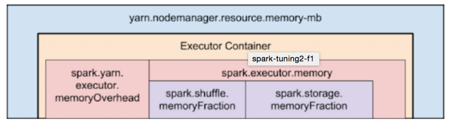

```shell
spark-submit --class <CLASS_NAME> --num-executors ? --executor-cores ? --executor-memory ? ....
```

# 前置知识

## Hadoop/Yarn/OS Deamons

当我们在yarn上运行job时，有几个后台进程，例如NameNode、Secondary NameNode、DateNode、JobTracker和TaskTracker。因此在指定num-executors时，我们需要保证预留足够的CPU cores(每个节点至少一个core)来执行这些进程。

## Yarn ApplicationMaster

ApplicationMaster负责协调来自ResourceManager的资源，并与NodeManagers一起执行container并监控其资源消耗。如果我们在YARN上运行Spark，那么我们需要预估运行AM所需要的资源（至少1024MB和1 CPU核）。

## HDFS吞吐量

HDFS客户端遇到大量并发线程会出现一些bug。一般来说，每个executors最多可以实现5个任务的完全写入吞吐量，因此最好将每个executors的核心数保持在该数量之下。

## MemoryOverhead

JVM还需要一些off heap的内存，请参考下图中描绘的Spark和YARN中内存属性的层次结构



```shell
 每个executor申请的总内存 =
          spark-executor-memory + spark.yarn.executor.memoryOverhead.
 spark.yarn.executor.memoryOverhead = 
        	Max(384MB, 7% of spark.executor-memory)
```

因此，如果每个executor分配20G, ApplicationMaster实际上可以获得20GB+memoryOverhead=20+7%*20=23GB.

注意：

1. executor分配太多内存会导致gc延迟
2. 运行较小的executors（例如，1G & 1 CPU core）则会浪费 ==单个JVM中运行多个任务==所带来的优点。

# 资源假设

```
10 Nodes
16 cores per Node
64GB RAM per Node
```

## 方式一：Tiny executors(每个executor一个核心)


```shell
`--num-executors` = `在这种方法中，我们将为每个核心分配一个executor`
                  = `集群的总核心数`
                  = `每个节点的核心数 * 集群的总节点数` 
                  =  16 x 10 = 160
                  
`--executor-cores`  = 1 (`每个executor分配的核心数目`)

`--executor-memory` = `每个executor分配的内存数`
                    = `每个节点内存总数数/每个节点上分配的executor数`
                    = 64GB/16 = 4GB
```

**分析**：
 由于每个executor只分配了一个核，我们将无法利用在同一个JVM中运行多个任务的优点。 此外，共享/缓存变量（如广播变量和累加器）将在节点的每个核心中复制16次。 最严重的就是，我们没有为Hadoop / Yarn守护程序进程留下足够的内存开销，我们还忘记了将ApplicationManagers运行所需要的开销加入计算。

## 方式二(fat executor)

```shell
`--num-executors` = `在这种方法中，我们将为每个节点分配一个executor`
                  = `集群的总节点数`
                  = 10
                    
`--executor-cores` = `每个节点一个executor意味着该节点的所有核心都分配给一个执executor`
                   = `每个节点的总核心数`
                   = 16
                     
`--executor-memory` = `每个executor分配的内存数`
                    = `每个节点内存总数数/每个节点上分配的executor数`
                    = 64GB/1 = 64GB
```

**分析：**
每个executor都有16个核心，由于HDFS客户端遇到大量并发线程会出现一些bug，即HDFS吞吐量会受到影响。同时过大的内存分配也会导致过多的GC延迟。

## 方法三（使用优化的executors）

基于上面提到的建议，让我们为每个执行器分配5个核心, 即`--executor-cores = 5`

为每个节点留出1个核心用于Hadoop / Yarn守护进程, 即每个节点可用的核心数 = 16-1 = 15。 因此，群集中核心的可用总数= 15 x 10 = 150

--num-executors =（群集中核心的可用总数/每个executors分配的核心数）= 150/5 = 30

为ApplicationManager预留1个executors的资源，  即`--num-executors = 29`

每个节点的executors数目 = 30/10 = 3

群集中每个节点的可使用的总内存数  64GB  - 1GB = 63GB

每个executor的内存= 63GB / 3 = 21GB

预留的 off heap overhead = 21GB * 7％ ~=  1.47G

所以，实际的`--executor-memory = 21 - 1.47G ~= 19GB`


--num-executors=集群总核数/executor-cores（一般3/5）

--executor-memory=集群总内存/num-executors