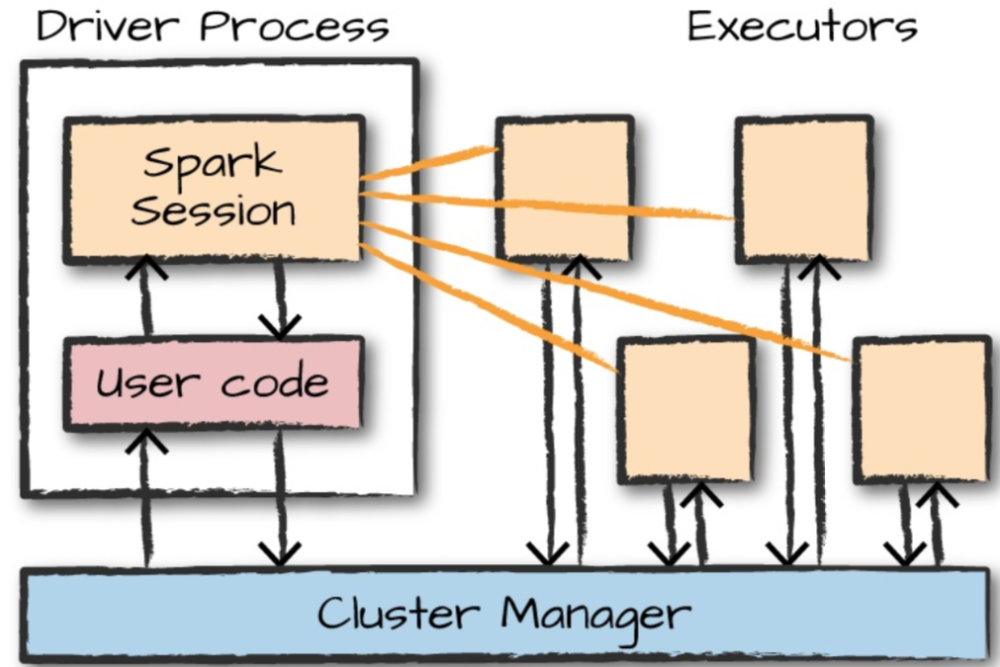

# 基本架构

## spark应用

spark是一个用于管理、协调跨机器的数据处理任务。

集群管理器管理这些计算机，例如：standalone、yarn、mesos。我们提交spark应用给集群管理器，它会分配资源给应用，从而完成作业。

spark应用由一个driver和多个executor进程组成，driver在一个节点上运行main()方法，负责三个事情：

1. 维护spark应用的信息
2. 响应用户程序或者输入
3. 分析、分发和调度task。

executors负责执行driver分配的任务，主要负责两个事情：

1. 执行driver分配的代码
2. 向driver报告计算状态



## 启动spark

当启动交互模式，事实上我们创建了一个SparkSession来管理spark应用。如果通过standalone应用启动saprk程序就必须自行创建SparkSession。

mac上安装spark非常简单

```shell
brew install apache-spark
```

但是最近失败了：

  DownloadError: Failed to download resource "apache-spark"
  Download failed: https://downloads.apache.org/spark/spark-2.4.4/spark-2.4.4-bin-hadoop2.7.tgz

1. 到官网手工下载

   Wget http://mirror.cogentco.com/pub/apache/spark/spark-2.4.6/spark-2.4.6-bin-hadoop2.7.tgz

   解压后将文件夹放到合适的位置
   mv /Users/apple/Downloads/spark-2.4.6-bin-hadoop2.7 /usr/local/Cellar

   添加环境变量

   ```shell
   vi ~/.bash_profile
   # <<< spark init <<<
   export SPARK_HOME=/usr/local/Cellar/spark-2.4.6-bin-hadoop2.7
   export PATH=$PATH:$SPARK_HOME/bin
   ```

   

2. 启动
   spark-shell

## sparkSession

sparkSesssion和spark应用是一对一的关系。

## DataFrames

就是二维表，只是这个表跨机器存储， 列集合称为schema。

### 分区

为了让每个executor可以并行操作，spark把数据切分成多个分区。一个分区是一个物理机上的行集合。大部分情况下不需要操作dataFrame的分区。

## transformations

Transformation是懒执行的，且分为两类：指定窄依赖和宽依赖。窄依赖：一个输入分区只会输出到一个输出分区。

## Spark UI

driver节点的4040端口可以监控作业的进度，

## 完整例子

处理csv文件

```shell
head 2015-summary.csv 
DEST_COUNTRY_NAME,ORIGIN_COUNTRY_NAME,count
United States,Romania,15
United States,Croatia,1
United States,Ireland,344
Egypt,United States,15
United States,India,62
United States,Singapore,1
United States,Grenada,62
Costa Rica,United States,588
Senegal,United States,40
```

```scala
val flightData2015=spark
.read
.option("inferSchema","true")
.option("header","true")
.csv("data/flight-data/csv/2015-summary.csv")

flightData2015.sort("count").explain()
== Physical Plan ==
*(2) Sort [count#28 ASC NULLS FIRST], true, 0
+- Exchange rangepartitioning(count#28 ASC NULLS FIRST, 200)
   +- *(1) FileScan csv [DEST_COUNTRY_NAME#26,ORIGIN_COUNTRY_NAME#27,count#28] Batched: false, Format: CSV, Location: InMemoryFileIndex[file:/Users/chengxingfu/code/my/TechWorld/code/spark/Spark-The-Definitive-Guide..., PartitionFilters: [], PushedFilters: [], ReadSchema: struct<DEST_COUNTRY_NAME:string,ORIGIN_COUNTRY_NAME:string,count:int>
```

默认spark执行shuffle时输出200个shuffle分区，可以设置

```scala
spark.conf.set("spark.sql.shuffle.partitions","5")
```

### dataframes和sql

业务逻辑可以用SQL或者dataframe表示，spark会把逻辑编译为基础计划再执行。使用spark SQL,可以把df注册为表或者视图，从而可以使用sql操作。

使用sql和使用df最后都会产生相同的基础计划，可以通过调用其explain()查看。

```scala
mydf.createOrReplaceTempView("flight_data_2015")
```

