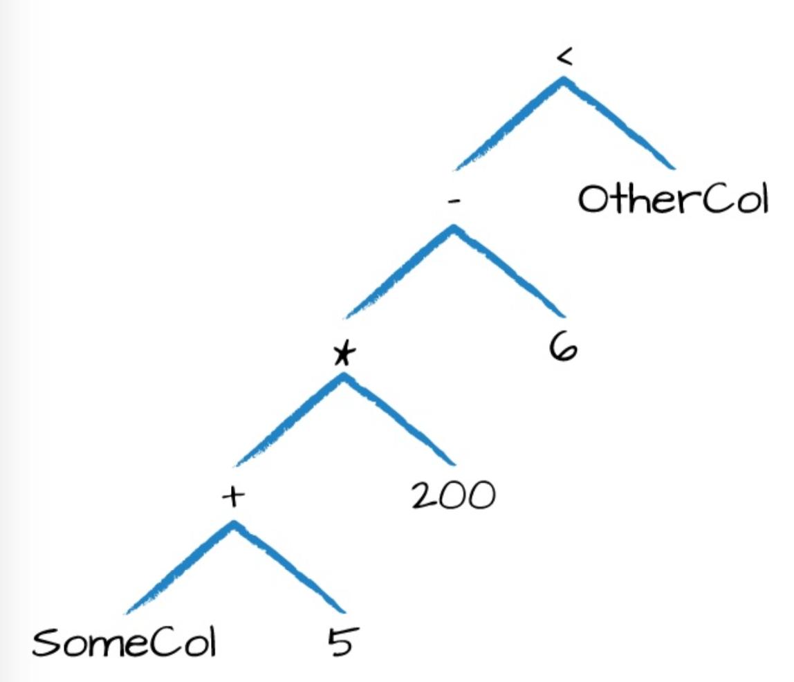
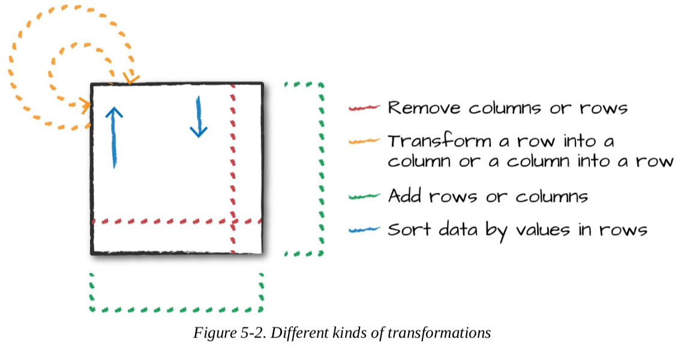

# 基本操作

本章聚焦基本的dataframe操作，后续章节再讨论聚合、窗口函数和join

## Schema

```scala
scala> val df=spark.read.format("json").load("data/flight-data/json/2015-summary.json")
df: org.apache.spark.sql.DataFrame = [DEST_COUNTRY_NAME: string, ORIGIN_COUNTRY_NAME: string ... 1 more field]

scala> df.printSchema()
root
 |-- DEST_COUNTRY_NAME: string (nullable = true)
 |-- ORIGIN_COUNTRY_NAME: string (nullable = true)
 |-- count: long (nullable = true)

scala> df.schema
res18: org.apache.spark.sql.types.StructType = StructType(
  StructField(DEST_COUNTRY_NAME,StringType,true), 
  StructField(ORIGIN_COUNTRY_NAME,StringType,true), 
  StructField(count,LongType,true))
```

schema是一个StructType，它由多个StructField组成，StructField有name\type\布尔flag组成，布尔flag指定是否允许missing/null值；还可以指定该列对应的metadata。

schema可以包含其他StructTypes。

下面的例子创建并施加一个shema到dataframe

```scala
import org.apache.spark.sql.types.{StructField,StructType,StringType,LongType}
import org.apache.spark.sql.types.Metadata
val mySchema= StructType(
	Array(
  	StructField("DEST_COUNTRY_NAME",StringType,true),
    StructField("ORIGIN_COUNTRY_NAME",StringType,true),
    StructField("count",StringType,false,Metadata.fromJson("{\"hello\":\"world\"}"))
  )
)

val df=spark.read.format("json").schema(mySchema).load("data/flight-data/json/2015-summary.json")
```

## 列和表达式

因为spark维护自身类型信息，所以无法通过特定语言类型简单设置类型。现在讨论schema定义：列。

列的选取、修改、删除等操作都称为表达式。

对于spark而言，列仅仅是逻辑结构，代表一个表达式在特定记录上计算出来的值。这意味着，要给列一个值，我们需要一个row,而要得到一个row,我们需要一个DataFrame。不能脱离DataFrame去操作列，必须在DataFrame里使用transformations算子修改列内容。

### 列

有很多方式可以创建和引用列，但最简单的事使用col或者column函数，只需要传递列名：

```scala
import org.apache.spark.sql.functions.{col,column}
col("someColumnName")
column("someColumnName")
```

后面我们都使用col函数了。注意，这个列在我们的DataFrame中可能存在也可能不存在，直到把列名和catalog里的列进行比较前，列都是未解析的。列和表解析都在解析(analyzer)阶段完成。

> 注：scala有个引用列的语法糖，$"myColumn", \$ 符号后面的字符串被解释为一个表达式


#### 显示引用列

如果要显示引用DataFrame的列，可以使用该DataFrame的col函数。当两个具有重名列的DF做join操作时，用这个方法可以引用特定的列。同时spark在解析阶段就不用解析这个列了。

### 表达式

​         表达式是df中一条记录上的一系列转换，列也是一个表达式。可以认为，表达式是一个函数，它的入参是一些列名，表达式会解析它们，并对dataset的每个记录应用表达式生成一个值。重点是值可以是像Map/Array这样的复杂类型。

​	   最简单的情况，通过expr函数创建的一个表达式就是一个df的列引用，例如`expr("someCOl")`就等价于`col("someCol")`.

#### 列表达式

列提供了表达式功能的子集，如果使用了col()且希望在该列上执行转换操作，就必须在列引用上执行。当使用一个表达式，expr函数可以从一个字符串解析列引用和转换操作，并且还可以传递给下一个转换操作：

```scala
expr("someCol"-5) 等价于：
col("someCol") -5 甚至
expr("someCol") -5
```

这是因为spark把这些按操作顺序编译成了一个逻辑树，关键点：

1. 列仅仅是表达式
2. 列和列转换操作和解析后的表达式被编译成相同的逻辑计划

例如： 

```scala
(((col("someCol")+5)*200)-6) < col("therCol")
```

这个表达式的逻辑树如下：


这个图等价于下面的表达式

```scala
import org.apache.spark.sql.functions.expr
expr("(((someCol +5)*200)-6) < otherCol")
```

这个表达式也是一个有效的SQL代码，可以直接放到select语句里，因为sql表达式和上面的df代码在执行之前都会被编译成相同的逻辑树。

#### 获取df的列

可以使用printSchema打印，也可以使用.columns方法获取

```scala
spark.read.format("json").load("data/flight-data/json/2015-summary.json").columns
```

### 记录和Rows

df的每个row都是一条记录，spark使用Row对象代表这个记录对象。spark使用列表达式操作Row对象，从而产生可用的值。Row对象内部代表字节数组，用户不用关心，只需要使用列表达式操作它们即可。

#### 创建Row

可以提供每个列值手动初始化一个Row对象。注意，只有df有schema，Row自身没有schema。因此要想把这个Row追加到一个df，就必须让这个Row对象的列顺序和df的schema一致。

```scala
import org.apache.spark.sql.Row
val myRow=Row("Hello",null ,1, false)
//获取Row里的值
myRow(0)//type Any
myRow(0).asInstanceOf[String] //String
myRow.getString(0) //String
myRow.getInt(2)//Int
```

也可以使用Dataset API获取Java对象

### df转换操作

1. 添加行、列
2. 删除行、列
3. 行列互转
4. 按列值对行进行排序



### 创建dataframes

```scala
val df = spark.read.format("json").load("data/flight-data/json/2015-summary.json")
df.createOrReplaceTempView("dfTable")
```

也可以把Row转为dataframe：

```scala
import org.apache.spark.sql.Row
import org.apache.spark.sql.types.{StructField,StructType,StringType,LongType}
val myManualSchema=new StructType(Array(
 new StructField("some",StringType,true),
   new StructField("col",StringType,true),
   new StructField("names",LongType,false)
))
val myRows=Seq(Row("Hello",null,1L))
val myRDD=spark.sparkContext.parallelize(myRows)
val myDf=spark.createDataFrame(myRDD,myManualSchema)
myDf.show()
```

> 注：利用spark的隐式转换还可以在Seq类型上调用toDF来获得df,但是对null类型不太友好

```scala
val myDF=Seq(("Hello",2,1L)).toDF("col1","col2","col3")
```

### select和selectExpr

select和selectExpr可以在df上执行sql操作

```scala
df.select("DEST_COUNTRY_NAME").show(2)
scala> df.select("DEST_COUNTRY_NAME").show(2)
+-----------------+
|DEST_COUNTRY_NAME|
+-----------------+
|    United States|
|    United States|
+-----------------+
```

当然也可以这么做,传递Column对象进去

```scala
import org.apache.spark.sql.functions.(expr,col,column)
df.select(df.col("DEST_COUNTRY_NAME"),
         col("DEST_COUNTRY_NAME"),
         'DEST_COUNTRY_NAME,
         $"DEST_COUNTRY_NAME",
         expr("DEST_COUNTRY_NAME"))
.show(2)
```

expr是最灵活的列引用方式，可以引用列，也可以引用操作列的字符串。

```scala
df.select(expr("DEST_COUNTRY_NAME as destination").alias("DEST_COUNTRY_NAME"))
.show(2)
```

因为在select方法里使用expr太频繁了，所以spark提供了selectExpr方法，这是最舒服的接口了：

```scala
df.selectExpr("DEST_COUNTRY_NAME as newColumnName","DEST_COUNTRY_NAME").show(2)
```

这个接口真正打开了spark的强大之处， 事实上，我们可以添加任何非聚合的sql语句，只要列能解析，就是合法的。例如，加列操作

```scala
df.selectExpr("*","(DEST_COUNTRY_NAME = ORIGIN_COUNTRY_NAME) as withinCountry")
.show(2)  //*保留了原有列
+-----------------+-------------------+-----+-------------+
|DEST_COUNTRY_NAME|ORIGIN_COUNTRY_NAME|count|withinCountry|
+-----------------+-------------------+-----+-------------+
|    United States|            Romania|   15|        false|
|    United States|            Croatia|    1|        false|
+-----------------+-------------------+-----+-------------+
```

也可以对整个df指定聚合函数：

```scala
df.selectExpr("avg(count)", "count(distinct(DEST_COUNTRY_NAME))").show(2)
+-----------+---------------------------------+                                 
| avg(count)|count(DISTINCT DEST_COUNTRY_NAME)|
+-----------+---------------------------------+
|1770.765625|                              132|
+-----------+---------------------------------+
```

### 转成spark类型(字面量)

有时，我们需要把值转成spark的值(不是一个列)，也许是用来比较的。可以通过字面量完成，就是把某个编程语言的字面量值翻译成spark认识的。字面量也是表达式。

```scala
import org.apache.spark.sql.functions.lit
df.select(expr("*"),lit(1).as("One")).show(2)
+-----------------+-------------------+-----+---+
|DEST_COUNTRY_NAME|ORIGIN_COUNTRY_NAME|count|One|
+-----------------+-------------------+-----+---+
|    United States|            Romania|   15|  1|
|    United States|            Croatia|    1|  1|
+-----------------+-------------------+-----+---+
```

### 加列

使用withColumn方法,有两个参数，第一个是列名， 第二个是一个表达式，用来生成值

```scala
df.withColumn("numberOne",lit(1)).show(2)
+-----------------+-------------------+-----+---------+
|DEST_COUNTRY_NAME|ORIGIN_COUNTRY_NAME|count|numberOne|
+-----------------+-------------------+-----+---------+
|    United States|            Romania|   15|        1|
|    United States|            Croatia|    1|        1|
+-----------------+-------------------+-----+---------+
```

也可以使用普通表达式

```scala
df.withColumn("withinCountry",expr("ORIGIN_COUNTRY_NAME==DEST_COUNTRY_NAME")).show(2)
+-----------------+-------------------+-----+-------------+
|DEST_COUNTRY_NAME|ORIGIN_COUNTRY_NAME|count|withinCountry|
+-----------------+-------------------+-----+-------------+
|    United States|            Romania|   15|        false|
|    United States|            Croatia|    1|        false|
+-----------------+-------------------+-----+-------------+
```

### 列重命名

```scala
df.withColumnRenamed("DEST_COUNTRY_NAME","dest").show(2)
+-------------+-------------------+-----+
|         dest|ORIGIN_COUNTRY_NAME|count|
+-------------+-------------------+-----+
|United States|            Romania|   15|
|United States|            Croatia|    1|
+-------------+-------------------+-----+
```

### 保留字符和关键字

使用`来处理保留字符

```scala
import org.apache.spark.sql.functions.expr
//注意，withColumn的第一个参数仅仅是一个字符串列名，无需使用`处理
val dfWithLongColName = df.withColumn("This Long Column-Name",expr("ORGIN_COUNTRY_NAME"))
//如果要在表达式里引用就必须使用`
dfWithLongColName.selectExpr(
	"`This Long Column-Name`",
  "`This Long Column-Name`" as `new col`
).show(2)
```

### 大小写敏感

spark默认是大小写敏感的，但也可以设置为不敏感

```scala
set spark.sql.caseSensitive true	
```

### 删除列

drop方法可以删除多个列

```scala
dfWithLongColName.drop("ORIGIN_COUNTRY_NAME","DEST_COUNTRY_NAME")
```

### 列类型强转

```scala
df.withColumn("count2",col("count").cast("long"))
```

### 过滤行

filter和where都可以，但为了和保持sql一致，我们用where 

```scala
df.where("count< 2").show(2)
```

因为返回值还是一个df,所以是可以继续调用where实现sql中的and条件语句的。

### 列去重

```scala
df.select("ORIGIN_COUNTRY_NAME","DEST_COUNTRY_NAME").distinct().count()
```

### 抽样

```scala
val seed = 5
val withReplacement=false
val fraction=0.5
df.sample(withReplacement,fractikon,seed).count()
```


### 随机切分

```scala
df.randomSplit(Array(0.25,0.75),seed)
```

### union

要注意，union是按照位置union的，不是按照schema

```scala
import org.apache.spark.sql.Row
val schema = df.schema
val newRows = Seq(
  Row("New Country", "Other Country", 5L),
  Row("New Country 2", "Other Country 3", 1L)
)
val parallelizedRows = spark.sparkContext.parallelize(newRows)
val newDF = spark.createDataFrame(parallelizedRows, schema)
df.union(newDF)
  .where("count = 1")
  .where($"ORIGIN_COUNTRY_NAME" =!= "United States")
  .show() // get all of them and we'll see our new rows at the end

```


### 排序

```scala
df.sort("count").show(2)
df.orderBy("count","DEST_COUNTRY_NAME").show(5)

import org.apache.spark.sql.functions.{desc, asc}
df.orderBy(expr("count desc")).show(2)
df.orderBy(desc("count"), asc("DEST_COUNTRY_NAME")).show(2)
```

### limit

```scala
// in Scala
spark.read.format("json").load("data/flight-data/json/*-summary.json")
  .sortWithinPartitions("count")

df.limit(5).show()

df.orderBy(expr("count desc")).limit(6).show()
```

### 重分区

```scala
df.rdd.getNumPartitions // 1

df.repartition(5)

df.repartition(col("DEST_COUNTRY_NAME"))

df.repartition(5, col("DEST_COUNTRY_NAME"))

df.repartition(5, col("DEST_COUNTRY_NAME")).coalesce(2)

```

### driver收集数据

```scala
val collectDF = df.limit(10)
collectDF.take(5) // take works with an Integer count
collectDF.show() // this prints it out nicely
collectDF.show(5, false)
collectDF.collect()
```

还有一种方式，collectDF.toLocalIterator()把所有分区作为迭代器收集到driver，从而可以迭代整个数据集

