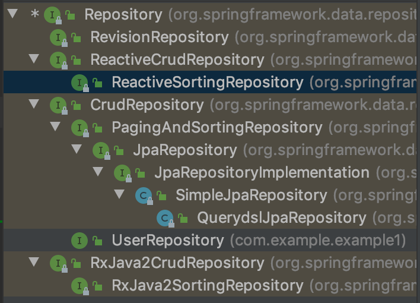

# Jpa基础查询方法

## Repository层级关系

ctrl+h可以查看Repository接口的层级关系



## PagingAndSortingRepository

继承自CrudRepository，增加了分页和排序等对查询结果进行限制的基本的、常用的、通用的一些分页方法

示例

```java
    @GetMapping(path = "/page")
    @ResponseBody
    public Page<User> getAllUserByPage() {
        return userPagingAndSortingRepository.findAll(PageRequest.of(0, 20, Sort.by(Sort.Direction.ASC, "name")));
    }

    @GetMapping(path = "/sort")
    @ResponseBody
    public Iterable<User> getAllUsersWithSort() {
        return userPagingAndSortingRepository.findAll(Sort.by(Sort.Order.asc("name")));
    }
```

## JpaRepository

上面那些都是Spring Data为了兼容NoSql而进行的一些抽象封装，从JpaRepository开始是对关系型数据库而进行抽象封装


SimpleJpaRepository是JPA整个关系数据的所有Repository的接口实现类，如果想进行扩展，可以继承此类，如QueryDsl的扩展。如果将此类里面的实现方法看透了，基本上JPA的API就能掌握大部分。同时也是Spring JPA动态代理的实现类


它通过EntityManager进行实体的操作，JpaEntityInfoMation里保存着实体的相关信息以及crud方法的元数据等。

# 定义查询方法

SpringJPA Repository的实现原理是采用动态代理的机制，介绍两种定义查询方法：

1. 从方法名称中可以指定特定用于存储的查询和更新
2. 通过@Query手动定义的查询

## 方法的查询策略设置

通过@EnableJpaRepositories(queryLookupStrategy=QueryLookupStrategy.KEY.CREATE_IF_NOT_FOUND)可以配置方法的查询策略，其中QueryLookupStrategy.KEY的值一共有三个：

1. CREATE：直接根据方法名创建。规则是根据方法名称的构造进行尝试，一般的方法是从方法名中删除给定的一组已知前缀，并解析该方法的其余部分。如果方法名不符合规范，启动时报异常
2. USE_DECLARED_QUERY:声明方式创建，即注解方式
3. CREATE_IF_NOT_FOUND:默认的，以上两种方式的结合版。先用声明方式进行查找，如果没找到，就用create的方法名创建规则创建一个查询。

示例如下： 

```java
@EnableJpaRepositories(queryLookupStrategy=QueryLookupStrategy.Key.CREATE_IF_NOT_FOUND)
public class Example1Alpplication{
  SpringApplication.run(Example1Application.class, args);
}
```

QueryLookupStrategy是策略的定义接口，JpaQueryLookupStrategy事具体策略的实现类。

## 查询方法的创建

内部基础架构中有个根据方法名的查询生成器机制，待查询功能的方法名由查询策略(关键字)、查询字段和一些限制性条件组成，可以直接在controller里面进行调用查询效果.

查询方法前缀：

```shell
find..
count..
exists
delete/remove
```

使用的时候要配合不同的返回结果类型进行使用，例如

```java
long deleteByLastname(String lastname);
List<User> removeByLastname(String lastname);
```

## 查询结果的处理

### 分页和排序

1. 动态地将分页和排序应用于查询

```java
Page<User> findByLastname(String lastname,Pageable pageable);
Slice<User> findByLastname(String lastname,Pageable pageable);
List<User> findByLastname(String lastname,Sort sort);
List<User> findByLastname(String lastname,Pageable pageable);

```

注意：当用到Pageable的时候默认会执行一条count语句，可能比较昂贵。而Slice的作用是，只知道是否有下一个Slice可用，不会执行count。

2. 限制查询结果

在查询方法名上加关键字first/top

```java
User findFirstByOrderByLastnameAsc();
User findTopByOrderByAgeDesc();
Page<USer>queryFirst10ByLastname(String lastname,Pageable pageable);
```

### 查询结果的不同形式

1. Page
2. List
3. Stream<T>流式查询结果
4. Future异步查询结果

### 实现机制介绍

QueryExecutorMethodInterceptor这个类实现了MethodInterceptor接口，也就是说它是一个方法调用的拦截器，当一个Repository上的查询方法(例如findByEmailAndLastname方法)被调用时，Advice拦截器会在方法真正地实现调用前先执行MethodInterceptor的invoke方法，这样我们就有机会在真正方法执行前执行其他代码了。

# 注解式查询方法

一般只需要关心@Query里面的value和nativeQuery的值

## @Param用法

默认情况下， 参数通过顺序绑定在查询语句上，这使得查询方法对参数位置的重构容易出错。@Param主机指定方法参数的具体名字，通过绑定的参数名字做查询条件

## SpEL表达式

# Entity常用注解

## 基础注解

@Entity 定义的对象将会成为被JPA管理的实体，将映射到指定的数据库表

@Table指定数据库的表名

@Id 定义属性为数据库的主键，每个实体里面必须有一个

@IdClass 利用外部类的联合主键

@GeneratedValue 主键生成策略，一共有一下4个值：

```java
public enum GenerationType {
    TABLE, //通过表产生主键，框架由表模拟序列产生主键，该策略可以使应用更易于数据库移植
    SEQUENCE,//通过序列产生主键，通过@SequenceGenerator注解指定序列名，mysql不支持这种方式
    IDENTITY,//采用数据库ID自增长，一般用于mysql数据库
    AUTO;//JPA自动选择合适的策略，默认选项
}
```

@Basic 默认值，表示属性是到数据库表的字段的映射

@Transient 非表字段，与@Basic相反

@Column 定义数据库中的列名

@Temporal 用来设置Date类型的属性映射到对应精度的字段

1. @Temporal(TemporalType.DATE) 映射为日期//date
2. @Temporal(TemporalType.DATE) 映射为时间//time
3. @Temporal(TemporalType.DATE) 映射为日期时间//datetime

@Enumerated 映射enum枚举类型的字段 ，有两个选择；

```java
public enum EnumType{
  ORDINAL,//映射枚举字段的下标
  STRING,//映射枚举的Name
}
```

@Lob将属性映射成数据库支持的大对象类型

## 关联关系注解

@JoinColumn定义外键关联字段的名称，配合@OneToOne、@ManyToOne、@OneToMany一起使用

@JoinColumns定义多个字段的关联关系

@OneToOne关联关系

 cascade设置级联操作策略、fetch设置加载方式、optional设置是否允许为空

@OneToMany与ManyToOne 可以成对存在也可以单独存在

@OrderBy关联查询时排序， 和@OneToMany一起使用

@JoinTable关联关系表，如果对象与对象之间有一个关联关系表的时候，就会用到@JoinTable,一般和@ManyToMany一起使用

## 关系查询的坑

1. 所有注解要么全配置在字段上，要么全配置在get方法上，不能混用
2. 双向关联，Json序列化时会产生死循环，需要人为手动转化一次，或者使用@jsonIgnore
3. 级联删除比较危险
4. 配置关联关系时，建议直接在表上面把外键建好，用开发工具直接生成代码
5. 