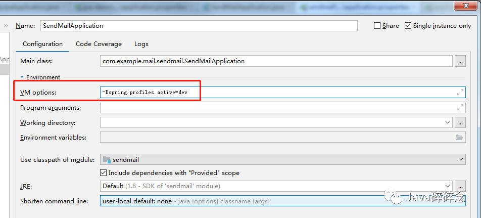

# 本文目录

一、为什么要使用Profile二、Spring Profile激活方式1、配置文件激活2、命令行3、虚拟机参数4、在Java代码中激活

## 一、为什么要使用Profile

在平时在开发时，经常会出现在开发的时候使用一个开发数据库，测试的时候使用一个测试的数据库，而实际部署的时候需要一个数据库。以前的做法是将这些信息写在一个配置文件中，当我把代码部署到测试的环境中，将配置文件改成测试环境；当测试完成，项目需要部署到现网了，又要将配置信息改成现网的，既麻烦又容易出现问题。

而使用了Profile之后，我们就可以分别定义3个配置文件，一个用于开发、一个用户测试、一个用户生产，其分别对应于3个Profile。当在实际运行的时候，只需给定一个参数来激活对应的Profile即可，那么容器就会只加载激活后的配置文件，这样就可以大大省去我们修改配置信息而带来的烦恼。

## 二、Spring Profile激活方式

针对上面的问题，我们可以采用如下的方案来解决：

在代码中新增多个配置文件，文件名可以是
application-{profile}.properties，然后在applcation.properties文件中配置激活profile。

例如我们的应用环境有：dev、uat、prod

那么，我们可以添加 4 个配置文件：

applcation.properties - 公共配置
application-dev.properties - 开发环境配置
application-uat.properties - 测试环境配置
application-prod.properties - 生产环境配置

下面介绍下激活profile的方式：

### 1、配置文件激活

在applcation.properties文件 中可以通过以下配置来激活 profile：

```
# 激活dev环境的配置
spring.profiles.active = dev
```

spring.profiles.active = dev 表示当前环境激活application-dev.properties文件中的配置。

### 2、命令行

在 运行java -jar 时候激活：

```
java -jar spring-boot-demo.jar --spring.profiles.active=dev
```

### 3、虚拟机参数

配置虚拟机参数激活：

```
-Dspring.profiles.active=dev
```

虚拟机参数配置


### 4、在Java代码中激活

在spring boot启动类添加如下代码即可：

```
System.setProperty("spring.profiles.active", "test");
```

------

Spring Boot之Profile多环境使用与切换的东西介绍完成啦，有任何问题欢迎留言沟通哦


# 多环境配置文件配置

[参考](https://blog.csdn.net/xiao__gui/article/details/51327385)

