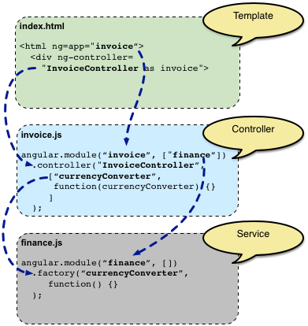

| 概念                                                         | 说明                                                         |
| :----------------------------------------------------------- | :----------------------------------------------------------- |
| [模板(Template)](https://www.angularjs.net.cn/tutorial/13.html) | 带有Angular扩展标记的**HTML**                                |
| [指令(Directive)](https://www.angularjs.net.cn/tutorial/5.html) | 用于通过**自定义属性和元素**扩展HTML的行为                   |
| 模型(Model)                                                  | 用于显示给用户并且与用户互动的**数据**                       |
| [作用域(Scope)](https://www.angularjs.net.cn/tutorial/12.html) | 用来存储模型(Model)的语境(context)。模型放在这个语境中才能被控制器、指令和表达式等访问到 |
| [表达式(Expression)](https://www.angularjs.net.cn/tutorial/3.html) | 模板中可以通过它来访问作用域（Scope）中的变量和函数          |
| [编译器(Compiler)](https://www.angularjs.net.cn/tutorial/15.html) | 用来**编译**模板(Template)，并且对其中包含的指令(Directive)和表达式(Expression)进行**实例化** |
| [过滤器(Filter)](https://www.angularjs.net.cn/tutorial/8.html) | 负责**格式化**表达式(Expression)的值，以便呈现给用户         |
| 视图(View)                                                   | 用户看到的内容（即**DOM**）                                  |
| [数据绑定(Data Binding)](https://www.angularjs.net.cn/tutorial/10.html) | **自动同步**模型(Model)中的数据和视图(View)表现              |
| [控制器(Controller)](https://www.angularjs.net.cn/tutorial/2.html) | 视图(View)背后的**业务逻辑**                                 |
| [依赖注入(Dependency Injection)](https://www.angularjs.net.cn/tutorial/17.html) | 负责创建和自动装载对象或函数                                 |
| 注入器(Injector)                                             | 用来实现依赖注入(Injection)的容器                            |
| [模块(Module)](https://www.angularjs.net.cn/tutorial/6.html) | 用来配置注入器                                               |
| [服务(Service)](https://www.angularjs.net.cn/tutorial/19.html) | 独立于视图(View)的、**可复用**的业务逻辑                     |


# Demo

1. 带有angular标记的html称为模版， 当Angular启动你的应用时，它通过“[编译器(compiler)](https://www.angularjs.net.cn/tutorial/15.html)”来解析并处理模板中的这些新标记。 这些经过加载、转换、渲染而成的DOM就叫做“视图(view)”

2. 第一类新标记叫做“[指令(directive)](https://www.angularjs.net.cn/tutorial/17.htmlrective)”。 它们通过HTML中的属性或元素来为页面添加特定的行为,例如：

   - required  自动非空验证
   - ng-model负责把input的value绑定到变量

   第二类新标记是{{表达式|过滤器}}，编译器会把这个标记替换为表达式的计算结果。

   - 表达式是js代码，注意，它所使用的变量不是全局变量，而是Scope作用域，称为scope变量。 这些变量所代表的数据叫做模型。
   - 过滤器格式化表达式的值

3. 动态绑定：input的值发生变化，表达式的值就会变，而且DOM内容也会变。这种模型与视图的联动称为双向数据绑定。


```html
<!doctype html>
<html ng-app>
  <head>
    <script src="http://code.angularjs.org/1.2.25/angular.min.js"></script>
  </head>
  <body>
  <div ng-app ng-init="qty=1;cost=2">
  <b>Invoice:</b>
  <div>
    Quantity: <input type="number" min="0" ng-model="qty" required>
  </div>
  <div>
    Costs: <input type="number" min="0" ng-model="cost">
  </div>
  <div>
    <b>Total:</b> {{qty * cost | currency}}
  </div>
</div>
  </body>
</html>
```

## 添加控制器

index.html

```html
<!doctype html>
<html ng-app="invoice1"> 告诉angular使用invoice1模块作为该应用的主模块
  <head>
    <script src="http://code.angularjs.org/1.2.25/angular.min.js"></script>
    <script src="invoice1.js"></script>
  </head>
  <body>
    在创建一个控制器的同时，我们还往HTML中添加了一个ng-controller指令。 这个指令告诉Angular，我们创建的这个InvoiceController控制器将会负责管理这个带有ng-controller指令的div节点，及其各级子节点。 InvoiceController as invoice这个语法告诉Angular：创建这个InvoiceController的实例，并且把这个实例赋值给当前作用域(Scope)中的invoice变量。
    
    <div ng-controller="InvoiceController as invoice">
      <b>订单:</b>
      <div>
        数量: <input type="number" ng-model="invoice.qty" required >
      </div>
      <div>
        单价: <input type="number" ng-model="invoice.cost" required >
        <select ng-model="invoice.inCurr">
          <option ng-repeat="c in invoice.currencies">{{c}}</option>
        </select>
      </div>
      <div>
        <b>总价:</b>
        <span ng-repeat="c in invoice.currencies">
                {{invoice.total(c) | currency:c}}   //调js中的函数
        </span>
        <button class="btn" ng-click="invoice.pay()">支付</button>
      </div>
    </div>
  </body>
</html>
```

Invoice1.js

这个文件中定义了一个构造函数，它用来在将来真正需要的时候创建这个控制器函数的实例。 控制器的用途是导出一些变量和函数，供模板中的表达式(expression)和指令(directive)使用。

```javascript
angular.module('invoice1', [])
  .controller('InvoiceController', function() { //定义一个控制器函数
    this.qty = 1;
    this.cost = 2;
    this.inCurr = 'EUR';
    this.currencies = ['USD', 'EUR', 'CNY'];
    this.usdToForeignRates = {
      USD: 1,
      EUR: 0.74,
      CNY: 6.09
    };
 
    this.total = function total(outCurr) {
      return this.convertCurrency(this.qty * this.cost, this.inCurr, outCurr);
    };
    this.convertCurrency = function convertCurrency(amount, inCurr, outCurr) {
      return amount * this.usdToForeignRates[outCurr] * 1 / this.usdToForeignRates[inCurr];
    };
    this.pay = function pay() {
      window.alert("谢谢！");
    };
  });
```


## 与视图无关的业务逻辑:Service

现在，`InvoiceController`包含了我们这个例子中的所有逻辑。如果这个应用程序的规模继续成长，最好的做法是：把控制器中与视图无关的逻辑都移到"[服务(service)](https://www.angularjs.net.cn/tutorial/guide/dev_guide.services)"中。 以便这个应用程序的其他部分也能复用这些逻辑。

接下来，就让我们重构我们的例子，并且把币种兑换的逻辑移入到一个独立的服务(service)中。


Angular中的每一样东西都是用依赖注入(DI)的方式来创建和使用的，比如指令(Directive)、过滤器(Filter)、控制器(Controller)、服务(Service)。 在Angular中，依赖注入(DI)的容器(container)叫做"[注入器(injector)](https://www.angularjs.net.cn/tutorial/17.html)"。

要想进行依赖注入，你必须先把这些需要协同工作的对象和函数注册(Register)到某个地方。在Angular中，这个地方叫做“[模块(module)](https://www.angularjs.net.cn/tutorial/6.html)”。

Finance2.js

```javascript
angular.module('finance2', [])
  .factory('currencyConverter', function() {
    var currencies = ['USD', 'EUR', 'CNY'],
        usdToForeignRates = {
      USD: 1,
      EUR: 0.74,
      CNY: 6.09
    };
    return {
      currencies: currencies,
      convert: convert
    };
 
    function convert(amount, inCurr, outCurr) {
      return amount * usdToForeignRates[outCurr] * 1 / usdToForeignRates[inCurr];
    }
  });
```


invoice2.js

```javascript
angular.module('invoice2', ['finance2']) 告诉Angular：invoice2模块依赖于finance2模块
  .controller('InvoiceController', ['currencyConverter', function(currencyConverter) {
    根据这个参数，Angular就知道InvoiceController依赖于currencyConverter，取得currencyConverter服务的实例，并且把它作为参数传给InvoiceController的构造函数。
    this.qty = 1;
    this.cost = 2;
    this.inCurr = 'EUR';
    this.currencies = currencyConverter.currencies;
 
    this.total = function total(outCurr) {
      return currencyConverter.convert(this.qty * this.cost, this.inCurr, outCurr);
    };
    this.pay = function pay() {
      window.alert("谢谢！");
    };
  }]);
这里把一个数组作为参数传入到module.controller函数中，而不再是一个普通函数。 这个数组前面部分的元素包含这个控制器所依赖的一系列服务的名字，最后一个元素则是这个控制器的构造函数。
之所以这么做，是因为：
js代码压缩器通常都会把构造函数的参数重命名为很短的名字，比如a，而常规的依赖注入是需要根据参数名来查找“被注入对象”的。
字符串不会被js代码压缩器重命名，所以数组语法可以解决这个问题。
```


```html
<!doctype html>
<html ng-app="invoice2">告诉angular使用invoice2模块作为该应用的主模块
  <head>
    <script src="http://code.angularjs.org/1.2.25/angular.min.js"></script>
    <script src="finance2.js"></script>
    <script src="invoice2.js"></script>
  </head>
  <body>
    <div ng-controller="InvoiceController as invoice">
      <b>订单:</b>
      <div>
        数量: <input type="number" ng-model="invoice.qty" required >
      </div>
      <div>
        单价: <input type="number" ng-model="invoice.cost" required >
        <select ng-model="invoice.inCurr">
          <option ng-repeat="c in invoice.currencies">{{c}}</option>
        </select>
      </div>
      <div>
        <b>总价:</b>
        <span ng-repeat="c in invoice.currencies">
                {{invoice.total(c) | currency:c}}
        </span>
        <button class="btn" ng-click="invoice.pay()">支付</button>
      </div>
    </div>
  </body>
</html>
```




## 访问后端

这次我们的`finance`模块中的`currencyConverter`服务使用了[`$http`](https://www.angularjs.net.cn/tutorial/api/ng.$http)服务 —— 它是由Angular内建的用于访问后端API的服务。 是对[`XMLHttpRequest`](https://developer.mozilla.org/en-US/docs/Web/API/XMLHttpRequest)以及[JSONP](http://en.wikipedia.org/wiki/JSONP)的封装。详情参阅$http的API文档 - [`$http`](https://www.angularjs.net.cn/api/105.html)。

```javascript
angular.module('finance3', [])
  .factory('currencyConverter', ['$http', function($http) {
    var YAHOO_FINANCE_URL_PATTERN =
          'http://query.yahooapis.com/v1/public/yql?q=select * from '+
          'yahoo.finance.xchange where pair in ("PAIRS")&format=json&'+
          'env=store://datatables.org/alltableswithkeys&callback=JSON_CALLBACK',
        currencies = ['USD', 'EUR', 'CNY'],
        usdToForeignRates = {};
    refresh();
    return {
      currencies: currencies,
      convert: convert,
      refresh: refresh
    };
 
    function convert(amount, inCurr, outCurr) {
      return amount * usdToForeignRates[outCurr] * 1 / usdToForeignRates[inCurr];
    }
 
    function refresh() {
      var url = YAHOO_FINANCE_URL_PATTERN.
                 replace('PAIRS', 'USD' + currencies.join('","USD'));
      return $http.jsonp(url).success(function(data) {
        var newUsdToForeignRates = {};
        angular.forEach(data.query.results.rate, function(rate) {
          var currency = rate.id.substring(3,6);
          newUsdToForeignRates[currency] = window.parseFloat(rate.Rate);
        });
        usdToForeignRates = newUsdToForeignRates;
      });
    }
  }]);
```


[参考中文](https://www.angularjs.net.cn/tutorial/10.html)

[英文原文](https://docs.angularjs.org/guide/concepts)


